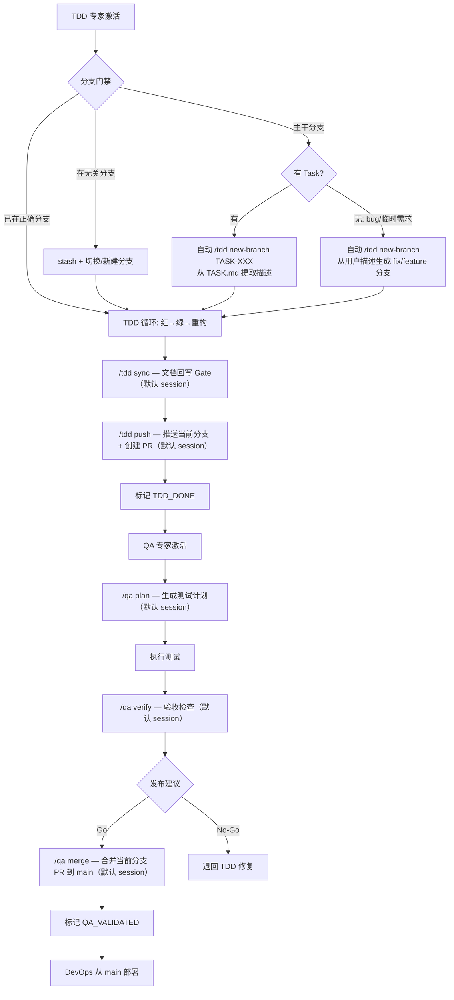

# AGENTS.md — 轻量路由与最小上下文规范
> 目的：用**一个**上下文文件在三款 CLI 中协同 6 位专家，**分阶段按需激活**，避免一次性加载过多上下文。

## 目录与角色
- 专家文件：`/AgentRoles/PRD-WRITER-EXPERT.md`、`/AgentRoles/ARCHITECTURE-WRITER-EXPERT.md`、`/AgentRoles/TASK-PLANNING-EXPERT.md`、`/AgentRoles/TDD-PROGRAMMING-EXPERT.md`、`/AgentRoles/QA-TESTING-EXPERT.md`、`/AgentRoles/DEVOPS-ENGINEERING-EXPERT.md`
- 手册与模板：详见各 `AgentRoles/Handbooks/*.playbook.md`
- 主要产物：`/docs/PRD.md`、`/docs/ARCH.md`、`/docs/TASK.md`、`/docs/QA.md`、`/docs/data/traceability-matrix.md`、`/CHANGELOG.md`、`/docs/AGENT_STATE.md`、代码
- 你全程用中文回复并展示思考过程。

## 路由总则（只读）
- **单阶段激活**：任一时刻仅激活 1 位专家，未激活专家不加载对应专家文件。
- **强制加载**：激活任何专家时，**必须先读取**对应专家文件（`AgentRoles/<对应专家>.md`）；**未完成读取前，禁止执行该专家的任何操作或产出**。
- **状态驱动**：每个阶段的输出作为下阶段的唯一输入；状态勾选记录在 `/docs/AGENT_STATE.md`。
- **点读手册**：完成专家文件读取后，**必须浏览**对应 `AgentRoles/Handbooks/*.playbook.md` 中的相关章节，再开始执行。

## 角色工作流
1. **PRD 专家**：根据用户信息产出需求文档，确保后续架构/任务/实现有清晰、可验收的依据。
2. **ARCH 专家**：根据需求文档输出架构视图，确立实现边界与质量特性。
3. **TASK 专家**：基于各模块需求、架构，定义依赖、里程碑、资源与风险，为 TDD 专家开发提供明确顺序与验收口径。
4. **TDD 专家**：按任务列表顺序实现代码、修复缺陷和测试，并根据情况更新任务状态和测试状态。
5. **QA 专家**：在 TDD 专家交付后，负责系统级验证、缺陷跟踪与发布建议，确保产品在交付前达到可发布标准。
6. **DevOps 专家**：负责 CI/CD 流水线配置与执行、环境管理（dev/staging/production）、部署运维与部署后验证，确保代码从构建到上线的全链路自动化。

## TDD 开发全流程（分支 → 编码 → PR → QA → 部署）



## 状态机（六阶段）
1. `PRD_CONFIRMED`
2. `ARCHITECTURE_DEFINED`
3. `TASK_PLANNED`
4. `TDD_DONE`
5. `QA_VALIDATED`
6. `DEPLOYED`

### 状态文件示例
```markdown
# AGENT_STATE
- [ ] 1. PRD_CONFIRMED
- [ ] 2. ARCHITECTURE_DEFINED
- [ ] 3. TASK_PLANNED
- [ ] 4. TDD_DONE (代码合并前)
- [ ] 5. QA_VALIDATED (发布前)
- [ ] 6. DEPLOYED (部署后)
```

## 激活触发语法（跨 CLI 通用）
在对话或命令中显式写入下列控制语句可触发对应专家：
- `[[ACTIVATE: PRD]]` / `[[DEACTIVATE: PRD]]`
- `[[ACTIVATE: ARCH]]`
- `[[ACTIVATE: TASK]]`
- `[[ACTIVATE: TDD]]`
- `[[ACTIVATE: QA]]`
- `[[ACTIVATE: DEVOPS]]` / `[[DEACTIVATE: DEVOPS]]`

### 软触发与别名
- **短命令**：`/prd`、`/arch`、`/task`、`/tdd`、`/qa`、`/devops`
- **中文自然语言**：如"你是 PRD 专家"激活 PRD、"进入架构阶段"激活 ARCH、"进入部署阶段"或"配置 CI"激活 DevOps，依此类推。
- **停用/切换**：完成某阶段后仅勾选对应状态；若要进入下一阶段，请显式发 `/arch`、`/task` 等或 `[[ACTIVATE: ...]]`。
- **优先级**：同条消息内若同时包含 `[[ACTIVATE: ...]]` 与别名，以 `[[ACTIVATE: ...]]` 为准；如出现多个角色，以最后一个为准；无明确触发则保持当前阶段。

## Phase 1 — PRD 专家路由
**激活条件**：项目启动、需求变更或 `/docs/PRD.md` 需创建/重写。

**加载（门禁）**：激活后**必须立即读取**专家文件 `/AgentRoles/PRD-WRITER-EXPERT.md`，未读取前禁止执行任何操作。

**完成状态**：在 `/docs/AGENT_STATE.md` 勾选 `PRD_CONFIRMED`。

**快捷命令**：`/prd confirm`（自动执行 `[[ACTIVATE: PRD]]` 并读取专家文件）。

**说明**：具体产出、拆分规则与校验工具请见 `/AgentRoles/PRD-WRITER-EXPERT.md` 及其 Handbook。

## Phase 2 — ARCH 专家路由
**激活条件**：`PRD_CONFIRMED` 之后，准备定义系统视图与架构决策。

**加载（门禁）**：激活后**必须立即读取**专家文件 `/AgentRoles/ARCHITECTURE-WRITER-EXPERT.md`，未读取前禁止执行任何操作。

**完成状态**：在 `/docs/AGENT_STATE.md` 勾选 `ARCHITECTURE_DEFINED`。

**快捷命令**：`/arch data-view`、`/arch sync`（调用时自动激活 ARCH，并加载对应专家文件）。

**说明**：具体架构产出与 ADR 创建细节由该专家文件和 Handbook 说明。

## Phase 3 — TASK 规划专家路由
**激活条件**：`ARCHITECTURE_DEFINED` 后，进入任务分解与依赖规划。

**加载（门禁）**：激活后**必须立即读取**专家文件 `/AgentRoles/TASK-PLANNING-EXPERT.md`，未读取前禁止执行任何操作。

**完成状态**：在 `/docs/AGENT_STATE.md` 勾选 `TASK_PLANNED`。

**快捷命令**：`/task plan`（自动触发 TASK 专家并同期读取模板）。

**说明**：WBS、依赖矩阵等任务细节由 `AgentRoles/TASK-PLANNING-EXPERT.md` 及手册支撑。

## Phase 4 — TDD 编程专家路由
**激活条件**：`TASK_PLANNED` 勾选后，进入实现与持续回写。

**加载（门禁）**：激活后**必须立即读取**专家文件 `/AgentRoles/TDD-PROGRAMMING-EXPERT.md`，未读取前禁止执行任何操作。

**完成状态**：`/tdd push` 完成后 PR 已自动创建，在 `/docs/AGENT_STATE.md` 勾选 `TDD_DONE`；如被退回则取消并回到对应阶段。

**快捷命令**：`/tdd diagnose`、`/tdd fix`、`/tdd sync`、`/tdd push`、`/tdd new-branch`、`/tdd resume`（每个命令触发即激活 TDD 专家）。

**分支门禁**（自动执行，无需手动触发）：
  - TDD 专家激活后（含 `/tdd`、`/tdd diagnose`、`/tdd fix` 等所有入口），**第一步**自动检查当前 Git 分支。
  - 若在 `main`/`master`/`develop` 等主干分支上 → 禁止执行任何代码操作，自动执行 `/tdd new-branch` 创建分支。
  - 已在正确的 `feature/TASK-*` 或 `fix/*` 分支上则跳过。
  - 若在无关分支上 → 自动 stash 未提交变更，提示用户切换或创建新分支；稍后用 `/tdd resume` 恢复。

**分支生成**（`/tdd new-branch`）：
  - **有 Task**：`/tdd new-branch TASK-<DOMAIN>-<编号>` → 自动从 TASK.md WBS 的"名称"列提取任务名称，转 kebab-case 英文短语（≤30 字符）作为描述 → `feature/TASK-XXX-<auto-desc>`
  - **无 Task**（bug 修复/临时需求）：`/tdd new-branch` 不带 Task ID → 从用户描述提取关键词 → `fix/<desc>` 或 `feature/<desc>`
  - 两种模式下用户可显式传入描述来覆盖自动生成。该命令通常由分支门禁自动调用，也可手动执行。

**说明**：TDD、文档回写规范在角色卡片与 Handbook 中对齐。CI/CD 流水线配置与部署由 DevOps 专家负责。

## Phase 5 — QA 专家路由
**激活条件**：`TDD_DONE` 勾选后，发布前需独立验证或回归测试时。

**加载（门禁）**：激活后**必须立即读取**专家文件 `/AgentRoles/QA-TESTING-EXPERT.md`，未读取前禁止执行任何操作。

**完成状态**：`/qa merge` 合并当前分支对应 PR 到 main 后勾选 `QA_VALIDATED`；如发现阻塞问题，可退回前一阶段重新处理。

**快捷命令**：`/qa plan`、`/qa verify`、`/qa merge`（自动激活 QA 专家）。

**说明**：测试策略、验证矩阵与发布建议由 QA 专家文件与 Handbook 描述，追溯矩阵同步也在其中。部署命令（`/ship`、`/cd`）已迁移至 DevOps 专家。

## Phase 6 — DevOps 专家路由
**激活条件**：`TASK_PLANNED` 后可激活（CI 配置模式）；`QA_VALIDATED` 后可激活（部署执行模式）。

**加载（门禁）**：激活后**必须立即读取**专家文件 `/AgentRoles/DEVOPS-ENGINEERING-EXPERT.md`，未读取前禁止执行任何操作。

**完成状态**：部署成功并通过冒烟验证后，在 `/docs/AGENT_STATE.md` 勾选 `DEPLOYED`。

**快捷命令**：
- CI 命令：`/ci run`、`/ci status`（自动激活 DevOps 专家）
- 部署命令：`/ship dev`、`/ship staging`、`/ship prod`、`/cd staging`、`/cd prod`（自动激活 DevOps 专家）
- 环境命令：`/env check <env>`、`/env status`（自动激活 DevOps 专家）
- 本地服务命令：`/restart`（自动激活 DevOps 专家，执行 `pnpm dev:restart`，固定端口 `3000`，日志: `/tmp/frontend-dev.log`）

**说明**：CI/CD 流水线、环境管理、部署与回滚由 DevOps 专家文件与 Handbook 描述。

---

## 文档目录职责规范

### 核心原则：主文档 vs 辅助数据

```
docs/
├── *-modules/          # 核心产出文档（各专家的主要工作成果）
└── data/               # 辅助支撑数据（模板、报告、归档、临时数据）
```

### 核心产出文档（`docs/*-modules/`）

**定位**：各专家的主要工作成果，是项目的核心知识资产

**特征**：
- ✅ 频繁访问和更新
- ✅ 结构化、模块化的文档
- ✅ 作为其他阶段的输入依据
- ✅ 长期维护，持续演进

**存放内容**：
- PRD 文档（需求规格、用户故事、验收标准） → `docs/prd-modules/`
- 架构文档（组件设计、数据模型、ADR） → `docs/arch-modules/`
- 任务规划（WBS、依赖、里程碑） → `docs/task-modules/`
- QA 文档（测试策略、测试用例） → `docs/qa-modules/`
- 各领域的 `MODULE-TEMPLATE.md`（创建新模块时使用的核心模板）

### 辅助支撑数据（`docs/data/`）

**定位**：为核心文档提供支撑的辅助材料，包括模板、报告、归档、临时数据

**特征**：
- ✅ 低频访问（模板）或一次性生成（报告）
- ✅ 时间序列数据（按日期归档）
- ✅ 可删除或归档（不影响核心知识）
- ✅ 工具生成或自动化产出

**存放内容**：
- 模板文件 → `docs/data/templates/{prd|arch|task|qa|devops}/`
- QA 验证报告 → `docs/data/qa-reports/YYYY-MM-DD-<type>-<description>.md`
- 部署记录 → `docs/data/deployment-records/YYYY-MM-DD-vX.Y.Z-<env>.md`
- 追溯矩阵、依赖图等衍生数据
- 变更请求（CR/SCR） → `docs/data/change-requests/`
- 临时数据、中间产物

### 决策规则

| 问题 | 放在 `*-modules/` | 放在 `data/` |
|------|------------------|--------------|
| 这是某个专家的主要工作成果吗？ | ✅ 是 | ❌ 否 |
| 这个文档会被其他专家作为输入依据吗？ | ✅ 是 | ❌ 否 |
| 这个文档会持续更新/演进吗？ | ✅ 是 | ❌ 否 |
| 这个文档是一次性生成的报告/记录吗？ | ❌ 否 | ✅ 是 |
| 这个文档是模板/参考资料吗？ | ❌ 否 | ✅ 是 |
| 这个文档是按时间序列归档的吗？ | ❌ 否 | ✅ 是 |

**一句话总结**：
- `*-modules/` = "这是什么模块的 PRD/ARCH/TASK/QA？"（按功能组织）
- `data/` = "这是什么时候生成的报告/模板？"（按时间/类型组织）

---

## 包管理器
本项目使用 pnpm，禁止使用 npm 或 yarn。
- 安装依赖：`pnpm install`
- 添加依赖：`pnpm add <package>`
- 运行脚本：`pnpm run <script>` 或 `pnpm <script>`

## 快捷命令速查（按专家分组）
> **执行规则**：使用任一快捷命令时，**必须先激活**对应专家并**读取其专家文件**（`AgentRoles/<对应专家>.md`），完成读取后才可执行命令逻辑。
> **命令作用域规则（新增）**：`/tdd sync`、`/tdd push`、`/qa plan`、`/qa verify`、`/qa merge` 若仅输入裸命令（前后无描述/参数），默认按 `session` 作用域执行（仅处理当前会话上下文）；传入描述、参数或显式 `--project` 时进入 `project` 作用域。`/tdd push` 与 `/qa merge` 在两种作用域下都只处理当前分支/当前 PR，不会操作其他分支。

### PRD 专家
- `/prd confirm` — 收口 PRD（范围/AC/追溯/开放问题），勾选 `PRD_CONFIRMED`

### ARCH 专家
- `/arch data-view` — 刷新数据视图（更多操作见角色卡片）
- `/arch sync` — 验证 PRD ↔ ARCH ID 双向追溯（Story ID、Component ID）

### TASK 专家
- `/task plan` — 刷新 WBS/依赖（更多操作见角色卡片）

### TDD 专家
- `/tdd diagnose` — 诊断当前代码/测试问题
- `/tdd fix` — 修复已识别问题
- `/tdd sync` — 默认 `session`（仅同步当前会话相关文档/任务）；`--project` 执行全量文档回写 Gate
- `/tdd push` — 默认 `session`（仅操作当前分支：版本递增 + 推送 + 创建当前分支 PR）；`--project` 仅用于显式声明项目模式
- `/tdd new-branch` — 创建 feature/fix 分支（通常由分支门禁自动调用，也可手动执行）
- `/tdd resume [branch]` — 恢复之前暂存的分支，自动 rebase main 并恢复 stash；不带参数时列出可恢复分支

### QA 专家
- `/qa plan` — **首先执行** `pnpm run qa:generate` **脚本**(读取 PRD/ARCH/TASK,解析数据,生成测试用例和策略,记录会话上下文)。默认 `session`(仅更新当前会话关联模块的 QA 文档);`--project` 执行全量刷新(主 QA + 所有模块 QA)。支持 `--modules <list>` 指定模块、`--dry-run` 预览
- `/qa verify` — **首先执行** `pnpm run qa:verify` **脚本**(优先基于 `/qa plan` 会话状态文件验证,检查文档完整性,生成验收建议)。默认 `session`(仅验证当前会话范围);`--project` 执行全项目验证(Go/Conditional/No-Go)
- `/qa merge` — **首先执行** `pnpm run qa:merge` **脚本**(包含自动 rebase、发布门禁检查、双策略合并、自动清理分支等15个关键步骤),合并**当前分支对应 PR** 到 main。默认 `session`(会话模式);`--project` 显式声明项目模式。两种作用域下都只处理当前分支 PR。支持 `--skip-checks`(跳过门禁)、`--dry-run`(预览)。**脚本成功后必须立即**：① 更新 `/docs/AGENT_STATE.md` 标记 `QA_VALIDATED` → ② `git add docs/AGENT_STATE.md` → ③ `git commit` → ④ `git push origin main` → ⑤ 交接 DevOps（确保工作区干净后再部署）

### DevOps 专家
- `/ci run` — 触发 CI 流水线
- `/ci status` — 查看 CI 状态
- `/ship dev` — 本地部署到开发环境（支持 `:quick` 快速模式）
- `/ship staging` — 本地部署到预发环境（支持 `:quick` 快速模式）
- `/ship prod` — 本地部署到生产环境（仅完整检查）
- `/cd staging` — 通过 CI/CD 远程部署到预发环境
- `/cd prod` — 通过 CI/CD 远程部署到生产环境
- `/env check <env>` — 执行指定环境健康检查
- `/env status` — 查看所有环境当前状态
- `/restart` — 重启本地前端开发服务（执行 `pnpm dev:restart`，PM2 托管，固定端口 `3000`，日志: `/tmp/frontend-dev.log`）

---

> 本文件仅描述激活及路由规范，具体职责、产出内容与工具详见各自 `AgentRoles/*.md` 和 Handbook。
