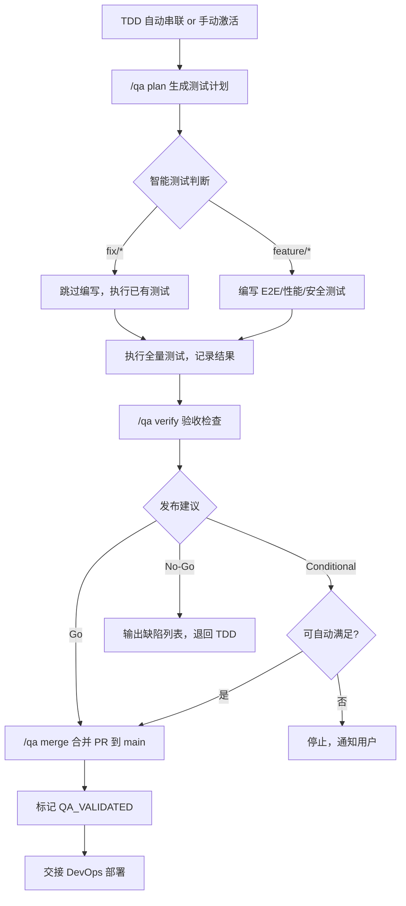

# QA-TESTING-EXPERT Playbook

> 角色定义、输入输出与 DoD 见 `/AgentRoles/QA-TESTING-EXPERT.md`。

## 工作环境与目录边界
遵循 `/docs/CONVENTIONS.md` 的命名与目录规范，仅在授权范围内操作。关键目录速查：
- `docs/QA.md`：QA 主文档（测试策略、用例概览、缺陷汇总、发布建议）
- `docs/qa-modules/{domain}/QA.md`：模块级 QA 文档（测试用例、执行记录、缺陷日志）
- `docs/data/traceability-matrix.md`：追溯矩阵（Story → AC → Test Case 映射）
- `docs/data/test-strategy-matrix.md`、`test-priority-matrix.md`、`test-risk-matrix.md`：全局测试矩阵
- `docs/data/qa-reports/`：全局质量报告归档
- `docs/data/templates/qa/`：QA 模板（QA-TEMPLATE-SMALL/LARGE、矩阵模板）
- `apps/web/tests/`：集成测试代码
- `e2e/`：端到端测试代码
- `apps/web/coverage/`、`apps/web/test-results/`：测试产物（已加入 .gitignore）

---

## QA 核心流程

### 第一步：测试计划（/qa plan）
1. 执行 `pnpm run qa:generate` 脚本
2. 脚本读取 PRD/ARCH/TASK，解析 Story → AC → Test Case 映射
3. 按项目规模生成/更新 QA 文档（单文件或主从结构）
4. 更新追溯矩阵（`docs/data/traceability-matrix.md`）
5. 记录会话上下文到 `/tmp/linghuiai-qa-plan-session.json`

### 第 1.5 步：编写测试代码（/qa plan 之后）

QA 负责编写并执行：E2E、性能、安全测试。单元/集成/契约/降级测试由 TDD 专家在实现阶段编写。

#### E2E 测试（Playwright）
- **目录**：`e2e/tests/`（Page Object 在 `e2e/pages/`，Fixtures 在 `e2e/fixtures/`）
- **策略**：Page Object Model + Fixtures；API 驱动创建前置数据（非 UI）；使用 web-first assertions（`await expect(locator).toBeVisible()`）
- **优先级**：P0 核心用户旅程 → P1 关键业务场景 → P2 边界
- **命名**：`{module}.e2e.spec.ts`（如 `auth.e2e.spec.ts`、`checkout.e2e.spec.ts`）
- **工具**：Playwright + @faker-js/faker
- **命令**：`pnpm playwright test`（headless）；调试用 `--ui` 或 `--trace on`
- **CI 配置**：sharding `--shard=N/M` + `retries: 2` + headless 模式；失败时上传 Trace 文件

#### 性能测试（k6）
- **目录**：`perf/scenarios/`
- **四类场景**：
  - Load：渐增至目标 VU → 稳定 → 渐减（10-30min），验证正常负载
  - Stress：阶梯递增直到崩溃，找系统极限
  - Spike：瞬间从低到极高再回低，验证突发承受力
  - Soak：中等负载长时间持续（2-8h），检测内存/连接泄漏
- **阈值**：从 ARCH NFR 提取；默认 `p95<500ms, p99<1.5s, error_rate<1%`
- **命名**：`{scenario}.k6.ts`（如 `load-test.k6.ts`、`checkout-flow.k6.ts`）
- **工具**：k6（原生 TS 支持）
- **命令**：`k6 run perf/scenarios/load-test.k6.ts`
- **CI 配置**：smoke 每次 PR（10 VU / 30s）；full load 每次 merge 到 main
- **每个场景最低要求**：
  - 至少 3 个自定义 metric（非仅默认 http_req_duration）
  - 至少测试 2 个关键 endpoint（不仅 homepage）
  - 阈值必须从 ARCH NFR 提取，禁止使用默认值而不验证
  - Smoke 脚本必须包含数据验证（检查响应 body 非仅 status）

#### 安全测试
- **SAST**（每次 PR）：`semgrep --config=security/semgrep/.semgrep.yml`（diff-aware，只扫变更文件）
- **SCA**（每次 PR + 每日定时）：`pnpm audit --audit-level=high` + `trivy fs .`
- **DAST**（每次部署 + 每周全扫描）：`docker run zaproxy/zaproxy zap-baseline.py -t <staging-url> -c security/zap/zap-baseline.conf`
- **认证/授权测试**：放 `apps/server/tests/security/*.security.test.ts`，与集成测试同频每次 PR
- **阻断策略**：Critical/High → 阻断部署；Medium → 限期修复；Low → 记录跟踪
- **认证/授权测试最低清单**（每个需认证的 endpoint 必须覆盖）：
  - [ ] 无 token 访问 → 401
  - [ ] 过期 token → 401
  - [ ] 篡改 token（修改 payload） → 401
  - [ ] 低权限角色访问高权限 endpoint → 403
  - [ ] 用户 A 的 token 访问用户 B 的资源 → 403/404
  - [ ] CORS 预检请求验证
- **配置文件**：`security/zap/`（ZAP 配置）、`security/semgrep/`（SAST 规则）、`security/checklists/`（手工清单）

#### E2E 边界场景清单

> QA 专家在编写 E2E 测试时，按以下清单为每个 P0/P1 场景补充边界用例。

**用户流程边界**：
- [ ] 会话过期时的操作（token 失效后提交表单）
- [ ] 浏览器后退/前进按钮在多步表单中的行为
- [ ] 页面刷新后状态恢复（表单数据、购物车、进度）
- [ ] 多标签页同时操作同一账户
- [ ] 网络中断后恢复（offline → online）

**数据边界**：
- [ ] 空状态页面（零条数据时的 UI 展示）
- [ ] 分页最后一页（不足一页数据时）
- [ ] 搜索无结果
- [ ] 超长用户输入的表单提交与展示
- [ ] 特殊字符输入（emoji、RTL 文本、HTML 标签）

**性能边界**：
- [ ] 大数据量列表的滚动与渲染（1000+ 条）
- [ ] 文件上传的大小边界（接近限制、超过限制）
- [ ] API 响应慢时的 UI 状态（loading 指示器是否出现）

**权限边界**：
- [ ] 直接 URL 访问未授权页面
- [ ] 降级用户角色后已缓存页面的行为
- [ ] 共享链接的权限检查

### 第二步：测试执行
1. **执行全量测试套件**：TDD 已写的单元/集成/契约/降级 + QA 新写的 E2E/性能/安全
2. 按优先级执行（P0 → P1 → P2），记录每条用例结果（通过/失败/阻塞）与环境信息
3. 发现缺陷时，完整填写复现步骤、影响分析、严重程度
4. P0 阻塞缺陷立即通知 TDD 修复
5. 更新追溯矩阵中的测试状态

### 第三步：验收检查（/qa verify）
1. 确认 §测试执行验证门禁（Expert 文件）全部满足
2. 执行 `pnpm run qa:verify` 脚本
3. 脚本检查：QA 文档完整性、覆盖率、缺陷阻塞情况
4. 生成质量指标（通过率、覆盖率、缺陷密度）
5. 输出发布建议：Go / Conditional / No-Go

### 第四步：合并发布（/qa merge）
1. 前置：verify 为 Go
2. 执行 `pnpm run qa:merge` 脚本（17 步详见 §qa merge 流程详解）
3. 完成后交接 DevOps 执行部署

### 回退触发
- 发布建议为 No-Go → 退回 TDD 修复，取消 `TDD_DONE`
- 部署后回滚 → 从部署记录中提取信息，在 `defect-log.md` 登记缺陷
- 范围偏差 → 记录回流建议并通知对应阶段

---

## 自动生成规范（/qa plan 详细流程）

### 生成触发条件
- **首次激活**：当 `/docs/QA.md` 不存在，或用户显式调用 `/qa plan --init` 时
- **更新已有**：当 `/docs/QA.md` 存在，`/qa plan` 刷新时
- **增量编辑**：QA 专家可在生成产物基础上进行人工调整（如补充缺陷详情、测试结果）

### 生成输入源
- **主输入**：`/docs/PRD.md`（Story、AC、验收标准、优先级）
- **架构输入**：`/docs/ARCH.md`（组件、技术选型、NFR）
- **任务输入**：`/docs/TASK.md`（WBS、里程碑、Owner、任务状态）
- **追溯矩阵**：`/docs/data/traceability-matrix.md`（Story → AC → Test Case 映射）
- **模块支持**：若 PRD/ARCH/TASK 已拆分，对应读取 `/docs/prd-modules/{domain}/PRD.md`、`/docs/arch-modules/{domain}/ARCH.md`、`/docs/task-modules/{domain}/TASK.md`
- **模块 QA 参考**：若已有模块 QA 数据，读取 `/docs/qa-modules/{domain}/priority-matrix.md`、`nfr-tracking.md`、`defect-log.md`，便于延续历史信息
- **历史数据**（如存在）：已有的 `/docs/QA.md` 的人工标注（测试执行结果、缺陷状态）

### 生成逻辑（6 步）

#### 第一步：检测项目规模
遍历 PRD 的所有 Story（计数）、检查现有模块目录（计数），估算项目规模。
- **小型项目**：Story < 30 AND 测试用例预估 < 100 AND 功能域 < 3
- **大型项目**：Story > 50 OR 测试用例预估 > 100 OR 功能域 >= 3
- 若 QA.md 已存在，读取现有拆分标记

#### 第二步：测试用例生成（Story → Test Case 映射）
- FOR EACH Story in PRD：
  1. 读取 Story 的所有 AC（验收标准）
  2. 为每个 AC 生成测试用例，遵循**基线 + 模式触发**规则：
     - **基线**（固定最低 3 个）：正常路径 ×1 + 输入边界 ×1 + 错误路径 ×1
     - **模式触发追加**：AC 涉及条件分支→追加分支测试；涉及多实体→追加关联测试；涉及认证→追加权限边界测试；涉及状态变更→追加幂等/负面测试
     - **断言质量**：每用例 ≥2 个有效断言（验证状态变更或业务数据，禁止仅检查 defined/null/truthy）
     - **负面测试**：必须包含验证"不应发生"的行为
     - **边界场景**：从 §E2E 边界场景清单 选取适用项
  3. 生成 Test Case ID：`TC-{MODULE}-{NNN}`
  4. 使用 Given-When-Then 格式填充测试步骤模板
  5. 标记测试类型（功能/集成/E2E/回归/性能/安全）
  6. 标记优先级（P0/P1/P2，继承 Story 优先级）
  7. 关联 Story ID 与 AC ID
- FOR EACH Component in ARCH：
  1. 识别需要契约测试的接口（微服务架构）
  2. 生成契约/降级测试用例

#### 第三步：测试策略矩阵
根据 PRD 的 NFR 和 ARCH 的技术选型：
  1. 确定测试类型覆盖范围（9 类测试）
  2. 生成测试环境配置（Dev/Staging/Prod）
  3. 定义测试优先级策略
  4. 生成测试工具链清单

#### 第四步：测试执行记录模板
根据 TASK.md 的里程碑：
  1. 为每个里程碑创建测试轮次模板（Round 1/2/3）
  2. 生成测试用例执行清单（状态：Pending）
  3. 预留缺陷列表模板（P0/P1/P2 分级）
  4. 生成测试指标统计表格

#### 第五步：拆分决策（大型项目）
若项目规模满足拆分条件：
  1. 在 `/docs/qa-modules/module-list.md` 注册模块索引
  2. 为每个功能域创建/更新模块 QA 文档，确保与主文档双向链接
  3. 修改主 `/docs/QA.md` 为总纲与索引（< 500 行）
  4. 标记跨模块外部依赖，补充全局整合测试说明
否则：保持 QA.md 为单一文件

#### 第六步：追溯矩阵更新
生成或更新 `/docs/data/traceability-matrix.md`：
- FOR EACH Story：列出关联的 AC 与 Test Case ID
- 标记测试状态（Pending/Pass/Fail/Blocked），关联缺陷 ID
- 同步模块 `defect-log.md`/`nfr-tracking.md`

### 更新现有 QA.md 的保留策略
当 `/qa plan` 刷新已有的 QA.md 时（MVP 版简化策略）：
- **直接覆盖**：完全重新生成 QA.md（MVP 版不保留人工标注）
- **建议操作**：执行 `/qa plan` 前手动备份现有 QA.md

---

## 测试策略与覆盖
- **优先级**：P0（阻塞）> P1（严重）> P2（一般）；P0 通过率必须 100%
- **测试类型覆盖**：功能/集成/E2E/回归/契约/降级/性能/安全/无障碍
- **快速通道**：时间受限时，P0 用例 + 变更影响范围内回归用例
- **非功能验证**：性能基准对比、可靠性指标、安全扫描、WCAG 2.1 AA 合规
- **设计还原度**：对照 UX 规范验证间距、色彩、排版、响应式断点

---

## 常用命令与自动化

### QA 核心命令
```bash
# 测试计划
pnpm run qa:generate                    # session 模式
pnpm run qa:generate -- --project       # project 模式（全项目刷新）
pnpm run qa:generate -- --modules auth,billing  # 指定模块
pnpm run qa:generate -- --dry-run       # 预览（不写入文件）

# 验收检查
pnpm run qa:verify                      # session 模式
pnpm run qa:verify -- --project         # project 模式

# 合并发布
pnpm run qa:merge                       # session 模式
pnpm run qa:merge -- --dry-run          # 预览
pnpm run qa:merge -- --skip-checks      # 跳过门禁（慎用）
```

### 质量报告
```bash
pnpm run qa:coverage-report             # 覆盖率报告
pnpm run qa:generate-test-report        # 测试执行报告
pnpm run qa:check-defect-blockers       # P0 阻塞检查
pnpm run qa:lint                        # QA 文档质量检查
pnpm run qa:sync-prd-qa-ids            # PRD ↔ QA ID 同步
```

### 测试执行（TDD 已写的测试）
```bash
cd apps/web
CI=1 pnpm test -- --runInBand --watchAll=false        # 全量单测
pnpm test tests/integration/ --runInBand               # 集成测试
pnpm test tests/contract/ --runInBand                  # 契约测试（Provider 验证）
pnpm test tests/resilience/ --runInBand                # 降级测试
pnpm test -- --coverage                                # 带覆盖率
```

### 测试执行（QA 编写的测试）
```bash
# E2E 测试
pnpm playwright test                                   # 全量 E2E（headless）
pnpm playwright test --shard=1/4                       # 分片并行
pnpm playwright test --ui                              # 调试模式
pnpm playwright test --trace on                        # 带 Trace

# 性能测试
k6 run perf/scenarios/load-test.k6.ts                  # 标准负载测试
k6 run perf/scenarios/smoke.k6.ts                      # 快速冒烟

# 安全测试
semgrep --config=security/semgrep/.semgrep.yml .       # SAST 扫描
pnpm audit --audit-level=high                          # 依赖漏洞
trivy fs .                                             # 深度依赖扫描
docker run -t zaproxy/zaproxy zap-baseline.py -t <url> -c security/zap/zap-baseline.conf  # DAST

# 清理
pnpm run test:clean                                    # 清理测试产物
```

> 测试结果目录（`test-results/`、`coverage/`、`playwright-report/`、`pacts/`、`perf/results/`、`security/reports/`）已加入 `.gitignore`，严禁提交。

---

## QA 验收检查清单

### 质量门槛
- [ ] P0 通过率 = 100%
- [ ] 总通过率 ≥ 90%
- [ ] 需求覆盖率 ≥ 85%（Story → AC → Test Case 映射完整）
- [ ] P0 缺陷全部关闭
- [ ] P1~P2 缺陷有缓解方案或验证计划

### 文档完整性
- [ ] `/docs/QA.md` 包含测试策略、用例概览、缺陷汇总、发布建议
- [ ] 追溯矩阵（`traceability-matrix.md`）状态为最新（Pass/Fail/Blocked）
- [ ] 模块 QA 文档（如模块化）与主文档双向索引一致
- [ ] 缺陷报告字段完整（复现步骤、环境、严重程度、回流建议）

### 测试交付完整性
- [ ] E2E 测试脚本已创建（`e2e/` 目录），P0 场景全部覆盖
- [ ] 性能测试脚本已创建并执行，核心接口响应时间满足 NFR 阈值
- [ ] 安全测试已执行（ZAP 扫描或手工清单），无高危漏洞
- [ ] NFR 验收在模块 `nfr-tracking.md` 中有最新状态
- [ ] 全局矩阵（strategy/priority/risk）反映当前覆盖/优先级/风险

### 发布评估
- [ ] 发布建议已明确（Go / Conditional / No-Go）
- [ ] 前置条件或风险已列出
- [ ] CHANGELOG.md 与测试结论一致
- [ ] CI 状态为绿色
- [ ] `/docs/AGENT_STATE.md` 打勾 `QA_VALIDATED`
- [ ] 若模块化，主/模块文档双向索引完整

---

## qa merge 流程详解（17 步）

`pnpm run qa:merge` 脚本执行以下步骤：

1. 加载项目级 GH_TOKEN
2. 确保 gh CLI 可用
3. 工作区干净检查（无未提交变更）
4. 分支验证（不能在主干分支）
5. 查找当前分支对应的 open PR
6. **自动 rebase**（fetch origin/main → 检测落后提交 → rebase + force-push；冲突时中止并提示手动解决）
7. PR 合并状态复查（rebase 后重新检测 `mergeable`）
8. **发布门禁检查**（`qa:check-defect-blockers`，检查 P0 阻塞缺陷和 NFR）
9. **双策略合并**：优先 `gh pr merge --squash`，权限不足时自动降级为本地 squash merge
10. 防竞态检测（gh 超时但实际已完成的情况）
11. **同步本地 main**（worktree 模式用 `git -C`，传统模式用 checkout + pull）
12. **清理 worktree**（检测并安全移除对应 worktree，无 worktree 则跳过）
13. 删除远程和本地 feature 分支
14. **版本递增 + CHANGELOG 条目**（自动 patch bump + 生成 CHANGELOG 条目）
15. **更新 AGENT_STATE**（标记 QA_VALIDATED）
16. **Release commit + tag + push**（统一提交版本、CHANGELOG、AGENT_STATE 变更并打 tag）
17. 输出详细摘要和下一步指导

---

## QA 交接流程图



---

## 全局报告归档说明

**目录**：`/docs/data/qa-reports/`（详见 `/docs/data/qa-reports/README.md`）

- **作用**：集中存放覆盖率、执行、缺陷、非功能、安全和发布 Gate 等报告，是与 Stakeholder 沟通的"质量看板"。
- **数据链与更新节奏**：QA 专家在执行 `/qa plan --project`、主要测试轮次或版本 Gate 后，应同步更新目录下的 `coverage-summary.md`、`test-execution-summary.md`、`defect-summary.md`、`release-gate-*.md` 等文件。
- **内容边界**：只存放全局级汇总报表，模块级报表留在 `docs/qa-modules/{domain}/reports/`。
- **生成命令**：`pnpm run qa:coverage-report`、`pnpm run qa:generate-test-report`、`pnpm run qa:check-defect-blockers`。

---

## 安全与合规
- 测试结果目录严禁提交 Git（`test-results/`、`coverage/`、`playwright-report/`）
- 测试数据使用脱敏/模拟数据，禁止使用真实用户信息
- 安全测试覆盖 OWASP Top 10（SQL 注入、XSS、CSRF 等）
- 无障碍测试验证 WCAG 2.1 AA 标准

---

## 与其他专家的协作

| 协作方 | 输入 | 输出 | 要点 |
|--------|------|------|------|
| TDD | TDD_DONE + PR + CI 绿色 | 缺陷记录 → 退回修复 | TDD 修复后 QA 重新验证原失败用例 + 回归套件 |
| ARCH | 架构约束 + NFR 指标 | NFR 验证结果 | 非功能测试覆盖 ARCH 定义的 SLO |
| PRD | 验收标准 + 用户故事 | 需求覆盖率 | 追溯矩阵确保每个 Story AC 都有测试覆盖 |
| DevOps | — | Go/Conditional/No-Go + AGENT_STATE | 发布建议为 Go 后执行 /qa merge，交接 DevOps 部署 |
