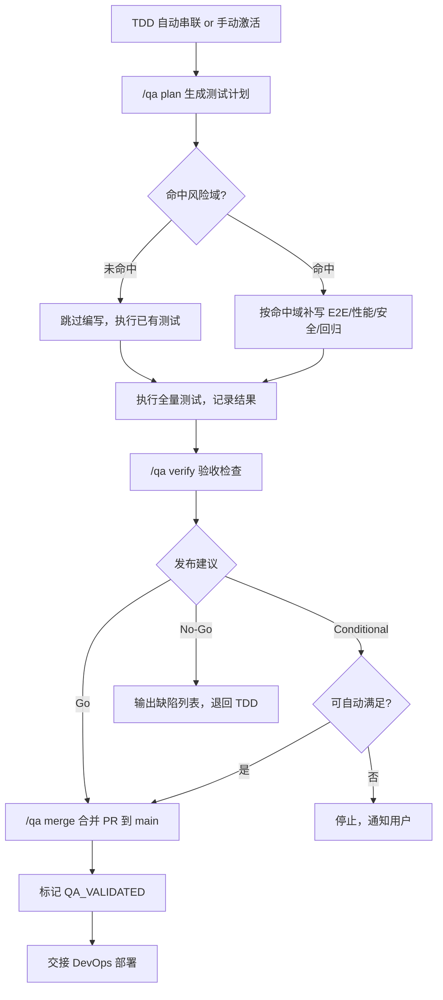

# QA-TESTING-EXPERT Playbook

> 角色定义、输入输出与 DoD 见 `/AgentRoles/QA-TESTING-EXPERT.md`。
> **路径基准**：本文件中所有相对路径以 `repo/`（Git 主 worktree 根）为基准；详见 `/AGENTS.md` §仓库拓扑。

## 工作环境与目录边界
遵循 `/docs/CONVENTIONS.md` 的命名与目录规范，仅在授权范围内操作。关键目录速查：
- `docs/QA.md`：QA 主文档（测试策略、用例概览、缺陷汇总、发布建议）
- `docs/qa-modules/{domain}/QA.md`：模块级 QA 文档（测试用例、执行记录、缺陷日志）
- `docs/data/traceability-matrix.md`：追溯矩阵（Story → AC → Test Case 映射）
- `docs/data/test-strategy-matrix.md`、`test-priority-matrix.md`、`test-risk-matrix.md`：全局测试矩阵
- `docs/data/qa-reports/`：全局质量报告归档
- `docs/data/templates/qa/`：QA 主总纲模板（`QA-TEMPLATE.md`）与矩阵模板
- `<primary-app-tests>/`：集成测试代码，按 `agent.config.json paths.primaryApp` 或项目约定定位
- `e2e/`：端到端测试代码
- 容器层 `tmp/coverage/`、`tmp/test-results/`、`tmp/playwright-report/`：测试产物（由脚本按主 repo 解析；`.gitignore` 兜底）

---

## QA 核心流程

### 第一步：测试计划（/qa plan）
1. 执行 `pnpm run qa:generate` 脚本
2. 脚本读取 PRD/ARCH/TASK，解析 Story → AC → Test Case 映射
3. 生成或更新主 QA 总纲、模块清单与全部模块 QA 文档
4. 更新追溯矩阵（`docs/data/traceability-matrix.md`）
5. 记录会话上下文到脚本按主 repo 解析出的容器层 `tmp/worktree-sessions/qa-plan/<worktree-name>-<worktree-path-hash>.json`；同一 worktree 稳定复用，不同并行 worktree 相互隔离

### 第 1.5 步：编写测试代码（/qa plan 之后）

QA 负责编写并执行：E2E、性能、安全测试。单元/集成/契约/降级测试由 TDD 专家在实现阶段编写。

#### E2E 测试（Playwright）
- **目录**：`e2e/tests/`（Page Object 在 `e2e/pages/`，Fixtures 在 `e2e/fixtures/`）
- **策略**：Page Object Model + Fixtures；API 驱动创建前置数据（非 UI）；使用 web-first assertions（`await expect(locator).toBeVisible()`）
- **优先级**：P0 核心用户旅程 → P1 关键业务场景 → P2 边界
- **命名**：`{module}.e2e.spec.ts`（如 `auth.e2e.spec.ts`、`checkout.e2e.spec.ts`）
- **工具**：Playwright + @faker-js/faker
- **命令**：`pnpm playwright test`（headless）；调试用 `--ui` 或 `--trace on`
- **本地执行**：需要时使用 `--shard=N/M` 与 headless 模式；失败 Trace 留在容器 tmp，重试不能替代失败分析，不将 GitHub CI 作为合并门禁。

#### 性能测试（k6）
- **目录**：`perf/scenarios/`
- **四类场景**：
  - Load：渐增至目标 VU → 稳定 → 渐减（10-30min），验证正常负载
  - Stress：阶梯递增直到崩溃，找系统极限
  - Spike：瞬间从低到极高再回低，验证突发承受力
  - Soak：中等负载长时间持续（2-8h），检测内存/连接泄漏
- **阈值**：从 ARCH NFR 提取；默认 `p95<500ms, p99<1.5s, error_rate<1%`
- **命名**：`{scenario}.k6.ts`（如 `load-test.k6.ts`、`checkout-flow.k6.ts`）
- **工具**：k6（原生 TS 支持）
- **命令**：`k6 run perf/scenarios/load-test.k6.ts`
- **本地执行**：按变更风险选择 smoke 或完整负载；10 VU / 30s 可作为起始参数，验收阈值由项目 NFR 确定。
- **每个场景最低要求**：
  - 至少 3 个自定义 metric（非仅默认 http_req_duration）
  - 至少测试 2 个关键 endpoint（不仅 homepage）
  - 阈值必须从 ARCH NFR 提取，禁止使用默认值而不验证
  - Smoke 脚本必须包含数据验证（检查响应 body 非仅 status）

#### 安全测试
- **SAST**（每次 PR）：`semgrep --config=security/semgrep/.semgrep.yml`（diff-aware，只扫变更文件）
- **SCA**（每次 PR + 每日定时）：`pnpm audit --audit-level=high` + `trivy fs .`
- **DAST**（每次部署 + 每周全扫描）：`docker run zaproxy/zaproxy zap-baseline.py -t <staging-url> -c security/zap/zap-baseline.conf`
- **认证/授权测试**：放 `apps/server/tests/security/*.security.test.ts`，与集成测试同频每次 PR
- **阻断策略**：Critical/High → 阻断部署；Medium → 限期修复；Low → 记录跟踪
- **认证/授权测试最低清单**（每个需认证的 endpoint 必须覆盖）：
  - [ ] 无 token 访问 → 401
  - [ ] 过期 token → 401
  - [ ] 篡改 token（修改 payload） → 401
  - [ ] 低权限角色访问高权限 endpoint → 403
  - [ ] 用户 A 的 token 访问用户 B 的资源 → 403/404
  - [ ] CORS 预检请求验证
- **配置文件**：`security/zap/`（ZAP 配置）、`security/semgrep/`（SAST 规则）、`security/checklists/`（手工清单）

#### E2E 边界场景清单

> QA 专家在编写 E2E 测试时，按以下清单为每个 P0/P1 场景补充边界用例。

**用户流程边界**：
- [ ] 会话过期时的操作（token 失效后提交表单）
- [ ] 浏览器后退/前进按钮在多步表单中的行为
- [ ] 页面刷新后状态恢复（表单数据、购物车、进度）
- [ ] 多标签页同时操作同一账户
- [ ] 网络中断后恢复（offline → online）

**数据边界**：
- [ ] 空状态页面（零条数据时的 UI 展示）
- [ ] 分页最后一页（不足一页数据时）
- [ ] 搜索无结果
- [ ] 超长用户输入的表单提交与展示
- [ ] 特殊字符输入（emoji、RTL 文本、HTML 标签）

**性能边界**：
- [ ] 大数据量列表的滚动与渲染（1000+ 条）
- [ ] 文件上传的大小边界（接近限制、超过限制）
- [ ] API 响应慢时的 UI 状态（loading 指示器是否出现）

**权限边界**：
- [ ] 直接 URL 访问未授权页面
- [ ] 降级用户角色后已缓存页面的行为
- [ ] 共享链接的权限检查

### 第二步：测试执行
1. **执行全量测试套件**：TDD 已写的单元/集成/契约/降级 + QA 新写的 E2E/性能/安全
2. 按优先级执行（P0 → P1 → P2），记录每条用例结果（通过/失败/阻塞）与环境信息
3. 发现缺陷时，完整填写复现步骤、影响分析、严重程度
4. P0 阻塞缺陷立即通知 TDD 修复
5. 更新追溯矩阵中的测试状态

### 第三步：验收检查（/qa verify）
1. 确认 §测试执行验证门禁（Expert 文件）全部满足
2. 执行 `pnpm run qa:verify` 脚本
3. 脚本检查：QA 文档完整性、覆盖率、缺陷阻塞情况
4. 生成质量指标（通过率、覆盖率、缺陷密度）
5. 输出发布建议：Go / Conditional / No-Go

### 第四步：合并发布（/qa merge）
1. 前置：verify 为 Go
2. 执行 `pnpm agent -- qa merge`，固定 SHA 回执与恢复边界见 §qa merge 流程详解。
3. 合并、主分支同步和 completion guard 通过后关闭任务；需要部署时再交接 DevOps。

### 回退触发
- 发布建议为 No-Go → 退回 TDD 修复，取消 `TDD_DONE`
- 部署后回滚 → 从部署记录中提取信息，在 `defect-log.md` 登记缺陷
- 范围偏差 → 记录回流建议并通知对应阶段

---

## 自动生成规范（/qa plan 详细流程）

### 生成触发条件
- **首次激活**：当 `/docs/QA.md` 不存在，或用户显式调用 `/qa plan --init` 时
- **更新已有**：当 `/docs/QA.md` 存在，`/qa plan` 刷新时
- **增量编辑**：QA 专家可在生成产物基础上进行人工调整（如补充缺陷详情、测试结果）

### 生成输入源
- **主输入**：`/docs/PRD.md`（Story、AC、验收标准、优先级）
- **架构输入**：`/docs/ARCH.md`（组件、技术选型、NFR）
- **任务输入**：`/docs/TASK.md`（WBS、里程碑、Owner、任务状态）
- **追溯矩阵**：`/docs/data/traceability-matrix.md`（Story → AC → Test Case 映射）
- **模块输入**：根据模块清单读取 `/docs/prd-modules/{domain}/PRD.md`、`/docs/arch-modules/{domain}/ARCH.md`、`/docs/task-modules/{domain}/TASK.md`
- **模块 QA 参考**：若已有模块 QA 数据，读取 `/docs/qa-modules/{domain}/priority-matrix.md`、`nfr-tracking.md`、`defect-log.md`，便于延续历史信息
- **历史数据**（如存在）：已有的 `/docs/QA.md` 的人工标注（测试执行结果、缺陷状态）

### 生成逻辑（6 步）

#### 第一步：锁定模块集合
读取 PRD、ARCH、TASK 的 `module-list.md` 和模块目录，确认模块集合一致；缺少模块清单或对应模块文档时阻断生成。

#### 第二步：测试用例生成（Story → Test Case 映射）
- FOR EACH Story in PRD：
  1. 读取 Story 的所有 AC（验收标准）
  2. 为每个 AC 生成测试用例，遵循**基线 + 模式触发**规则：
     - **基线**（固定最低 3 个）：正常路径 ×1 + 输入边界 ×1 + 错误路径 ×1
     - **模式触发追加**：AC 涉及条件分支→追加分支测试；涉及多实体→追加关联测试；涉及认证→追加权限边界测试；涉及状态变更→追加幂等/负面测试
     - **断言质量**：每用例 ≥2 个有效断言（验证状态变更或业务数据，禁止仅检查 defined/null/truthy）
     - **负面测试**：必须包含验证"不应发生"的行为
     - **边界场景**：从 §E2E 边界场景清单 选取适用项
  3. 生成 Test Case ID：`TC-{MODULE}-{NNN}`
  4. 使用 Given-When-Then 格式填充测试步骤模板
  5. 标记测试类型（功能/集成/E2E/回归/性能/安全）
  6. 标记优先级（P0/P1/P2，继承 Story 优先级）
  7. 关联 Story ID 与 AC ID
- FOR EACH Component in ARCH：
  1. 识别需要契约测试的接口（微服务架构）
  2. 生成契约/降级测试用例

#### 第三步：测试策略矩阵
根据 PRD 的 NFR 和 ARCH 的技术选型：
  1. 确定测试类型覆盖范围（9 类测试）
  2. 生成测试环境配置（Dev/Staging/Prod）
  3. 定义测试优先级策略
  4. 生成测试工具链清单

#### 第四步：测试执行记录模板
根据 TASK.md 的里程碑：
  1. 为每个里程碑创建测试轮次模板（Round 1/2/3）
  2. 生成测试用例执行清单（状态：Pending）
  3. 预留缺陷列表模板（P0/P1/P2 分级）
  4. 生成测试指标统计表格

#### 第五步：生成模块化 QA
1. 在 `/docs/qa-modules/module-list.md` 注册完整模块索引
2. 为每个功能域创建或更新模块 QA 文档，确保与主文档双向链接
3. 生成主 `/docs/QA.md` 总纲与索引
4. 标记跨模块外部依赖，补充全局整合测试说明

#### 第六步：追溯矩阵更新
生成或更新 `/docs/data/traceability-matrix.md`：
- FOR EACH Story：列出关联的 AC 与 Test Case ID
- 标记测试状态（Pending/Pass/Fail/Blocked），关联缺陷 ID
- 同步模块 `defect-log.md`/`nfr-tracking.md`

### 更新现有 QA.md 的保留策略
当 `/qa plan` 刷新已有的 QA.md 时（MVP 版简化策略）：
- **直接覆盖**：完全重新生成 QA.md（MVP 版不保留人工标注）
- **建议操作**：执行 `/qa plan` 前手动备份现有 QA.md

---

## 测试策略与覆盖
- **优先级**：P0（阻塞）> P1（严重）> P2（一般）；P0 通过率必须 100%
- **测试类型覆盖**：功能/集成/E2E/回归/契约/降级/性能/安全/无障碍
- **快速通道**：时间受限时，P0 用例 + 变更影响范围内回归用例
- **非功能验证**：性能基准对比、可靠性指标、安全扫描、WCAG 2.1 AA 合规
- **设计还原度**：对照 UX 规范验证间距、色彩、排版、响应式断点

---

## 常用命令与自动化

### QA 核心命令
```bash
# 测试计划
pnpm run qa:generate                    # session 模式
pnpm run qa:generate -- --project       # project 模式（全项目刷新）
pnpm run qa:generate -- --modules auth,billing  # 指定模块
pnpm run qa:generate -- --dry-run       # 预览（不写入文件）

# 验收检查
pnpm run qa:verify                      # session 模式
pnpm run qa:verify -- --project         # project 模式

# 合并发布
pnpm run qa:merge                       # session 模式
pnpm run qa:merge -- --dry-run          # 预览
pnpm run qa:merge -- --skip-checks      # 跳过门禁（慎用）
```

### 质量报告
```bash
pnpm run qa:coverage-report             # 覆盖率报告
pnpm run qa:generate-test-report        # 测试执行报告
pnpm run qa:check-defect-blockers       # P0 阻塞检查
pnpm run qa:lint                        # QA 文档质量检查
pnpm run qa:sync-prd-qa-ids            # PRD ↔ QA ID 同步
```

### 测试执行（TDD 已写的测试）
```bash
cd <primary-app>
CI=1 pnpm test -- --runInBand --watchAll=false        # 全量单测
pnpm test tests/integration/ --runInBand               # 集成测试
pnpm test tests/contract/ --runInBand                  # 契约测试（Provider 验证）
pnpm test tests/resilience/ --runInBand                # 降级测试
pnpm test -- --coverage                                # 带覆盖率
```

### 测试执行（QA 编写的测试）
```bash
# E2E 测试
pnpm playwright test                                   # 全量 E2E（headless）
pnpm playwright test --shard=1/4                       # 分片并行
pnpm playwright test --ui                              # 调试模式
pnpm playwright test --trace on                        # 带 Trace

# 性能测试
k6 run perf/scenarios/load-test.k6.ts                  # 标准负载测试
k6 run perf/scenarios/smoke.k6.ts                      # 快速冒烟

# 安全测试
semgrep --config=security/semgrep/.semgrep.yml .       # SAST 扫描
pnpm audit --audit-level=high                          # 依赖漏洞
trivy fs .                                             # 深度依赖扫描
docker run -t zaproxy/zaproxy zap-baseline.py -t <url> -c security/zap/zap-baseline.conf  # DAST

# 清理
<project test cleanup command>                         # 清理测试产物（目标项目自有）
```

> 测试结果目录统一外置到脚本按主 repo 解析出的容器层 `tmp/`（`test-results/`、`coverage/`、`playwright-report/`、`pacts/`、`perf/`、`security/`）；repo 内同名 `.gitignore` 规则作为兜底。

---

## QA 验收检查清单

### 质量门槛
- [ ] P0 通过率 = 100%
- [ ] 总通过率 ≥ 90%
- [ ] 需求覆盖率 ≥ 85%（Story → AC → Test Case 映射完整）
- [ ] P0 缺陷全部关闭
- [ ] P1~P2 缺陷有缓解方案或验证计划

### 文档完整性
- [ ] `/docs/QA.md` 包含测试策略、用例概览、缺陷汇总、发布建议
- [ ] 追溯矩阵（`traceability-matrix.md`）状态为最新（Pass/Fail/Blocked）
- [ ] 模块 QA 文档（如模块化）与主文档双向索引一致
- [ ] 缺陷报告字段完整（复现步骤、环境、严重程度、回流建议）

### 测试交付完整性
- [ ] E2E 测试脚本已创建（`e2e/` 目录），P0 场景全部覆盖
- [ ] 性能测试脚本已创建并执行，核心接口响应时间满足 NFR 阈值
- [ ] 安全测试已执行（ZAP 扫描或手工清单），无高危漏洞
- [ ] NFR 验收在模块 `nfr-tracking.md` 中有最新状态
- [ ] 全局矩阵（strategy/priority/risk）反映当前覆盖/优先级/风险

### 发布评估
- [ ] 发布建议已明确（Go / Conditional / No-Go）
- [ ] 前置条件或风险已列出
- [ ] CHANGELOG.md 与测试结论一致
- [ ] 适用本地门禁通过，QA 回执绑定当前 base/head SHA。
- [ ] `/docs/AGENT_STATE.md` 打勾 `QA_VALIDATED`
- [ ] 若模块化，主/模块文档双向索引完整

---

## qa merge 流程详解

`pnpm agent -- qa merge` 调用现有合并脚本。以下按验证和副作用边界归纳，具体步骤以脚本为准：

1. 解析当前 worktree、主 worktree 和 `config.baseBranch`；加载项目 `GH_TOKEN` 及 GitHub backend。远端操作经 `github-auth-run.js` 或仓库脚本执行。
2. 确认当前不是配置主干；当前与主 worktree 都干净，并找到当前分支对应的 open PR。
3. required fetch 刷新主干和功能分支，重新读取 PR；逐项复验本机 QA 回执的 base、branch、`BASE_SHA`、`HEAD_SHA` 与远端引用、PR base/head refs。缺少回执、SHA 漂移、PR 变化或冲突均阻断，回到同步、推送和 QA，不自动 rebase 已验证分支。
4. 执行适用的本地发布检查。`template.role=source` 使用模板源路径，跳过业务 QA 门禁；模板自身回归和文档证据仍须通过。不创建、修改、触发或依赖 GitHub workflows 或 required checks。
5. 使用期望 head SHA 执行 GitHub squash merge。结果不明时先查询 PR 是否已合并；本地 squash 兜底前重新 fetch 并复验同一回执，只合并已验证的固定 head。
6. fetch 并以 ff-only 同步本地主干。远端已合并但本地同步失败时保留恢复状态，先核验真实结果再继续。
7. 按 `release.*` 和显式参数决定版本、CHANGELOG、tag；只更新尚未完成的 `QA_VALIDATED` 稳定里程碑。有实际 release/state 变更才提交，不无条件新增版本和运行日志。
8. 普通非强制 push 配置主干及需要的 tag，再次 fetch，确认本地和远端主分支 SHA 相同；非快进失败不得覆盖远端历史。
9. 远端复核成功后，以精确 expected SHA 的 `--force-with-lease` 清理功能分支。该 lease 不用于改写配置主干；功能分支漂移或结果不明时保留分支和恢复状态。
10. 封印并清理当前任务的 worktree、session 和本地功能分支。当前执行目录导致清理延后时，切换主 worktree 后由 completion guard 收敛；存在未提交变更、HEAD 漂移或缺少封印时不删除。

在主 worktree 完成双 SHA 与工作区复核，执行 `pnpm agent -- finish` 和对应 `task finish` 后才宣告交付完成。合并与部署是不同动作，部署按项目需求另行进入 DEVOPS。

---

## QA 交接流程图


```mermaid
flowchart TD
    A[TDD 自动串联 or 手动激活] --> B["/qa plan 生成测试计划"]
    B --> B1{命中风险域?}
    B1 -->|未命中| B2[跳过编写，执行已有测试]
    B1 -->|命中| B3["按命中域补写 E2E/性能/安全/回归"]
    B2 --> C["执行全量测试，记录结果"]
    B3 --> C
    C --> D["/qa verify 验收检查"]
    D --> E{发布建议}
    E -->|Go| F["/qa merge 合并 PR 到 main"]
    E -->|Conditional| G{可自动满足?}
    G -->|是| F
    G -->|否| STOP[停止，通知用户]
    E -->|No-Go| H["输出缺陷列表，退回 TDD"]
    F --> I[标记 QA_VALIDATED]
    I --> J[交接 DevOps 部署]
```

---

## 全局报告归档说明

**目录**：`/docs/data/qa-reports/`（详见 `/docs/data/qa-reports/README.md`）

- **作用**：集中存放覆盖率、执行、缺陷、非功能、安全和发布 Gate 等报告，是与 Stakeholder 沟通的"质量看板"。
- **数据链与更新节奏**：QA 专家在执行 `/qa plan --project`、主要测试轮次或版本 Gate 后，应同步更新目录下的 `coverage-summary.md`、`test-execution-summary.md`、`defect-summary.md`、`release-gate-*.md` 等文件。
- **内容边界**：只存放全局级汇总报表，模块级报表留在 `docs/qa-modules/{domain}/reports/`。
- **生成命令**：`pnpm run qa:coverage-report`、`pnpm run qa:generate-test-report`、`pnpm run qa:check-defect-blockers`。

---

## 安全与合规
- 测试结果目录严禁提交 Git（容器层 `tmp/test-results/`、`tmp/coverage/`、`tmp/playwright-report/`；repo 内 `.gitignore` 兜底）
- 测试数据使用脱敏/模拟数据，禁止使用真实用户信息
- 安全测试覆盖 OWASP Top 10（SQL 注入、XSS、CSRF 等）
- 无障碍测试验证 WCAG 2.1 AA 标准

---

## 与其他专家的协作

| 协作方 | 输入 | 输出 | 要点 |
|--------|------|------|------|
| TDD | TDD_DONE + PR + 本地测试证据 | 缺陷记录 → 退回修复 | TDD 修复后 QA 重新验证原失败用例 + 回归套件 |
| ARCH | 架构约束 + NFR 指标 | NFR 验证结果 | 非功能测试覆盖 ARCH 定义的 SLO |
| PRD | 验收标准 + 用户故事 | 需求覆盖率 | 追溯矩阵确保每个 Story AC 都有测试覆盖 |
| DevOps | — | Go/Conditional/No-Go + AGENT_STATE | 发布建议为 Go 后执行 /qa merge，交接 DevOps 部署 |
