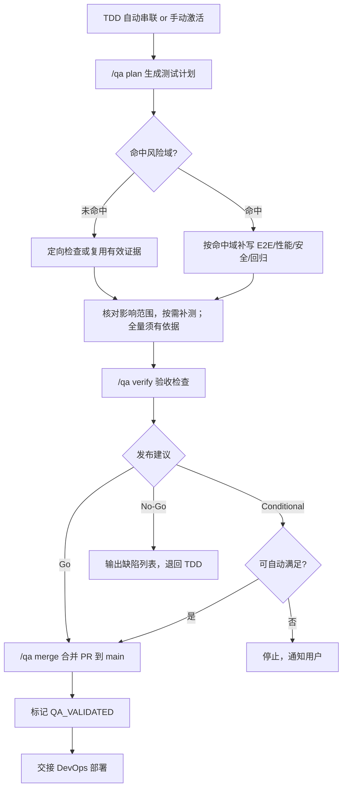

# QA-TESTING-EXPERT Playbook

> 角色定义、输入输出与 DoD 见 `/AgentRoles/QA-TESTING-EXPERT.md`。
> **路径基准**：本文件中所有相对路径以 `repo/`（Git 主 worktree 根）为基准；详见 `/docs/CONVENTIONS.md` §路径与仓库拓扑。

## 工作环境与目录边界
遵循 `/docs/CONVENTIONS.md` 的命名与目录规范，仅在授权范围内操作。关键目录速查：
- `docs/QA.md`：QA 主文档（测试策略、用例概览、缺陷汇总、发布建议）
- `docs/qa-modules/{domain}/QA.md`：模块级 QA 文档（测试用例、缺陷与 NFR 验证口径；执行证据另存）
- `docs/data/traceability-matrix.md`：追溯矩阵（Story → AC → Test Case 映射）
- `docs/data/test-strategy-matrix.md`、`test-priority-matrix.md`、`test-risk-matrix.md`：全局测试矩阵
- `docs/data/qa-reports/`：全局质量报告归档
- `docs/qa-modules/{domain}/PATHS.md`：页面状态与操作路径（界面、状态、转移、路径与覆盖准则；业务测试自动化使用，由 QA 维护，`/qa plan` 不生成也不覆盖）
- `docs/data/templates/qa/`：QA 主总纲模板（`QA-TEMPLATE.md`）、页面状态与操作路径模板（`PATHS-TEMPLATE.md`）与矩阵模板
- `<primary-app-tests>/`：集成测试代码，按 `agent.config.json paths.primaryApp` 或项目约定定位
- `e2e/`：端到端测试代码
- 容器层 `tmp/coverage/`、`tmp/test-results/`、`tmp/playwright-report/`：测试产物（由脚本按主 repo 解析；`.gitignore` 兜底）

---

## QA 核心流程

### 第一步：测试计划（/qa plan）
1. 执行 `pnpm run qa:generate` 脚本
2. 治理流程读取 PRD/ARCH/TASK 并解析 Story → AC → Test Case；日常流程读取用户验收、交付 diff 与已有测试
3. 按 session 目标生成或更新相关 QA 文档；仅显式 project 范围覆盖全部模块，文档范围不自动决定测试执行范围
4. 映射有变化时更新追溯矩阵（`docs/data/traceability-matrix.md`）
5. 记录会话上下文到脚本按主 repo 解析出的容器层 `tmp/worktree-sessions/qa-plan/<worktree-name>-<worktree-path-hash>.json`；同一 worktree 稳定复用，不同并行 worktree 相互隔离

### 第 1.5 步：编写测试代码（/qa plan 之后）

QA 负责编写并执行：E2E、性能、安全测试。单元/集成/契约/降级测试由 TDD 专家在实现阶段编写。

#### E2E 测试（Playwright）
- **目录**：`packages/e2e/tests/<app>/`（与架构包 e2e 脚手架一致；Page Object 在 `packages/e2e/pages/`，Fixtures 在 `packages/e2e/fixtures/`）
- **策略**：Page Object Model + Fixtures；API 驱动创建前置数据（非 UI）；使用 web-first assertions（`await expect(locator).toBeVisible()`）
- **优先级**：P0 核心用户旅程 → P1 关键业务场景 → P2 边界
- **命名**：`{module}.e2e.spec.ts`（如 `auth.e2e.spec.ts`、`checkout.e2e.spec.ts`）
- **工具**：Playwright + @faker-js/faker
- **命令**：`pnpm --filter @project/e2e exec playwright test tests/<app>/<affected>.e2e.spec.ts`（headless 定向）；调试用 `--ui` 或 `--trace on`
- **本地执行**：需要时使用 `--shard=N/M` 与 headless 模式；失败 Trace 留在容器 tmp，重试不能替代失败分析，不将 GitHub CI 作为合并门禁。

#### 性能测试（k6）
- **目录**：`perf/scenarios/`
- **四类场景**：
  - Load：渐增至目标 VU → 稳定 → 渐减（10-30min），验证正常负载
  - Stress：阶梯递增直到崩溃，找系统极限
  - Spike：瞬间从低到极高再回低，验证突发承受力
  - Soak：中等负载长时间持续（2-8h），检测内存/连接泄漏
- **阈值**：从 ARCH NFR 提取；默认 `p95<500ms, p99<1.5s, error_rate<1%`
- **命名**：`{scenario}.k6.ts`（如 `load-test.k6.ts`、`checkout-flow.k6.ts`）
- **工具**：k6（原生 TS 支持）
- **命令**：`k6 run perf/scenarios/load-test.k6.ts`
- **本地执行**：按变更风险选择 smoke 或完整负载；10 VU / 30s 可作为起始参数，验收阈值由项目 NFR 确定。
- **每个场景最低要求**：
  - 至少 3 个自定义 metric（非仅默认 http_req_duration）
  - 至少测试 2 个关键 endpoint（不仅 homepage）
  - 阈值必须从 ARCH NFR 提取，禁止使用默认值而不验证
  - Smoke 脚本必须包含数据验证（检查响应 body 非仅 status）

#### 安全测试
- **SAST**（受影响安全逻辑或项目门禁）：使用项目已选工具，覆盖变更及相关安全路径
- **SCA**（依赖/供应链配置变化或项目门禁）：`pnpm audit --audit-level=high`、`trivy fs .` 为按需示例
- **DAST**（受影响对外入口或部署门禁）：`docker run zaproxy/zaproxy zap-baseline.py -t <staging-url> -c security/zap/zap-baseline.conf` 为按需示例；定期全扫描按项目既定计划
- **认证/授权测试**：放 `apps/server/tests/security/*.security.test.ts`，覆盖受影响端点与权限消费者
- **阻断策略**：Critical/High → 阻断部署；Medium → 限期修复；Low → 记录跟踪
- **认证/授权测试最低清单**（每个需认证的 endpoint 必须覆盖）：
  - [ ] 无 token 访问 → 401
  - [ ] 过期 token → 401
  - [ ] 篡改 token（修改 payload） → 401
  - [ ] 低权限角色访问高权限 endpoint → 403
  - [ ] 用户 A 的 token 访问用户 B 的资源 → 403/404
  - [ ] CORS 预检请求验证
- **配置文件**：`security/zap/`（ZAP 配置）、`security/semgrep/`（SAST 规则）、`security/checklists/`（手工清单）

#### E2E 边界场景清单

> QA 专家在编写 E2E 测试时，按以下清单为每个 P0/P1 场景补充边界用例。

**用户流程边界**：
- [ ] 会话过期时的操作（token 失效后提交表单）
- [ ] 浏览器后退/前进按钮在多步表单中的行为
- [ ] 页面刷新后状态恢复（表单数据、购物车、进度）
- [ ] 多标签页同时操作同一账户
- [ ] 网络中断后恢复（offline → online）

**数据边界**：
- [ ] 空状态页面（零条数据时的 UI 展示）
- [ ] 分页最后一页（不足一页数据时）
- [ ] 搜索无结果
- [ ] 超长用户输入的表单提交与展示
- [ ] 特殊字符输入（emoji、RTL 文本、HTML 标签）

**性能边界**：
- [ ] 大数据量列表的滚动与渲染（1000+ 条）
- [ ] 文件上传的大小边界（接近限制、超过限制）
- [ ] API 响应慢时的 UI 状态（loading 指示器是否出现）

**权限边界**：
- [ ] 直接 URL 访问未授权页面
- [ ] 降级用户角色后已缓存页面的行为
- [ ] 共享链接的权限检查

### 第二步：测试执行
1. **按影响执行测试**：按 `docs/CONVENTIONS.md` §测试范围与证据复用选择定向、消费者及专项回归，核实有效 TDD 证据；仅满足明确升级条件时执行对应应用/测试类型的全量，具体门禁见 Expert 文件
2. 按优先级执行（P0 → P1 → P2），记录每条用例结果（通过/失败/阻塞）与环境信息
3. 发现缺陷时，完整填写复现步骤、影响分析、严重程度
4. P0 阻塞缺陷立即通知 TDD 修复
5. 在 QA 证据中记录本次测试状态与关联缺陷

### 第三步：验收检查（/qa verify）
1. 确认 §测试执行验证门禁（Expert 文件）全部满足
2. 执行 `pnpm run qa:verify` 脚本
3. 脚本检查：QA 文档完整性、覆盖率、缺陷阻塞情况
4. 生成质量指标（通过率、覆盖率、缺陷密度）
5. 输出发布建议：Go / Conditional / No-Go

### 第四步：合并发布（/qa merge）
1. 前置：verify 为 Go
2. 执行 `pnpm agent -- qa merge`，固定 SHA 回执与恢复边界见 §qa merge 流程详解。
3. 合并、主分支同步和 completion guard 通过后关闭任务；需要部署时再交接 DevOps。

### 回退触发
- 发布建议为 No-Go → 附缺陷证据回流 TDD，保留已有 `TDD_DONE` 里程碑历史
- 部署后回滚 → 从部署记录中提取信息，在 `defect-log.md` 登记缺陷
- 范围偏差 → 记录回流建议并通知对应阶段

---

## 自动生成规范（/qa plan 详细流程）

### 生成触发条件
- **首次激活**：治理流程需要建立 QA 文档且 `/docs/QA.md` 不存在，或用户显式调用 `/qa plan --init` 时；日常流程不因缺少治理文档自动初始化全部模块
- **更新已有**：当 `/docs/QA.md` 存在，`/qa plan` 刷新时
- **增量编辑**：QA 专家可在生成产物基础上进行人工调整（如补充缺陷详情、测试结果）

### 生成输入源
- **主输入**：`/docs/PRD.md`（Story、AC、验收标准、优先级）
- **架构输入**：`/docs/ARCH.md`（组件、技术选型、NFR）
- **任务输入**：治理流程的 `/docs/TASK.md`（WBS、里程碑、Owner）；日常流程使用用户验收、交付 diff 与有效测试证据
- **追溯矩阵**：`/docs/data/traceability-matrix.md`（Story → AC → Test Case 映射）
- **模块输入**：根据模块清单读取 `/docs/prd-modules/{domain}/PRD.md`、`/docs/arch-modules/{domain}/ARCH.md`、`/docs/task-modules/{domain}/TASK.md`
- **模块 QA 参考**：若已有模块 QA 数据，读取 `/docs/qa-modules/{domain}/priority-matrix.md`、`nfr-tracking.md`、`defect-log.md`，以及业务测试自动化使用的 `PATHS.md`，便于延续历史信息
- **历史数据**（如存在）：已有的 QA 稳定策略与缺陷资料；单次执行结果从 QA 证据读取

### 生成逻辑（6 步）

#### 第一步：锁定模块集合
治理流程读取 PRD、ARCH、TASK 的 `module-list.md` 和模块目录，确认模块集合一致；缺少必要模块文档时回流。日常流程按受影响范围规划，不要求补建治理模块。

#### 第二步：测试用例生成（Story → Test Case 映射）
- FOR EACH Story in PRD：
  1. 读取 Story 的所有 AC（验收标准）
  2. 为每个 AC 生成测试用例，遵循**基线 + 模式触发**规则：
     - **基线**（新增或改变关键用户路径的受影响 Story）：正常路径、适用输入边界及错误恢复；复用已有用例并补缺口，不对纯文档或局部样式固定新增 3 个 E2E
     - **模式触发追加**：AC 涉及条件分支→追加分支测试；涉及多实体→追加关联测试；涉及认证→追加权限边界测试；涉及状态变更→追加幂等/负面测试
     - **断言质量**：每用例 ≥2 个有效断言（验证状态变更或业务数据，禁止仅检查 defined/null/truthy）
     - **负面测试**：必须包含验证"不应发生"的行为
     - **边界场景**：从 §E2E 边界场景清单 选取适用项
  3. 生成 Test Case ID：`TC-{MODULE}-NNN`；PRD 原子 AC 表 TC 列已有的标识沿用，新增标识在同一编号空间内取未占用的序号并回填 TC 列
  4. 使用 Given-When-Then 格式填充测试步骤：已有原子 AC 表时直接取该表的 Given、When、Then 三列，不改写也不另行发明；自动化用例须做到测试名携带 AC/TC 标识（命名规则见「业务测试自动化」一章）
  5. 标记测试类型（功能/集成/E2E/回归/性能/安全）
  6. 标记优先级（P0/P1/P2，继承 Story 优先级）
  7. 关联 Story ID 与 AC ID
- FOR EACH Component in ARCH：
  1. 识别需要契约测试的接口（微服务架构）
  2. 生成契约/降级测试用例

#### 第三步：测试策略矩阵
根据 PRD 的 NFR 和 ARCH 的技术选型：
  1. 确定测试类型覆盖范围（9 类测试）
  2. 生成测试环境配置（Dev/Staging/Prod）
  3. 定义测试优先级策略
  4. 生成测试工具链清单

#### 第四步：测试执行证据模板
按适用里程碑或本次交付范围，在 QA 证据目录准备测试清单、环境、命令、退出码、缺陷 ID 与质量指标；不把轮次状态回写阶段总纲。

#### 第五步：生成模块化 QA
1. 在 `/docs/qa-modules/module-list.md` 注册完整模块索引
2. 为每个功能域创建或更新模块 QA 文档，确保与主文档双向链接
3. 生成主 `/docs/QA.md` 总纲与索引
4. 标记跨模块外部依赖，补充全局整合测试说明

#### 第六步：追溯矩阵更新
生成或更新 `/docs/data/traceability-matrix.md`：
- FOR EACH Story：列出关联的 AC 与 Test Case ID
- 执行状态（Pending/Pass/Fail/Blocked）与缺陷 ID 保存在本次 QA 证据；稳定缺陷与 NFR 口径按需同步模块资料

### 更新现有 QA.md 的保留策略
`/qa plan` 刷新已有文档时按文档归属处理，已评审的业务测试资料不会被覆盖：
- **生成器自有文档**：以 `<!-- QA-GENERATED: generate-qa.js -->` 标记开头的文档由 `/qa plan` 重新生成，内容以 PRD、ARCH、TASK 与追溯矩阵为准；PRD 含原子 AC 表时，用例编号取 AC 表 `TC` 列、前缀取表内模块标识，`TC` 为 `-` 的 AC 与没有 AC 的 Story 列在「3.2 尚未登记用例的验收标准」，不替它们臆造编号
- **手工维护文档**：没有该标记的 `docs/QA.md`、QA 模块清单与模块 QA 文档会被保留（日志提示「保留手工维护的…」），差异由 QA 专家评审后合并
- **业务测试资料**：`PATHS.md`、业务测试套件与已评审的 TC 行从不由 `/qa plan` 生成或覆盖；刷新只新增或提出差异，不覆盖已评审用例，详见「业务测试自动化」一章的刷新策略
- **建议操作**：刷新前先提交现有改动，刷新后用 `git diff` 审阅，再决定保留或回退

---

## 业务测试自动化（qa paths / qa run / 业务验收门禁）

> 适用于有页面或客户端界面、需要把 PRD 验收标准落成端到端自动化验收的项目。`agent.config.json` 的 `qa.business.enabled=true` 才启用业务验收门禁；未启用时 `qa verify` 的行为与输出保持不变。
> 分工：模型在创作期生成路径模型与用例；脚本只做确定性的解析、校验、运行、绑定与判定，不调用大模型、不含随机、不联网，同一份 PRD、PATHS.md、用例与报告永远得出同一个结论。

```text
PRD 原子 AC 表 → docs/qa-modules/{domain}/PATHS.md → pnpm agent -- qa paths（STATUS=OK）
→ 编写并评审自动化用例（测试名携带 AC/TC 标识）→ 提交 → pnpm agent -- qa run → pnpm agent -- qa verify
```

### 预言机：期望值从哪里来

预言机是判定「实际结果对不对」的依据。自动生成的用例只有在预言机独立于被测系统时才有验证价值：

预期结果只来自 PRD 原子 AC、数据字典、UX 规范与 ARCH 接口契约，禁止以被测代码当前输出作期望值；规格有歧义时回流 PRD 澄清。

| 来源 | 提供什么 | 引用方式 |
|------|----------|----------|
| PRD 原子 AC | Then 列的可观察结果，Given 列的前置条件 | 断言逐条对应 Then 列，用例名携带该 AC 的标识 |
| 数据字典 | 字段类型、长度、取值范围、枚举与默认值 | 等价类与边界值的取值依据，数据行注明出处 |
| UX 规范 | 界面状态、提示文案、交互反馈 | 状态断言引用 PATHS.md 中对应的 SCR 与 STA 标识 |
| ARCH 接口契约 | 状态码、错误码、幂等与限流约定 | 接口断言引用契约条目 |

禁止项：
- 把被测代码或页面的**当前输出**当作期望值。先运行一遍、再把结果抄进断言，只能证明「它现在是这样」，不能证明「它应该这样」；
- 以**录制**回放的结果作为预期，或用**截图**与快照基线代替断言。基线只能在期望已由 AC 或 UX 规范固定之后，用于视觉回归；
- 从实现代码反推业务规则，再据此写断言。

规格有歧义或缺失时不要猜测：回流 PRD 澄清，澄清之前该 AC 不进入自动化。每条用例至少 2 个有效断言，且都能追溯到某条 AC 的 Then 列。

### 路径推导：从原子 AC 到 PATHS.md

把 `docs/data/templates/qa/PATHS-TEMPLATE.md` 复制为 `docs/qa-modules/{domain}/PATHS.md`（`{domain}` 与 `docs/prd-modules/{domain}/` 同名）。该文件由 QA 专家维护，其他专家通过评审提出修改；它只引用 AC 与 TC，不复制 Given/When/Then，规格以 PRD 原子 AC 表为唯一来源。

1. **列界面**：从 UX 规范列出每个用户可见的页面或客户端视图（`SCR-{MODULE}-NNN`），写明适用的端。
2. **列状态**：列出界面上用户能观察到、且会影响下一步操作的状态（`STA-{MODULE}-NNN`）；状态必须可断言，不写内部实现细节。
3. **列转移**：每个转移是「起始状态 + 操作 + 守卫 → 目标状态」（`TRN-{MODULE}-NNN`）；守卫写区分分支的条件，无条件写 `-`；承载验收标准的转移在「关联 AC」引用该 AC，纯导航转移写 `-`。
4. **选覆盖准则**：默认 `all-transitions`，声明方式与取舍见下一小节。
5. **推导路径**：用尽量少的路径覆盖全部转移，路径内的转移首尾相接；每条路径（`PTH-{MODULE}-NNN`）绑定一个端到端用例 `TC-{MODULE}-NNN`，与 PRD 原子 AC 表的 TC 列共用同一个编号空间。
6. **运行 `pnpm agent -- qa paths`**：输出 `STATUS=OK` 才表示模型自洽，逐条处理 `VIOLATION=` 行（含义见速查表）；再用 `MATRIX_AC=` 行核对每条 AC 关联的转移、路径与 TC，用 `MATRIX_PATH=` 行核对每条路径的转移序列与 TC，这两组行就是要编写的用例清单。

`qa paths` 只读，不创建目录、不写文件。路径模型由模型推导，容易编造或过度细化，因此 P0 路径必须经过评审，评审人对照 UX 规范确认：
- 每个状态在 UX 规范中有依据，没有凭空添加的界面；
- 同一起始状态的各个守卫互斥且完整，没有遗漏分支；
- 没有为凑覆盖率增加冗余路径；`manual`（人工验收）的 AC 不需要转移。

### 覆盖准则

覆盖准则决定「哪些路径是必须的」。在 PATHS.md 的行首单独写一行声明，整份文件只声明一次（围栏代码块里的示例不生效）：

```text
覆盖准则：all-transitions
```

| 取值 | 含义 | 何时使用 |
|------|------|----------|
| `all-transitions` | 每条转移至少被一条通过的路径经过 | 默认推荐，能发现守卫分支的遗漏 |
| `all-states` | 每个状态至少被一条通过的路径经过，要求较弱 | 界面流程尚在成形的过渡阶段 |
| `none` | 不要求覆盖，只校验引用 | 暂无界面流程的模块，须在评审中说明理由 |

- `all-*` 取值可用逗号组合（如 `all-transitions,all-states`），`none` 不与其他取值并存；重复声明或取值非法会报 `CRITERION_INVALID`。
- 覆盖只统计结果为通过的路径：路径对应的用例失败、被跳过或缺失，相应的转移就算未覆盖，业务验收门禁报 `PATH_COVERAGE_GAP`。
- 声明了 `none` 以外的准则后，每条 P0 的 `auto` AC 都必须被某条转移引用，否则 `qa paths` 报 `AC_UNLINKED`。
- 取值差异（等价类、边界值、组合）是同一条路径上的数据行，不会改变覆盖准则要求的路径集合。
- `manual` 的 AC 不需要转移，但会在门禁里披露为 `RISK_MANUAL_AC`，需要人工验收。

### 测试设计技术

取值技术只产生同一条路径上的数据行，不新增状态、转移或路径：先由覆盖准则选出路径，再用下列技术决定每条路径上要跑哪些数据。

| 技术 | 用法 | 落点 |
|------|------|------|
| 等价类 | 把输入按「系统应当同样对待」分类，每类取一个代表值，有效类与无效类都要覆盖 | 同一条路径的数据行，类别取自数据字典的类型、范围与枚举 |
| 边界值 | 在数据字典给出的范围边界上取边界值及其相邻值（最小、最大、刚好越界） | 同一条路径的数据行，注明所属边界 |
| 判定表 | 列出条件组合与期望结果；可观察结果不同的规则对应不同守卫，结果相同的规则合并为数据行 | 区分结果的规则写成转移的守卫，其余规则是数据行 |
| 状态迁移 | 由 PATHS.md 的转移与覆盖准则承载，不再另画一张状态图 | 转移与路径本身；被拒绝的操作若有可观察的拒绝结果，写成带守卫的转移 |
| 两两组合 | 仅对相互独立、且组合会改变结果的多个参数，取覆盖全部参数两两组合的最小用例集 | 同一条路径的数据行，不为无关参数做全组合 |

选用顺序：先用判定表理清哪些条件会改变可观察结果（它们才值得成为守卫），再对每个守卫分支做等价类与边界值，最后只在参数仍然过多时用两两组合收敛。

### 用例预算：按优先级分配

预算按 AC 的优先级分配，时间紧时按优先级自下而上削减，但不降低 P0 的断言质量。`qa.business.requiredPriorities` 默认 `["P0"]`，只有优先级落在其中且验证方式为 `auto` 的 AC 才进入业务验收门禁。

| 优先级 | 预算 | 门禁 |
|--------|------|------|
| P0 | 承载 P0 AC 的每条转移都被自动化路径覆盖，正向与负向都要有；等价类、边界值与判定表规则齐全，参数组合用两两组合收敛 | 默认在门禁内；没有被通过的用例证明时报 `AC_NOT_PROVEN` 并阻断 |
| P1 | 覆盖主要分支，每个分支取代表值与关键边界 | 默认不在门禁内；可加入 `requiredPriorities`，未证明时披露 `RISK_LOWER_PRIORITY` |
| P2 | 冒烟或抽样：主流程正向加一个典型负向 | 不在门禁内；`auto` 的 AC 未被证明时同样披露 `RISK_LOWER_PRIORITY` |
| P3 | 不要求自动化，可手工验收 | 不阻断；标为 `auto` 却未被证明的 AC 仍披露 `RISK_LOWER_PRIORITY` |

- 预算不免除门禁要求：落在 `requiredPriorities` 内的 `auto` AC 必须被通过的用例证明。
- 需要把 P1 纳入验收时，把 `requiredPriorities` 改为 `["P0","P1"]`，P1 的预算随之按 P0 标准执行。
- 无法自动化的 AC 在 PRD 中标为 `manual`，由人工验收，不当作自动化通过。

### 数据驱动用例与测试命名

测试名携带 AC/TC 标识：业务验收门禁只靠标识把测试结果绑定到验收标准，没有标识的用例不计入任何验收。

```text
TC-USER-006 AC-USER-002-02 连续输错密码未达 5 次，提示错误且不锁定
```

- 命名格式：`<TC 标识> <AC 标识…> <行为描述>`。标识可写在 `test` 名或外层 `describe` 名里（JUnit 报告的 `name` 与 `classname` 都会被扫描），标识前后不要紧贴大写字母、数字或连字符。
- 绑定规则：AC 标识直接绑定该 AC；TC 标识经 PRD 原子 AC 表的 TC 列，绑定到所有列出该 TC 的 AC；只出现在 PATHS.md 路径表里的 TC 只计入路径覆盖、不为任何 AC 提供证明，所以端到端路径用例的 TC 还要登记在它所覆盖的各条 AC 的 TC 列。没有标识的用例披露为 `RISK_UNLABELLED_CASES`，标识在规格中不存在的披露为 `RISK_UNKNOWN_IDS`。
- 一行数据对应一个 `testcase`：同一条路径上的所有数据行共用同一个 TC 标识，任一数据行失败，该 TC 及其绑定的 AC 即判失败。
- 数据集放在用例旁边，每行注明来源（等价类、边界值或判定规则）；期望值按预言机规则取自规格，不用系统输出计算。

### 刷新策略

刷新只新增或提出差异，不覆盖已评审用例：PRD 变化后，已评审的界面、状态、转移、路径、标识与用例保持原样，新内容只追加，需要改动已评审内容时先作为差异提案进入评审。

| 变化 | 处理 | 评审 |
|------|------|------|
| 新增 AC | 运行 `pnpm agent -- qa paths` 找出缺口，为新 AC 追加转移、路径与用例，已有标识与用例不动 | 评审新增的 P0 路径与断言 |
| 修改 AC | 先写差异提案：旧 Then 与新 Then、受影响的 TC 与路径；评审通过后再改用例与断言 | 必须评审，评审前不改已评审用例 |
| 删除 AC | 评审确认后归档或移除关联的转移、路径与用例，标识不复用 | 必须评审 |
| 应用改版 | 只更新 PATHS.md 中「操作」「守卫」的描述与驱动适配层，不改标识与期望值；期望值变化须由 AC 变化触发 | 对照 UX 规范抽查 |

- `/qa plan` 只重新生成带 `QA-GENERATED` 标记的文档，保留手工维护的 QA 文档，并且从不生成或覆盖 PATHS.md、业务测试套件与已评审的 TC 行（见「更新现有 QA.md 的保留策略」）。
- 刷新前先提交已有改动，刷新后用 `git diff` 审阅差异，再决定保留或回退；不要让模型一次性重写全部用例。

### 驱动产物与报告

驱动（Playwright、pytest、JUnit/Gradle、XCUITest 等）只需满足一个契约：输出 JUnit XML 报告，`testcase` 的 `name` 或 `classname` 带 AC/TC 标识；端由套件配置的 `platform` 声明，不从报告推断。报告按 UTF-8 解析，含 DOCTYPE 或自定义实体的报告、超过 64 MiB 的报告都判为无效。

- **忽略产物**：报告、截图、trace、视频、录制脚本等驱动产物加入 `.gitignore`（如 `reports/`）。已被跟踪的报告先执行 `git rm --cached`，再加入忽略；否则 `qa run` 时工作区不干净，业务验收门禁报 `RESULTS_DIRTY_WORKTREE`。
- **跨平台路径**：报告输出路径写在驱动自己的配置里（例如 `playwright.config.ts` 的 `reporter`），不要在 `command` 里内联环境变量赋值（`FOO=bar cmd` 在 Windows shell 中无效）；`report` 使用相对仓库根、以 `/` 分隔的路径。
- **不自动重试**：不要在驱动层开启失败重试（如 Playwright 的 `retries`），重试会把不稳定的用例洗成「偶尔通过」；先修等待条件与数据隔离，让失败如实暴露。
- **失败如实**：失败、超时、缺报告都是真实结果；不要删除或手改报告，不要把失败改成跳过来换取通过；`command` 中不放密钥。
- **Web 驱动脚手架**：采用架构包且至少有一个 UI 应用的项目，可在 `architecture.config.json` 的 `modules` 加入可选的 `e2e` 后执行 `architecture plan/init`，得到满足上述全部约定的 Playwright 配置与示例用例；其 README 给出可合并进 `agent.config.json` 的套件片段（`platform` 为 `web`），浏览器由项目自行安装。只覆盖 Web 与 Tauri 的 Web 层，iOS、Android 与原生桌面驱动仍由项目自带。

### 配置与使用顺序

在稀疏的 `agent.config.json` 里配置 `qa.business`；默认 `enabled` 为 `false`，此时 `qa verify` 的行为与输出保持不变。

| 配置项 | 默认值 | 含义 |
|--------|--------|------|
| `enabled` | `false` | 是否启用业务验收门禁；值不是布尔类型，或 `qa.business` 下出现未知键（如把 `enabled` 拼成 `enable`）时按已启用处理（失败即关闭） |
| `requiredPriorities` | `["P0"]` | 进入门禁的优先级；只检查这些优先级且验证方式为 `auto` 的 AC |
| `suites` | `[]` | 业务测试套件列表；启用时至少声明一个，按配置顺序运行 |

套件字段（`suites` 的每一项，不允许出现其他键）：

| 套件字段 | 默认值 | 约束 |
|----------|--------|------|
| `name` | 必填 | 小写字母开头，只含小写字母、数字与连字符；套件之间不重复 |
| `platform` | `-` | 单个端标签，需与 PRD 原子 AC 表「端」列的标签一致；`-` 表示不区分端 |
| `command` | 必填 | 在仓库根执行的 shell 命令，只写受信配置，不放密钥 |
| `report` | 必填 | JUnit XML 报告路径，相对仓库根、以 `/` 分隔；不得为绝对路径、目录、符号链接、已被 Git 跟踪的文件或 `.git` 内的路径 |
| `timeoutSeconds` | `900` | 1 到 `7200` 的整数；超时记为 `SUITE_HARD_FAILURE` |

```json
{
  "qa": {
    "business": {
      "enabled": true,
      "requiredPriorities": ["P0"],
      "suites": [
        {
          "name": "web-e2e",
          "platform": "web",
          "command": "pnpm exec playwright test",
          "report": "reports/business/web-e2e.xml",
          "timeoutSeconds": 900
        }
      ]
    }
  }
}
```

Playwright 的 JUnit 输出路径写在 `playwright.config.ts`（`reporter: [['junit', { outputFile: 'reports/business/web-e2e.xml' }]]`），并把 `reports/` 加入 `.gitignore`。AC 的「端」列声明了多个端时，每个端都要有 `platform` 相同的套件给出通过的用例，否则该 AC 判为未证明（`AC_NOT_PROVEN`，原因是声明的端未通过）。

使用顺序：

1. `pnpm agent -- qa paths`，处理全部 `VIOLATION=` 直至 `STATUS=OK`；
2. 编写并评审自动化用例，测试名携带 AC/TC 标识；
3. 提交全部改动（用例、PATHS.md、`.gitignore`）；
4. 在最后一次提交之后运行 `pnpm agent -- qa run`：逐个套件输出 `SUITE=` 行，并以 `RESULTS_FILE=<绝对路径>` 给出结果文件；结果绑定当前 HEAD 与配置摘要，之后再提交会使结果过期（`RESULTS_STALE_HEAD`）；每个套件运行前会先删除旧报告；只有 `STATUS=OK` 才表示套件都正常完成且必需优先级的 `auto` AC 全部有通过的用例，否则 `STATUS=FAILED` 且退出码非零：`REASON=SUITE_FAILED`（套件失败，优先）或 `REASON=AC_NOT_PROVEN`（逐条输出 `AC_OPEN=<AC>|<优先级>|<状态>|<原因>`，缺用例、被跳过、声明的端没有套件覆盖）。两种 FAILED 都已写出结果；补用例或修复后重新提交、重跑，不要带着 FAILED 进入 `qa verify`；
5. `pnpm agent -- qa verify`：启用 `qa.business` 时先运行业务验收门禁，阻断时输出原因、不签发回执；放行时回执附带 `business` 摘要（`gate`、`required_priorities`、`acs_proven`、`risk_count`、`config_digest`），仅作审计记录，`qa merge` 复验不读取它。

套件命令退出码非零但报告有效时，以报告为准并披露 `RISK_SUITE_EXIT_NONZERO`，不直接阻断；启动失败、超时、缺少或无法解析报告属于 `SUITE_HARD_FAILURE`。

套件命令较长时，可用 `pnpm agent -- task exec --task <id> --name <名> -- <命令>` 把输出落成任务证据：与 `qa.business.suites[].command` 登记原文逐词相同的命令不受聚合测试护栏拦截；加了包装器、改了参数，或登记命令含引号、变量、管道、通配符的，仍按原规则处理（定向文件、或事先记录 `mode=full` 的 `TEST_SCOPE_DECISION`）。`pnpm agent -- test --file <文件> -- <命令>` 对同一批登记命令同样放行，并把文件追加到命令末尾。`task exec` 输出的 `LOG_PATH`/`LOG_SHA256` 可直接写进 `TEST_SCOPE_RESULT.checks[].evidence`（形如 `evidence/<名>.log sha256=<hex>`），`qa verify` 会核对该文件存在且摘要一致。

### 阻断码与风险码速查

输出格式：`qa paths` 为 `VIOLATION=<代码>|<文件>:<行号>|<说明>`；`qa verify` 为 `BUSINESS_BLOCK=<代码>|<对象>|<详情>` 与 `BUSINESS_RISK=<代码>|<详情>`。下列三张表由漂移守卫测试对照脚本中的代码清单校验，脚本新增或改名代码时必须同步这里。

#### qa paths 违规码

| 代码 | 含义 | 处理 |
|------|------|------|
| `ROW_COLUMNS` | 表格行的单元格数与表头不一致 | 补齐缺失的单元格；单元格内的竖线需用反斜杠转义 |
| `AC_ID_INVALID` | AC 标识格式不合法，应形如 `AC-{模块}-NNN-NN` | 按「模块、三位 Story 序号、两位 AC 序号」重命名 |
| `AC_ID_DUPLICATE` | 同一 AC 标识被定义了两次，说明里给出首次定义的位置 | 删除重复行，或换用未占用的序号（标识不复用） |
| `STORY_INVALID` | Story 列的标识格式不合法，应形如 `US-{模块}-NNN` | 改为合法的 Story 标识 |
| `STORY_MISMATCH` | AC 所属的 Story 与其标识不一致：AC 标识去掉末段序号后必须等于 Story 标识 | 修改 Story 列，或重命名 AC 使二者一致 |
| `PRIORITY_INVALID` | 优先级不是 P0、P1、P2、P3 之一 | 改为合法的优先级 |
| `VERIFICATION_INVALID` | 验证方式不是 `auto` 或 `manual` | 改为 auto 或 manual |
| `PLATFORM_INVALID` | 端标签不合法：以小写字母开头的标签（如 web、ios），多个用逗号分隔，不区分端写 `-`；PATHS.md 界面表的「端」列同理 | 补写合法标签，不区分端写 `-`，不要留空 |
| `FIELD_EMPTY` | Given、When、Then 单元格为空 | 补全三列，它们是预言机的来源 |
| `TC_INVALID` | TC 标识格式不合法，应形如 `TC-{模块}-NNN`，多个用逗号分隔，没有写 `-`；PATHS.md 路径表的「关联 TC」同理 | 改为合法标识，暂无用例写 `-` |
| `CRITERION_INVALID` | 覆盖准则重复声明，或取值为空、不合法，或 `none` 与其他取值并存 | 整份 PATHS.md 只声明一次合法取值 |
| `ID_INVALID` | 界面、状态、转移或路径的标识格式不合法 | 按 `SCR-`、`STA-`、`TRN-`、`PTH-` 前缀加模块与三位序号重命名 |
| `ID_DUPLICATE` | 标识重复，包括不同功能域的 PATHS.md 之间重复 | 换用未占用的序号 |
| `PATHS_TABLE_MISSING` | PATHS.md 缺少某张表，或表头不符 | 按 PATHS-TEMPLATE.md 补齐界面、状态、转移、路径四张表及表头 |
| `PATHS_MISSING` | 某功能域的 PRD 含 `auto` AC，但 `docs/qa-modules/<域>/PATHS.md` 不存在，自动化验收没有路径模型可依 | 按 PATHS-TEMPLATE.md 为该域新建 PATHS.md；只做人工验收的域把 AC 改为 manual |
| `NO_ATOMIC_AC` | `docs/prd-modules/<域>/` 下没有找到任何原子 AC 表 | 按 PRD 模块模板补写原子 AC 表，或把 `qa.business.enabled` 设为 false |
| `REF_UNKNOWN` | 引用了不存在的界面、状态、转移或 AC | 修正引用，或先补上被引用的条目 |
| `PATH_EMPTY` | 路径的转移序列为空 | 补写转移序列，或删除该路径 |
| `PATH_DISCONNECTED` | 路径中前一转移的目标状态不是后一转移的起始状态 | 调整转移顺序，或补上中间的转移 |
| `COVERAGE_GAP` | 按覆盖准则，有转移（all-transitions）或状态（all-states）没有被任何路径覆盖 | 补一条经过它的路径，或在评审后调整覆盖准则 |
| `AC_UNLINKED` | P0 且 `auto` 的 AC 没有被任何转移引用（仅当该域 PATHS.md 声明了 `none` 以外的覆盖准则时报告） | 在承载该 AC 的转移「关联 AC」中引用它，或把它改为 manual |

#### qa verify 阻断码

判定顺序：配置 → 规格 → 结果存在 → 结果新鲜度 → 套件 → 报告完整性 → 验收 → 路径覆盖。前六步遇到第一个失败的步骤即停止，同一步内的问题全部列出；验收与路径覆盖彼此独立，同时失败时都会列出。阻断时不签发回执。

| 代码 | 含义 | 处理 |
|------|------|------|
| `CONFIG_INVALID` | `qa.business` 配置不合法，或启用后没有声明任何套件 | 修正 `agent.config.json` 的 `qa.business`（启用时至少声明一个套件），再运行 `pnpm agent -- qa verify` |
| `NO_ATOMIC_AC` | 启用了业务验收，但 `docs/prd-modules/<域>/` 下没有任何原子 AC 表 | 在 PRD 中按模板补写原子 AC 表，或把 `qa.business.enabled` 设为 false |
| `SPEC_INVALID` | 原子 AC 表或 PATHS.md 存在违规，详情为「违规码: 说明」 | 运行 `pnpm agent -- qa paths` 查看全部 VIOLATION，修正后重新运行 `qa verify` |
| `RESULTS_MISSING` | 没有找到 `qa run` 生成的结果文件 | 提交全部改动后运行 `pnpm agent -- qa run`，再运行 `qa verify` |
| `RESULTS_INVALID` | 结果文件无法读取或格式不合法 | 重新运行 `pnpm agent -- qa run`，再运行 `qa verify` |
| `RESULTS_STALE_HEAD` | 结果绑定的 HEAD 与当前 HEAD 不一致，说明运行之后又有新提交 | 在最后一次提交之后重新运行 `pnpm agent -- qa run` |
| `RESULTS_DIRTY_WORKTREE` | `qa run` 运行时工作区有未提交的改动 | 把报告输出路径加入 `.gitignore`（已跟踪的报告先 `git rm --cached`），或提交、清理其余改动，再运行 `qa run` |
| `RESULTS_CONFIG_DRIFT` | `qa run` 之后套件或 `requiredPriorities` 又被修改 | 重新运行 `pnpm agent -- qa run` |
| `SUITE_HARD_FAILURE` | 套件启动失败、超时、没有产生报告，或报告无法解析 | 先按原因修复套件命令或报告路径，再重新运行 `pnpm agent -- qa run` |
| `REPORT_TAMPERED` | 报告副本的 SHA256 或大小与记录不符，或副本缺失 | 不要手改结果目录里的文件，重新运行 `pnpm agent -- qa run` |
| `RESULTS_MISMATCH` | 用报告副本与当前规格重新计算的结果，与结果文件中的记录不一致 | 重新运行 `pnpm agent -- qa run` |
| `AC_NOT_PROVEN` | 进入门禁的 `auto` AC 没有被通过的用例证明，详情为「优先级 状态: 原因」（`qa run` 以 `FAILED(REASON=AC_NOT_PROVEN)` 提前给出同一判定） | 修复失败用例，或为未覆盖的 AC 补写自动化用例（用例名带 AC/TC 标识）后运行 `qa run`；确属无法自动化的 AC 在 PRD 中标为 manual |
| `PATH_COVERAGE_GAP` | 只统计通过的路径后，按覆盖准则仍有转移或状态未被覆盖，详情列出经过它的路径及其状态 | 补写或修复覆盖该路径的用例使其通过，或修正 PATHS.md 的路径、关联 TC 与覆盖准则，再运行 `qa run` |
| `GATE_ERROR` | 业务验收门禁自身出错 | 带着错误信息排查后重新运行 `pnpm agent -- qa verify` |

##### 流程阻断码（结果块 `REASON=`）

`qa verify` 结尾固定输出 `STATUS=OK|BLOCKED|FAILED`、`SUMMARY=`、`NEXT_ACTION=`，非 OK 时另给 `REASON=`；上表的业务门禁码出现在 `BUSINESS_BLOCK=` 行，结果块的 `REASON=` 则是下面的流程码。`BLOCKED` 表示前置条件未满足、按 `NEXT_ACTION` 补齐后重跑即可；`FAILED` 表示命令本身没有跑完，先按 `tool_error` 留痕再决定是否重试，不改写命令或更换入口。

| 代码 | 状态 | 含义 | 处理 |
|------|------|------|------|
| `QA_BRANCH_REQUIRED` | BLOCKED | 当前不在任务功能分支（在配置主干或分离 HEAD） | 在任务功能分支的 worktree 中重跑 `pnpm agent -- qa verify` |
| `STALE_QA_BASE` | BLOCKED | 功能分支落后于远端配置主干 | 在当前 worktree 执行 `git merge --no-edit origin/<base>`，重跑受影响测试并追加 `TEST_SCOPE_DECISION`/`TEST_SCOPE_RESULT`，再 `pnpm agent -- tdd push` 与 `qa verify` |
| `HEAD_NOT_PUSHED` | BLOCKED | 本地 HEAD 与远端功能分支不一致 | `pnpm agent -- tdd push` 后重跑 `qa verify` |
| `TEST_SCOPE_EVIDENCE` | BLOCKED | 当前 mutation 任务缺少或不合法的 `TEST_SCOPE_DECISION`/`TEST_SCOPE_RESULT`，包括 evidence 引用的任务日志缺失或 SHA256 不符 | 在任务 checkpoint 中补录决策与绑定当前 HEAD 的结果后重跑 `qa verify` |
| `QA_VERDICT_NO_GO` | BLOCKED | QA 文档检查有错误（Go/Conditional/No-Go 判定为 No-Go） | 修复上方列出的错误后重跑 `qa verify` |
| `BUSINESS_GATE_BLOCKED` | BLOCKED | 业务验收门禁未通过，具体原因见 `BUSINESS_BLOCK=` 行（上表） | 补齐后重跑 `pnpm agent -- qa run`，再 `qa verify` |
| `ARCHITECTURE_PACKAGE_MISSING` | BLOCKED | 项目声明了架构包（`architecture.config.json` 或 lock 登记）但 `architecture/` 目录缺失 | 执行 `pnpm agent -- template sync --include architecture` 安装架构包后重跑 `qa verify` |
| `ARCHITECTURE_CHECK_FAILED` | BLOCKED | `architecture check` 有失败项（告警不阻断） | 执行 `pnpm agent -- architecture check` 并修复列出的失败项后重跑 `qa verify` |
| `QA_FETCH_FAILED` | FAILED | 签发回执前的 `git fetch --prune` 连续 2 次失败（同一命令只重试一次） | 核实网络、代理与 `GH_TOKEN` 后重试；按 `tool_error` 留痕 |
| `UNEXPECTED_ERROR` | FAILED | 未预期异常，堆栈写到 stderr | 修复后重跑 `qa verify` |

`qa plan` 的结果块同形，`REASON=` 取 `PRD_MISSING`、`NO_MODULES`、`MODULE_STORIES_EMPTY`、`MODULE_SET_MISMATCH`（逐项 `MODULE_SET_MISMATCH=<missingArch|extraArch|missingTask|extraTask>|<module>`，补齐或移除对应 `docs/arch-modules/<domain>/ARCH.md`、`docs/task-modules/<domain>/TASK.md`）或 `UNEXPECTED_ERROR`。

#### 风险披露码

风险码只披露、不阻断，且仅在结果可信（结果存在、新鲜、套件与报告完整）时给出；由评审决定是否接受。

| 代码 | 含义 | 建议 |
|------|------|------|
| `RISK_MANUAL_AC` | 进入门禁优先级内的 `manual` AC，门禁不验证它 | 安排人工验收并留下记录；能自动化时改为 auto 并补用例 |
| `RISK_LOWER_PRIORITY` | 不在 `requiredPriorities` 内的 `auto` AC 没有被通过的用例证明 | 按用例预算补用例，或把对应优先级加入 `requiredPriorities` |
| `RISK_UNLABELLED_CASES` | 有用例的名称不带任何 AC/TC 标识，不计入任何验收 | 按命名约定补上标识 |
| `RISK_UNKNOWN_IDS` | 用例引用了规格中不存在的标识 | 修正标识的拼写，或回到 PRD 补写对应的 AC/TC |
| `RISK_SUITE_EXIT_NONZERO` | 套件命令退出码非零，但报告有效，结果以报告为准 | 查看失败原因，常见于驱动自身的非零退出策略 |
| `RISK_MODULE_WITHOUT_TABLE` | 有的模块没有原子 AC 表，不在门禁覆盖内 | 为该模块补写原子 AC 表，或在评审中确认无需业务测试 |

---

## 测试策略与覆盖
- **优先级**：P0（阻塞）> P1（严重）> P2（一般）；P0 通过率必须 100%
- **测试类型覆盖**：功能/集成/E2E/回归/契约/降级/性能/安全/无障碍
- **执行范围**：按影响和风险选择 P0 及相关回归；时间受限不豁免必需验证，全量与证据复用遵循 `docs/CONVENTIONS.md` §测试范围与证据复用
- **非功能验证**：性能基准对比、可靠性指标、安全扫描、WCAG 2.1 AA 合规
- **设计还原度**：根目录 `DESIGN.md` 存在且含 YAML front matter 时，对照它（及 UX 规范）验证间距、色彩、排版、响应式断点，页面与断点范围以其 Visual QA 约定为准；否则回退 UX 规范 §5 与 `styles.css`

---

## 常用命令与自动化

### QA 核心命令
```bash
# 测试计划
pnpm run qa:generate                    # session 模式
pnpm run qa:generate -- --project       # project 模式（全项目刷新）
pnpm run qa:generate -- --modules auth,billing  # 指定模块
pnpm run qa:generate -- --dry-run       # 预览（不写入文件）

# 验收检查
pnpm run qa:verify                      # session 模式
pnpm run qa:verify -- --project         # project 模式

# 业务测试自动化（启用 qa.business 时；详见「业务测试自动化」一章）
pnpm agent -- qa paths                  # 校验原子 AC 与 PATHS.md，输出覆盖矩阵（只读）
pnpm agent -- qa run                    # 在最后一次提交之后运行业务测试套件并写入结果

# 合并发布
pnpm run qa:merge                       # session 模式
pnpm run qa:merge -- --dry-run          # 预览
pnpm run qa:merge -- --skip-checks      # 跳过门禁（慎用）
```

### 质量报告
```bash
pnpm run qa:coverage-report             # 覆盖率报告
pnpm run qa:generate-test-report        # 测试执行报告
pnpm run qa:check-defect-blockers       # P0 阻塞检查
pnpm run qa:lint                        # QA 文档质量检查
pnpm run qa:sync-prd-qa-ids            # PRD ↔ QA ID 同步
```

### 测试执行（TDD 已写的测试）
以下示例按项目运行器选择，过滤参数的核实见 `docs/CONVENTIONS.md` §测试范围与证据复用；不逐条执行，不因进入 QA 自动运行全量或生成全仓覆盖率。
```bash
cd <primary-app>
pnpm test                                              # 仅满足明确全量升级条件时执行
pnpm test tests/integration/                           # 受影响的集成测试
pnpm test tests/contract/                              # 受影响的契约测试（Provider 验证）
pnpm test tests/resilience/                            # 受影响的降级测试
pnpm test -- --coverage                                # 项目要求覆盖率时，按运行器指定范围
```

### 测试执行（QA 编写的测试）
```bash
# E2E 测试
pnpm --filter @project/e2e exec playwright test tests/<app>/<affected>.e2e.spec.ts   # 定向 E2E（headless）
pnpm playwright test --shard=1/4                       # 分片并行
pnpm playwright test --ui                              # 调试模式
pnpm playwright test --trace on                        # 带 Trace

# 性能测试
k6 run perf/scenarios/load-test.k6.ts                  # 标准负载测试
k6 run perf/scenarios/smoke.k6.ts                      # 快速冒烟

# 安全测试
semgrep --config=security/semgrep/.semgrep.yml .       # SAST 扫描
pnpm audit --audit-level=high                          # 依赖漏洞
trivy fs .                                             # 深度依赖扫描
docker run -t zaproxy/zaproxy zap-baseline.py -t <url> -c security/zap/zap-baseline.conf  # DAST

# 清理
<project test cleanup command>                         # 清理测试产物（目标项目自有）
```

> 测试结果目录统一外置到脚本按主 repo 解析出的容器层 `tmp/`（`test-results/`、`coverage/`、`playwright-report/`、`pacts/`、`perf/`、`security/`）；repo 内同名 `.gitignore` 规则作为兜底。

---

## QA 验收检查清单

以下清单仅核验本次受影响范围和项目适用门禁；不适用项记录理由，不能据此默认新增测试类型或扩大为全量。有效的 TDD 证据按 `docs/CONVENTIONS.md` §测试范围与证据复用的条件复用。

### 质量门槛
- [ ] P0 通过率 = 100%
- [ ] 总通过率 ≥ 90%
- [ ] 需求覆盖率 ≥ 85%（Story → AC → Test Case 映射完整）
- [ ] P0 缺陷全部关闭
- [ ] P1~P2 缺陷有缓解方案或验证计划

### 文档完整性
- [ ] `/docs/QA.md` 包含测试策略、用例概览、缺陷汇总、发布建议
- [ ] 追溯矩阵的 Story/AC/Test Case ID 映射准确；本次 Pass/Fail/Blocked 状态可从 QA 证据追溯
- [ ] 模块 QA 文档（如模块化）与主文档双向索引一致
- [ ] 缺陷报告字段完整（复现步骤、环境、严重程度、回流建议）

### 测试交付完整性
- [ ] 涉及用户路径时，相关 E2E 已覆盖受影响 P0 场景；已有脚本可复用
- [ ] 命中性能风险时，专项验证满足相关 NFR 阈值
- [ ] 命中安全风险时，对应验证已执行，无未解决的阻塞漏洞
- [ ] NFR 验收在模块 `nfr-tracking.md` 中有最新状态
- [ ] 全局矩阵（strategy/priority/risk）反映当前覆盖/优先级/风险
- [ ] 启用 `qa.business` 时：`pnpm agent -- qa paths` 输出 `STATUS=OK`；`pnpm agent -- qa run` 在最后一次提交之后运行；`qa verify` 的业务验收门禁通过，`BUSINESS_RISK=` 披露项已在评审中处理
- [ ] `qa verify` 结尾 `STATUS=OK` 且已输出 `QA_RECEIPT=`；出现 `BLOCKED`/`FAILED` 时按 `REASON=` 与 `NEXT_ACTION=` 处理，不带着非 OK 结果进入 `qa merge`

### 发布评估
- [ ] 发布建议已明确（Go / Conditional / No-Go）
- [ ] 前置条件或风险已列出
- [ ] CHANGELOG.md 与测试结论一致
- [ ] 适用本地门禁通过，QA 回执绑定当前 base/head SHA。
- [ ] QA 回执和任务 state 记录 `QA_VALIDATED`
- [ ] 若模块化，主/模块文档双向索引完整

---

## qa merge 流程详解

`pnpm agent -- qa merge` 调用现有合并脚本。以下按验证和副作用边界归纳，具体步骤以脚本为准：

1. 解析当前 worktree、主 worktree 和 `config.baseBranch`；加载项目 `GH_TOKEN` 及 GitHub backend。远端操作经 `github-auth-run.js` 或仓库脚本执行。
2. 确认当前不是配置主干，并找到当前分支对应的 open PR。开发 worktree 的本地未提交内容不阻止合并；含本地内容时须使用独立且干净的目标主干 worktree，禁止把这些内容自动提交、stash 或删除。
3. required fetch 刷新主干和功能分支，重新读取 PR；逐项复验本机 QA 回执的 base、branch、`BASE_SHA`、`HEAD_SHA` 与远端引用、PR base/head refs。缺少回执、SHA 漂移、PR 变化或冲突均阻断，回到同步、推送和 QA，不自动 rebase 已验证分支。
4. 执行适用的本地发布检查。`template.role=source` 使用模板源路径，跳过业务 QA 门禁；模板自身回归和文档证据仍须通过。不创建、修改、触发或依赖 GitHub workflows 或 required checks。
5. 使用期望 head SHA 执行 GitHub squash merge。结果不明时先查询 PR 是否已合并；本地 squash 兜底前重新 fetch 并复验同一回执，只合并已验证的固定 head。
6. fetch 并以 ff-only 同步本地主干。远端已合并但本地同步失败时保留恢复状态，先核验真实结果再继续。
7. 按 `release.*` 和显式参数决定版本、CHANGELOG、tag；只更新尚未完成的 `QA_VALIDATED` 稳定里程碑。有实际 release/state 变更才提交，不无条件新增版本和运行日志。
8. 普通非强制 push 配置主干及需要的 tag，再次 fetch，确认本地和远端主分支 SHA 相同；非快进失败不得覆盖远端历史。
9. 远端复核成功后，以精确 expected SHA 的 `--force-with-lease` 清理功能分支。该 lease 不用于改写配置主干；功能分支漂移或结果不明时保留分支和恢复状态。
10. 以 QA head 封印当前任务的 worktree；存在未提交内容或 HEAD 漂移时直接保留目录、本地分支和 session，不启动清理进程，分别报告 `MERGE_STATUS=MERGED`、`CLEANUP_STATUS=PRESERVED`。可安全清理时才进入既有补偿流程；当前执行目录导致延后时，由 completion guard 收敛。清理未完成不回滚已验证合并，也不冒充生命周期完成。

在主 worktree 完成双 SHA 与工作区复核，执行 `pnpm agent -- finish` 和对应 `task finish` 后才宣告交付完成。合并与部署是不同动作，部署按项目需求另行进入 DEVOPS。

---

## QA 交接流程图


```mermaid
flowchart TD
    A[TDD 自动串联 or 手动激活] --> B["/qa plan 生成测试计划"]
    B --> B1{命中风险域?}
    B1 -->|未命中| B2[定向检查或复用有效证据]
    B1 -->|命中| B3["按命中域补写 E2E/性能/安全/回归"]
    B2 --> C["核对影响范围，按需补测；全量须有依据"]
    B3 --> C
    C --> D["/qa verify 验收检查"]
    D --> E{发布建议}
    E -->|Go| F["/qa merge 合并 PR 到 main"]
    E -->|Conditional| G{可自动满足?}
    G -->|是| F
    G -->|否| STOP[停止，通知用户]
    E -->|No-Go| H["输出缺陷列表，退回 TDD"]
    F --> I[标记 QA_VALIDATED]
    I --> J[交接 DevOps 部署]
```

---

## 全局报告归档说明

**目录**：`/docs/data/qa-reports/`（详见 `/docs/data/qa-reports/README.md`）

- **作用**：集中存放覆盖率、执行、缺陷、非功能、安全和发布 Gate 等报告，是与 Stakeholder 沟通的"质量看板"。
- **数据链与更新节奏**：QA 专家在执行 `/qa plan --project`、主要测试轮次或版本 Gate 后，应同步更新目录下的 `coverage-summary.md`、`test-execution-summary.md`、`defect-summary.md`、`release-gate-*.md` 等文件。
- **内容边界**：只存放全局级汇总报表，模块级报表留在 `docs/qa-modules/{domain}/reports/`。
- **生成命令**：`pnpm run qa:coverage-report`、`pnpm run qa:generate-test-report`、`pnpm run qa:check-defect-blockers`。

---

## 安全与合规
- 测试结果目录严禁提交 Git（容器层 `tmp/test-results/`、`tmp/coverage/`、`tmp/playwright-report/`；repo 内 `.gitignore` 兜底）
- 测试数据使用脱敏/模拟数据，禁止使用真实用户信息
- 安全测试覆盖 OWASP Top 10（SQL 注入、XSS、CSRF 等）
- 无障碍测试验证 WCAG 2.1 AA 标准，数值目标取根目录 `DESIGN.md`（存在且含 YAML front matter）的 Accessibility，否则取 UX 规范 §5 补充的取值，仍无则按 WCAG 2.1 AA 默认阈值

---

## 与其他专家的协作

| 协作方 | 输入 | 输出 | 要点 |
|--------|------|------|------|
| TDD | TDD_DONE + PR + 本地测试证据 | 缺陷记录 → 退回修复 | TDD 修复后 QA 重新验证原失败用例 + 回归套件；业务测试的用例名携带 AC/TC 标识 |
| ARCH | 架构约束 + NFR 指标 + 接口契约 | NFR 验证结果 | 非功能测试覆盖 ARCH 定义的 SLO；接口契约是业务测试的预言机来源 |
| PRD | 验收标准 + 用户故事 + 原子 AC 表 | 需求覆盖率 | 追溯矩阵确保每个 Story AC 都有测试覆盖；AC 有歧义时回流 PRD 澄清 |
| DevOps | — | Go/Conditional/No-Go + QA 回执 | 发布建议为 Go 后执行 /qa merge，交接 DevOps 部署 |
