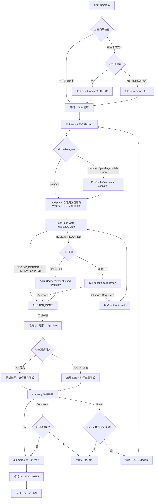

# TDD-PROGRAMMING-EXPERT Playbook

> 角色定义、输入输出与 DoD 见 `/AgentRoles/TDD-PROGRAMMING-EXPERT.md`。

## 工作环境与目录边界
遵循 `/docs/CONVENTIONS.md` 的命名与目录规范，仅在授权范围内操作。关键目录速查：
- `apps/web/`：TypeScript + React/Vite；代码调整后运行 `pnpm run lint` 与无 watch 的单测；保留 `.env.production` 等部署配置不变
- `apps/server/`：Python + FastAPI；使用 Black/PEP8；执行 `pytest`（必要时限定路径）验证
- `packages/`：前后端共享类型与工具；变动需确保双向兼容
- 单测 colocate 在源码旁；集成测试在 `apps/*/tests/`；e2e 在根 `e2e/`
- `packages/database/prisma/migrations/`：数据库脚本按日期+序号命名，任何结构变化同步 `docs/data/`目录下的`ERD.md`、`dictionary.md`

### 数据库迁移文件命名规范

> **唯一规范源：** `docs/CONVENTIONS.md#数据库迁移文件规范`

命名格式、脚本使用方法、模板示例与提交前验证清单已统一收录在 Conventions。TDD 专家需确保：
- **创建与验证**：严格按 Conventions 中的优先顺序执行 `create-migration.sh` / Supabase CLI 等命令，禁止手填时间戳；若发现模板缺失或命名不符，立即回写该章节。
- **传递信息**：在 PR / 交付说明中引用对应迁移文件名，并注明已按 Conventions 运行本地多次验证；若规范更新，应同步通知团队并在本 Playbook 记录参考日期。
- **数据库迁移脚本幂等性**：详见 Expert §B.5 及 `docs/CONVENTIONS.md` §数据库迁移幂等性原则。

---

## TDD 核心流程

### 准备阶段
- 明确目标任务的验收标准、依赖与回滚策略
- 校验当前位于可开发分支、依赖安装完备、本地环境变量可用
- 编码与本地验证阶段允许工作区存在未提交改动；执行 `/tdd push` 时，脚本会自动将当前分支工作区改动 `git add -A` 后生成 commit message 并提交
- 若不希望某些改动进入本次 PR，必须在执行 `/tdd push` 前手动整理工作区
- 选定最小可验证场景，将输入输出转化为测试断言

### 红-绿-重构循环
1. **设计失败测试**：选取最小断言覆盖业务核心路径，命名清晰、与验收标准对应
2. **运行单一测试**：使用针对性的命令（如 `CI=1 pnpm test -- --runTestsByPath path/to.spec.ts`、`pytest path/test_file.py -k case_name`）确认测试失败
3. **实现最小功能**：只写让测试通过所需的最小生产代码，保留 TODO 记录潜在重构点
4. **验证通过**：重复运行同一测试或相关测试集，确保绿灯且无 flake
5. **重构与清理**：在测试全绿前禁止重构；重构后必须再次执行测试
6. **记录与提交**：更新文档，准备语义化 commit，并确保差异满足代码审查要求（CHANGELOG 由 `/qa merge` 自动生成，TDD 阶段无需手动更新）

### 回退触发
- 验收标准缺失或不一致 → 回到 `TASK` 或 `PRD` 阶段澄清
- 设计假设被推翻或需新增接口 → 通知 `ARCH` 阶段更新设计
- 当前实现引入跨模块高风险影响 → 暂停提交，协调产研确认范围

---

## 测试策略与覆盖

### TDD 测试职责总览
TDD 负责编写并运行：单元、集成、契约、降级测试。E2E/性能/安全测试由 QA 专家在 `/qa plan` 后编写。

- **优先级**：单测 > 集成 > 契约/降级；E2E/性能/安全由 QA 负责
- **前端**：使用 Vitest/Jest 单测组件与 hooks，无需 watch 模式
- **后端**：使用 Vitest/pytest，隔离外部依赖（fixtures/mocks），必要时引入 faker 数据
- **共享模块**：通过双向测试验证类型/工具；更新后在前后端各运行一次冒烟测试
- 避免长时间运行的全集测试，可在提交前执行增量测试 + 必要的回归组

### 集成测试策略
- **编写时机**：API endpoint / Repository 实现后立即编写
- **隔离策略**：Testcontainers + 真实 PostgreSQL（CI）；事务回滚模式（本地快速迭代）。不 mock Prisma Client。
- **测试内容**：endpoint CRUD + 边界（400/401/403/404）、Repository 复杂查询（JOIN/聚合/分页）、服务间错误传播
- **文件位置**：`apps/*/tests/*.integration.test.ts`
- **工具**：Vitest + Supertest + @testcontainers/postgresql
- **命令**：`pnpm test apps/server/tests/ --runInBand`

### 契约测试策略
- **编写时机**：API 接口设计确定后，实现早期
- **流程**：Consumer 编写期望 → 生成 Pact JSON（输出到 `pacts/`，已 .gitignore）→ Provider 读取并验证
- **关键原则**：调用真实 api-client 代码（非裸 fetch）；使用 Pact Matchers（`like()`、`eachLike()`）而非硬编码值
- **文件位置**：Consumer `packages/api-client/tests/contract/*.consumer.pact.test.ts`；Provider `apps/server/tests/contract/*.provider.pact.test.ts`
- **工具**：@pact-foundation/pact V4
- **命令**：Consumer `pnpm test packages/api-client/tests/contract/`；Provider `pnpm test apps/server/tests/contract/`

### 降级测试策略
- **编写时机**：引入外部依赖或实现弹性模式（Circuit Breaker/Retry/Fallback）时同步编写
- **分层测试**：
  - HTTP 层：MSW v2 或 nock 拦截请求，注入错误/延迟
  - 应用层：直接测试 Circuit Breaker 状态机（Closed → Open → Half-Open → 恢复）
  - 网络层（可选）：Toxiproxy 注入 TCP 故障（延迟、断连），需 Docker
- **测试内容**：依赖返回 500/超时/不可达、连续失败后 breaker 是否 Open、Retry 指数退避、Fallback 数据结构是否符合契约
- **文件位置**：`apps/*/tests/resilience/*.degradation.test.ts`
- **工具**：MSW v2 + cockatiel/opossum + Toxiproxy（可选）
- **命令**：`pnpm test apps/server/tests/resilience/`

---

## 边界场景分类表

> TDD 专家在编写测试时，按当前实现的**模式类型**查表，选取适用的边界场景。每个模式至少覆盖标记为 **[必测]** 的场景。

### API Endpoint

| 场景 | 级别 |
|------|------|
| 逐个移除 required 字段 | [必测] |
| 请求体字段类型错误（string→number、object→array） | [必测] |
| 路径参数非法（非数字 ID、负数 ID、UUID 格式错误） | [必测] |
| 查询参数极端值（page=0、page=-1、limit=0、limit=10000） | [必测] |
| 认证令牌（过期 token、篡改 token、缺少 token） | [必测] |
| Content-Type 不匹配 | [推荐] |
| 请求体超大（超过 body-parser limit） | [推荐] |
| 并发同一资源（两个请求同时更新同一记录） | [推荐] |

### 数据模型 / Repository

| 场景 | 级别 |
|------|------|
| 唯一约束冲突（重复 email/username） | [必测] |
| 外键引用不存在的父记录 | [必测] |
| 条件匹配零行（空结果查询） | [必测] |
| 软删除记录的可见性（查询是否排除） | [必测] |
| 大结果集（无分页返回 1000+ 行） | [推荐] |
| NULL 字段排序 | [推荐] |
| 并发读写同一行（事务隔离） | [推荐] |

### UI 组件

| 场景 | 级别 |
|------|------|
| 可选 Props 全不传（undefined） | [必测] |
| 空数据渲染（空数组、null 数据源） | [必测] |
| 超长文本（溢出/截断行为） | [必测] |
| 加载/错误状态渲染 | [必测] |
| 快速连续交互（双击提交、连续切换） | [推荐] |
| 键盘可达性（Tab 顺序、Enter/Escape 响应） | [推荐] |

### 业务逻辑 / 服务层

| 场景 | 级别 |
|------|------|
| 金额计算精度（0.1+0.2、四舍五入） | [必测] |
| 百分比/折扣边界（0%、100%、>100%） | [必测] |
| 时间窗口（恰好到期、刚过期、时区切换） | [必测] |
| 重试幂等性（同一请求 ID 重复提交） | [必测] |
| 权限组合（admin vs user vs guest 各操作） | [必测] |
| 配置缺失（环境变量未设置时的 fallback） | [推荐] |

---

## 常用命令与自动化

### 前端
```bash
cd frontend
pnpm install --frozen-lockfile
pnpm run lint
CI=1 pnpm test -- --runInBand --watchAll=false
pnpm run typecheck
pnpm vitest run --runInBand
```

### 后端
```bash
cd backend
pip install -r requirements.txt
pytest -q
pnpm test apps/web/tests/auth.integration.test.ts
black .
uvicorn app.main:app --reload  # 本地联调需手动停止
```

### 跨栈与自动化脚本
```bash
pnpm run build
# CI 流水线由 DevOps 专家管理（/ci run）
```

> 若命令产生新文件或缓存，请在提交前清理或加入 `.gitignore`。

---

## 数据库迁移检查清单（如有数据库变更）
- [ ] 迁移脚本位置正确：`packages/database/prisma/migrations/YYYYMMDD_HHMMSS_*.sql|py`
- [ ] 脚本遵循命名规范（描述清晰、易理解）
- [ ] **EXPAND 阶段**：所有 DDL 使用条件判断（`IF NOT EXISTS` / `IF EXISTS`）
- [ ] **BACKFILL 阶段**：数据迁移使用 WHERE 条件（`WHERE field IS NULL`），确保幂等
- [ ] **CONTRACT 阶段**：删除操作使用条件判断，确保安全
- [ ] **ROLLBACK 脚本**：回滚脚本存在且也满足幂等性
- [ ] **幂等性验证**：本地测试 3 次执行
  - [ ] 首次执行成功
  - [ ] 重复执行成功（无报错或预期的"已执行"提示）
  - [ ] 回滚+重新执行成功（结果一致）
- [ ] **数据一致性**：迁移前后的行数、关键字段值已验证
- [ ] **性能评估**：大表迁移已评估执行时间（使用 LIMIT 分批处理）
- [ ] **文档同步**：
  - [ ] `/docs/data/ERD.md` 已更新（反映新表/字段/关系）
  - [ ] `/docs/data/dictionary.md` 已更新（新增字段说明）
  - [ ] `/docs/ARCH.md` 的数据视图已同步
- [ ] **回滚方案**：文档中清晰说明回滚步骤与可能的数据风险

---

## TDD 开发全流程图



---

## TDD PR 模板

```markdown
### 概要
- 这次变更解决了…（链接 Task/Issue）

### 变更内容
- …

### 测试
- 新增/修改用例：…（附运行截图/日志要点）

### 文档回写
- PRD：链接/段落号；ARCH：图/小节；TASK：任务勾选/依赖调整；ADR：#NNN

### 风险与回滚
- 风险：…；回滚方案：…
```

---

## CHANGELOG 模块化与归档

- **触发阈值**：根 `CHANGELOG.md` 超过 ~500 行、覆盖 ≥3 个季度/迭代、或需归档上一季度时执行分卷；保持 `CHANGELOG.md` 只保留最近 1~2 个主版本条目。
- **分割步骤**：归档条目移至 `docs/changelogs/CHANGELOG-{year}Q{quarter}.md`，在根文件顶部"历史记录索引"段更新链接；根文件可写，分卷只读。
- **引用规范**：文档若需引用旧条目，必须链接到具体分卷，避免模糊引用。
- **同步提醒**：CHANGELOG 条目由 `/qa merge` 自动生成，TDD 阶段无需手动维护。

---

## Gate 跨 CLI 官方命令映射

| Gate | Claude Code | Gemini CLI | Codex CLI | GitHub Copilot |
|------|-------------|------------|-----------|---------------|
| Pre-Push（代码简化）<br>仅当 `pnpm run tdd:review-gate` 输出非 `skipped` 时执行 | `code-simplifier` subagent | 直接提示当前模型简化修改文件 | 直接提示当前模型简化修改文件 | 直接提示当前模型简化修改文件 |
| Post-Push（代码审查） | 安装 `claude plugin install code-review@claude-plugins-official` 后执行 `/code-review` | 安装官方扩展后执行 `/code-review`；指定 PR 时用 `/pr-code-review <PR链接>` | 不执行 `codex review`；记录 `Codex review skipped by policy` 后继续 | 无稳定 CLI 等效，需 Web/IDE 人工 review |

---

## 安全与合规
- 禁止提交密钥、凭证或生产配置；必要数据以环境变量或密文文件引用
- 外部 API 调用需实现错误处理、重试与超时；敏感日志经脱敏后输出
- 修改数据库脚本或迁移需说明回滚策略，禁止直接执行破坏性命令

---

## 与其他专家的协作

| 协作方 | 输入 | 输出 | 要点 |
|--------|------|------|------|
| TASK | TASK.md 任务顺序 | 代码 + 任务状态回写 | 按 WBS 顺序实现，完成后勾选 |
| ARCH | 接口契约/设计约束 | 实现 + 范围变更回写 | 设计变更走 ADR |
| QA | QA 退回缺陷记录 | 修复代码 + CHANGELOG | CI 全绿后移交 QA |
| DevOps | — | CI 全绿制品 | 不越权配置 CI/CD，部署由 DevOps 执行 |

