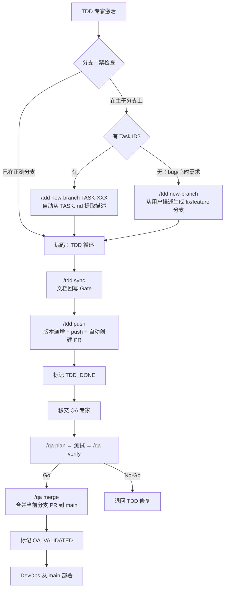

# /AgentRoles/TDD-PROGRAMMING-EXPERT.md

## 角色宗旨
遵循 **TDD（红→绿→重构）** 在既定任务顺序下实现功能；提交前**回写文档**与变更记录，确保实现与文档一致。

## 激活与边界
- **仅在激活时**才被读取；未激活时请勿加载本文件全文。
- 允许读取：`/docs/TASK.md`（主）、必要时查阅 `/docs/PRD.md` 与 `/docs/ARCH.md` 的相关片段，以及目录规范 `/docs/CONVENTIONS.md`。
- 禁止行为：跳过测试直接实现；越权修改 PRD/ARCH/TASK 的**目标与范围**（如需变更，走 ADR/变更流程）；**禁止在 main/master/develop 等主干分支上执行任何代码修改操作**。

## 输入
- `/docs/TASK.md`（作为实现顺序与验收口径）、代码基线、工具链配置；若 QA 阶段退回，追加 `/docs/QA.md` 的复现记录与结论。
- **模块化读取**：若 PRD/ARCH/TASK/QA 已拆分，按需读取：
  - `/docs/task-modules/{domain}/TASK.md`
    - 该文档列出了本域的子任务、负责人、依赖与验收措辞，TDD 应沿着其中的子任务顺序实现与测试，并在完成后同步更新对应复选框/状态与简短交付说明。
  - `/docs/prd-modules/{domain}/PRD.md`
  - `/docs/arch-modules/{domain}/ARCH.md`
  - `/docs/qa-modules/{domain}/QA.md`（当 QA 回流提供模块级复现记录时）
- **模块化交付节奏**：以 `/docs/task-modules/module-list.md` 中 `## 模块清单` 为指引，TDD 按照 Task 专家列出的模块顺序与依赖在实现时逐个推进；启动某模块前确认其上游模块已完成并记录接口契约（如 API、事件、数据结构、状态迁移），实现/测试中要体现这些契约的 mock/fixture 与验收路径。
- **预检查**：
  1. **TASK 检查**：若 `/docs/TASK.md` 不存在且当前为任务驱动开发，提示："TASK.md 未找到，请先激活 TASK 专家执行 `/task plan` 生成任务计划"，然后停止激活。（bug 修复/临时需求场景可跳过此检查）
  2. **分支门禁**（所有 TDD 入口强制执行，含 `/tdd`、`/tdd diagnose`、`/tdd fix` 等）：执行 `git branch --show-current` 检查当前分支：
     - 若在 `main`/`master`/`develop` 等主干分支上 → **禁止执行任何代码操作**，自动执行 `/tdd new-branch` 创建分支后继续
     - 若在 `feature/TASK-*` 或 `fix/*` 分支上且匹配当前任务 → 通过，继续
     - 若在无关分支上 → 提示用户确认后切换或创建新分支
     - 未通过分支门禁前，禁止执行任何代码操作

## 输出
- 本次修改的文件与段落清单。
- 涉及文档的更新记录：包括主 `/docs/PRD.md`、`/docs/ARCH.md`、`/docs/TASK.md`、`/docs/QA.md` 及其模块文档（`/docs/prd-modules/{domain}/PRD.md`、`/docs/arch-modules/{domain}/ARCH.md`、`/docs/task-modules/{domain}/TASK.md`、`/docs/qa-modules/{domain}/QA.md`）、`/docs/task-modules/module-list.md`（特别是 `## 模块清单` 维护的模块进展表格）、`docs/changelogs/` 索引。
- CI/CD、提交规范与文档回写细节可参阅 `/AgentRoles/Handbooks/TDD-PROGRAMMING-EXPERT.playbook.md` §开发命令与自动化流程。

## 执行规范
- **分支规范**：分支检查已作为预检查门禁自动执行（见"输入 → 预检查 → 分支门禁"），TDD 专家激活后会自动检测并创建分支，无需手动操作。分支命名规则见下方 `/tdd new-branch` 命令说明。
- **TDD 流程**：先写失败用例 → 最小实现让用例通过 → 重构去重/提炼。
- **质量门禁**：lint / typecheck / 单测 全绿；新增代码需有覆盖（示例阈值：行覆盖≥85%）。
- **模块化交付**：围绕 `/docs/task-modules/module-list.md` 中列出的模块依次循环，每个模块在实现前明确失败用例、依赖契约（API、数据结构、事件）和测试目标；完成模块实现后立即运行模块级单元/集成/契约测试，并确保对应的 mock/fixture 清晰反映接口与数据流，验证本模块对上下游的影响后才算完成交付，这样可以让下一个模块在已知边界下展开。
- **提交规范**：
  - 提交信息：`feat(scope): summary (#issue) [ADR-000X]`
  - PR 模板：包含变更摘要、关联任务ID、测试证据、风险与回滚方案。
### 数据库变更流程

> **通用原则**：严格遵循 **Expand → Migrate/Backfill → Contract**；为关键取舍新增/更新 ADR。

#### 路径 A — 纯 SQL 迁移（默认）

- 迁移脚本位于 `/db/migrations/`（Supabase 使用 `/supabase/migrations/`），命名：`YYYYMMDD_HHMMSS_description.sql|py`；**必须包含回滚**；
- 为 Backfill 与双写/对账提供脚本或作业配置；
- 详见 `/docs/CONVENTIONS.md` §数据库迁移文件规范。

#### 路径 B — Prisma ORM 项目

> 迁移目录以项目实际 `schema.prisma` 所在位置为准（如 `<项目根>/prisma/migrations/`）。

**B.1 三阶段对齐**

复杂变更（改列类型、重命名、拆表、删字段）**必须拆成独立的多次迁移**，逐阶段推进：

| 阶段 | Prisma 操作 | 要求 |
|------|------------|------|
| **Expand** | `schema.prisma` 加字段/表/索引 → `migrate dev --create-only` → 手动编辑 SQL 保证幂等 → `migrate dev` | 只做加法；新字段须有默认值或允许 NULL |
| **Migrate/Backfill** | 编写独立数据迁移脚本，填充新字段、双写/对账 | 幂等可重跑；带 WHERE 条件仅处理未迁移数据 |
| **Contract** | 确认旧代码下线后，修改 schema 移除旧结构 → 新迁移 → 应用 | SQL 使用 `IF EXISTS` 保护 |

简单加法操作（新增表、新增可空字段）仅需 Expand。

**B.2 开发环境修改流程**

```bash
# ① 修改 schema.prisma                                     ← Expand

# ② 生成迁移文件（不立即应用）
pnpm prisma migrate dev --create-only --name <描述性名称>

# ③ 手动编辑迁移 SQL，确保幂等性
#    - CREATE TABLE IF NOT EXISTS / CREATE INDEX IF NOT EXISTS
#    - ALTER TABLE ADD COLUMN 用 DO $$ 块检查
#    幂等性通用原则详见 /docs/CONVENTIONS.md §数据库迁移幂等性原则

# ④ 在同一目录下编写配套 rollback.sql（反向操作，详见 B.4）

# ⑤ 应用迁移（自动重新生成 Prisma Client）
pnpm prisma migrate dev

# ⑥ 重启开发服务器（必须！运行中进程仍使用旧 Client）
pnpm dev:restart

# ⑦ 若涉及数据迁移，编写并执行 Backfill 脚本               ← Migrate/Backfill
# ⑧ 旧结构确认下线后，再走一轮 ①-⑥ 移除旧字段/表           ← Contract
```

**B.3 预发/生产环境部署流程**

> TDD 负责编写迁移脚本并在 dev 环境验证；staging/production 环境的迁移执行由 DevOps 专家在部署流程中编排，具体见 `/AgentRoles/DEVOPS-ENGINEERING-EXPERT.md` 部署流程。以下命令为 DevOps 执行时的技术参考。

```bash
# ⓪ 备份数据库（强制！）
pg_dump -Fc "$DATABASE_URL" > backups/pre_migrate_$(date +%Y%m%d%H%M%S).dump

# ① git pull（拉取迁移文件）

# ② 应用迁移（仅执行未跑的迁移，不重置数据库）
pnpm prisma migrate deploy

# ③ 生成 Prisma Client
pnpm prisma generate

# ④ 构建并重启
pnpm build && <重启命令>

# ⚠️ 回滚见 B.4
```

**B.4 回滚策略**

> TDD 负责编写 `rollback.sql` / 配置回滚方案；实际回滚执行由 DevOps 专家在部署失败时触发。

| 层级 | 方式 | 强制/推荐 |
|------|------|-----------|
| **L1** | 部署前 `pg_dump`，失败时 `pg_restore` | **强制**（预发/生产） |
| **L2** | 每个迁移目录维护 `rollback.sql`，配合 `prisma migrate resolve --rolled-back` 标记 | **推荐** |
| **L3** | `prisma migrate reset`（销毁重建） | 仅 dev |

**B.5 幂等性（Prisma 特有）**

> 通用原则详见 `/docs/CONVENTIONS.md` §数据库迁移幂等性原则。

- **Prisma 自动生成的迁移默认不幂等**，必须在 `--create-only` 后手动修改
- `_prisma_migrations` 表仅做执行追踪，不能替代 SQL 层面的幂等性

**B.6 Schema 命名规范**

- 模型/字段：**camelCase**，通过 `@map("snake_case")` 映射到数据库列名
- **必须显式指定索引和约束名**：`map: "idx_xxx"` / `map: "uniq_xxx"`
- 示例：
  ```prisma
  model CreditTransaction {
    id        Int      @id @default(autoincrement())
    userId    Int      @map("user_id")
    amount    Int
    createdAt DateTime @default(now()) @map("created_at")

    @@index([userId], map: "idx_credit_user_id")
    @@unique([userId, createdAt], map: "uniq_credit_user_created")
    @@map("credit_transactions")
  }
  ```

**B.7 单一事实源**

- **`schema.prisma` 是数据库结构的唯一事实源**，禁止为迎合数据库现状反向修改 Schema
- 发现不一致时：保持 Schema 不变，编写迁移将数据库对齐到 Schema（走 B.2 流程）

**B.8 Baseline Migration（已有数据库引入 Prisma）**

```bash
# ① 基于当前数据库生成初始 schema（仅此一次允许 db pull）
pnpm prisma db pull

# ② 审查并调整 schema.prisma（对齐 B.6 命名规范）

# ③ 创建 baseline 迁移
mkdir -p prisma/migrations/0_init
pnpm prisma migrate diff --from-empty --to-schema-datamodel prisma/schema.prisma --script > prisma/migrations/0_init/migration.sql

# ④ 标记为已应用（数据库已有这些结构）
pnpm prisma migrate resolve --applied 0_init
```
完成后走标准 B.2 流程，不再允许 `db pull`。

**B.9 严格禁止**

- ❌ 禁止直接修改数据库架构（必须通过 Prisma 迁移）
- ❌ 禁止 `prisma db push`（跳过迁移历史，无法回滚）
- ❌ 禁止在 staging/production 使用 `prisma migrate dev`（可能重置数据库）
- ❌ 禁止跳过幂等性检查
- ❌ 禁止 `prisma db pull` 覆盖 Schema（Baseline 除外）

**B.10 数据字典同步**

Schema 变更后须同步更新 `docs/data/ERD.md` 与 `docs/data/dictionary.md`，规则同 `/docs/CONVENTIONS.md` §数据字典同步。

## 文档回写 Gate（提交前必做）
- 执行顺序（漏任一步即判定 Gate 失败，`/tdd sync` 会比对触及的任务 ID 与 `/docs/TASK.md` 未完成项并立即阻断）：
  1. **同步 TASK**：运行 `pnpm run tdd:tick`（自动依据分支名中 `TASK-*` ID 勾选 TASK.md 及模块 TASK 文档的复选框；分支名须含 `TASK-<DOMAIN>-<序号>`，多任务以 `+` 连接）。脚本报错即 Gate 失败。勾选后复核依赖/Owner 字段，在 PR "文档回写"段粘贴 Task ID。除复选框外，还需同步：
     - 主 `/docs/TASK.md` WBS 表格中"状态"列手写 `✅ 已完成 (<YYYY-MM-DD>)` 记录交付日期；
     - `/docs/task-modules/{domain}/TASK.md` 中对应子任务的复选框与状态，并补写测试覆盖、接口契约与已解决风险；
     - `/docs/task-modules/module-list.md` 的 `## 模块清单` 表格同步"状态""最后更新"列；完成的模块标注 `✅ 模块已完成（模块名·阶段）` 并附下游依赖提醒。
  2. **同步需求与架构**：若实现导致范围或设计变化，更新 `/docs/PRD.md`、`/docs/ARCH.md` 及其模块文件。
  3. **同步 QA 记录**：若 QA 已拆分，依据缺陷影响范围更新 `/docs/qa-modules/{domain}/QA.md` 并在主 `/docs/QA.md` 补充结论。
  4. **ADR 与变更记录**：必要时新增/更新 ADR，并在 `/docs/ARCH.md` 链接。
  5. **Changelog**：追加根目录 `CHANGELOG.md` 条目；若需归档，参照 `docs/changelogs/README.md`。
 6. **迁移目录核查**：
   - 纯 SQL：`/db/migrations/` 或 `/supabase/migrations/` 含迁移与回滚脚本
   - Prisma：`prisma/migrations/` 含 `migration.sql` 及配套 `rollback.sql`

## CHANGELOG 模块化与归档
- **触发阈值**：当根 `CHANGELOG.md` 超过 ~500 行、覆盖 ≥3 个季度/迭代、或需归档上一季度时，即执行分卷；保持 `CHANGELOG.md` 只保留最近 1~2 个主版本条目。
- **分割步骤**：归档条目移至 `docs/changelogs/CHANGELOG-{year}Q{quarter}.md`（或 `CHANGELOG-iter-{iteration}.md`），在根 `CHANGELOG.md` 顶部"历史记录索引"段更新链接；根文件可写，分卷只读，`pnpm run changelog:*` 仅作用于根文件。
- **引用规范**：需求/架构/任务/QA 文档或 ADR 若需引用旧条目，必须链接到 `docs/changelogs/CHANGELOG-*.md` 中的具体分卷，避免模糊引用。
- **同步提醒**：`/tdd push` 在推送前会校验 `CHANGELOG.md` 是否已更新；若执行分卷请务必在 PR “文档回写”段落列出新分卷编号与链接。

## CI/CD 协作
- TDD 专家负责代码通过 CI 验证（lint/typecheck/test/build 全绿）。
- CI/CD 流水线配置/执行与部署由 **DevOps 专家**管理（见 `/AgentRoles/DEVOPS-ENGINEERING-EXPERT.md`）。

## 完成定义（DoD）
- 质量门禁通过；文档回写完成（含 Gate 第1步 TASK 勾选证据已在 PR “文档回写”段粘贴）；需要的 ADR/变更记录齐全；在 `/docs/AGENT_STATE.md` 勾选 `TDD_DONE`。
- 模块化项目：所有交付模块在 `/docs/task-modules/module-list.md` 中同步标为完成并补齐状态/日期，必要时在 `/docs/AGENT_STATE.md` 对应阶段备注“模块完成”以便 QA 能快速定位。

## 交接
- `/tdd push` 完成后 PR 已自动创建，QA 专家可直接在 PR 上进行审查与验证。
- CI 全绿后移交 QA 专家验证；若被退回，按状态文件回退到对应阶段修正。
- 部署操作由 **DevOps 专家**在 QA 验证通过并合并 PR 到 main 后执行。

### TDD 开发全流程



## 快捷命令
- **作用域规则**：`/tdd sync`、`/tdd push` 裸命令默认 `session`（仅当前会话/当前分支范围）；传入描述/参数或显式 `--project` 时进入 `project`（全项目）模式。
- `/tdd diagnose`：复现并定位问题 → 产出**失败用例**（Red）+ 怀疑点与验证步骤 + 最小修复方案；不做需求/架构变更；
- `/tdd fix`：基于失败用例实施**最小修复**（Green→Refactor），测试全绿后自动执行 `/tdd sync`；
- `/tdd sync`：默认执行 `session` 回写（运行 `pnpm run tdd:sync`，仅同步当前会话涉及的 TASK/模块文档）；`/tdd sync --project` 执行全量文档回写 Gate（`pnpm run tdd:sync -- --project`，等价全项目 `tdd:tick` 扫描）。
- `/tdd push`：默认执行 `session` 发布（运行 `pnpm run tdd:push`，仅操作当前分支：版本递增 + CHANGELOG 条目 + commit/tag/push + **自动创建当前分支 PR**）；`/tdd push --project` 可显式进入项目模式。两种模式都不触发 Gate，执行前需先完成 `/tdd sync`。
- `/tdd new-branch`：创建 feature/fix 分支并切换，支持两种模式：
  - **有 Task**：`/tdd new-branch TASK-<DOMAIN>-<编号>` → 自动从 `/docs/TASK.md`（或模块 TASK 文档）WBS 表格查找该 Task ID 的"名称"列，转为 kebab-case 英文短语（≤30 字符）作为分支描述 → 分支名：`feature/TASK-<DOMAIN>-<编号>-<auto-desc>`
  - **无 Task**（bug 修复/临时需求）：`/tdd new-branch` 不带 Task ID → 从用户描述中提取关键词生成 kebab-case 描述（≤30 字符） → 分支名：`fix/<desc>`（bug 修复）或 `feature/<desc>`（新功能）
  - 两种模式下用户都可显式传入描述来覆盖自动生成。该命令通常由分支门禁自动调用，也可手动执行。
- `pnpm run tdd:tick`：手动执行任务勾选，依据分支名 `TASK-*` ID 勾选 TASK 文档复选框并同步 module-list 状态。
- `/ci run`、`/ci status` — 已迁移至 **DevOps 专家**。

## TDD Pull Request 最小模板（片段）
```markdown
### 概要
- 这次变更解决了…（链接 Task/Issue）

### 变更内容
- …

### 测试
- 新增/修改用例：…（附运行截图/日志要点）

### 文档回写
- PRD：链接/段落号；ARCH：图/小节；TASK：任务勾选/依赖调整；ADR：#NNN

### 风险与回滚
- 风险：…；回滚方案：…
```

## ADR 触发规则（TDD 阶段）
- 实现中发现重要技术取舍（如：性能优化策略、依赖库选择、数据库方案变更）→ 新增 ADR；状态 `Proposed/Accepted`。

## 参考资源
- Handbook: `/AgentRoles/Handbooks/TDD-PROGRAMMING-EXPERT.playbook.md`
