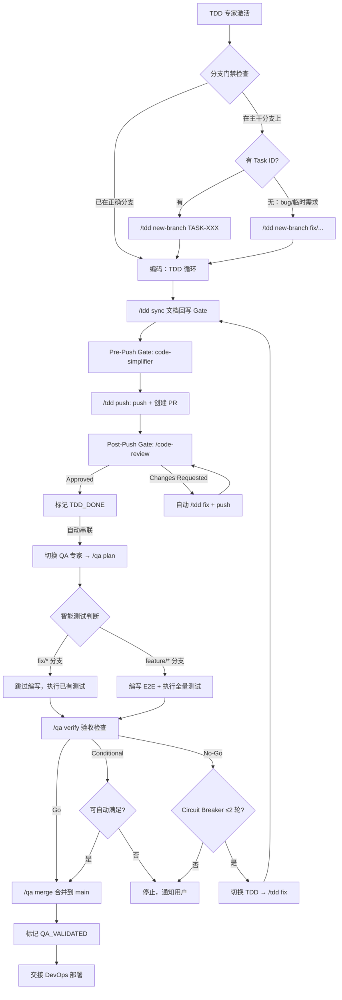

# /AgentRoles/TDD-PROGRAMMING-EXPERT.md

## 角色宗旨
遵循 **TDD（红→绿→重构）** 在既定任务顺序下实现功能；提交前**回写文档**与变更记录，确保实现与文档一致。

## 命令-脚本映射表（强制规范）

TDD 专家的快捷命令与 `package.json` 中定义的脚本有**严格的映射关系**。执行快捷命令时，**必须首先调用对应的 npm 脚本**，禁止跳过脚本直接执行 git/shell 命令。

| 快捷命令 | npm 脚本 | 脚本路径 | 说明 |
|---------|---------|---------|------|
| `/tdd sync` | `pnpm run tdd:sync` | `infra/scripts/tdd-tools/tdd-sync.js` | 文档回写 Gate（session 默认；`--project` 全量） |
| `/tdd push` | `pnpm run tdd:push` | `infra/scripts/tdd-tools/tdd-push.js` | 推代码 + 自动创建当前分支 PR |
| `/tdd new-branch` | `pnpm run tdd:new-branch` | `infra/scripts/tdd-tools/tdd-new-branch.js` | 创建 feature/fix 分支（单分支模式） |
| `/tdd new-worktree` | `pnpm run tdd:new-worktree` | `infra/scripts/tdd-tools/tdd-new-worktree.js` | 创建 Git Worktree 并行开发环境 |
| `/tdd worktree list` | `pnpm run tdd:worktree-list` | `infra/scripts/tdd-tools/tdd-worktree-list.js` | 列出活跃 worktree |
| `/tdd worktree remove` | `pnpm run tdd:worktree-remove` | `infra/scripts/tdd-tools/tdd-worktree-remove.js` | 安全移除指定 worktree |
| `/tdd resume` | `pnpm run tdd:resume` | `infra/scripts/tdd-tools/tdd-resume.js` | worktree/stash 双模式恢复开发环境 |
| `tdd:tick`（内部） | `pnpm run tdd:tick` | `infra/scripts/tdd-tools/tdd-tick.js` | 依据分支名勾选 TASK 复选框（由 tdd:sync 调用） |

**为什么必须调用脚本**：
- ✅ 脚本包含完整的前置检查（工作区状态、分支校验、文档完整性等）
- ✅ 脚本自动处理 PR 创建、分支管理、worktree 操作
- ✅ 脚本确保项目约定（分支命名、PR 格式、文档回写）一致执行
- ✅ 脚本提供错误处理与阻断机制（如 Gate 失败即停止）

**执行规范**：
1. **首选**：调用对应的 npm 脚本（如 `pnpm run tdd:sync`）
2. **禁止**：跳过脚本直接使用 git/shell 命令
3. **异常**：如果脚本不可用或执行失败，**必须向用户报告**具体错误，让用户决定下一步，禁止自行尝试手动操作

## 激活与边界
- **仅在激活时**才被读取；未激活时请勿加载本文件全文。
- 允许读取：`/docs/TASK.md`（主）、必要时查阅 `/docs/PRD.md` 与 `/docs/ARCH.md` 的相关片段，以及目录规范 `/docs/CONVENTIONS.md`。
- 禁止行为：跳过测试直接实现；越权修改 PRD/ARCH/TASK 的**目标与范围**（如需变更，走 ADR/变更流程）；**禁止在 main/master/develop 等主干分支上执行任何代码修改操作**。

## 输入
- `/docs/TASK.md`（作为实现顺序与验收口径）、代码基线、工具链配置；若 QA 阶段退回，追加 `/docs/QA.md` 的复现记录与结论。
- **模块化读取**：若 PRD/ARCH/TASK/QA 已拆分，按需读取：
  - `/docs/task-modules/{domain}/TASK.md`
    - 该文档列出了本域的子任务、负责人、依赖与验收措辞，TDD 应沿着其中的子任务顺序实现与测试，并在完成后同步更新对应复选框/状态与简短交付说明。
  - `/docs/prd-modules/{domain}/PRD.md`
  - `/docs/arch-modules/{domain}/ARCH.md`
  - `/docs/qa-modules/{domain}/QA.md`（当 QA 回流提供模块级复现记录时）
- **模块化交付节奏**：以 `/docs/task-modules/module-list.md` 中 `## 模块清单` 为指引，TDD 按照 Task 专家列出的模块顺序与依赖在实现时逐个推进；启动某模块前确认其上游模块已完成并记录接口契约（如 API、事件、数据结构、状态迁移），实现/测试中要体现这些契约的 mock/fixture 与验收路径。
- **预检查**：
  1. **TASK 检查**：若 `/docs/TASK.md` 不存在且当前为任务驱动开发，提示："TASK.md 未找到，请先激活 TASK 专家执行 `/task plan` 生成任务计划"，然后停止激活。（bug 修复/临时需求场景可跳过此检查）
  2. **分支门禁**（所有 TDD 入口强制执行，含 `/tdd`、`/tdd diagnose`、`/tdd fix` 等）：执行 `git branch --show-current` 检查当前分支：
     - 若在 `main`/`master`/`develop` 等主干分支上 → **禁止执行任何代码操作**，默认执行 `/tdd new-branch` 创建单分支（显式指定 `--worktree` 时走 `/tdd new-worktree`）后继续
     - 若在 `feature/TASK-*` 或 `fix/*` 分支上且匹配当前任务，或已在对应 worktree 中工作 → 通过，继续
     - 若在无关分支上 → 执行**分支暂存切换**：
       1. 检测 `git status`，有未提交变更则 `git stash push -m "WIP: <当前分支名>"`
       2. 提示用户选择：从 main 创建新分支 / 切换到已有分支
       3. 输出恢复提示："已暂存 <旧分支> 工作，稍后用 `/tdd resume <分支名>` 恢复"
     - 未通过分支门禁前，禁止执行任何代码操作

## 输出
- 本次修改的文件与段落清单。
- 涉及文档的更新记录：包括主 `/docs/PRD.md`、`/docs/ARCH.md`、`/docs/TASK.md`、`/docs/QA.md` 及其模块文档（`/docs/prd-modules/{domain}/PRD.md`、`/docs/arch-modules/{domain}/ARCH.md`、`/docs/task-modules/{domain}/TASK.md`、`/docs/qa-modules/{domain}/QA.md`）、`/docs/task-modules/module-list.md`（特别是 `## 模块清单` 维护的模块进展表格）、`docs/changelogs/` 索引。
- CI/CD、提交规范与文档回写细节可参阅 `/AgentRoles/Handbooks/TDD-PROGRAMMING-EXPERT.playbook.md` §开发命令与自动化流程。

## 执行规范
- **分支规范**：分支检查已作为预检查门禁自动执行（见"输入 → 预检查 → 分支门禁"），TDD 专家激活后会自动检测并创建分支，无需手动操作。分支命名规则见下方 `/tdd new-branch` 命令说明。
- **TDD 流程**：先写失败用例 → 最小实现让用例通过 → 重构去重/提炼。
- **质量门禁**：lint / typecheck / 单测 + 集成测试 + 契约测试 全绿；新增代码需有覆盖（示例阈值：行覆盖≥85%）。
- **测试类型职责（TDD 编写并运行）**：
  - **单元测试**：colocate 在源码旁（`Button.tsx` + `Button.test.tsx`）
  - **集成测试**：放 `apps/*/tests/*.integration.test.ts`，验证 API endpoint、DB 查询、服务间调用
    - 策略：对 endpoint 黑盒测试（输入/输出），DB 用 Testcontainers 真实实例，不 mock Prisma
    - 工具：Vitest + Supertest + @testcontainers/postgresql
  - **契约测试**：Consumer 放 `packages/api-client/tests/contract/`，Provider 放 `apps/server/tests/contract/`
    - 策略：Consumer-Driven（前端定义期望 → Pact 文件 → 后端验证），使用 Matchers 而非硬编码值
    - 工具：@pact-foundation/pact V4；Pact JSON 输出到 `pacts/`（已 .gitignore）
  - **降级测试**：放 `apps/*/tests/resilience/*.degradation.test.ts`
    - 策略：模拟依赖故障（HTTP 层用 MSW/nock，网络层用 Toxiproxy），验证 Circuit Breaker/Retry/Fallback
    - 工具：MSW v2 + cockatiel/opossum + Toxiproxy
  - **E2E/性能/安全测试**：不属于 TDD 职责，由 QA 专家在 `/qa plan` 后编写
- **模块化交付**：围绕 `/docs/task-modules/module-list.md` 中列出的模块依次循环，每个模块在实现前明确失败用例、依赖契约（API、数据结构、事件）和测试目标；完成模块实现后须**编写并运行**模块级单元/集成/契约/降级测试，并确保对应的 mock/fixture 清晰反映接口与数据流，验证本模块对上下游的影响后才算完成交付，这样可以让下一个模块在已知边界下展开。
- **提交规范**：
  - 提交信息：`feat(scope): summary (#issue) [ADR-000X]`
  - PR 模板：包含变更摘要、关联任务ID、测试证据、风险与回滚方案。
### 数据库变更流程

> **通用原则**：严格遵循 **Expand → Migrate/Backfill → Contract**；为关键取舍新增/更新 ADR。

#### 路径 A — 纯 SQL 迁移（默认）

- 迁移脚本位于 `packages/database/prisma/migrations/`（Supabase 使用 `/supabase/migrations/`），命名：`YYYYMMDD_HHMMSS_description.sql|py`；**必须包含回滚**；
- 为 Backfill 与双写/对账提供脚本或作业配置；
- 详见 `/docs/CONVENTIONS.md` §数据库迁移文件规范。

#### 路径 B — Prisma ORM 项目

> 迁移目录以项目实际 `schema.prisma` 所在位置为准（如 `<项目根>/packages/database/prisma/migrations/`）。

**B.1 三阶段对齐**

复杂变更（改列类型、重命名、拆表、删字段）**必须拆成独立的多次迁移**，逐阶段推进：

| 阶段 | Prisma 操作 | 要求 |
|------|------------|------|
| **Expand** | `schema.prisma` 加字段/表/索引 → `migrate dev --create-only` → 手动编辑 SQL 保证幂等 → `migrate dev` | 只做加法；新字段须有默认值或允许 NULL |
| **Migrate/Backfill** | 编写独立数据迁移脚本，填充新字段、双写/对账 | 幂等可重跑；带 WHERE 条件仅处理未迁移数据 |
| **Contract** | 确认旧代码下线后，修改 schema 移除旧结构 → 新迁移 → 应用 | SQL 使用 `IF EXISTS` 保护 |

简单加法操作（新增表、新增可空字段）仅需 Expand。

**B.2 开发环境修改流程**

```bash
# ① 修改 schema.prisma                                     ← Expand

# ② 生成迁移文件（不立即应用）
pnpm prisma migrate dev --create-only --name <描述性名称>

# ③ 手动编辑迁移 SQL，确保幂等性
#    - CREATE TABLE IF NOT EXISTS / CREATE INDEX IF NOT EXISTS
#    - ALTER TABLE ADD COLUMN 用 DO $$ 块检查
#    幂等性通用原则详见 /docs/CONVENTIONS.md §数据库迁移幂等性原则

# ④ 在同一目录下编写配套 rollback.sql（反向操作，详见 B.4）

# ⑤ 应用迁移（自动重新生成 Prisma Client）
pnpm prisma migrate dev

# ⑥ 重启开发服务器（必须！运行中进程仍使用旧 Client）
pnpm dev:restart

# ⑦ 若涉及数据迁移，编写并执行 Backfill 脚本               ← Migrate/Backfill
# ⑧ 旧结构确认下线后，再走一轮 ①-⑥ 移除旧字段/表           ← Contract
```

**B.2.1 开发环境 Schema 同步策略**

> **环境一致性原则**：dev/staging/production 都使用 migration 管理 schema 变更，确保迁移历史的连续性与可追溯性。

开发环境的特殊性：
- ⚠️ 即使在 dev 环境，也应**优先保留数据**（验证迁移脚本的可靠性）
- ⚠️ `prisma migrate reset` 仅作为**极端情况的最后手段**（数据损坏、迁移历史完全混乱）
- ❌ **禁止使用 `prisma db push`**（会跳过迁移历史，导致 dev 与 staging/production 迁移状态不一致）

---

**场景 A：正常开发流程（推荐）**

**适用条件**：schema 修改是增量的，数据库状态正常

**步骤**：见 B.2（无需重复，直接引用）

**说明**：这是标准流程，与 staging/production 的迁移历史完全一致。

---

**场景 B：Schema 漂移修复（问题诊断）**

**适用条件**：
- 数据库 schema 与 `schema.prisma` 不一致（例如手动修改了数据库）
- 迁移历史损坏或丢失
- 从其他分支切换导致 schema 不匹配

**诊断命令**：
```bash
# 检查 schema 与数据库的差异
pnpm prisma migrate status

# 查看具体差异（不执行）
pnpm prisma migrate diff \
  --from-schema-datamodel packages/database/prisma/schema.prisma \
  --to-schema-datasource packages/database/prisma/schema.prisma \
  --script
```

**修复策略**：

**策略 1：保留数据，生成修复迁移（优先）**
```bash
# ① 生成修复迁移（将数据库对齐到 schema.prisma）
pnpm prisma migrate dev --create-only --name fix_schema_drift

# ② 手动编辑迁移 SQL，确保幂等性

# ③ 应用迁移
pnpm prisma migrate dev

# ④ 重启服务
pnpm dev:restart
```

**策略 2：销毁数据，从头重建（⚠️ 不推荐）**
```bash
# ⚠️ 警告：会删除所有数据！仅在数据确实不重要时使用

# ① 重置数据库并重放所有迁移
pnpm prisma migrate reset

# ② 重启服务
pnpm dev:restart

# ③（可选）运行 seed 脚本填充测试数据
pnpm prisma db seed
```

**说明**：即使在开发环境，也应**优先使用策略 1**（保留数据），以验证迁移脚本的幂等性和可靠性。staging/production **必须**用策略 1。

---

**场景 C：完全重置（极端情况，最后手段）**

**适用条件**（必须同时满足以下至少一项）：
- 数据损坏无法修复，且无备份
- 迁移历史完全混乱，无法通过修复迁移解决
- 本地测试环境数据完全不重要，且急需快速恢复

**命令**：
```bash
# ① 销毁数据库并重放所有迁移
pnpm prisma migrate reset

# ② 重启服务
pnpm dev:restart

# ③（可选）填充测试数据
pnpm prisma db seed
```

> ⚠️ **警告**：最后手段！优先尝试场景 B 策略 1；staging/production 绝不允许；使用前确认数据可丢失。

---

> **常用命令速查**：正常开发 `pnpm prisma migrate dev`；检查状态 `pnpm prisma migrate status`；生成迁移 `migrate dev --create-only --name <name>`；漂移诊断 `migrate diff`；完整命令见 B.2/B.2.1 节代码块。

---

> 环境限制与命令对比详见 B.9 节。

---

**场景 B/C 核心原则**：
> 详见 B.7 节（单一事实源）及 B.2.1 开头（环境一致性原则）。

---

**B.3 预发/生产环境部署流程**

> TDD 负责编写迁移脚本并在 dev 环境验证；staging/production 环境的迁移执行由 DevOps 专家在部署流程中编排，具体见 `/AgentRoles/DEVOPS-ENGINEERING-EXPERT.md` 部署流程。以下命令为 DevOps 执行时的技术参考。

```bash
# ⓪ 备份数据库（强制！）
pg_dump -Fc "$DATABASE_URL" > backups/pre_migrate_$(date +%Y%m%d%H%M%S).dump

# ① git pull（拉取迁移文件）

# ② 应用迁移（仅执行未跑的迁移，不重置数据库）
pnpm prisma migrate deploy

# ③ 生成 Prisma Client
pnpm prisma generate

# ④ 构建并重启
pnpm build && <重启命令>

# ⚠️ 回滚见 B.4
```

**B.4 回滚策略**

> TDD 负责编写 `rollback.sql` / 配置回滚方案；实际回滚执行由 DevOps 专家在部署失败时触发。

| 层级 | 方式 | 强制/推荐 |
|------|------|-----------|
| **L1** | 部署前 `pg_dump`，失败时 `pg_restore` | **强制**（预发/生产） |
| **L2** | 每个迁移目录维护 `rollback.sql`，配合 `prisma migrate resolve --rolled-back` 标记 | **推荐** |
| **L3** | `prisma migrate reset`（销毁重建） | 仅 dev |

**B.5 幂等性（Prisma 特有）**

> 通用原则详见 `/docs/CONVENTIONS.md` §数据库迁移幂等性原则。

- **Prisma 自动生成的迁移默认不幂等**，必须在 `--create-only` 后手动修改
- `_prisma_migrations` 表仅做执行追踪，不能替代 SQL 层面的幂等性

**B.6 Schema 命名规范**

- 模型/字段：**camelCase**，通过 `@map("snake_case")` 映射到数据库列名
- **必须显式指定索引和约束名**：`map: "idx_xxx"` / `map: "uniq_xxx"`
- 示例：
  ```prisma
  model CreditTransaction {
    id        Int      @id @default(autoincrement())
    userId    Int      @map("user_id")
    amount    Int
    createdAt DateTime @default(now()) @map("created_at")

    @@index([userId], map: "idx_credit_user_id")
    @@unique([userId, createdAt], map: "uniq_credit_user_created")
    @@map("credit_transactions")
  }
  ```

**B.7 单一事实源**

- **`schema.prisma` 是数据库结构的唯一事实源**，禁止为迎合数据库现状反向修改 Schema
- 发现不一致时：保持 Schema 不变，编写迁移将数据库对齐到 Schema（参考 B.2.1 场景 B 策略 1）

**B.8 Baseline Migration（已有数据库引入 Prisma）**

```bash
# ① 基于当前数据库生成初始 schema（仅此一次允许 db pull）
pnpm prisma db pull

# ② 审查并调整 schema.prisma（对齐 B.6 命名规范）

# ③ 创建 baseline 迁移
mkdir -p packages/database/prisma/migrations/0_init
pnpm prisma migrate diff --from-empty --to-schema-datamodel packages/database/prisma/schema.prisma --script > packages/database/prisma/migrations/0_init/migration.sql

# ④ 标记为已应用（数据库已有这些结构）
pnpm prisma migrate resolve --applied 0_init
```
完成后走标准 B.2 流程，不再允许 `db pull`。

**B.9 严格禁止与环境限制**

- ❌ 禁止直接修改数据库架构（必须通过 Prisma 迁移）
- ❌ 禁止 `prisma db push`（跳过迁移历史，无法回滚；所有环境适用）
- ❌ 禁止在 staging/production 使用 `prisma migrate dev`（可能重置数据库；dev 推荐）
- ❌ 禁止在 staging/production 使用 `prisma migrate reset`（dev 不推荐，仅极端情况）
- ❌ 禁止跳过幂等性检查
- ❌ 禁止 `prisma db pull` 覆盖 Schema（Baseline 除外）

> **环境适用性总结**：`migrate dev` 仅 dev 推荐；`migrate deploy` staging/prod 必须；`migrate reset` staging/prod 禁止、dev 不推荐；`db push` 所有环境禁止；`db pull` 除 Baseline 外所有环境禁止。

**B.10 数据字典同步**

Schema 变更后须同步更新 `docs/data/ERD.md` 与 `docs/data/dictionary.md`，规则同 `/docs/CONVENTIONS.md` §数据字典同步。

## 文档回写 Gate（提交前必做）
- 执行顺序（漏任一步即判定 Gate 失败，`/tdd sync` 会比对触及的任务 ID 与 `/docs/TASK.md` 未完成项并立即阻断）：
  1. **同步 TASK**：运行 `pnpm run tdd:tick`（自动依据分支名中 `TASK-*` ID 勾选 TASK.md 及模块 TASK 文档的复选框；分支名须含 `TASK-<DOMAIN>-<序号>`，多任务以 `+` 连接）。脚本报错即 Gate 失败。勾选后复核依赖/Owner 字段，在 PR "文档回写"段粘贴 Task ID。除复选框外，还需同步：
     - 主 `/docs/TASK.md` WBS 表格中"状态"列手写 `✅ 已完成 (<YYYY-MM-DD>)` 记录交付日期；
     - `/docs/task-modules/{domain}/TASK.md` 中对应子任务的复选框与状态，并补写测试覆盖、接口契约与已解决风险；
     - `/docs/task-modules/module-list.md` 的 `## 模块清单` 表格同步"状态""最后更新"列；完成的模块标注 `✅ 模块已完成（模块名·阶段）` 并附下游依赖提醒。
  2. **同步需求与架构**：若实现导致范围或设计变化，更新 `/docs/PRD.md`、`/docs/ARCH.md` 及其模块文件。
  3. **同步 QA 记录**：若 QA 已拆分，依据缺陷影响范围更新 `/docs/qa-modules/{domain}/QA.md` 并在主 `/docs/QA.md` 补充结论。
  4. **ADR 与变更记录**：必要时新增/更新 ADR，并在 `/docs/ARCH.md` 链接。
  5. **Changelog**：CHANGELOG 由 `/qa merge` 自动生成，TDD 阶段无需手动更新。
 6. **迁移目录核查**：
   - 纯 SQL：`packages/database/prisma/migrations/` 或 `/supabase/migrations/` 含迁移与回滚脚本
   - Prisma：`packages/database/prisma/migrations/` 含 `migration.sql` 及配套 `rollback.sql`

## Pre-Push Gate：代码简化（强制）

> **运行环境**：本 Gate 依赖 Claude Code 专属能力（`code-simplifier` subagent）。其他 LLM CLI（Gemini、Copilot、Codex）均无等效 CLI 插件，可直接提示当前模型简化修改文件替代。

**触发时机**：`/tdd sync` 完成后，执行 `/tdd push` 之前
**执行方式**：启动 `code-simplifier` subagent，输入为 `git diff HEAD --name-only` 的修改文件列表
**职责**：简化与清理（风格、冗余、可读性），保留所有功能逻辑
**完成后**：执行 `git add <修改文件> && git commit -m "refactor: simplify code"`，再执行 `/tdd push`
**禁止跳过**：Pre-Push Gate 未完成前，禁止执行 `/tdd push`

## CHANGELOG 模块化与归档
- **触发阈值**：当根 `CHANGELOG.md` 超过 ~500 行、覆盖 ≥3 个季度/迭代、或需归档上一季度时，即执行分卷；保持 `CHANGELOG.md` 只保留最近 1~2 个主版本条目。
- **分割步骤**：归档条目移至 `docs/changelogs/CHANGELOG-{year}Q{quarter}.md`（或 `CHANGELOG-iter-{iteration}.md`），在根 `CHANGELOG.md` 顶部"历史记录索引"段更新链接；根文件可写，分卷只读，`pnpm run changelog:*` 仅作用于根文件。
- **引用规范**：需求/架构/任务/QA 文档或 ADR 若需引用旧条目，必须链接到 `docs/changelogs/CHANGELOG-*.md` 中的具体分卷，避免模糊引用。
- **同步提醒**：CHANGELOG 条目由 `/qa merge` 自动生成（版本递增 + CHANGELOG + tag），TDD 阶段无需手动维护；若执行分卷请务必在 PR “文档回写”段落列出新分卷编号与链接。

## Post-Push Gate：代码审查（强制）

> **运行环境**：本 Gate 使用 Claude Code 官方 `/code-review` 插件（需 gh CLI）。其他平台等效替代：Gemini CLI 可安装官方 `code-review` 扩展（`gemini extensions install gemini-cli-extensions/code-review`）；Codex CLI 可使用内置 `/review` 命令（本地 diff 分析）；GitHub Copilot 无 CLI 等效，仅 Web/IDE 可用。

**触发时机**：`/tdd push` 完成、PR 已创建后，TDD_DONE 标记之前
**执行方式**：在当前 PR 分支执行 `/code-review --comment`（官方 Code Review 插件，多代理并行审查，结果自动写入 PR 评论）
**前置依赖**：`gh` CLI 已安装并登录

**审查范围**：
- ✅ 安全漏洞（OWASP Top 10）
- ✅ 架构边界违规（与 ARCH.md 对照）
- ✅ 逻辑错误与边界情况
- ❌ 代码风格（已由 code-simplifier 处理，不重复）

**输出格式（结构化）**：
- 结论：`Approved` | `Changes Requested`
- 问题列表（仅 Changes Requested 时）：文件路径 + 行号 + 类型（security/arch-violation/logic-error）+ 描述 + 修改建议

**自动修复循环**（无需用户介入）：
1. `Changes Requested` → 自动执行 `/tdd fix`（以问题列表为输入）
   - `/tdd fix` 此处**不重新触发 `/tdd sync`**（文档回写已完成）
   - 质量门禁（lint/typecheck/单测）仍须全绿
2. 对修复文件重新运行 `code-simplifier`
3. `git add + git commit + git push`（追加 commits 到已有 PR，**禁止重新执行 `/tdd push`**）
4. 重新执行 `/code-review --comment`，回到步骤 1
5. **唯一中断条件**：连续两轮 review 问题列表无变化（无进展）→ 暂停并通知用户

**强制门禁**：code-review 未返回 `Approved`，禁止标记 `TDD_DONE`，禁止移交 QA。

## 自动串联 QA（Post-Push Gate 完成后默认执行）

Post-Push Gate（code-review）返回 `Approved` 后，TDD 专家**自动执行**以下步骤，无需用户手动激活 QA：

1. 在 `/docs/AGENT_STATE.md` 勾选 `TDD_DONE`
2. **自动切换至 QA 专家**：读取 `/AgentRoles/QA-TESTING-EXPERT.md`
3. 自动执行 `/qa plan`（session 模式）
4. **智能测试编写**（见 QA 专家文件 §智能测试编写规则）：
   - `fix/*` 分支：跳过编写新测试代码，仅执行已有测试套件
   - `feature/*` 分支：编写 E2E 测试代码 + 执行全量测试
5. 自动执行 `/qa verify`（session 模式）
6. 根据验收结果自动处理：
   - **Go** → 自动执行 `/qa merge`
   - **Conditional** → 尝试满足前置条件后执行 `/qa merge`；无法自动满足则停止并通知用户
   - **No-Go** → 触发自动修复循环（见下方）

### No-Go 自动修复循环

1. QA 专家输出缺陷列表（defect list）
2. **自动切换回 TDD 专家**：读取 `/AgentRoles/TDD-PROGRAMMING-EXPERT.md`
3. 以缺陷列表为输入执行 `/tdd fix`
4. `/tdd fix` 完成后走正常 TDD push 流程（追加 commits 到已有 PR，禁止重新 `/tdd push`）→ Post-Push Gate
5. Post-Push Gate 通过后再次自动串联 QA 流程（步骤 2-6）
6. **Circuit Breaker**：连续 2 轮 No-Go 且缺陷列表无变化 → 停止并通知用户

### 跳过自动串联

- `/tdd sync --no-qa` 或 `/tdd push --no-qa`：完成 TDD 全流程但不自动串联 QA（手动模式）
- 适用场景：需要人工审查 PR、等待外部依赖、多分支协调合并

## CI/CD 协作
- TDD 专家负责代码通过 CI 验证（lint/typecheck/test/build 全绿）。
- CI/CD 流水线配置/执行与部署由 **DevOps 专家**管理（见 `/AgentRoles/DEVOPS-ENGINEERING-EXPERT.md`）。

## 完成定义（DoD）
- 质量门禁通过；文档回写完成（含 Gate 第1步 TASK 勾选证据已在 PR “文档回写”段粘贴）；需要的 ADR/变更记录齐全；code-review（Post-Push Gate）返回 `Approved`；在 `/docs/AGENT_STATE.md` 勾选 `TDD_DONE`。
- 模块化项目：所有交付模块在 `/docs/task-modules/module-list.md` 中同步标为完成并补齐状态/日期，必要时在 `/docs/AGENT_STATE.md` 对应阶段备注”模块完成”以便 QA 能快速定位。
- 自动串联模式下，TDD_DONE 标记后自动进入 QA 流程；QA_VALIDATED 由 `/qa merge` 脚本自动勾选。

## 交接
- `/tdd push` 完成后 PR 已自动创建；Post-Push Gate（code-review）通过后**自动串联 QA 流程**（`/qa plan` → 智能测试编写 → `/qa verify` → `/qa merge`），无需手动激活 QA。
- 使用 `--no-qa` 跳过自动串联时，QA 专家可手动在 PR 上进行审查与验证。
- 若 QA 退回（No-Go），按自动修复循环重试（含 Circuit Breaker）；最终由 **DevOps 专家**在 QA_VALIDATED 后执行部署。

### TDD 开发全流程



## 快捷命令
- **作用域规则**：`/tdd sync`、`/tdd push` 裸命令默认 `session`（仅当前会话/当前分支范围）；传入描述/参数或显式 `--project` 时进入 `project`（全项目）模式。
- `/tdd diagnose`：复现并定位问题 → 产出**失败用例**（Red）+ 怀疑点与验证步骤 + 最小修复方案；不做需求/架构变更；
- `/tdd fix`：基于失败用例实施**最小修复**（Green→Refactor），测试全绿后自动执行 `/tdd sync`；
- `/tdd sync`：默认执行 `session` 回写（运行 `pnpm run tdd:sync`，仅同步当前会话涉及的 TASK/模块文档）；`/tdd sync --project` 执行全量文档回写 Gate（`pnpm run tdd:sync -- --project`，等价全项目 `tdd:tick` 扫描）。完成后自动串联执行：Pre-Push Gate（code-simplifier + commit）→ `/tdd push` → Post-Push Gate（`/code-review --comment`）→ **自动 QA 流程**（`/qa plan` → 智能测试编写 → `/qa verify` → `/qa merge`）。使用 `--no-qa` 跳过 QA 串联。
- `/tdd push`：默认执行 `session` 发布（运行 `pnpm run tdd:push`，仅操作当前分支：push + **自动创建当前分支 PR**）；`/tdd push --project` 可显式进入项目模式。两种模式都不触发 Gate，执行前须确认 Pre-Push Gate 已完成；完成后自动触发 Post-Push Gate（`/code-review --comment`）→ Post-Push Gate 通过后**自动串联 QA 流程**（同 `/tdd sync` 串联逻辑）。使用 `--no-qa` 跳过 QA 串联。
- `/tdd new-branch`：**（默认推荐）** 创建 feature/fix 分支并切换（单分支模式），支持两种模式：
  - **有 Task**：`/tdd new-branch TASK-<DOMAIN>-<编号>` → 分支名：`feature/TASK-<DOMAIN>-<编号>-<auto-desc>`
  - **无 Task**（bug 修复/临时需求）：`/tdd new-branch "描述"` → `fix/<desc>`（加 `--fix`）或 `feature/<desc>`
  - 两种模式下用户都可显式传入描述来覆盖自动生成。不切换 VSCode workspace，Claude Code 会话完整保留。
- `/tdd new-worktree`：**（高级备选，会重启 Claude Code 会话）** 在 `.worktrees/` 下创建 Git Worktree。仅在需要同时保留两个分支文件系统快照的场景下使用（如长期并行任务且必须双向切换）。参数与 `/tdd new-branch` 相同，额外支持 `--dry-run`。Worktree 会自动 symlink 主目录的 `.env.local`，手动用 `code "<worktree-path>"` 在新窗口打开。
- `/tdd worktree list`：列出当前所有活跃的 worktree（分支名 | 相对路径 | HEAD 缩写）。
- `/tdd worktree remove <branch>`：安全移除指定 worktree，检查未提交变更后执行 `git worktree remove` + `git worktree prune`。
- `pnpm run tdd:tick`：手动执行任务勾选，依据分支名 `TASK-*` ID 勾选 TASK 文档复选框并同步 module-list 状态。
- `/tdd resume [branch]`：自动感知 worktree/stash 双模式恢复开发环境：① worktree 模式：检测目标分支是否有对应 worktree → 有则输出 worktree 路径供导航 ② stash 模式：checkout + rebase main + stash pop。不带参数时列出所有可恢复目标（worktree + stash）。本命令跳过常规分支门禁。
- `/ci run`、`/ci status` — 已迁移至 **DevOps 专家**。

## TDD Pull Request 最小模板（片段）
```markdown
### 概要
- 这次变更解决了…（链接 Task/Issue）

### 变更内容
- …

### 测试
- 新增/修改用例：…（附运行截图/日志要点）

### 文档回写
- PRD：链接/段落号；ARCH：图/小节；TASK：任务勾选/依赖调整；ADR：#NNN

### 风险与回滚
- 风险：…；回滚方案：…
```

## ADR 触发规则（TDD 阶段）
- 实现中发现重要技术取舍（如：性能优化策略、依赖库选择、数据库方案变更）→ 新增 ADR；状态 `Proposed/Accepted`。

## 参考资源
- Handbook: `/AgentRoles/Handbooks/TDD-PROGRAMMING-EXPERT.playbook.md`
