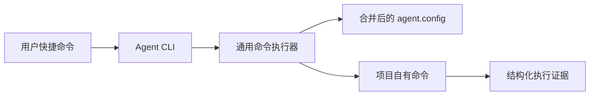
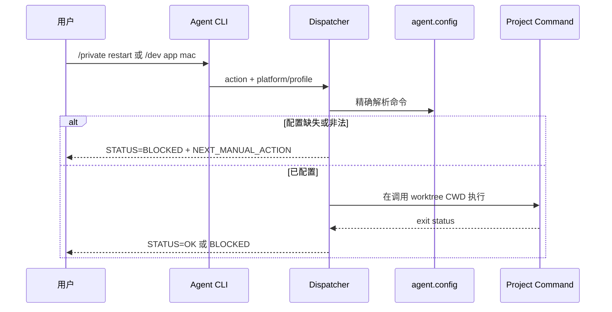

# PromptsEngineering 模板架构总纲

**日期**：2026-08-23  
**版本**：v1.0  
**状态**：✅ 已确认

## 1. 总览

本架构在现有配置加载器、统一 Agent CLI 和 DevOps 执行器之上增加通用客户端命令面。模板持有命令语义、规范 alias 默认矩阵、维度校验、配置解析和结构化结果；目标项目持有 alias 的真实实现、覆盖值与产品约束。

## 2. 功能域架构索引

| 功能域 | 负责团队 | 文档链接 | 状态 | 依赖/Gate | Traceability ID | 阻塞/待办 | 最后更新 |
| --- | --- | --- | --- | --- | --- | --- | --- |
| 模板命令面 | @template-maintainers | [ARCH.md](arch-modules/template-command-surface/ARCH.md) | ✅ 已确认 | TDD/QA 定向测试 | US-CMDSURF-001~004 | 无 | 2026-08-23 |

## 3. 架构视图

### 3.1 C4 上下文与组件

### 3.2 运行时视图

### 3.3 数据视图

无数据库、持久业务实体或迁移。配置事实源为模板默认 `config.example.json` 与项目稀疏 `agent.config.json` 的深合并结果；运行证据写入容器层 `tmp/devops-runs/`。

### 3.4 接口视图

- 输入：`action`、`platform`、`target/profile`、`env` 和透传参数。
- 输出：`STATUS`、`ACTION`、`PLATFORM`、`TARGET`、`CWD`、`RUN_DIR`、`COMMAND` 和退出码。
- 错误：缺失维度、缺失命令、非法位置参数和项目命令失败均 fail closed。

### 3.5 运维视图

模板自身无部署单元。执行器随模板文件传播，目标项目命令在调用 worktree 内运行；`/build` 只生成产物，`/ship` 才允许改变远端环境状态。

### 3.6 安全与合规视图

- 不记录密钥或展开敏感环境变量。
- 不跨 profile、平台或环境回退。
- `RULES.md`、`agent.config.json` 与业务脚本保持 project-owned。
- 用户语法使用 `/private restart`；内部结构化 target 不作为用户快捷语法暴露。

## 4. 技术选型与 ADR

| 选项 | 决策 | 原因 | ADR |
| --- | --- | --- | --- |
| 新建独立命令系统 | 不采用 | 会产生第二执行面 | [ADR-001](adr/001-arch-template-command-dispatch.md) |
| 扩展现有 Agent CLI + DevOps dispatcher | 采用 | 复用配置、运行证据和阻断模型 | [ADR-001](adr/001-arch-template-command-dispatch.md) |
| 在模板配置中登记规范 alias 默认矩阵 | 采用 | 稀疏项目更新模板后即可解析统一命令，同时保留叶级覆盖 | [ADR-001](adr/001-arch-template-command-dispatch.md) |
| 向目标 `package.json` 强制注入 alias 实现 | 不采用 | 模板无法替项目选择框架、构建器或签名流程 | [ADR-001](adr/001-arch-template-command-dispatch.md) |

## 5. 跨模块依赖关系

当前只有模板命令面模块，无跨模块依赖。详见 [global-dependency-graph.md](data/global-dependency-graph.md) 与 [component-dependency-graph.md](data/component-dependency-graph.md)。

## 6. 风险

| 风险 | 影响 | 缓解 | Gate |
| --- | --- | --- | --- |
| private profile 回退到 default | 连接或操作错误目标 | profile 存在时只接受精确配置 | 负向测试 |
| 平台字符串与项目 alias 漂移 | 执行错误脚本 | 平台标准化后精确索引 | 单元测试 |
| 文档语法和内部 CLI 混淆 | 用户继续使用旧语法 | 专家表只显示 `/private restart` | 文档契约测试 |
| 模板覆盖项目文件 | 项目行为损坏 | manifest 所有权和传播收敛检查 | apply 验收 |
| 模板只更新路由但漏登记默认矩阵 | 实际项目在启动前即因配置缺失阻断 | 枚举矩阵契约测试 + 目标项目 apply 后解析测试 | 模板传播验收 |

## 7. 文档审查与更新节奏

| 版本 | 日期 | 触发类型 | 影响功能域 | 审查人 | Traceability/QA 状态 | 说明 |
| --- | --- | --- | --- | --- | --- | --- |
| v1.0 | 2026-08-23 | 用户确认命令协议 | 模板命令面 | @architect | Traceability 已建立 / QA 待执行 | 首版架构 |

## 8. 相关文档

- [PRD.md](PRD.md)
- [模块架构](arch-modules/template-command-surface/ARCH.md)
- [架构追溯](data/arch-prd-traceability.md)
- [ADR](adr/001-arch-template-command-dispatch.md)
