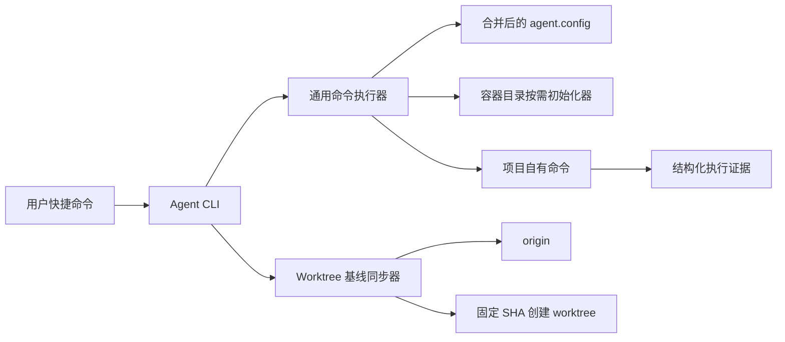
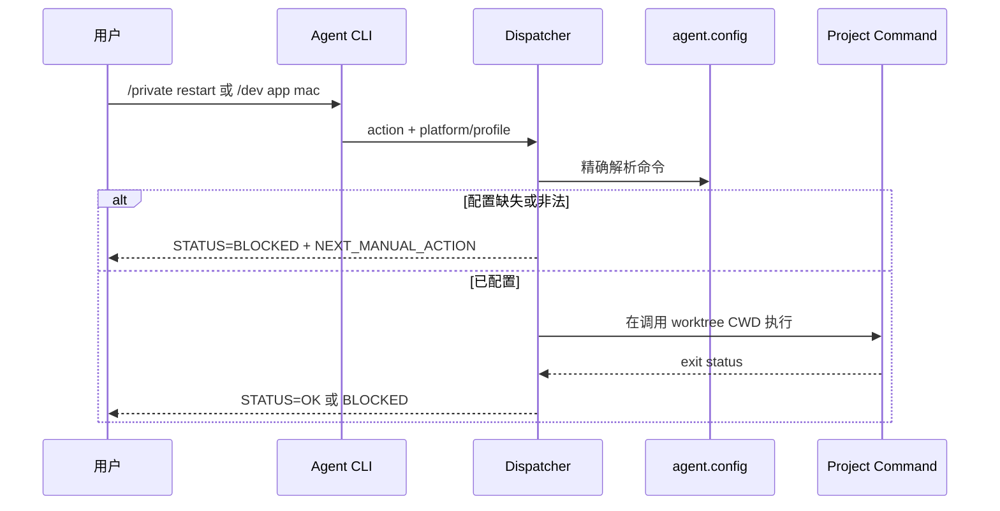

# PromptsEngineering 模板架构总纲

**日期**：2026-09-01
**版本**：v1.3
**状态**：✅ 已确认

## 1. 总览

本架构覆盖通用客户端命令面，以及基于模板 manifest 和初始化器的环境文件首次创建。模板持有协议和安全骨架；目标项目持有后续内容与真实凭据。

## 2. 功能域架构索引

| 功能域 | 负责团队 | 文档链接 | 状态 | 依赖/Gate | Traceability ID | 阻塞/待办 | 最后更新 |
| --- | --- | --- | --- | --- | --- | --- | --- |
| 模板命令面 | @template-maintainers | [ARCH.md](arch-modules/template-command-surface/ARCH.md) | ✅ 已确认 | TDD/QA 定向测试 | US-CMDSURF-001~007 | 无 | 2026-09-01 |
| 环境文件初始化 | @template-maintainers | [ARCH.md](arch-modules/environment-file-initialization/ARCH.md) | ✅ 已确认 | init-if-missing / Git ignore 验收 | US-ENVINIT-001~003 | 无 | 2026-08-24 |

## 3. 架构视图

### 3.1 C4 上下文与组件

### 3.2 运行时视图

目录初始化是显式写入边界：配置解析保持无副作用；需要写入的命令声明 `worktrees/tmp/cache/artifacts` 子集，初始化器完成拓扑校验、递归创建与真实目录复核后，才允许后续状态或项目命令副作用。

全新 worktree 的默认运行时顺序为：完成请求与恢复态预检，成功执行 `git fetch --prune origin`，严格解析 `refs/remotes/origin/<base>^{commit}`，再以该不可变 commit SHA 创建 branch/worktree。fetch 或远端 base 解析失败时不得进入 branch、worktree 或 session 副作用；dry-run、已有 worktree resume 与显式 `--skip-fetch` 不执行默认在线刷新。

### 3.3 数据视图

无数据库、持久业务实体或迁移。配置事实源为模板默认 `config.example.json` 与项目稀疏 `agent.config.json` 的深合并结果；运行证据写入容器层 `tmp/devops-runs/`。

### 3.4 接口视图

- 输入：`action`、`platform`、`target/profile`、`env` 和透传参数。
- 输出：`STATUS`、`ACTION`、`PLATFORM`、`TARGET`、`CWD`、`RUN_DIR`、`COMMAND` 和退出码。
- 错误：缺失维度、缺失命令、非法位置参数和项目命令失败均 fail closed。

### 3.5 运维视图

模板自身无部署单元。执行器随模板文件传播，目标项目命令在调用 worktree 内运行；`/build` 只生成产物，`/ship` 才允许改变远端环境状态。

### 3.6 安全与合规视图

- 不记录密钥或展开敏感环境变量。
- 不跨 profile、平台或环境回退。
- `RULES.md`、`agent.config.json` 与业务脚本保持 project-owned。
- 用户语法使用 `/private restart`；内部结构化 target 不作为用户快捷语法暴露。

## 4. 技术选型与 ADR

| 选项 | 决策 | 原因 | ADR |
| --- | --- | --- | --- |
| 新建独立命令系统 | 不采用 | 会产生第二执行面 | [ADR-001](adr/001-arch-template-command-dispatch.md) |
| 扩展现有 Agent CLI + DevOps dispatcher | 采用 | 复用配置、运行证据和阻断模型 | [ADR-001](adr/001-arch-template-command-dispatch.md) |
| 在模板配置中登记规范 alias 默认矩阵 | 采用 | 稀疏项目更新模板后即可解析统一命令，同时保留叶级覆盖 | [ADR-001](adr/001-arch-template-command-dispatch.md) |
| 向目标 `package.json` 强制注入 alias 实现 | 不采用 | 模板无法替项目选择框架、构建器或签名流程 | [ADR-001](adr/001-arch-template-command-dispatch.md) |
| 配置加载时自动创建全部容器目录 | 不采用 | 会让只读命令产生意外副作用 | [ADR-003](adr/003-arch-container-directory-initialization.md) |
| 写入命令显式声明并初始化所需目录 | 采用 | 兼顾缺目录自愈、幂等和只读边界 | [ADR-003](adr/003-arch-container-directory-initialization.md) |
| 默认 best-effort fetch 并回退缓存或任意 HEAD | 不采用 | 无法证明新任务基于最新 configured base，且会把网络/鉴权失败伪装成成功 | [ADR-005](adr/005-arch-worktree-required-base-sync.md) |
| 默认 required fetch，并从本次解析的 commit SHA 创建 | 采用 | 在副作用前建立可验证基线；现有 `--skip-fetch` 保留显式离线边界 | [ADR-005](adr/005-arch-worktree-required-base-sync.md) |

## 5. 跨模块依赖关系

模板命令面与环境文件初始化无运行时依赖；两者共同依赖模板 apply 生命周期。详见 [global-dependency-graph.md](data/global-dependency-graph.md) 与 [component-dependency-graph.md](data/component-dependency-graph.md)。

## 6. 风险

| 风险 | 影响 | 缓解 | Gate |
| --- | --- | --- | --- |
| private profile 回退到 default | 连接或操作错误目标 | profile 存在时只接受精确配置 | 负向测试 |
| 平台字符串与项目 alias 漂移 | 执行错误脚本 | 平台标准化后精确索引 | 单元测试 |
| 文档语法和内部 CLI 混淆 | 用户继续使用旧语法 | 专家表只显示 `/private restart` | 文档契约测试 |
| 模板覆盖项目文件 | 项目行为损坏 | manifest 所有权和传播收敛检查 | apply 验收 |
| 模板只更新路由但漏登记默认矩阵 | 实际项目在启动前即因配置缺失阻断 | 枚举矩阵契约测试 + 目标项目 apply 后解析测试 | 模板传播验收 |
| 环境初始化覆盖已有凭据 | 本地或部署配置损坏 | 独占创建、存在即 unchanged，禁止 append/overwrite | 预置 sentinel 内容测试 |
| 容器目录缺失或被文件占位 | 稳定命令启动失败或写入异常位置 | 共享初始化器递归创建并复核真实目录，异常 fail closed | 缺失/幂等/负向测试 |
| fetch 失败后使用陈旧或错误基线 | 新任务从非预期 commit 开始，后续验证与合并证据失真 | 默认 required fetch、严格远端 ref、固定 SHA 创建；显式 skip 输出未验证状态 | worktree 集成与负向测试 |

## 7. 文档审查与更新节奏

| 版本 | 日期 | 触发类型 | 影响功能域 | 审查人 | Traceability/QA 状态 | 说明 |
| --- | --- | --- | --- | --- | --- | --- |
| v1.0 | 2026-08-23 | 用户确认命令协议 | 模板命令面 | @architect | Traceability 已建立 / QA 待执行 | 首版架构 |
| v1.1 | 2026-08-24 | 用户确认六文件初始化 | 环境文件初始化 | @architect | Traceability 已建立 / QA 待执行 | 增加首次创建与所有权边界 |
| v1.2 | 2026-08-26 | 用户确认容器目录自动创建 | 模板命令面 | @architect | Traceability 已建立 / QA 待执行 | 增加显式按需初始化器与只读边界 |
| v1.3 | 2026-09-01 | 用户确认 worktree 最新远端基线门禁 | 模板命令面 | @architect | Traceability 已建立 / QA 待执行 | 增加 required fetch、固定 SHA 与显式 skip 边界 |

## 8. 相关文档

- [PRD.md](PRD.md)
- [模块架构](arch-modules/template-command-surface/ARCH.md)
- [环境文件初始化架构](arch-modules/environment-file-initialization/ARCH.md)
- [架构追溯](data/arch-prd-traceability.md)
- [ADR](adr/001-arch-template-command-dispatch.md)
- [ADR-002](adr/002-arch-environment-file-init-if-missing.md)
- [ADR-003](adr/003-arch-container-directory-initialization.md)
- [ADR-005](adr/005-arch-worktree-required-base-sync.md)
