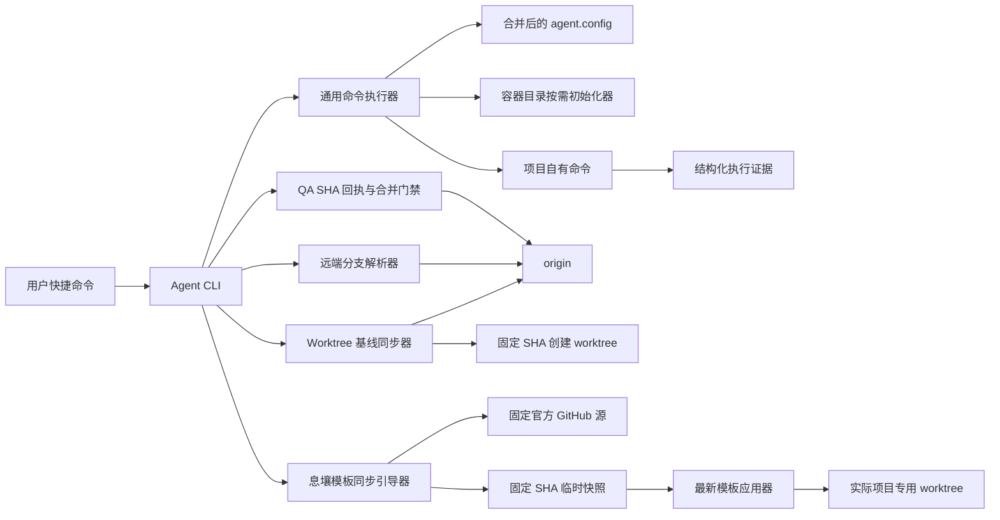
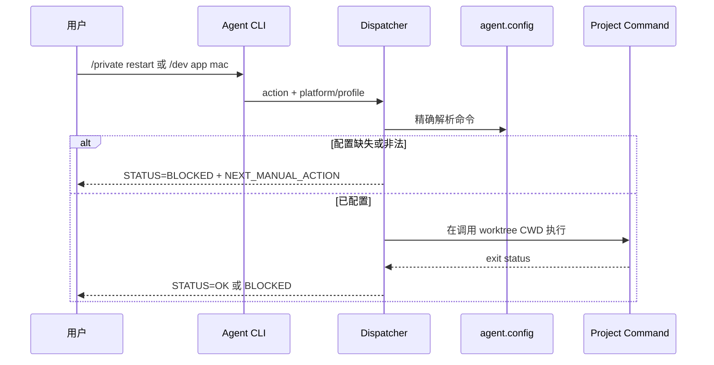

# 息壤（Xirang）模板架构总纲

**日期**：2026-09-06
**版本**：v1.5
**状态**：✅ 已确认

## 1. 总览

多端 workspace、按需依赖、Prisma 与预置组合见 [Monorepo 架构](arch-modules/monorepo-platform/ARCH.md) 和 [ADR-028](adr/028-arch-monorepo-prisma.md)。

新增应用架构能力见 [双能力包与架构落地](arch-modules/architecture-platform/ARCH.md)。既有架构覆盖通用客户端命令面、基于模板 manifest 和初始化器的环境文件首次创建、不依赖 GitHub CI 的多电脑同权 Git 协作，以及由实际项目主动发起的息壤官方模板自更新。模板持有协议、身份、官方来源和安全骨架；目标项目持有后续内容与真实凭据。

## 2. 功能域架构索引

| 功能域 | 负责团队 | 文档链接 | 状态 | 依赖/Gate | Traceability ID | 阻塞/待办 | 最后更新 |
| --- | --- | --- | --- | --- | --- | --- | --- |
| 双能力包与架构落地 | @template-maintainers | [ARCH.md](arch-modules/architecture-platform/ARCH.md) | 已定义 | 初始化/升级/生成项目验证 | US-ARCHPLAT-001~014 | 无 | 2026-09-09 |
| 模板命令面 | @template-maintainers | [ARCH.md](arch-modules/template-command-surface/ARCH.md) | ✅ v1.5 已确认 | TDD/QA 定向测试、模板源模拟与传播收敛 | US-CMDSURF-001~009 | 无 | 2026-09-06 |
| 环境文件初始化 | @template-maintainers | [ARCH.md](arch-modules/environment-file-initialization/ARCH.md) | ✅ 已确认 | init-if-missing / Git ignore 验收 | US-ENVINIT-001~003 | 无 | 2026-08-24 |

## 3. 架构视图

### 3.1 C4 上下文与组件

### 3.2 运行时视图

目录初始化是显式写入边界：配置解析保持无副作用；需要写入的命令声明 `worktrees/tmp/cache/artifacts` 子集，初始化器完成拓扑校验、递归创建与真实目录复核后，才允许后续状态或项目命令副作用。

全新 worktree 的默认运行时顺序为：完成请求与恢复态预检，成功执行 `git fetch --prune origin`，严格解析 `refs/remotes/origin/<base>^{commit}`，再以该不可变 commit SHA 创建 branch/worktree。fetch 或远端 base 解析失败时不得进入 branch、worktree 或 session 副作用；dry-run、已有 worktree resume 与显式 `--skip-fetch` 不执行默认在线刷新。

多电脑运行时不共享 PID、锁、worktree 路径或 task/session 文件。`worktree new` 在 fetch 后检查远端同名分支并阻断误建；`worktree resume` 可从远端分支的固定 SHA 建立本机 worktree/session。`qa verify` 记录 `BASE_SHA` 与 `HEAD_SHA`，`qa merge` 再次 fetch 并要求二者未漂移；GitHub squash merge 绑定 head SHA，本地 fallback 只允许普通非强制 push。主干或功能分支变化时旧回执立即失效。

息壤模板同步由实际项目中随模板传播的轻量引导器发起。引导器只在实际项目的 linked worktree 中运行，读取 template-owned 的息壤身份和官方 GitHub URL/branch，通过独立匿名 HTTPS Git 环境在容器 `tmp` 的唯一运行目录执行 required shallow fetch，解析 `FETCH_HEAD^{commit}` 后以 detached checkout 形成不可变模板快照。随后必须调用该快照中的最新 `update-template.js` 和 manifest 对调用 worktree执行 dry-run/apply/convergence；因此实际项目内携带的旧应用器不会成为模板内容事实源。来源或预检失败只允许留下容器层诊断证据，不得写入目标 tracked 文件。

### 3.3 数据视图

无数据库、持久业务实体或迁移。配置事实源为模板默认 `config.example.json` 与项目稀疏 `agent.config.json` 的深合并结果；运行证据写入容器层 `tmp/`。QA 回执是本机临时状态，只保存配置主干、分支、PR 与 base/head SHA，不作为跨电脑授权或远端锁。息壤身份和官方源位于 template-owned 默认配置；每次同步的 source repo、branch、commit 和阶段状态只作为命令输出及报告保存，临时 Git 快照在调用结束后安全清理，不形成可被误用为“最新”的持久缓存。

### 3.4 接口视图

- 输入：`action`、`platform`、`target/profile`、`env` 和透传参数。
- 输出：`STATUS`、`ACTION`、`PLATFORM`、`TARGET`、`CWD`、`RUN_DIR`、`COMMAND` 和退出码。
- 错误：缺失维度、缺失命令、非法位置参数和项目命令失败均 fail closed。
- Git 协作输出：`BASE_BRANCH`、`BASE_SHA`、`HEAD_SHA`、`REMOTE_MAIN_SHA`、`QA_STATUS`、`MERGE_STATUS`、`PUSH_STATUS` 和 `NEXT_ACTION`。
- 息壤同步输出：`TEMPLATE_ID`、`TEMPLATE_NAME`、`TEMPLATE_REPO`、`TEMPLATE_BRANCH`、`TEMPLATE_COMMIT`、`TEMPLATE_FETCH_STATUS`、`TEMPLATE_APPLY_STATUS`、`TEMPLATE_CONVERGENCE_STATUS` 和退出码。

### 3.5 运维视图

模板自身无部署单元。执行器随模板文件传播，目标项目命令在调用 worktree 内运行；`/build` 只生成产物，`/ship` 才允许改变远端环境状态。`template sync` 是用户触发的短生命周期联网操作，不创建 daemon、后台更新器或定时任务。

### 3.6 安全与合规视图

- 不记录密钥或展开敏感环境变量。
- 不跨 profile、平台或环境回退。
- `RULES.md`、`agent.config.json` 与业务脚本保持 project-owned。
- 用户语法使用 `/private restart`；内部结构化 target 不作为用户快捷语法暴露。
- 专家阶段不是机器身份或 GitHub 权限；所有授权电脑使用同一命令合约。
- GitHub CI 不参与 QA/合并；模板不创建、修改或触发 project-owned workflows。
- 配置主干只允许普通更新，模板永不对其执行 force push 或删除。
- 普通“更新息壤模板”只使用 template-owned 官方 GitHub URL 与 branch；官方下载不读取项目 token、不发送 Authorization/Cookie，并隔离用户 Git 配置；项目自身远端操作继续走原鉴权入口。
- 模板 fetch、commit 解析、快照形状验证和 dry-run 必须先于目标 tracked 文件写入；失败不得回退项目内旧快照。

## 4. 技术选型与 ADR

| 选项 | 决策 | 原因 | ADR |
| --- | --- | --- | --- |
| 新建独立命令系统 | 不采用 | 会产生第二执行面 | [ADR-001](adr/001-arch-template-command-dispatch.md) |
| 扩展现有 Agent CLI + DevOps dispatcher | 采用 | 复用配置、运行证据和阻断模型 | [ADR-001](adr/001-arch-template-command-dispatch.md) |
| 在模板配置中登记规范 alias 默认矩阵 | 采用 | 稀疏项目更新模板后即可解析统一命令，同时保留叶级覆盖 | [ADR-001](adr/001-arch-template-command-dispatch.md) |
| 向目标 `package.json` 强制注入 alias 实现 | 不采用 | 模板无法替项目选择框架、构建器或签名流程 | [ADR-001](adr/001-arch-template-command-dispatch.md) |
| 配置加载时自动创建全部容器目录 | 不采用 | 会让只读命令产生意外副作用 | [ADR-003](adr/003-arch-container-directory-initialization.md) |
| 写入命令显式声明并初始化所需目录 | 采用 | 兼顾缺目录自愈、幂等和只读边界 | [ADR-003](adr/003-arch-container-directory-initialization.md) |
| 默认 best-effort fetch 并回退缓存或任意 HEAD | 不采用 | 无法证明新任务基于最新 configured base，且会把网络/鉴权失败伪装成成功 | [ADR-005](adr/005-arch-worktree-required-base-sync.md) |
| 默认 required fetch，并从本次解析的 commit SHA 创建 | 采用 | 在副作用前建立可验证基线；现有 `--skip-fetch` 保留显式离线边界 | [ADR-005](adr/005-arch-worktree-required-base-sync.md) |
| 固定 QA 电脑、机器角色或远程 merge lock | 不采用 | 每台电脑都可能承担任意专家阶段；新增授权面和服务会扩大复杂度 | [ADR-006](adr/006-arch-multi-host-optimistic-git-coordination.md) |
| 本地状态保护本机生命周期，远端 SHA 与非快进更新协调多电脑 | 采用 | 复用 Git 原子引用更新，以最小改动阻止误建、陈旧 QA 和覆盖先到提交 | [ADR-006](adr/006-arch-multi-host-optimistic-git-coordination.md) |
| 实际项目使用自身携带的模板快照或依赖人工维护本地模板仓库 | 不采用 | 无法保证来源新鲜度，旧脚本也无法可靠升级自身 | [ADR-007](adr/007-arch-xirang-official-template-sync.md) |
| 固定官方源 required fetch、固定 SHA 临时快照并调用快照内最新应用器 | 采用 | 同时建立来源、版本、执行器自举和失败零写入的可验证边界 | [ADR-007](adr/007-arch-xirang-official-template-sync.md) |

## 5. 跨模块依赖关系

模板命令面与环境文件初始化无运行时依赖；两者共同依赖模板 apply 生命周期。详见 [global-dependency-graph.md](data/global-dependency-graph.md) 与 [component-dependency-graph.md](data/component-dependency-graph.md)。

## 6. 风险

| 风险 | 影响 | 缓解 | Gate |
| --- | --- | --- | --- |
| private profile 回退到 default | 连接或操作错误目标 | profile 存在时只接受精确配置 | 负向测试 |
| 平台字符串与项目 alias 漂移 | 执行错误脚本 | 平台标准化后精确索引 | 单元测试 |
| 文档语法和内部 CLI 混淆 | 用户继续使用旧语法 | 专家表只显示 `/private restart` | 文档契约测试 |
| 模板覆盖项目文件 | 项目行为损坏 | manifest 所有权和传播收敛检查 | apply 验收 |
| 模板只更新路由但漏登记默认矩阵 | 实际项目在启动前即因配置缺失阻断 | 枚举矩阵契约测试 + 目标项目 apply 后解析测试 | 模板传播验收 |
| 环境初始化覆盖已有凭据 | 本地或部署配置损坏 | 独占创建、存在即 unchanged，禁止 append/overwrite | 预置 sentinel 内容测试 |
| 容器目录缺失或被文件占位 | 稳定命令启动失败或写入异常位置 | 共享初始化器递归创建并复核真实目录，异常 fail closed | 缺失/幂等/负向测试 |
| fetch 失败后使用陈旧或错误基线 | 新任务从非预期 commit 开始，后续验证与合并证据失真 | 默认 required fetch、严格远端 ref、固定 SHA 创建；显式 skip 输出未验证状态 | worktree 集成与负向测试 |
| 同名远端分支被另一台电脑误建 | 两个开发历史争用同一远端 ref | new 在 fetch 后阻断；resume 从远端精确 SHA 恢复 | 三 clone 集成测试 |
| 本机锁被误当成跨电脑 merge queue | 并发合并仍可同时进入临界区 | 明确本机状态边界；base/head SHA 回执与普通非快进更新协调 | QA 合并并发测试 |
| QA 后 base/head 漂移 | 未验证组合进入主干 | merge 前重新 fetch；任一 SHA 不同即使旧回执失效 | SHA 负向测试 |
| 所有人可直接更新主干且无 CI | 原始 Git 命令可绕过本地流程 | 明确信任边界；GitHub 仅强制禁止主干 force push/删除，模板提供防误操作而不宣称零信任 | 文档与内容扫描 |
| 实际项目误把旧模板快照当成官方最新版 | 模板更新成功但没有获得中央改动 | required fetch 固定官方源，锁定 SHA，并调用快照内最新执行器 | 本地 bare remote 前进测试 |
| fetch、认证或远端 ref 异常后继续写入 | 产生来源不明或部分模板更新 | 所有来源验证和 dry-run 位于目标 tracked mutation 前，失败即阻断 | 失败零写入测试 |
| 同步过程中官方分支继续前进 | dry-run 与 apply 使用不同版本 | 首次 fetch 后仅使用不可变 commit SHA 的 detached 快照 | SHA 一致性断言 |

## 7. 文档审查与更新节奏

| 版本 | 日期 | 触发类型 | 影响功能域 | 审查人 | Traceability/QA 状态 | 说明 |
| --- | --- | --- | --- | --- | --- | --- |
| v1.0 | 2026-08-23 | 用户确认命令协议 | 模板命令面 | @architect | Traceability 已建立 / QA 待执行 | 首版架构 |
| v1.1 | 2026-08-24 | 用户确认六文件初始化 | 环境文件初始化 | @architect | Traceability 已建立 / QA 待执行 | 增加首次创建与所有权边界 |
| v1.2 | 2026-08-26 | 用户确认容器目录自动创建 | 模板命令面 | @architect | Traceability 已建立 / QA 待执行 | 增加显式按需初始化器与只读边界 |
| v1.3 | 2026-09-01 | 用户确认 worktree 最新远端基线门禁 | 模板命令面 | @architect | Traceability 已建立 / QA 待执行 | 增加 required fetch、固定 SHA 与显式 skip 边界 |
| v1.4 | 2026-09-05 | 用户确认多电脑同权且禁用 GitHub CI | 模板命令面 | @architect | Traceability 已建立 / QA 待执行 | 增加远端分支保护、QA 双 SHA 回执与主干乐观并发 |
| v1.5 | 2026-09-06 | 用户确认息壤命名与实际项目自更新 | 模板命令面 | @architect | Traceability 已建立 / QA 待执行 | 增加固定官方源、SHA 快照、自举应用器和收敛门禁 |

## 8. 相关文档

- [PRD.md](PRD.md)
- [模块架构](arch-modules/template-command-surface/ARCH.md)
- [环境文件初始化架构](arch-modules/environment-file-initialization/ARCH.md)
- [架构追溯](data/arch-prd-traceability.md)
- [ADR](adr/001-arch-template-command-dispatch.md)
- [ADR-002](adr/002-arch-environment-file-init-if-missing.md)
- [ADR-003](adr/003-arch-container-directory-initialization.md)
- [ADR-005](adr/005-arch-worktree-required-base-sync.md)
- [ADR-006](adr/006-arch-multi-host-optimistic-git-coordination.md)
- [ADR-007](adr/007-arch-xirang-official-template-sync.md)
## 公共 UI 扩展索引

3.1 表单、选择器、日期与反馈组件及初始化依赖闭包见 [架构模块 §8](arch-modules/architecture-platform/ARCH.md#8-四组公共-ui-与按需组件集31)。
