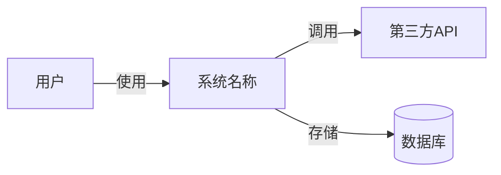
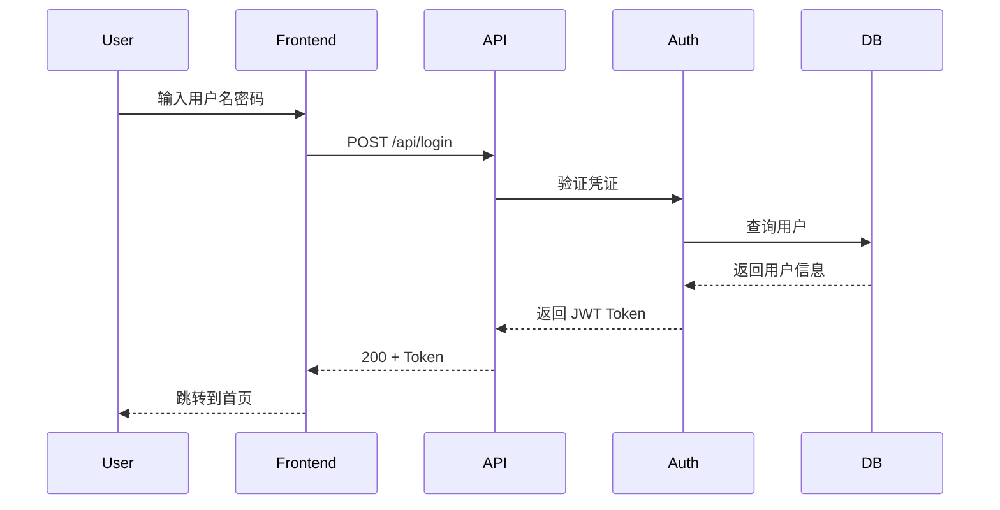
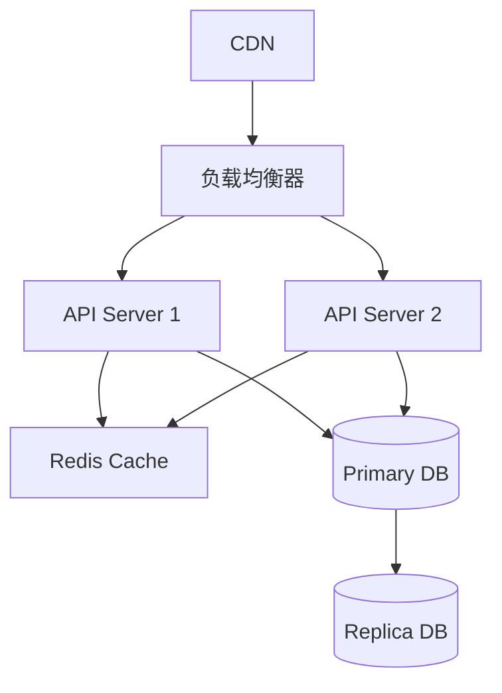
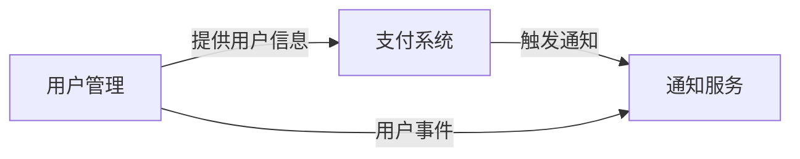

# 系统架构文档

> **说明**：本文档由 ARCHITECTURE 专家编写和维护。对于小型项目（< 5 个服务），使用单文件结构即可；对于大型项目，采用主从结构（主架构文档 + 模块架构文档），详见 [architecture-modules/README.md](architecture-modules/README.md)。

**日期**：YYYY-MM-DD
**版本**：v0
**状态**：📝 草稿

---

## 使用说明

### 小型项目（单一文件）
如果项目满足以下条件，直接在本文件中完成所有架构设计：
- 子系统/服务 < 8 个
- 单一数据库或简单数据模型（< 30 个实体表）
- 单团队开发
- 文档预计 < 1000 行

### 大型项目（主从结构）
如果项目满足以下**任一条件**，建议采用模块化架构：
- 主架构文档 > 1000 行
- 子系统/服务 > 8 个
- 业务域边界明确（3+ 个独立领域模型）
- 多团队并行开发
- 数据模型复杂（30+ 实体表，跨域数据流）

**迁移步骤**：
1. 保持本文件作为主架构文档（总纲与索引，< 500 行）
2. 在 `/docs/architecture-modules/` 创建功能域子架构文档（如 `user-management.md`、`payment-system.md`）
3. 在 [architecture-modules/README.md](architecture-modules/README.md) 中注册所有模块
4. 使用下方的"大型项目模板"替换本文件内容

---

## 小型项目模板（当前使用）

### 1. 总览与目标

#### 1.1 系统概述
- **系统名称**：（项目名称）
- **系统边界**：（系统范围与对外接口）
- **核心目标**：（系统要解决的核心问题）

#### 1.2 质量属性优先级
按重要性排序（SMART 原则）：
1. **性能**：（如：首页加载 < 2s，API 响应 < 500ms）
2. **可靠性**：（如：SLA 99.5%，MTTR < 1h）
3. **成本**：（如：月运营成本 < $500）
4. **可演进性**：（如：支持水平扩展，模块化设计）
5. **安全性**：（如：符合 OWASP Top 10）

---

### 2. 架构视图

#### 2.1 上下文/容器/组件（C4）

**系统上下文图**（Mermaid）：


**容器视图**：
- **前端应用**：React / Vue / Next.js（运行环境：浏览器/CDN）
- **后端API**：Node.js / Python / Go（运行环境：云服务器/容器）
- **数据库**：PostgreSQL / MySQL / MongoDB（运行环境：托管数据库服务）
- **缓存**：Redis（运行环境：托管缓存服务）

**组件视图**：
- （补充核心组件与职责）

#### 2.2 运行时视图

**关键链路时序图**（示例：用户登录）：


（补充其他关键用例的时序图）

#### 2.3 数据视图

**实体关系图（ERD）**：
参考 `/docs/data/ERD.mmd`

**核心数据表**：
| 表名 | 用途 | 主键 | 重要字段 | 索引策略 |
|------|------|------|---------|---------|
| users | 用户信息 | id (UUID) | email, password_hash, created_at | idx_email (UNIQUE) |
| （补充其他表） | - | - | - | - |

**数据字典**：详见 `/docs/data/dictionary.md`

**关系与约束**：
- users 1:N orders（一个用户有多个订单）
- （补充其他关系）

**索引策略**：
- **查询热点**：email、user_id、created_at
- **复合索引**：(user_id, status, created_at)（用于分页查询）

**容量与保留**：
- **预估数据量**：10,000 用户，100,000 订单（第一年）
- **增长率**：20% MoM（月环比增长）
- **数据保留**：用户数据永久保留，日志保留 90 天

**一致性与事务边界**：
- **强一致性**：用户注册、支付交易
- **最终一致性**：统计数据、推荐系统
- **事务边界**：单个订单创建（包含订单表+库存表更新）

**合规与审计**：
- **敏感字段加密**：password_hash (bcrypt)、payment_info (AES-256)
- **审计日志**：所有写操作记录到 audit_logs 表

**备份与恢复**：
- **备份频率**：每日全量备份（凌晨 2:00）
- **备份保留**：30 天
- **RTO/RPO**：恢复时间目标 < 4h，数据丢失 < 1h

#### 2.4 接口视图

**外部 API 契约**：
| 端点 | 方法 | 用途 | 认证 | 限流 |
|------|------|------|------|------|
| /api/v1/users | POST | 用户注册 | 无 | 10 req/min/IP |
| /api/v1/login | POST | 用户登录 | 无 | 5 req/min/IP |
| /api/v1/orders | GET | 查询订单列表 | JWT | 100 req/min/user |
| /api/v1/orders | POST | 创建订单 | JWT | 20 req/min/user |

**错误码规范**：
| 错误码 | HTTP 状态 | 含义 | 处理建议 |
|--------|----------|------|---------|
| 1001 | 400 | 参数校验失败 | 检查请求参数 |
| 1002 | 401 | 认证失败 | 重新登录 |
| 1003 | 403 | 权限不足 | 联系管理员 |
| 1004 | 429 | 请求过于频繁 | 稍后重试 |
| 5000 | 500 | 服务器内部错误 | 联系技术支持 |

**幂等性设计**：
- POST /api/v1/orders：使用 idempotency_key（客户端生成UUID）防止重复创建订单

**限流策略**：
- **IP 限流**：针对未登录用户（如注册、登录）
- **用户限流**：针对已登录用户（按 user_id）
- **全局限流**：保护系统总体负载（如 10,000 req/s）

#### 2.5 运维视图

**部署拓扑**：


**弹性策略**：
- **水平扩展**：API Server 支持无状态扩展（2-10 实例）
- **自动扩容**：CPU > 70% 或 RPS > 5000 时触发扩容
- **降级策略**：缓存不可用时直接查询数据库，推荐系统不可用时返回默认推荐

**可观测性**：
- **日志**：ELK Stack / CloudWatch Logs（结构化日志，JSON 格式）
- **指标**：Prometheus + Grafana（系统指标、业务指标）
- **追踪**：Jaeger / AWS X-Ray（分布式追踪）
- **告警**：PagerDuty / Slack（P0 错误、SLA 违规）

**SLO（服务等级目标）**：
| 指标 | 目标 | 测量方式 |
|------|------|---------|
| 可用性 | 99.5% (月度) | Uptime Robot + 自定义健康检查 |
| 响应时间 | P95 < 500ms | APM 工具统计 |
| 错误率 | < 0.5% | 日志聚合统计 |

#### 2.6 安全与合规

**身份与权限**：
- **认证**：JWT Token（有效期 7 天，支持刷新）
- **授权**：基于角色的访问控制（RBAC）
  - Admin：全部权限
  - User：标准用户权限（查看/编辑自己的数据）
  - Guest：仅浏览公开内容

**审计**：
- **操作日志**：记录所有写操作（用户、时间、操作、IP）
- **保留期**：90 天（合规要求）
- **日志不可篡改**：使用只追加日志存储

**数据安全**：
- **传输加密**：HTTPS (TLS 1.2+)
- **存储加密**：敏感字段加密（bcrypt、AES-256）
- **密钥管理**：AWS Secrets Manager / HashiCorp Vault

**合规要求**：
- **GDPR**（欧盟）：支持用户数据导出与删除
- **PIPL**（中国个人信息保护法）：符合数据最小化原则
- **PCI DSS**（如涉及支付）：不存储完整卡号，使用第三方支付网关

---

### 3. 技术选型与 ADR

#### 3.1 技术栈总览
| 层次 | 技术选择 | 理由 | ADR 链接 |
|------|---------|------|---------|
| 前端 | React 18 + TypeScript | 生态成熟、团队熟悉 | [ADR-001](adr/001-frontend-framework.md) |
| 后端 | Node.js + Express | 高性能、异步 I/O | [ADR-002](adr/002-backend-framework.md) |
| 数据库 | PostgreSQL 15 | 关系型、ACID、扩展性强 | [ADR-003](adr/003-database-selection.md) |
| 缓存 | Redis 7 | 高性能、丰富数据结构 | [ADR-004](adr/004-cache-strategy.md) |
| 部署 | AWS ECS + Fargate | 无服务器容器、自动扩展 | [ADR-005](adr/005-deployment-platform.md) |

#### 3.2 关键技术决策
详见 `/docs/adr/` 目录下的 ADR 文档。

---

### 4. 风险与缓解

| 风险类型 | 风险描述 | 概率 | 影响 | 风险等级 | 缓解措施 | 负责人 |
|---------|---------|------|------|---------|---------|--------|
| 技术风险 | 第三方 API 不稳定 | 中 | 高 | 🔴 高 | 增加重试机制+降级方案 | @tech-lead |
| 性能风险 | 数据库查询慢 | 中 | 中 | 🟡 中 | 优化索引+读写分离 | @dba |
| 安全风险 | SQL 注入攻击 | 低 | 高 | 🟡 中 | 使用参数化查询+输入校验 | @security |
| 合规风险 | GDPR 审查未通过 | 低 | 高 | 🟡 中 | 提前咨询法律顾问 | @legal |

---

### 5. 变更记录

| 版本 | 日期 | 变更类型 | 变更描述 | 负责人 |
|------|------|---------|---------|--------|
| v0 | YYYY-MM-DD | 新增 | 初始版本 | @architect |

---

### 6. 相关文档

- **PRD 文档**：[PRD.md](PRD.md)
- **任务计划**：[TASK.md](TASK.md)
- **测试计划**：[QA.md](QA.md)
- **ADR 目录**：[adr/](adr/)
- **数据字典**：[data/dictionary.md](data/dictionary.md)
- **ERD 图**：[data/ERD.mmd](data/ERD.mmd)
- **目录规范**：[CONVENTIONS.md](CONVENTIONS.md)

---

## 大型项目模板（迁移时使用）

当项目发展为大型项目时，将本文件替换为以下内容，并在 `/docs/architecture-modules/` 创建详细模块文档。

```markdown
# 系统架构文档（总纲）

> **说明**：本文档是大型项目的主架构文档，作为总纲与索引。详细架构设计见各功能域模块文档。

**日期**：YYYY-MM-DD
**版本**：v1.0
**状态**：✅ 已确认

---

## 1. 系统概述
- **系统边界**：（系统范围与对外接口）
- **核心目标**：（系统要解决的核心问题）
- **质量属性优先级**：性能 > 可靠性 > 成本 > 可演进性 > 安全性

---

## 2. 功能域架构索引

| 功能域 | 负责团队 | 文档链接 | 状态 | 最后更新 |
|--------|---------|---------|------|---------|
| 用户管理 | @team-backend | [user-management.md](architecture-modules/user-management.md) | ✅ 已确认 | YYYY-MM-DD |
| 支付系统 | @team-payment | [payment-system.md](architecture-modules/payment-system.md) | 🔄 进行中 | YYYY-MM-DD |
| 通知服务 | @team-notification | [notification-service.md](architecture-modules/notification-service.md) | 📝 待启动 | - |
| （补充其他模块）| - | - | - | - |

详见 [architecture-modules/README.md](architecture-modules/README.md)

---

## 3. 全局视图（跨模块）

### 3.1 系统全景（C4 Context）
（Mermaid 图：展示所有功能域与外部系统的交互）

### 3.2 全局数据流与集成点
- **数据流**：用户管理 → 支付系统 → 通知服务
- **集成点**：API Gateway、消息队列、共享数据库

### 3.3 横切关注点
- **日志**：ELK Stack（集中式日志）
- **监控**：Prometheus + Grafana（系统指标）
- **安全**：JWT 认证 + RBAC 授权
- **合规**：GDPR + PIPL

---

## 4. 全局技术选型与 ADR

| 技术栈 | 选择 | ADR 链接 |
|--------|------|---------|
| 前端框架 | React 18 | [ADR-001](adr/001-frontend-framework.md) |
| 后端框架 | Node.js + Express | [ADR-002](adr/002-backend-framework.md) |
| 数据库 | PostgreSQL 15 | [ADR-003](adr/003-database-selection.md) |
| 缓存 | Redis 7 | [ADR-004](adr/004-cache-strategy.md) |
| 部署平台 | AWS ECS + Fargate | [ADR-005](adr/005-deployment-platform.md) |
| 消息队列 | RabbitMQ | [ADR-006](adr/006-message-queue-selection.md) |

---

## 5. 跨模块依赖关系



**依赖说明**：
- **用户管理 → 支付系统**：支付功能依赖用户身份验证（JWT Token）
- **支付系统 → 通知服务**：支付完成后通过消息队列异步发送通知
- **用户管理 → 通知服务**：用户注册/登录时发送欢迎邮件

---

## 6. 全局风险与缓解

| 风险类型 | 风险描述 | 影响范围 | 缓解措施 | 负责人 |
|---------|---------|---------|---------|--------|
| 单点故障 | 数据库主节点宕机 | 全系统 | 主从复制+自动故障转移 | @dba |
| 性能瓶颈 | API Gateway 过载 | 全系统 | 水平扩展+限流 | @devops |
| 数据一致性 | 跨模块数据不一致 | 支付+通知 | 使用分布式事务（Saga 模式） | @architect |

---

## 7. 变更记录

| 版本 | 日期 | 变更类型 | 变更描述 | 负责人 |
|------|------|---------|---------|--------|
| v1.0 | YYYY-MM-DD | 重构 | 从单一文件迁移到模块化架构 | @architect |

---

## 8. 相关文档

- **PRD 文档**：[PRD.md](PRD.md)
- **任务计划**：[TASK.md](TASK.md)
- **测试计划**：[QA.md](QA.md)
- **架构模块索引**：[architecture-modules/README.md](architecture-modules/README.md)
- **ADR 目录**：[adr/](adr/)
- **目录规范**：[CONVENTIONS.md](CONVENTIONS.md)
```

---

> **维护说明**：
> - 本文档由 ARCHITECTURE 专家在 Phase 2 创建并持续维护
> - 当架构设计发生重大变更时，更新对应章节并在"变更记录"中记录
> - 关键架构决策需新增 ADR 至 `/docs/adr/NNN-*.md`
> - 若项目发展为大型项目，参考 [architecture-modules/README.md](architecture-modules/README.md) 进行模块化拆分
