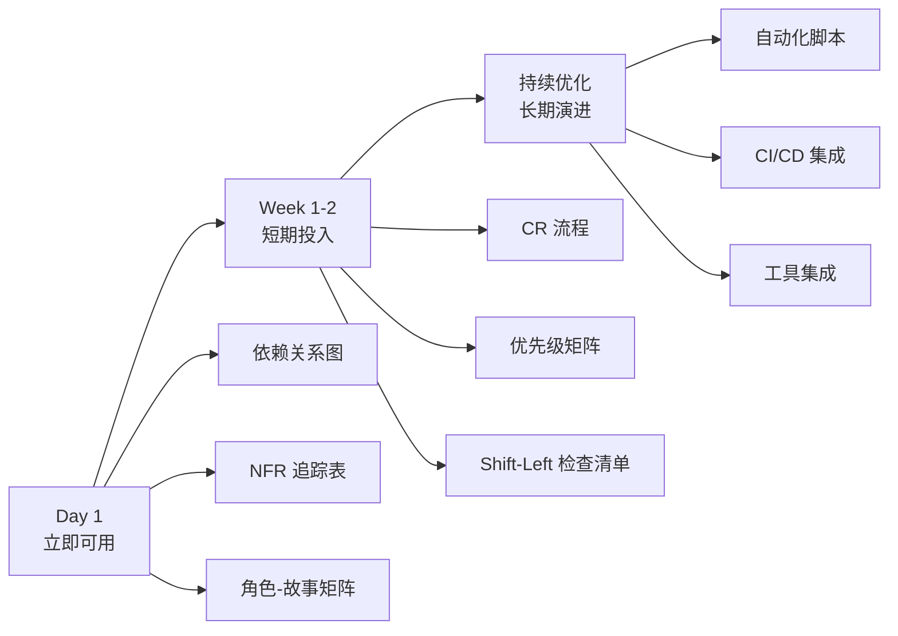

# PRD 增强功能实施路线图（v1.8+）

> **目标读者**：项目经理、技术 Lead、决策者
> **文档定位**：提供 PRD v1.8 增强功能的实施路线图、时间规划与项目管理建议
> **详细操作指南**：请参考 [PRD-WRITER-EXPERT.playbook.md](../AgentRoles/Handbooks/PRD-WRITER-EXPERT.playbook.md) §8

---

## 🚀 三阶段实施路线图



---

## 📋 Phase 1: 立即可用（Day 1）

**推荐优先级**：⭐⭐⭐（项目启动时必须引入）

### 1.1 依赖关系图 — 可视化需求网络

**目标**：识别关键路径与循环依赖，优化排期
**关键工具**：
- 模块内依赖：`/docs/prd-modules/{domain}/dependency-graph.md`
- 跨模块依赖：`/docs/data/global-dependency-graph.md`
- 在线预览：[Mermaid Live Editor](https://mermaid.live/)

**预期成果**：
- ✅ 依赖关系图完成
- ✅ 识别 1-3 条关键路径
- ✅ 发现 0-2 处循环依赖（需修正）

**投入时间**：2-3 小时

---

### 1.2 NFR 追踪表 — 性能安全可量化

**目标**：将抽象的非功能需求量化，确保可验证
**关键工具**：
- 模块级 NFR：`/docs/prd-modules/{domain}/nfr-tracking.md`
- 验证工具：Lighthouse CI（性能）、OWASP ZAP（安全）、APM 监控（可用性）

**预期成果**：
- ✅ 识别 10-20 个核心 NFR
- ✅ 每个 NFR 有明确目标值和验证方式
- ✅ 发布 Gate 与 NFR 联动

**投入时间**：3-4 小时

---

### 1.3 角色-故事矩阵 — 验证覆盖完整性

**目标**：发现"孤儿角色"与权限冲突
**关键工具**：`/docs/data/persona-story-matrix.md`

**预期成果**：
- ✅ 矩阵覆盖所有 Story 和角色
- ✅ 识别 0-2 个孤儿角色
- ✅ 发现 0-3 处权限冲突

**投入时间**：2 小时

---

## 📈 Phase 2: 短期投入（Week 1-2）

**推荐优先级**：⭐⭐（项目复杂度高时引入）

### 2.1 变更请求（CR）流程 — 结构化变更管理

**目标**：追踪需求变更影响范围，多专家审批
**关键工具**：
- CR 模板：`/docs/data/change-requests/CR-TEMPLATE.md`
- 审批流程：Draft → Under Review → Approved → Implemented → Closed

**预期成果**：
- ✅ 完成 3-5 个 CR 闭环
- ✅ 平均审批周期 < 3 天（High 优先级）
- ✅ 变更影响分析准确率 > 90%

**投入时间**：1 周（含培训）

---

### 2.2 优先级矩阵 — 量化决策

**目标**：科学分配资源，发现被低估的高依赖 Story
**关键工具**：
- 模块级优先级：`/docs/prd-modules/{domain}/priority-matrix.md`
- 评分模型：业务价值、用户影响面、技术风险、依赖权重

**预期成果**：
- ✅ 所有 Story 完成量化评分
- ✅ 识别 5-10 个"被低估"的高依赖 Story
- ✅ 优先级冲突减少 50%

**投入时间**：1 周

---

### 2.3 Shift-Left 检查清单 — 前置验证

**目标**：减少后期返工，提升 PRD 评审通过率
**关键工具**：
- 检查清单：Playbook §8（技术可行性、数据合规性、依赖风险、验收标准、业务目标对齐、角色覆盖、NFR 明确、文档完整性）
- 技术评审会：PRD 70% 完成时组织（1 小时）

**预期成果**：
- ✅ 前置发现 5-10 个潜在问题
- ✅ 后期返工率降低 30%
- ✅ PRD 评审一次通过率 > 80%

**投入时间**：1-2 周

---

## 🔧 Phase 3: 持续优化（长期）

**推荐优先级**：⭐（自动化与工具集成，ROI 显现于规模化阶段）

### 3.1 自动化脚本开发

**推荐脚本**（优先级排序）：

#### 高优先级
```bash
# 1. PRD 完整性检查
npm run prd:lint

# 2. 依赖冲突检查（循环依赖）
npm run prd:check-dependency-cycles

# 3. NFR 达标检查
npm run nfr:check-compliance
```

#### 中优先级
```bash
# 4. 优先级冲突检测
npm run priority:check-conflicts

# 5. 角色覆盖率报告
npm run persona:coverage-report

# 6. 业务目标覆盖率检查
npm run goal:coverage-report
```

**投入时间**：2-4 周（分阶段实施）

---

### 3.2 CI/CD 集成

**目标**：自动化质量门禁，PR 触发检查
**关键工具**：GitHub Actions、GitLab CI

**示例流程**：
1. PRD 完整性检查
2. 依赖冲突检查
3. 生成预检报告

**投入时间**：1 周

---

### 3.3 工具集成

**推荐工具**：

| 工具 | 用途 | 优先级 | 集成难度 |
|------|------|--------|---------|
| **Jira** | 需求管理、CR 流程 | 高 | 中 |
| **Notion** | 文档协作、矩阵维护 | 高 | 低 |
| **Confluence** | 知识库、ADR 管理 | 中 | 低 |
| **Miro** | 依赖关系图可视化 | 中 | 低 |
| **Lighthouse CI** | NFR 性能验证 | 高 | 中 |
| **SonarQube** | NFR 代码质量 | 中 | 高 |

**投入时间**：按需选择，2-4 周

---

## 📊 效果评估指标（项目管理 KPI）

### 过程指标

| 指标 | 基准值 | 目标值 | 实际值 | 达成率 |
|------|--------|--------|--------|--------|
| PRD 评审一次通过率 | 50% | 80% | - | - |
| 需求返工率 | 40% | < 15% | - | - |
| 变更影响分析准确率 | 60% | > 90% | - | - |
| 前置发现的技术风险数 | 2/项目 | > 5/项目 | - | - |

### 结果指标

| 指标 | 基准值 | 目标值 | 实际值 | 达成率 |
|------|--------|--------|--------|--------|
| PRD 编写效率 | 5 天/模块 | 3 天/模块 | - | - |
| 架构设计返工次数 | 3 次/项目 | < 1 次/项目 | - | - |
| 测试用例覆盖率 | 70% | > 90% | - | - |
| NFR 达标率（发布时） | 60% | > 95% | - | - |

---

## 🎯 成功要素

### ✅ 组织层面
- [ ] 高层支持（分配专职时间）
- [ ] 跨团队协作（PRD/ARCH/TDD/QA）
- [ ] 定期复盘（每 Sprint 回顾）

### ✅ 人员层面
- [ ] PRD 专家培训（Shift-Left 理念）
- [ ] 全员认知（理解新流程价值）
- [ ] 激励机制（质量指标与绩效挂钩）

### ✅ 工具层面
- [ ] 模板易用性（降低使用门槛）
- [ ] 自动化程度（减少手工劳动）
- [ ] 工具集成度（无缝衔接现有流程）

---

## 🚦 决策建议（按项目规模）

### 小型项目（< 20 Story）
**推荐引入**：
- ✅ NFR 追踪表（性能安全必需）
- ✅ Shift-Left 检查清单（前置验证）

**不推荐**：依赖图、矩阵、CR 流程（成本 > 收益）

---

### 中型项目（20-50 Story）
**推荐引入**：
- ✅ Phase 1 全部（立即可用）
- ✅ Phase 2 选择性引入（CR 流程、优先级矩阵）

**可选**：自动化脚本（中优先级）

---

### 大型项目（50+ Story / 3+ 业务域）
**推荐引入**：
- ✅ Phase 1 + Phase 2 全部
- ✅ Phase 3 自动化脚本（高优先级）
- ✅ CI/CD 集成

**强制要求**：模块化 PRD（参考 Playbook §7）

---

## ❓ 常见问题

### Q1: 团队抵触新流程怎么办？
**A**: 分三步推进：
1. 小范围试点（1-2 个模块），展示效果
2. 量化收益（返工率降低、评审通过率提升）
3. 渐进式推广（先立即可用，再短期投入）

### Q2: 没有专职 PRD 专家怎么办？
**A**:
- 可由项目经理（PM）兼任
- 使用自动化脚本降低工作量
- 优先实施"立即可用"的 3 个功能

### Q3: 如何平衡文档完整性与敏捷迭代？
**A**:
- 采用"最小必需"原则：只维护发布 Gate 要求的文档
- 使用模板加速编写（如 CR 模板、NFR 表）
- 工具自动化（如依赖图生成脚本）

---

## 📚 参考资料

- **[PRD-WRITER-EXPERT.playbook.md](../AgentRoles/Handbooks/PRD-WRITER-EXPERT.playbook.md)** — 详细操作步骤与检查清单
- **[AGENTS.md](../AGENTS.md)** — 五阶段工作流总览
- **[STRUCTURE-GUIDE.md](prd-modules/STRUCTURE-GUIDE.md)** — 模块内部结构指南
- **[data/README.md](data/README.md)** — 全局数据目录说明
- **[变更请求管理](data/change-requests/README.md)** — CR 流程详解
- **[依赖关系图指南](data/dependency-graph-README.md)** — Mermaid 使用说明

---

## 🔄 版本记录

| 版本 | 日期 | 说明 |
|------|------|------|
| v2.0 | 2025-11-05 | 重构为路线图形式，精简详细步骤，聚焦项目管理 |
| v1.0 | 2025-11-01 | 初版快速实施指南 |

---

> **文档定位说明**：本路线图聚焦"做什么"与"何时做"（项目管理视角），详细的"如何做"（操作步骤）请参考 Playbook。如有疑问或改进建议，请在团队复盘会议中提出。
