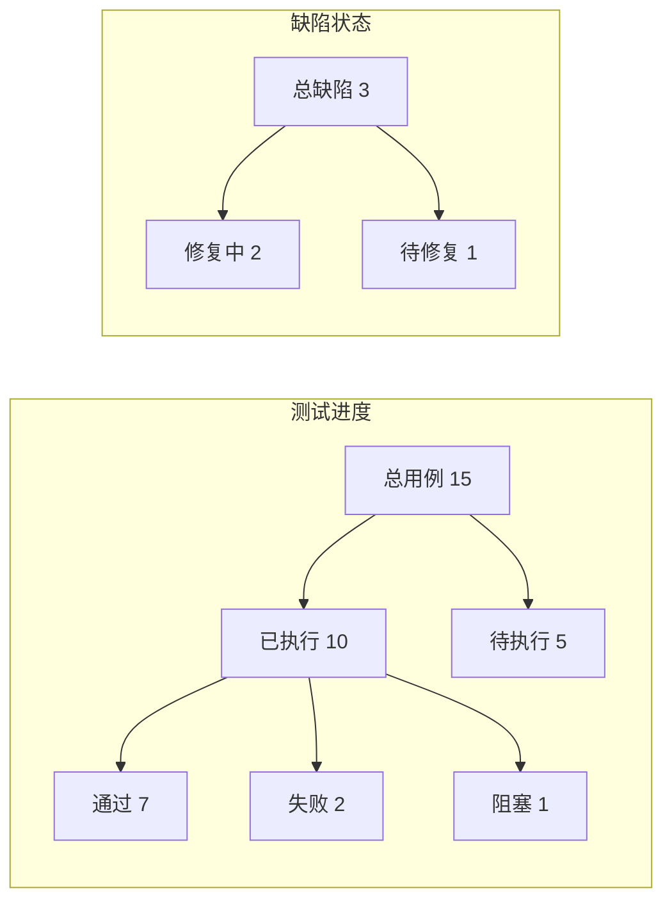

# 测试与质量保证文档

> **说明**：本文档由 **QA 专家（QA-TESTING-EXPERT）** 负责维护，用于记录测试策略、执行结果、缺陷管理与发布建议。
> **激活命令**：`/qa`、`[[ACTIVATE: QA]]`、"作为 QA 专家"
> **快捷命令**：`/qa verify`（快速聚焦验收项）、`/ship staging`、`/ship prod`、`/cd staging`、`/cd prod`

---

## 使用说明

### 小型项目（单一文件）
如果项目满足以下条件，直接在本文件中完成所有测试计划与执行记录：
- 测试用例总数 < 100 条
- 单一功能域或简单业务逻辑
- 单人或小团队测试
- 测试类型简单（主要为功能测试 + 冒烟测试）
- 文档预计 < 1000 行

**操作方式**：
- 直接在下方「小型项目模板」章节填写测试策略、用例、缺陷、执行记录
- 所有测试用例按优先级组织在单一表格中
- 缺陷列表在同一文件内维护

### 大型项目（主从结构）
如果项目满足以下**任一条件**，建议采用模块化测试计划：
- 主 QA 文档 > 1000 行
- 测试用例总数 > 100 条
- 涉及多种测试类型（功能、集成、性能、安全、兼容性、压测等）
- 业务域边界明确（3+ 个独立功能模块）
- 测试周期长（> 2 周）或多轮回归
- 多团队并行测试

**迁移步骤**：
1. **保留主文档**（本文件）作为总纲与索引（< 500 行）
2. **创建模块目录**：`/docs/qa-modules/` 目录（如不存在）
3. **拆分功能域测试计划**：在 `/docs/qa-modules/{domain}.md` 中创建各功能域的详细测试计划（参考 [qa-modules/README.md](qa-modules/README.md)）
4. **注册模块清单**：在 `/docs/qa-modules/README.md` 的模块索引表格中登记所有模块

**拆分原则**：
- **按功能域拆分**（user-management、payment-system、notification 等）
- **对齐 PRD/ARCH/TASK 模块**（保持一致的功能域边界）
- **ID 命名约定**：
  - 测试用例：`TC-{MODULE}-{序号}`（如 `TC-USER-001`）
  - 缺陷：`BUG-{MODULE}-{序号}`（如 `BUG-PAY-001`）
- **追溯矩阵集中管理**：在 `/docs/data/traceability-matrix.md` 统一维护 Story → AC → Test Case 的映射关系

---

## 小型项目模板

### 1. 测试概览

**项目名称**：[项目名称]
**版本**：v0.1.0
**测试负责人**：@qa-lead
**测试周期**：YYYY-MM-DD ~ YYYY-MM-DD
**测试目标**：验证核心功能符合 PRD 需求，确保系统稳定性与安全性

**测试范围**：
- ✅ 用户注册与登录（Story #U1）
- ✅ 数据管理功能（Story #U2）
- ✅ 权限控制（Story #U3）
- ⏸️ 性能测试（待定）
- ❌ 国际化（暂不测试）

**测试环境**：
| 环境 | 用途 | URL | 数据库 | 版本 |
|------|------|-----|--------|------|
| Dev | 开发自测 | http://dev.example.com | dev_db | main 分支 |
| Staging | 预发测试 | https://staging.example.com | staging_db | release/v0.1.0 |
| Production | 生产环境 | https://prod.example.com | prod_db | v0.1.0 |

---

### 2. 测试策略

**测试类型覆盖**：
- **功能测试**（必需）：验证核心业务逻辑与 AC 符合性
- **集成测试**（必需）：验证前后端/服务间接口正确性
- **系统测试**（必需）：端到端业务流程验证
- **冒烟测试**（必需）：关键路径快速验证（每次部署后执行）
- **回归测试**（必需）：确保新功能未破坏已有功能
- **性能测试**（按需）：并发负载、响应时间、资源占用
- **安全测试**（按需）：认证授权、SQL 注入、XSS、CSRF
- **兼容性测试**（按需）：浏览器/设备/操作系统兼容性

**测试优先级**：
- **P0**（阻塞级）：核心业务路径，失败则阻塞发布
- **P1**（严重）：重要功能，失败需修复后发布
- **P2**（一般）：次要功能，可推迟修复
- **P3**（轻微）：优化项，不影响发布

**非功能质量指标**（来自 PRD/ARCH）：
- **性能**：API 响应时间 < 200ms（P95）
- **可靠性**：系统可用性 > 99.9%
- **安全**：所有 API 需要身份验证
- **可扩展性**：支持 10,000 并发用户

**风险与缓解**：
| 风险 ID | 风险描述 | 影响 | 概率 | 缓解措施 | 负责人 |
|---------|---------|------|------|---------|--------|
| R-QA-001 | 测试环境不稳定 | 高 | 中 | 提前 2 天部署 staging 环境 | @qa-lead |
| R-QA-002 | 第三方服务依赖不可用 | 中 | 低 | 准备 Mock 数据与 Stub 服务 | @dev-backend |
| R-QA-003 | 数据迁移失败导致测试阻塞 | 高 | 低 | 预演迁移脚本，准备回滚方案 | @dba |

---

### 3. 测试用例

#### 3.1 功能测试用例

| 用例 ID | 模块 | 用例名称 | 优先级 | AC 引用 | 前置条件 | 测试步骤 | 预期结果 | 状态 | 执行人 | 执行日期 | 备注 |
|---------|------|---------|--------|---------|---------|---------|---------|------|--------|---------|------|
| TC-001 | 用户管理 | 用户注册成功 | P0 | AC#U1-1 | 数据库可用 | 1. 访问注册页面<br/>2. 输入有效邮箱+密码<br/>3. 点击注册按钮 | 返回 200，用户记录创建成功，收到欢迎邮件 | ✅ 通过 | @qa-tester-1 | 2025-11-05 | - |
| TC-002 | 用户管理 | 邮箱格式验证 | P1 | AC#U1-2 | - | 1. 输入无效邮箱（如 "test"）<br/>2. 点击注册按钮 | 返回 400，提示"邮箱格式不正确" | ✅ 通过 | @qa-tester-1 | 2025-11-05 | - |
| TC-003 | 用户管理 | 用户登录成功 | P0 | AC#U1-3 | 用户已注册 | 1. 输入正确邮箱+密码<br/>2. 点击登录按钮 | 返回 200，跳转到首页，显示用户名 | ✅ 通过 | @qa-tester-2 | 2025-11-05 | - |
| TC-004 | 用户管理 | 登录失败（密码错误） | P1 | AC#U1-4 | 用户已注册 | 1. 输入正确邮箱+错误密码<br/>2. 点击登录按钮 | 返回 401，提示"邮箱或密码错误" | ✅ 通过 | @qa-tester-2 | 2025-11-05 | - |
| TC-005 | 权限控制 | 未登录访问受保护资源 | P0 | AC#U3-1 | 用户未登录 | 1. 直接访问 /dashboard | 返回 401，跳转到登录页 | 🔄 执行中 | @qa-tester-1 | - | - |
| TC-006 | 数据管理 | 创建数据记录 | P1 | AC#U2-1 | 用户已登录 | 1. 点击"新建"按钮<br/>2. 填写表单<br/>3. 点击"保存" | 返回 201，记录创建成功，列表显示新记录 | 📝 待执行 | @qa-tester-2 | - | - |

**状态标识**：
- 📝 **待执行**：已设计但未执行
- 🔄 **执行中**：正在测试
- ✅ **通过**：测试通过
- ❌ **失败**：测试失败（需记录缺陷）
- ⏸️ **阻塞**：因依赖或缺陷无法执行
- 🚫 **跳过**：因需求变更或其他原因跳过

#### 3.2 集成测试用例

| 用例 ID | 集成点 | 用例名称 | 优先级 | 前置条件 | 测试步骤 | 预期结果 | 状态 | 执行人 | 执行日期 | 备注 |
|---------|--------|---------|--------|---------|---------|---------|------|--------|---------|------|
| TC-INT-001 | 前端 → 后端 API | 注册接口调用 | P0 | 后端服务运行 | 1. 前端调用 POST /api/users<br/>2. 传递有效 payload | 返回 201，响应包含 user_id | ✅ 通过 | @qa-tester-1 | 2025-11-05 | - |
| TC-INT-002 | 后端 → 数据库 | 用户记录持久化 | P0 | 数据库可用 | 1. 调用注册 API<br/>2. 查询数据库 users 表 | 记录存在，字段正确 | ✅ 通过 | @qa-tester-1 | 2025-11-05 | - |
| TC-INT-003 | 后端 → 邮件服务 | 欢迎邮件发送 | P1 | SMTP 服务可用 | 1. 注册新用户<br/>2. 检查邮箱 | 收到欢迎邮件，内容正确 | 📝 待执行 | @qa-tester-2 | - | 需配置测试邮箱 |

#### 3.3 系统测试用例（E2E）

| 用例 ID | 业务流程 | 用例名称 | 优先级 | 测试步骤 | 预期结果 | 状态 | 执行人 | 执行日期 | 备注 |
|---------|---------|---------|--------|---------|---------|------|--------|---------|------|
| TC-E2E-001 | 用户注册 → 登录 → 创建数据 | 完整用户生命周期 | P0 | 1. 注册新用户<br/>2. 登录系统<br/>3. 创建数据记录<br/>4. 查看记录列表 | 所有步骤成功，数据一致 | ✅ 通过 | @qa-tester-1 | 2025-11-05 | - |
| TC-E2E-002 | 权限验证流程 | 未授权用户访问受保护资源 | P1 | 1. 以普通用户登录<br/>2. 尝试访问管理员页面 | 返回 403，禁止访问 | 📝 待执行 | @qa-tester-2 | - | - |

#### 3.4 性能测试用例（按需）

| 用例 ID | 测试场景 | 目标指标 | 测试工具 | 负载配置 | 测试结果 | 状态 | 执行人 | 执行日期 | 备注 |
|---------|---------|---------|---------|---------|---------|------|--------|---------|------|
| TC-PERF-001 | 登录 API 响应时间 | P95 < 200ms | Apache JMeter | 100 并发，持续 5 分钟 | P95 = 180ms | ✅ 通过 | @qa-perf | 2025-11-05 | - |
| TC-PERF-002 | 数据查询并发 | TPS > 500 | k6 | 500 并发，持续 10 分钟 | TPS = 520，错误率 0.1% | ✅ 通过 | @qa-perf | 2025-11-05 | - |
| TC-PERF-003 | 系统稳定性测试 | 无内存泄漏 | Grafana + Prometheus | 100 并发，持续 2 小时 | 内存使用稳定，无泄漏 | 📝 待执行 | @qa-perf | - | - |

#### 3.5 安全测试用例（按需）

| 用例 ID | 测试场景 | 攻击类型 | 测试步骤 | 预期结果 | 状态 | 执行人 | 执行日期 | 备注 |
|---------|---------|---------|---------|---------|------|--------|---------|------|
| TC-SEC-001 | SQL 注入防护 | SQL Injection | 1. 在登录表单输入 `' OR '1'='1`<br/>2. 提交请求 | 返回 400 或 401，未绕过认证 | ✅ 通过 | @qa-security | 2025-11-05 | - |
| TC-SEC-002 | XSS 防护 | Cross-Site Scripting | 1. 在输入框输入 `<script>alert('XSS')</script>`<br/>2. 保存并显示 | 内容被转义，未执行脚本 | ✅ 通过 | @qa-security | 2025-11-05 | - |
| TC-SEC-003 | CSRF 防护 | Cross-Site Request Forgery | 1. 构造跨站请求<br/>2. 尝试修改用户数据 | 返回 403，拒绝请求 | 📝 待执行 | @qa-security | - | 需配置 CSRF token |
| TC-SEC-004 | 权限提升漏洞 | Privilege Escalation | 1. 以普通用户登录<br/>2. 尝试调用管理员 API | 返回 403，禁止访问 | 📝 待执行 | @qa-security | - | - |

---

### 4. 缺陷列表

| 缺陷 ID | 模块 | 标题 | 严重程度 | 优先级 | 状态 | 发现日期 | 修复版本 | 负责人 | 描述 | 复现步骤 | 预期结果 | 实际结果 | 影响分析 | 建议回流阶段 |
|---------|------|------|---------|--------|------|---------|---------|--------|------|---------|---------|---------|---------|--------------|
| BUG-001 | 用户管理 | 注册时邮箱重复未校验 | 严重 | P0 | 🔄 修复中 | 2025-11-04 | v0.1.1 | @dev-backend-1 | 用户可使用已存在的邮箱重复注册 | 1. 注册用户 A（test@example.com）<br/>2. 再次注册用户 B（test@example.com） | 返回 409，提示"邮箱已存在" | 返回 201，创建了重复记录 | 数据一致性问题，可能导致登录混乱 | TDD（代码修复） |
| BUG-002 | 权限控制 | 未登录用户可访问 /api/users | 阻塞 | P0 | 🔄 修复中 | 2025-11-05 | v0.1.1 | @dev-backend-2 | API 缺少认证中间件 | 1. 清除登录状态<br/>2. 调用 GET /api/users | 返回 401 | 返回 200，返回所有用户列表 | 安全漏洞，敏感数据泄露 | TDD（代码修复） |
| BUG-003 | 前端 | 登录失败时错误提示不明确 | 一般 | P2 | 📝 待修复 | 2025-11-05 | v0.2.0 | @dev-frontend-1 | 错误提示显示为"请求失败"，未区分具体原因 | 1. 输入错误密码登录 | 显示"邮箱或密码错误" | 显示"请求失败" | 用户体验问题，非阻塞 | TDD（前端优化） |

**严重程度定义**：
- **阻塞**（Blocker）：核心功能完全不可用，必须修复才能发布
- **严重**（Critical）：重要功能异常，严重影响用户体验
- **一般**（Major）：功能可用但有缺陷，需要修复
- **轻微**（Minor）：界面或文案问题，影响较小
- **建议**（Trivial）：优化建议，不影响功能

**状态标识**：
- 📝 **待修复**（Open）：已确认但未开始修复
- 🔄 **修复中**（In Progress）：正在修复
- ✅ **已修复**（Fixed）：已修复并合并，待验证
- 🔍 **待验证**（Pending Verification）：已修复，待 QA 回归验证
- ✅ **已关闭**（Closed）：已验证通过，关闭
- ❌ **无法复现**（Cannot Reproduce）：无法复现，关闭
- 🚫 **不修复**（Won't Fix）：需求变更或其他原因不修复

---

### 5. 测试执行记录

#### 5.1 测试轮次

| 轮次 | 时间段 | 测试类型 | 执行人 | 通过率 | 新增缺陷 | 状态 | 备注 |
|------|--------|---------|--------|--------|---------|------|------|
| Round 1 | 2025-11-04 ~ 2025-11-05 | 功能测试 + 集成测试 | @qa-tester-1, @qa-tester-2 | 70% (7/10) | 3 个（2 个 P0） | ✅ 已完成 | 阻塞缺陷需优先修复 |
| Round 2 | 2025-11-06 ~ 2025-11-07 | 回归测试 + 系统测试 | @qa-tester-1, @qa-tester-2 | - | - | 📝 待开始 | 等待 BUG-001/002 修复 |
| Round 3 | 2025-11-08 | 冒烟测试 + 性能测试 | @qa-tester-1, @qa-perf | - | - | 📝 待开始 | 发布前最终验证 |

#### 5.2 每日执行日志

**2025-11-05 执行记录**：
- **执行人**：@qa-tester-1, @qa-tester-2
- **执行用例**：TC-001 ~ TC-006, TC-INT-001, TC-INT-002
- **通过**：7 条
- **失败**：2 条（TC-005 因 BUG-002 失败，TC-006 因依赖未就绪阻塞）
- **新增缺陷**：BUG-002（阻塞），BUG-003（一般）
- **环境问题**：Staging 环境数据库连接不稳定（已恢复）

**2025-11-04 执行记录**：
- **执行人**：@qa-tester-1
- **执行用例**：TC-001 ~ TC-004
- **通过**：3 条
- **失败**：1 条（TC-002 因 BUG-001 失败）
- **新增缺陷**：BUG-001（严重）

---

### 6. 测试指标与统计

#### 6.1 用例统计

| 指标 | 数值 | 说明 |
|------|------|------|
| **总用例数** | 15 | 功能 6 + 集成 3 + E2E 2 + 性能 3 + 安全 4 |
| **已执行** | 10 | 66.7% |
| **通过** | 7 | 70% 通过率（基于已执行） |
| **失败** | 2 | 20% |
| **阻塞** | 1 | 10% |
| **待执行** | 5 | 33.3% |

#### 6.2 缺陷统计

| 指标 | 数值 | 说明 |
|------|------|------|
| **总缺陷数** | 3 | - |
| **阻塞** | 1 | BUG-002 |
| **严重** | 1 | BUG-001 |
| **一般** | 1 | BUG-003 |
| **已修复** | 0 | - |
| **修复中** | 2 | BUG-001, BUG-002 |
| **待修复** | 1 | BUG-003 |
| **缺陷密度** | 3 / 15 = 0.2 | 每用例缺陷数 |

#### 6.3 质量趋势图（Mermaid）



#### 6.4 覆盖率矩阵（追溯）

| Story ID | AC ID | Test Case ID | 状态 | 缺陷 ID |
|---------|-------|--------------|------|---------|
| Story #U1 | AC#U1-1 | TC-001 | ✅ 通过 | - |
| Story #U1 | AC#U1-2 | TC-002 | ❌ 失败 | BUG-001 |
| Story #U1 | AC#U1-3 | TC-003 | ✅ 通过 | - |
| Story #U1 | AC#U1-4 | TC-004 | ✅ 通过 | - |
| Story #U3 | AC#U3-1 | TC-005 | ❌ 失败 | BUG-002（阻塞） |
| Story #U2 | AC#U2-1 | TC-006 | ⏸️ 阻塞 | - |

**详细追溯矩阵**：参见 [/docs/data/traceability-matrix.md](data/traceability-matrix.md)

---

### 7. 发布建议

**当前版本**：v0.1.0
**测试结论日期**：2025-11-05

#### 7.1 发布评估

**发布建议**：**🚫 不建议发布**（❌ 存在 2 个阻塞/严重缺陷）

**关键问题**：
1. **BUG-002（阻塞）**：未登录用户可访问敏感 API，存在安全漏洞 → **必须修复**
2. **BUG-001（严重）**：邮箱重复注册导致数据一致性问题 → **必须修复**
3. **BUG-003（一般）**：错误提示不明确，用户体验问题 → **可推迟至 v0.2.0**

**发布前提条件**：
- ✅ 所有 **P0 阻塞缺陷** 关闭并通过回归验证
- ✅ **P1 严重缺陷** 至少修复 90%
- ✅ 功能测试通过率 ≥ 95%
- ✅ CI 状态全绿
- ✅ `CHANGELOG.md` 与产物一致
- ✅ 必要的审批与回滚方案就绪

**下一步行动**：
1. 通知 TDD 团队优先修复 BUG-001、BUG-002（预计 1 天）
2. 修复完成后执行 Round 2 回归测试（预计 2 天）
3. 若回归通过，执行 Round 3 冒烟测试 + 性能测试（预计 1 天）
4. 满足发布条件后，执行 `/ship staging` 部署预发环境
5. Staging 环境验证通过后，申请 `/ship prod` 发布生产

#### 7.2 已知风险

| 风险 ID | 风险描述 | 影响 | 缓解措施 | 负责人 |
|---------|---------|------|---------|--------|
| R-REL-001 | BUG-002 修复可能引入新问题 | 中 | 要求 TDD 团队补充单元测试 | @dev-backend-2 |
| R-REL-002 | 性能测试未完成 | 低 | 在生产环境启用监控，发现问题立即回滚 | @qa-perf |
| R-REL-003 | 邮件服务依赖第三方 API | 中 | 准备降级方案（异步队列 + 重试机制） | @dev-backend-1 |

#### 7.3 发布检查清单

**部署前检查**（执行 `/ship staging` 或 `/cd staging` 前）：
- [ ] 所有阻塞缺陷已关闭
- [ ] CI 状态全绿（Lint + Typecheck + Test + Build）
- [ ] `CHANGELOG.md` 更新完整
- [ ] 数据库迁移脚本已准备（含回滚脚本）
- [ ] 环境变量已配置（Staging/Production）
- [ ] 必要的审批已完成（如需）
- [ ] 回滚方案已就绪

**生产发布检查**（执行 `/ship prod` 或 `/cd prod` 前）：
- [ ] Staging 环境验证通过
- [ ] 所有 P0/P1 缺陷已关闭
- [ ] 性能测试通过
- [ ] 安全测试通过
- [ ] 产品负责人批准发布
- [ ] 通知运维团队（发布窗口、回滚预案）
- [ ] 监控告警已配置（Grafana/Prometheus/Sentry）

**发布后验证**（冒烟测试）：
- [ ] 关键业务流程验证（注册、登录、核心功能）
- [ ] 监控指标正常（错误率、响应时间、资源占用）
- [ ] 用户反馈无重大问题
- [ ] 日志无异常错误

---

### 8. 环境与配置信息

**测试环境清单**：
- **Dev**：http://dev.example.com（开发自测）
- **Staging**：https://staging.example.com（预发测试）
- **Production**：https://prod.example.com（生产环境）

**测试数据**：
- **测试账号**：test@example.com / Test@1234
- **Mock 数据**：参见 `/tests/fixtures/`
- **数据库 Seed**：`npm run db:seed:test`

**测试工具**：
- **功能测试**：Postman、Playwright
- **性能测试**：Apache JMeter、k6
- **安全测试**：OWASP ZAP、Burp Suite
- **监控**：Grafana + Prometheus + Sentry

---

### 9. 参考文档

- **PRD**：[/docs/PRD.md](PRD.md)
- **架构设计**：[/docs/ARCHITECTURE.md](ARCHITECTURE.md)
- **任务计划**：[/docs/TASK.md](TASK.md)
- **变更记录**：[/CHANGELOG.md](../CHANGELOG.md)
- **追溯矩阵**：[/docs/data/traceability-matrix.md](data/traceability-matrix.md)
- **测试模板与规范**：[/AgentRoles/Handbooks/QA-TESTING-EXPERT.playbook.md](../AgentRoles/Handbooks/QA-TESTING-EXPERT.playbook.md)

---

## 大型项目模板（参考）

> **说明**：当项目满足拆分条件时，请迁移到主从结构。下方仅为参考模板。

### 主 QA 文档（/docs/QA.md，< 500 行）

```markdown
# 测试与质量保证文档（总纲）

**版本**：v0.1.0
**测试负责人**：@qa-lead
**测试周期**：YYYY-MM-DD ~ YYYY-MM-DD

---

## 1. 测试概览

**项目名称**：[项目名称]
**测试目标**：验证多功能域系统符合 PRD 需求，确保高质量交付

**测试范围**（功能域）：
- ✅ 用户管理（User Management）
- ✅ 支付系统（Payment System）
- ✅ 通知服务（Notification Service）
- ⏸️ 数据分析（Data Analytics）

---

## 2. 模块测试计划索引

| 模块名称 | 负责团队 | 文档链接 | 状态 | 测试通过率 | 缺陷数 | 最后更新 |
|---------|---------|---------|------|-----------|-------|---------|
| 用户管理 | @team-backend | [user-management.md](qa-modules/user-management.md) | ✅ 测试完成 | 95% (38/40) | 2 个（P1） | 2025-11-05 |
| 支付系统 | @team-payment | [payment-system.md](qa-modules/payment-system.md) | 🔄 测试中 | 70% (21/30) | 5 个（2 个 P0） | 2025-11-05 |
| 通知服务 | @team-notification | [notification-service.md](qa-modules/notification-service.md) | 📝 待开始 | - | - | - |
| （补充其他模块）| - | - | - | - | - | - |

详见 [qa-modules/README.md](qa-modules/README.md)

---

## 3. 全局测试策略

**测试类型覆盖**：
- **功能测试**：各模块独立验证（详见模块文档）
- **集成测试**：跨模块接口验证（如用户管理 → 支付系统）
- **系统测试**：端到端业务流程（如注册 → 登录 → 下单 → 支付）
- **性能测试**：并发负载、响应时间、资源占用
- **安全测试**：认证授权、数据加密、漏洞扫描

**非功能质量指标**（全局）：
- **性能**：API 响应时间 P95 < 200ms
- **可靠性**：系统可用性 > 99.9%
- **安全**：所有 API 需要身份验证
- **可扩展性**：支持 100,000 并发用户

---

## 4. 跨模块集成测试

| 用例 ID | 集成场景 | 涉及模块 | 状态 | 负责人 | 备注 |
|---------|---------|---------|------|--------|------|
| TC-INT-G-001 | 用户注册后自动创建支付账户 | 用户管理 + 支付系统 | ✅ 通过 | @qa-integration | - |
| TC-INT-G-002 | 支付成功后发送通知 | 支付系统 + 通知服务 | 🔄 执行中 | @qa-integration | - |
| TC-INT-G-003 | 用户删除后清理支付记录 | 用户管理 + 支付系统 | 📝 待执行 | @qa-integration | 需确认数据保留策略 |

---

## 5. 全局缺陷汇总

| 严重程度 | 总数 | 已修复 | 修复中 | 待修复 |
|---------|------|--------|--------|--------|
| 阻塞 | 2 | 0 | 2 | 0 |
| 严重 | 3 | 1 | 2 | 0 |
| 一般 | 4 | 2 | 1 | 1 |
| 轻微 | 1 | 0 | 0 | 1 |
| **合计** | **10** | **3** | **5** | **2** |

**阻塞缺陷详情**（必须修复）：
- **BUG-PAY-002**（支付系统）：支付网关超时未处理，导致订单状态不一致 → 修复中（@dev-payment）
- **BUG-USER-005**（用户管理）：权限验证绕过漏洞 → 修复中（@dev-backend）

---

## 6. 全局测试指标

| 指标 | 数值 | 目标 | 说明 |
|------|------|------|------|
| **总用例数** | 120 | - | 跨所有模块 |
| **已执行** | 80 | 100% | 66.7% 完成 |
| **通过率** | 75% (60/80) | ≥ 95% | **未达标** |
| **总缺陷数** | 10 | - | - |
| **阻塞缺陷** | 2 | 0 | **阻塞发布** |
| **缺陷密度** | 10 / 120 = 0.083 | < 0.1 | ✅ 达标 |

---

## 7. 发布建议

**当前版本**：v0.1.0
**测试结论**：**🚫 不建议发布**

**阻塞原因**：
1. 存在 2 个阻塞缺陷（BUG-PAY-002, BUG-USER-005）
2. 测试通过率 75%，未达到 95% 目标
3. 性能测试未完成（等待修复后执行）

**发布路径**：
1. 修复 2 个阻塞缺陷（预计 2 天）
2. 执行回归测试（预计 3 天）
3. 性能测试与安全测试（预计 2 天）
4. 若通过率 ≥ 95%，申请发布

---

## 8. 参考文档

- **追溯矩阵**：[/docs/data/traceability-matrix.md](data/traceability-matrix.md)
- **模块清单**：[/docs/qa-modules/README.md](qa-modules/README.md)
- **PRD 总纲**：[/docs/PRD.md](PRD.md)
- **架构总纲**：[/docs/ARCHITECTURE.md](ARCHITECTURE.md)
- **任务总纲**：[/docs/TASK.md](TASK.md)
```

---

### 模块 QA 文档（/docs/qa-modules/{domain}.md）

**示例**：`/docs/qa-modules/user-management.md`（详细结构参考 [qa-modules/README.md](qa-modules/README.md)）

**标准章节**：
1. **模块概述**（测试范围、负责人、版本）
2. **测试策略**（测试类型、优先级）
3. **测试用例**（功能、集成、E2E、性能、安全）
4. **缺陷列表**（模块内缺陷）
5. **测试执行记录**（每日日志、轮次统计）
6. **测试指标**（通过率、缺陷密度）
7. **外部依赖**（跨模块依赖）
8. **风险与缓解**
9. **参考文档**

---

## 变更历史

| 版本 | 日期 | 变更内容 | 变更人 |
|------|------|---------|--------|
| v0.1.0 | 2025-11-05 | 初始版本（小型项目模板） | @qa-lead |
| - | - | - | - |
