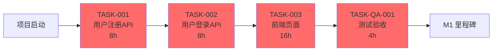
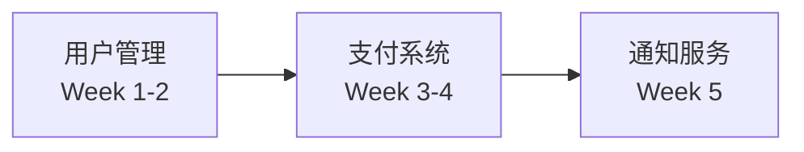

# 任务计划（WBS）

> **说明**：本文档由 TASK 专家编写和维护。对于小型项目（< 20 个任务），使用单文件结构即可；对于大型项目，采用主从结构（主任务文档 + 模块任务文档），详见 [task-modules/README.md](task-modules/README.md)。

**日期**：YYYY-MM-DD
**版本**：v0
**状态**：📝 待启动

---

## 使用说明

### 小型项目（单一文件）
如果项目满足以下条件，直接在本文件中完成所有任务计划：
- 工作包（WBS）< 50 个
- 单一团队开发
- 项目周期 < 6 个月
- 跨模块依赖简单（< 10 个依赖关系）
- 文档预计 < 1000 行

### 大型项目（主从结构）
如果项目满足以下**任一条件**，建议采用模块化任务文档：
- 主任务文档 > 1000 行
- 工作包（WBS）> 50 个
- 存在 3+ 个并行开发流（多团队/多模块）
- 项目周期 > 6 个月
- 跨模块依赖复杂（10+ 个依赖关系）

**迁移步骤**：
1. 保持本文件作为主任务文档（总纲与索引，< 500 行）
2. 在 `/docs/task-modules/` 创建功能域子任务文档（如 `user-management.md`、`payment-system.md`）
3. 在 [task-modules/README.md](task-modules/README.md) 中注册所有模块
4. 使用下方的"大型项目模板"替换本文件内容

---

## 小型项目模板（当前使用）

### 1. 项目概述

#### 1.1 总体目标
- **业务目标**：（项目要实现的业务价值）
- **关键交付物**：（核心功能/模块）
- **整体时间线**：YYYY-MM-DD ~ YYYY-MM-DD（预计 X 周）

#### 1.2 团队资源
| 角色 | 人员 | 分配工时 | 备注 |
|------|------|---------|------|
| 产品经理 | @pm | 10% | 需求澄清 |
| 技术负责人 | @tech-lead | 30% | 架构设计+Code Review |
| 后端开发 | @dev-backend-1, @dev-backend-2 | 100% | 全职投入 |
| 前端开发 | @dev-frontend-1 | 100% | 全职投入 |
| 测试工程师 | @qa-engineer-1 | 100% | 全职投入 |

---

### 2. 里程碑

| 里程碑 ID | 里程碑名称 | 目标日期 | 交付物 | 验收标准 | 状态 |
|----------|----------|---------|--------|---------|------|
| M1 | MVP 发布 | YYYY-MM-DD | 核心功能上线（用户注册/登录/基础功能） | 完成 P0 任务，无阻塞缺陷 | 📝 待完成 |
| M2 | 功能增强 | YYYY-MM-DD | 增值功能上线（支付、通知） | 完成 P1 任务，P0 缺陷全关闭 | 📝 待完成 |
| M3 | 正式发布 | YYYY-MM-DD | 通过 QA 验证，生产环境部署 | QA_VALIDATED 勾选，无 P0/P1 缺陷 | 📝 待完成 |

---

### 3. WBS（工作分解结构）

#### 3.1 任务列表

| 任务 ID | 任务名称 | 负责人 | 预估工时 | 优先级 | 前置任务 | 状态 | 完成日期 | 产出 |
|---------|---------|--------|---------|--------|---------|------|---------|------|
| TASK-001 | 用户注册后端 API | @dev-backend-1 | 8h | P0 | ARCH§接口 | 📝 待开始 | - | PR#123 |
| TASK-002 | 用户登录后端 API | @dev-backend-1 | 8h | P0 | TASK-001 | 📝 待开始 | - | PR#124 |
| TASK-003 | 用户管理前端页面 | @dev-frontend-1 | 16h | P0 | TASK-002 | 📝 待开始 | - | PR#125 |
| （补充其他任务）| - | - | - | - | - | - | - | - |

**状态标识**：
- 📝 **待开始**：已规划但未开始
- 🚀 **进行中**：正在开发
- 🔄 **已提交**：已提交 PR/MR
- ✅ **已完成**：已合并并通过 QA
- ⏸️ **暂停**：因依赖或资源问题暂停
- ❌ **已取消**：需求变更取消

**优先级标识**：
- **P0**：核心功能，必须完成（阻塞发布）
- **P1**：重要功能，优先完成
- **P2**：增值功能，资源允许时完成
- **P3**：可选功能，可延后到下版本

#### 3.2 任务详细说明

##### TASK-001: 用户注册后端 API

**描述**：
实现用户注册接口，支持邮箱+密码注册，包含参数校验、密码加密存储、邮件验证。

**输入**：
- PRD 需求：US-001（用户注册）
- 架构设计：ARCHITECTURE.md §2.4 接口视图

**输出**：
- 代码：`/backend/src/api/user/register.ts`
- 测试：单元测试覆盖率 > 80%
- 文档：API 文档更新（Swagger/OpenAPI）

**验收标准**：
- [ ] 功能实现符合 PRD 验收条件（AC-001-01, AC-001-02）
- [ ] 测试覆盖率达标（单元测试 > 80%，集成测试关键路径）
- [ ] 代码评审通过（至少 1 个 Approval）
- [ ] 文档同步更新（API 文档、CHANGELOG）

**风险**：
- 邮件服务不稳定（概率：中，影响：中） — 缓解措施：增加重试机制+降级方案

**依赖**：
- ARCH§接口视图（定义 API 契约）
- DB 迁移完成（users 表已创建）

---

### 4. 依赖关系矩阵

#### 4.1 内部依赖（本项目内）

| 任务 | 依赖任务 | 依赖类型 | 说明 |
|------|---------|---------|------|
| TASK-002 | TASK-001 | FS（Finish-to-Start） | 登录依赖注册功能完成 |
| TASK-003 | TASK-002 | FS（Finish-to-Start） | 前端依赖后端 API 完成 |

**依赖类型说明**：
- **FS（Finish-to-Start）**：前置任务完成后才能开始（最常见）
- **SS（Start-to-Start）**：前置任务开始后才能开始（如并行设计）
- **FF（Finish-to-Finish）**：前置任务完成后才能完成（如联调测试）
- **SF（Start-to-Finish）**：前置任务开始后才能完成（罕见，如服务迁移）

#### 4.2 外部依赖（第三方服务/团队）

| 本项目任务 | 依赖方 | 依赖内容 | 阻塞影响 | 协调方式 | 状态 |
|-----------|--------|---------|---------|---------|------|
| TASK-010 | 第三方支付 | 支付网关 API 接入 | 高 | 每周对接会 | 🔄 进行中 |
| TASK-015 | 设计团队 | UI 设计稿交付 | 中 | Slack #design | ✅ 已完成 |

---

### 5. 关键路径（CPM）

**关键路径分析**：
```
TASK-001 (8h) → TASK-002 (8h) → TASK-003 (16h) → TASK-QA-001 (4h) = 36h (关键路径)
```

**关键路径可视化**：


**关键路径任务**：TASK-001, TASK-002, TASK-003, TASK-QA-001（总计 36h）
**非关键路径**：TASK-004（8h 浮动时间）

---

### 6. 资源分配与时间线

#### 6.1 甘特图（文本格式）

```
Week 1  | TASK-001 ████████ (后端)
        | TASK-004        ████████ (设计)
Week 2  | TASK-002        ████████ (后端)
        | TASK-003               ████████████████ (前端)
Week 3  | TASK-003               ████████████████ (前端)
        | TASK-QA-001                           ████ (QA)
```

*（推荐使用 Mermaid 或 PlantUML 生成可视化甘特图）*

#### 6.2 人力负载分析

| 人员 | Week 1 | Week 2 | Week 3 | 总工时 | 负载率 |
|------|--------|--------|--------|--------|--------|
| @dev-backend-1 | 8h | 8h | - | 16h | 40% |
| @dev-frontend-1 | - | 16h | 16h | 32h | 80% |
| @qa-engineer-1 | - | - | 4h | 4h | 10% |

---

### 7. 风险登记

| 风险 ID | 风险描述 | 概率 | 影响 | 风险等级 | 缓解措施 | 应急预案 | 负责人 | 状态 |
|---------|---------|------|------|---------|---------|---------|--------|------|
| RISK-001 | 第三方 API 不稳定 | 中 | 高 | 🔴 高 | 增加重试机制+降级方案 | 使用 Mock 数据 | @tech-lead | 🔄 监控中 |
| RISK-002 | 团队成员请假 | 低 | 中 | 🟡 中 | 任务交叉培训 | 调配备用人员 | @pm | 🟢 已缓解 |
| RISK-003 | 需求变更频繁 | 中 | 高 | 🔴 高 | 冻结需求（里程碑前 1 周） | 延后到下版本 | @pm | 🔄 监控中 |

**风险等级**：
- 🔴 **高**：概率高 & 影响高（需立即制定缓解措施）
- 🟡 **中**：概率中 & 影响中（需监控并准备预案）
- 🟢 **低**：概率低 & 影响低（仅记录，不主动干预）

---

### 8. 测试映射（需求追溯）

| Story ID | Story Title | AC ID | 任务 ID | Test Case ID | 测试状态 |
|----------|-------------|-------|---------|--------------|---------|
| US-001 | 用户注册 | AC-001-01 | TASK-001 | TC-REG-001 | 📝 待测试 |
| US-001 | 用户注册 | AC-001-02 | TASK-001 | TC-REG-002 | 📝 待测试 |
| US-002 | 用户登录 | AC-002-01 | TASK-002 | TC-LOGIN-001 | 📝 待测试 |

详见 [data/traceability-matrix.md](data/traceability-matrix.md)

---

### 9. DB 任务（固定表头）

> **说明**：如涉及数据库变更，请在此段固定表头下补全最小项，遵循 **Expand → Migrate/Backfill → Contract** 流程。

| ID | 类别 | 目标 | Backfill方案 | 双写观察指标 | 对账规则 | 回滚方案 | Owner | 估时 | 依赖 |
|---|---|---|---|---|---|---|---|---|---|
| T-DB-001 | Expand | 新增 users 表（id, email, password_hash, created_at） | - | - | - | DROP TABLE | @dev-backend-1 | 1h | ARCH§数据视图 |
| T-DB-002 | Migrate | 回填历史用户数据（如有） | 批量脚本 | 差异率<0.1%/48h | 抽样对账（100条） | 回滚脚本 | @dev-backend-1 | 2h | T-DB-001 |
| T-DB-003 | Contract | 移除旧 user_info 表（如有） | - | - | - | 回滚预案（保留 7 天） | @dev-backend-1 | 0.5h | 稳定观察 1 周 |

**DB 迁移注意事项**：
- **Expand**：新增字段/表/索引，不删除旧结构（向后兼容）
- **Migrate/Backfill**：数据回填与双写观察（确保新旧数据一致）
- **Contract**：移除旧结构（确认新结构稳定后再执行）
- **回滚方案**：所有 DB 迁移必须可回滚（保留旧结构 7 天）

---

### 10. 沟通与协作

#### 10.1 同步机制
- **站会**：每日 10:00 AM（15 分钟）
- **周会**：每周五 3:00 PM（30 分钟）
- **文档协作**：本文件实时更新，重大变更通知 @all

#### 10.2 问题升级路径
- **日常问题**：Slack #dev-team（即时响应）
- **阻塞问题**：24h 内上报给 @pm 或 @tech-lead
- **跨团队协调**：通过邮件或会议解决

---

### 11. 变更记录

| 版本 | 日期 | 变更类型 | 变更描述 | 负责人 |
|------|------|---------|---------|--------|
| v0 | YYYY-MM-DD | 新增 | 初始版本 | @pm |
| v0.1 | YYYY-MM-DD | 调整 | 增加 TASK-005，调整 M2 里程碑日期 | @pm |

---

### 12. 相关文档

- **PRD 文档**：[PRD.md](PRD.md)
- **架构文档**：[ARCHITECTURE.md](ARCHITECTURE.md)
- **测试计划**：[QA.md](QA.md)
- **追溯矩阵**：[data/traceability-matrix.md](data/traceability-matrix.md)
- **目录规范**：[CONVENTIONS.md](CONVENTIONS.md)

---

## 大型项目模板（迁移时使用）

当项目发展为大型项目时，将本文件替换为以下内容，并在 `/docs/task-modules/` 创建详细模块文档。

```markdown
# 任务计划（总纲）

> **说明**：本文档是大型项目的主任务文档，作为总纲与索引。详细任务计划见各功能域模块文档。

**日期**：YYYY-MM-DD
**版本**：v1.0
**状态**：🚀 执行中

---

## 1. 项目概述
- **总体目标**：（项目要实现的业务价值）
- **关键交付物**：（核心功能/模块）
- **整体时间线**：YYYY-MM-DD ~ YYYY-MM-DD（预计 X 个月）

---

## 2. 模块任务索引

| 模块名称 | 负责团队 | 文档链接 | 状态 | 最后更新 |
|---------|---------|---------|------|---------|
| 用户管理 | @team-backend | [user-management.md](task-modules/user-management.md) | ✅ 已确认 | YYYY-MM-DD |
| 支付系统 | @team-payment | [payment-system.md](task-modules/payment-system.md) | 🔄 进行中 | YYYY-MM-DD |
| 通知服务 | @team-notification | [notification-service.md](task-modules/notification-service.md) | 📝 待启动 | - |
| （补充其他模块）| - | - | - | - |

详见 [task-modules/README.md](task-modules/README.md)

---

## 3. 全局里程碑（跨模块）

| 里程碑 ID | 里程碑名称 | 目标日期 | 交付物 | 验收标准 | 状态 |
|----------|----------|---------|--------|---------|------|
| M1 | MVP 发布 | YYYY-MM-DD | 核心功能上线（用户+支付） | 完成所有 P0 任务 | 📝 待完成 |
| M2 | Beta 测试 | YYYY-MM-DD | 功能增强（通知+分析） | 完成所有 P1 任务 | 📝 待完成 |
| M3 | 正式发布 | YYYY-MM-DD | 生产环境部署 | QA_VALIDATED 勾选 | 📝 待完成 |

---

## 4. 跨模块依赖关系



**依赖说明**：
- **用户管理 → 支付系统**：支付功能依赖用户身份验证完成
- **支付系统 → 通知服务**：通知功能依赖支付事件触发

---

## 5. 全局关键路径（CPM）

**关键路径**：用户管理（2周） → 支付系统（2周） → 通知服务（1周） → QA验收（1周） = 6周

**影响里程碑的关键任务**：
- TASK-USER-001~005（用户管理核心功能）
- TASK-PAY-001~008（支付系统核心功能）
- TASK-NOTIF-001~003（通知服务核心功能）

---

## 6. 全局风险与缓解

| 风险类型 | 风险描述 | 影响范围 | 缓解措施 | 负责人 | 状态 |
|---------|---------|---------|---------|--------|------|
| 资源风险 | 多团队资源冲突 | 全项目 | 每周资源协调会 | @pm | 🔄 监控中 |
| 技术风险 | 跨模块集成复杂 | 支付+通知 | 提前定义接口契约 | @tech-lead | 🟢 已缓解 |
| 进度风险 | 关键路径任务延期 | M1 里程碑 | 增加备用资源 | @pm | 🔄 监控中 |

---

## 7. 变更记录

| 版本 | 日期 | 变更类型 | 变更描述 | 负责人 |
|------|------|---------|---------|--------|
| v1.0 | YYYY-MM-DD | 重构 | 从单一文件迁移到模块化任务计划 | @pm |

---

## 8. 相关文档

- **PRD 文档**：[PRD.md](PRD.md)
- **架构文档**：[ARCHITECTURE.md](ARCHITECTURE.md)
- **测试计划**：[QA.md](QA.md)
- **任务模块索引**：[task-modules/README.md](task-modules/README.md)
- **追溯矩阵**：[data/traceability-matrix.md](data/traceability-matrix.md)
- **目录规范**：[CONVENTIONS.md](CONVENTIONS.md)
```

---

> **维护说明**：
> - 本文档由 TASK 专家在 Phase 3 创建并持续维护
> - 任务状态与完成日期需实时更新，重大变更需同步通知 TDD 专家与 QA 专家
> - 若项目发展为大型项目，参考 [task-modules/README.md](task-modules/README.md) 进行模块化拆分
