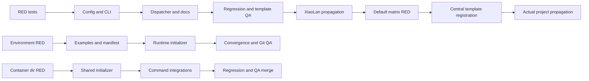

# PromptsEngineering 模板任务计划（总纲）

日期：2026-08-26　版本：v1.2

## 1. 项目概述

按测试先行顺序交付模板客户端/服务端通用命令面与环境文件首次初始化。环境文件模块先冻结首次创建、Git ignore、dry-run 和已有内容保护行为，再实现 manifest 与初始化器，最后执行传播收敛验收。

## 2. 模块任务索引

| 模块名称 | 负责团队 | 文档链接 | 状态 | 关键依赖 | 数据/接口追溯 | 最后更新 |
| --- | --- | --- | --- | --- | --- | --- |
| 模板命令面 | @template-maintainers | [TASK.md](task-modules/template-command-surface/TASK.md) | 🔄 容器目录 TDD 通过 / 待 QA | 现有 Agent CLI、dispatcher、config loader | [story-task-mapping.md](data/story-task-mapping.md) | 2026-08-26 |
| 环境文件初始化 | @template-maintainers | [TASK.md](task-modules/environment-file-initialization/TASK.md) | 🔄 TDD 完成 / 待 QA | template manifest、update-template、gitignore merge | [story-task-mapping.md](data/story-task-mapping.md) | 2026-08-24 |

## 3. 全局里程碑（跨模块）

| 里程碑 ID | 里程碑名称 | 目标日期 | 交付物 | 验收标准 | 状态 |
| --- | --- | --- | --- | --- | --- |
| M1-PROTOCOL | 治理与 RED | 2026-08-23 | PRD/ARCH/TASK、失败测试 | 文档 Gate 通过、测试因缺失能力失败 | ✅ 已规划 |
| M2-TEMPLATE | 模板实现与 QA | 2026-08-23 | 配置、路由、执行器、文档、测试 | 完整默认矩阵定向与相关全量回归通过 | 🚧 修复中 |
| M3-PROPAGATE | 实际项目传播 | 2026-08-23 | 模板 apply 与稀疏配置继承验收 | dry-run/apply/convergence、32 项命令解析、项目规则不被覆盖 | 📝 待开始 |
| M4-ENVINIT | 六环境文件初始化 | 2026-08-24 | example sources、manifest、初始化器、测试 | 首次创建六文件、实际文件 ignored、第二次 apply 零变化 | 🔄 待 QA |
| M5-CONTAINER-DIRS | 容器目录按需初始化 | 2026-08-26 | 共享初始化器、调用点、测试与文档 | 缺失目录自动创建、重复幂等、非法目标阻断、只读无副作用 | 🔄 TDD 通过 / 待 QA |

## 4. 跨模块依赖关系

两个模块无业务运行时依赖，均依赖模板 apply 生命周期；环境文件模块可独立交付。详见 [task-dependency-matrix.md](data/task-dependency-matrix.md)。

## 5. 全局关键路径（CPM）

```mermaid
flowchart LR
  T1[RED tests] --> T2[Config and CLI]
  T2 --> T3[Dispatcher and docs]
  T3 --> T4[Regression and template QA]
  T4 --> T5[XiaoLan propagation]
  T5 --> T6[Default matrix RED]
  T6 --> T7[Central template registration]
  T7 --> T8[Actual project propagation]
  E1[Environment RED] --> E2[Examples and manifest]
  E2 --> E3[Runtime initializer]
  E3 --> E4[Convergence and Git QA]
  C1[Container dir RED] --> C2[Shared initializer]
  C2 --> C3[Command integrations]
  C3 --> C4[Regression and QA merge]
```

关键路径无可并行跳过项；模板源未合并前不得向目标项目应用未确定版本。

## 6. 全局风险与缓解

- profile 回退风险：用负向测试阻断。
- aliases 扩张风险：只在模板配置登记规范 alias，不向目标 package scripts 强制注入实现。
- 双仓传播风险：分别建立任务状态、worktree、QA 和主分支一致性证明。
- 数据库任务：不适用，无 schema 或数据迁移。
- 环境文件覆盖风险：实际文件使用 exclusive create，sentinel 回归验证已有内容不变。
- 容器目录副作用边界：解析 API 保持纯函数，写入命令显式声明目录；文件/符号链接占位必须 fail closed。

## 7. 模块同步与相关文档

- [模块 TASK](task-modules/template-command-surface/TASK.md)
- [环境文件初始化 TASK](task-modules/environment-file-initialization/TASK.md)
- [PRD](prd-modules/template-command-surface/PRD.md)
- [ARCH](arch-modules/template-command-surface/ARCH.md)
- [Traceability](data/traceability-matrix.md)
- [Story → Task](data/story-task-mapping.md)

模块状态、里程碑和 Gate 结果由模块 TASK 维护并在 TDD/QA 阶段同步。
