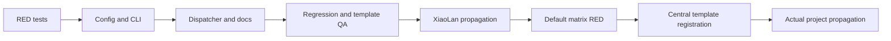

# 模板命令面任务计划（总纲）

日期：2026-08-23　版本：v1.0

## 1. 项目概述

按测试先行顺序交付模板客户端/服务端通用命令面：先冻结负向行为，再实现配置与路由；针对实际项目更新后默认矩阵缺失的问题，补充完整枚举契约、中央模板默认值和真实项目传播验收。

## 2. 模块任务索引

| 模块名称 | 负责团队 | 文档链接 | 状态 | 关键依赖 | 数据/接口追溯 | 最后更新 |
| --- | --- | --- | --- | --- | --- | --- |
| 模板命令面 | @template-maintainers | [TASK.md](task-modules/template-command-surface/TASK.md) | ✅ 已规划 | 现有 Agent CLI、dispatcher、config loader | [story-task-mapping.md](data/story-task-mapping.md) | 2026-08-23 |

## 3. 全局里程碑（跨模块）

| 里程碑 ID | 里程碑名称 | 目标日期 | 交付物 | 验收标准 | 状态 |
| --- | --- | --- | --- | --- | --- |
| M1-PROTOCOL | 治理与 RED | 2026-08-23 | PRD/ARCH/TASK、失败测试 | 文档 Gate 通过、测试因缺失能力失败 | ✅ 已规划 |
| M2-TEMPLATE | 模板实现与 QA | 2026-08-23 | 配置、路由、执行器、文档、测试 | 完整默认矩阵定向与相关全量回归通过 | 🚧 修复中 |
| M3-PROPAGATE | 实际项目传播 | 2026-08-23 | 模板 apply 与稀疏配置继承验收 | dry-run/apply/convergence、32 项命令解析、项目规则不被覆盖 | 📝 待开始 |

## 4. 跨模块依赖关系

只有一个模块，无跨模块依赖；外部交付顺序为模板源合并后再传播目标项目。详见 [task-dependency-matrix.md](data/task-dependency-matrix.md)。

## 5. 全局关键路径（CPM）

```mermaid
flowchart LR
  T1[RED tests] --> T2[Config and CLI]
  T2 --> T3[Dispatcher and docs]
  T3 --> T4[Regression and template QA]
  T4 --> T5[XiaoLan propagation]
  T5 --> T6[Default matrix RED]
  T6 --> T7[Central template registration]
  T7 --> T8[Actual project propagation]
```

关键路径无可并行跳过项；模板源未合并前不得向目标项目应用未确定版本。

## 6. 全局风险与缓解

- profile 回退风险：用负向测试阻断。
- aliases 扩张风险：只在模板配置登记规范 alias，不向目标 package scripts 强制注入实现。
- 双仓传播风险：分别建立任务状态、worktree、QA 和主分支一致性证明。
- 数据库任务：不适用，无 schema 或数据迁移。

## 7. 模块同步与相关文档

- [模块 TASK](task-modules/template-command-surface/TASK.md)
- [PRD](prd-modules/template-command-surface/PRD.md)
- [ARCH](arch-modules/template-command-surface/ARCH.md)
- [Traceability](data/traceability-matrix.md)
- [Story → Task](data/story-task-mapping.md)

模块状态、里程碑和 Gate 结果由模块 TASK 维护并在 TDD/QA 阶段同步。
