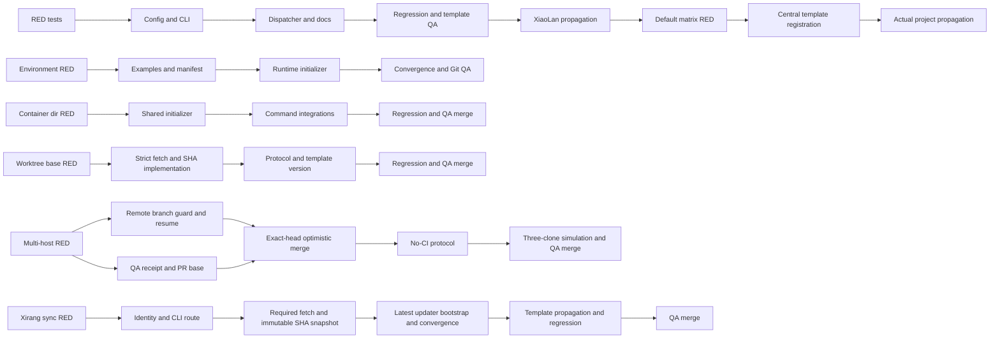

# 息壤（Xirang）模板任务计划（总纲）

日期：2026-09-06　版本：v1.6

## 1. 项目概述

按测试先行顺序交付模板客户端/服务端通用命令面、环境文件首次初始化、无 GitHub CI 的多电脑同权 Git 协作保护，以及息壤模板从实际项目发起的官方源自更新。新增范围保持现有 apply 所有权和本地治理入口，以固定 GitHub 源、required fetch、不可变 SHA 快照和最新应用器自举补齐模板来源链。

## 2. 模块任务索引

架构按需获取：[模块 TASK](task-modules/architecture-on-demand/TASK.md)，依赖固定来源缓存与所有权引擎，3.4 功能验收通过（2026-09-10）。

开源公共能力：[模块 TASK](task-modules/open-source-components/TASK.md)，与文件存储一起完成全组件组合验收和交付。

统一文件存储：[模块 TASK](task-modules/file-storage/TASK.md)，覆盖四适配、上传与元数据、消费者和升级验证。

多端 Monorepo 与 Prisma 的 3.2 验收通过，见 [模块 TASK](task-modules/monorepo-platform/TASK.md) 与 [QA](qa-modules/monorepo-platform/QA.md)，依赖架构能力包与所有权引擎。

| 模块名称 | 负责团队 | 文档链接 | 状态 | 关键依赖 | 数据/接口追溯 | 最后更新 |
| --- | --- | --- | --- | --- | --- | --- |
| 模板命令面 | @template-maintainers | [TASK.md](task-modules/template-command-surface/TASK.md) | ✅ 官方匿名获取回归通过 | Agent CLI、GitHub auth、template apply、worktree lifecycle、固定官方源 | [story-task-mapping.md](data/story-task-mapping.md) | 2026-09-06 |
| 环境文件初始化 | @template-maintainers | [TASK.md](task-modules/environment-file-initialization/TASK.md) | 兼容回归通过 / Go | template manifest、update-template、gitignore merge | [story-task-mapping.md](data/story-task-mapping.md) | 2026-09-11 |

## 3. 全局里程碑（跨模块）

| 里程碑 ID | 里程碑名称 | 目标日期 | 交付物 | 验收标准 | 状态 |
| --- | --- | --- | --- | --- | --- |
| M1-PROTOCOL | 治理与 RED | 2026-08-23 | PRD/ARCH/TASK、失败测试 | 文档 Gate 通过、测试因缺失能力失败 | ✅ 已规划 |
| M2-TEMPLATE | 模板实现与 QA | 2026-08-23 | 配置、路由、执行器、文档、测试 | 完整默认矩阵定向与相关全量回归通过 | ✅ 兼容回归通过 |
| M3-PROPAGATE | 实际项目传播 | 2026-08-23 | 模板 apply 与稀疏配置继承验收 | dry-run/apply/convergence、32 项命令解析、项目规则不被覆盖 | 消费者验证通过；小懒接入待项目验收 |
| M4-ENVINIT | 六环境文件初始化 | 2026-08-24 | example sources、manifest、初始化器、测试 | 首次创建六文件、实际文件 ignored、第二次 apply 零变化 | ✅ 兼容回归通过 |
| M5-CONTAINER-DIRS | 容器目录按需初始化 | 2026-08-26 | 共享初始化器、调用点、测试与文档 | 缺失目录自动创建、重复幂等、非法目标阻断、只读无副作用 | ✅ 兼容回归通过 |
| M6-WORKTREE-BASE | Worktree 最新远端基线 | 2026-09-01 | required fetch、固定 SHA 创建、显式 skip、测试与协议 | TC-CMDSURF-012~015、全量回归与 QA merge 通过 | ✅ 兼容回归通过 |
| M7-MULTI-HOST | 无 CI 多电脑同权 Git 安全 | 2026-09-05 | 远端恢复、QA 双 SHA 回执、精确合并、三 clone 模拟 | TC-CMDSURF-016~021、模板收敛与 QA merge 通过 | ✅ QA 验证通过 |
| M8-XIRANG-SYNC | 息壤官方模板自更新 | 2026-09-06 | 模板身份、自然语言路由、`template sync`、固定 SHA 自举与传播验证 | TC-CMDSURF-022~026、全量回归、目标副本收敛与 QA merge 通过 | ✅ QA 通过 |

既有命令面和环境能力的状态依据 [命令面 QA](qa-modules/template-command-surface/QA.md) 与 [环境 QA](qa-modules/environment-file-initialization/QA.md)。实际业务项目的接入验收单独记录，消费者回归不替代小懒或其他真实项目的同步与验收。

## 4. 跨模块依赖关系

两个模块无业务运行时依赖，均依赖模板 apply 生命周期；环境文件模块可独立交付。详见 [task-dependency-matrix.md](data/task-dependency-matrix.md)。

## 5. 全局关键路径（CPM）

```mermaid
flowchart LR
  T1[RED tests] --> T2[Config and CLI]
  T2 --> T3[Dispatcher and docs]
  T3 --> T4[Regression and template QA]
  T4 --> T5[XiaoLan propagation]
  T5 --> T6[Default matrix RED]
  T6 --> T7[Central template registration]
  T7 --> T8[Actual project propagation]
  E1[Environment RED] --> E2[Examples and manifest]
  E2 --> E3[Runtime initializer]
  E3 --> E4[Convergence and Git QA]
  C1[Container dir RED] --> C2[Shared initializer]
  C2 --> C3[Command integrations]
  C3 --> C4[Regression and QA merge]
  W1[Worktree base RED] --> W2[Strict fetch and SHA implementation]
  W2 --> W3[Protocol and template version]
  W3 --> W4[Regression and QA merge]
  H1[Multi-host RED] --> H2[Remote branch guard and resume]
  H1 --> H3[QA receipt and PR base]
  H2 --> H4[Exact-head optimistic merge]
  H3 --> H4
  H4 --> H5[No-CI protocol]
  H5 --> H6[Three-clone simulation and QA merge]
  X1[Xirang sync RED] --> X2[Identity and CLI route]
  X2 --> X3[Required fetch and immutable SHA snapshot]
  X3 --> X4[Latest updater bootstrap and convergence]
  X4 --> X5[Template propagation and regression]
  X5 --> X6[QA merge]
```

关键路径无可并行跳过项；模板源未合并前不得向目标项目应用未确定版本。

## 6. 全局风险与缓解

- profile 回退风险：用负向测试阻断。
- aliases 扩张风险：只在模板配置登记规范 alias，不向目标 package scripts 强制注入实现。
- 双仓传播风险：分别建立任务状态、worktree、QA 和主分支一致性证明。
- 数据库任务：不适用，无 schema 或数据迁移。
- 环境文件覆盖风险：实际文件使用 exclusive create，sentinel 回归验证已有内容不变。
- 容器目录副作用边界：解析 API 保持纯函数，写入命令显式声明目录；文件/符号链接占位必须 fail closed。
- Worktree 基线陈旧风险：默认 fetch 或远端 base 解析失败在创建副作用前阻断；显式 skip 才允许未验证缓存，且禁止任意 HEAD fallback。
- 多电脑同名分支风险：`worktree new` 在刷新远端后检测冲突，只有显式 `worktree resume` 可从远端固定 SHA 恢复。
- 本地 QA 回执陈旧风险：回执同时绑定配置主干与功能分支 SHA，合并前重新 fetch 并逐项比较。
- 同权主干更新竞态：GitHub 合并携带期望 head SHA；本地兜底只允许普通 push，非快进拒绝后必须重新同步和 QA。
- 无 GitHub CI 的信任边界：模板提供可审计的本地门禁，但不能阻止拥有仓库写权限的协作者绕过工具裸推；该边界由项目团队治理承担。
- 息壤来源陈旧风险：普通同步 required fetch 固定官方源并锁定 SHA，禁止项目内旧快照和缓存回退。
- 自举风险：轻量引导器只负责获取与校验，实际 apply 必须调用固定 SHA 快照中的最新更新器。
- 同步部分写入风险：来源、linked-worktree 预检和首次 dry-run 全部前置，应用后强制 convergence dry-run。

## 7. 模块同步与相关文档

- [模块 TASK](task-modules/template-command-surface/TASK.md)
- [环境文件初始化 TASK](task-modules/environment-file-initialization/TASK.md)
- [PRD](prd-modules/template-command-surface/PRD.md)
- [ARCH](arch-modules/template-command-surface/ARCH.md)
- [Traceability](data/traceability-matrix.md)
- [Story → Task](data/story-task-mapping.md)

模块状态、里程碑和 Gate 结果由模块 TASK 维护并在 TDD/QA 阶段同步。

## 应用架构平台任务

[模块任务与依赖](task-modules/architecture-platform/TASK.md)：TASK-ARCHPLAT-001~006，覆盖 US-ARCHPLAT-001~009。

公共 UI 3.1：TASK-ARCHPLAT-007～010 已通过 QA，覆盖 US-ARCHPLAT-010～014；组件闭包、公共交互和消费者升级证据见 [架构平台 QA](qa-modules/architecture-platform/QA.md)，详细任务由模块 TASK §4 维护。
