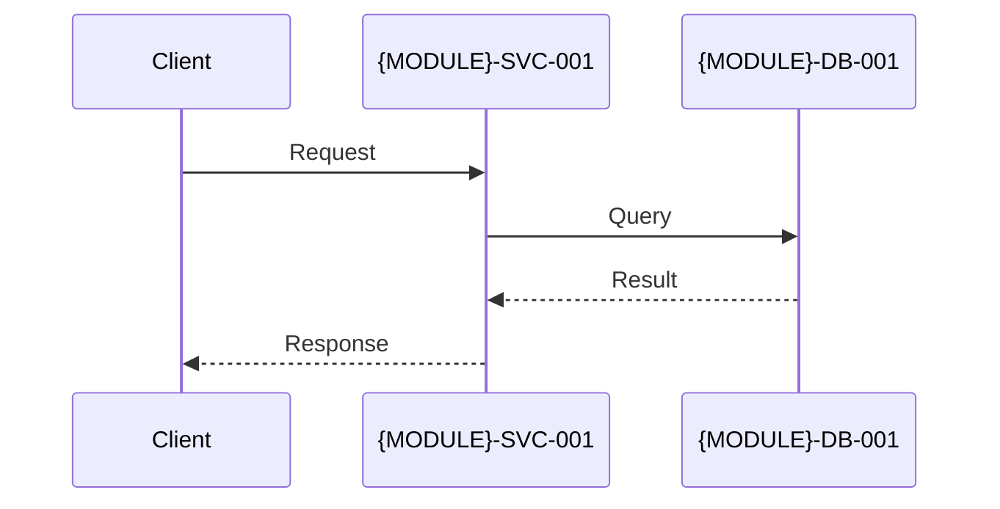
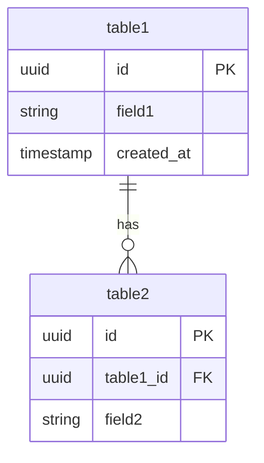

# 子模块 ARCH 模板

> 本文档整合了模块目录约定、模板结构、协作规范等要素，是模块化需求治理的唯一权威参考。
>
> **提醒**：ARCH 专家在评估拆分前，请先梳理本文件的目录与模板规范后再展开模块产出，生成的模块 ARCH 仍以 `{domain}/ARCH.md` 为主体，从本模板获取章节/支撑产物的定义。

## 1. 目录与命名规范

### 1.1 模块目录结构

```
/docs/
└── prd-modules/
    ├── MODULE-TEMPLATE.md # 本模板（权威）
    ├── module-list.md # 模板清单（由 ARCH 专家根据本文件 §3 模块清单模板 生成）
    └── {domain}/
        └── ARCH.md
```

### 1.2 命名与 ID

- **模块目录**：`{domain}` 使用 kebab-case 域名（如 `user-management`、`payment-system`），保持与主 PRD 功能域索引中的 ID 一致，便于追溯与自动化脚本查找。
- **模块文件**：`{domain}/ARCH.md`（目录固定，文件名统一为 `ARCH.md`），与主 ARCH 的结构保持同步，方便引用与导航。
- **Story ID**：`US-{MODULE}-{序号}`（例如 `US-USER-001`、`US-PAY-005`）
- **验收标准 ID**：`AC-{MODULE}-{Story序号}-{AC序号}`（例如 `AC-USER-001-01`）
- **测试用例 ID**：`TC-{MODULE}-{序号}`（例如 `TC-REG-001`）

#### 组件/服务 ID 命名
- **格式**：`{MODULE}-{TYPE}-{序号}`
- **TYPE 类型**：
  - `SVC`：服务（Service）
  - `DB`：数据库（Database）
  - `CACHE`：缓存（Cache）
  - `MQ`：消息队列（Message Queue）
  - `API`：API 端点（API Endpoint）
  - `JOB`：定时任务（Job）
- **示例**：
  - `USER-SVC-001`：用户管理服务
  - `USER-DB-001`：用户数据库
  - `PAY-SVC-001`：支付服务
  - `PAY-CACHE-001`：支付缓存

## 2. 模块清单模板

| 模块名称 | 文档路径 | 负责团队 | 核心服务 | 状态 | 最后更新 |
|---------|---------|---------|---------|------|---------|
| （示例）用户管理 | [ARCH.md](user-management/ARCH.md) | @team-auth | USER-SVC-001 | 📝 待启动 | - |
| （示例）支付系统 | [ARCH.md](payment-system/ARCH.md) | @team-payment | PAY-SVC-001 | 📝 待启动 | - |

**状态说明**：
- 📝 待启动
- 🔄 进行中
- ✅ 已确认
- ⚠️ 需更新


该表格仅作为模板，实际模块清单信息由 ARCH 专家根据以上表格生成到`module-list.md`，每次ARCH 模块变化都更新`module-list.md`。

## 3. 标准模块 ARCH 结构

`{domain}/ARCH.md` 根据模板创建，模板见本文件 § Appendix A: ARCH 模块模板。
- 每次更新需记录 `最后更新` 时间戳
- 重大变更需在主 ARCH 的“变更记录”章节同步，并补齐必要 ADR

## 4. 支撑产物说明
- **组件/服务清单**：记录模块可交付的服务、数据库、缓存、任务等组件，包含 ID、职责、技术栈、部署环境、SLO 与负责人，便于同步 `component-dependency-graph.md` 及大项目的组件依赖表。
- **接口契约矩阵**：集中描述模块提供与依赖的 API/gRPC/Event 接口（路径/方法、输入输出、错误码、版本、SLA、降级策略），并标明覆盖的 PRD Story ID，支持 `arch-prd-traceability.md` 与 TASK 的接口依赖核对。
- **数据资产表**：列出核心实体/表、字段摘要、索引策略、事务边界、容量/留存/增长、脱敏与备份流程，作为 `/docs/data/ERD.md` 与 `dictionary.md` 的数据原件。
- **风险与验证表**：列出架构验证前置中识别的技术、合规、性能、依赖风险（描述、影响、缓解、责任人、状态），并引用对应 ADR（`NNN-arch-{module}-{decision}.md`），确保 Gate review 有据可查。
- **Story/Component 追溯表**：将 Story ID、Component/Interface/Module 功能点、状态、是否已落地于 ARCH、需补充 ADR/接口等列出，方便 `arch-prd-traceability` 自动或手工比对差异。

## 5. 模块协作规范

### 5.1 跨模块依赖管理
- **同步调用**：REST/gRPC 在主 ARCH 跨模块依赖章节维护。
- **异步消息**：消息队列、事件总线等在主 ARCH 依赖章节说明。
- **接口契约**：模块接口在本章详细说明，主 ARCH 维护跨模块表格。

### 5.3 ADR 命名规范
- **模块级 ADR**：`/docs/adr/NNN-arch-{module}-{decision}.md`
  - 示例：`NNN-arch-user-oauth-provider-selection.md`
- **全局级 ADR**：`NNN-arch-global-{decision}.md`
  - 示例：`NNN-arch-global-api-gateway-selection.md`
- **ADR 版本变更记录**：`NNN-arch-global-{decision}.md`
  - 在`/docs/adr/CHANGELOG.md` 记录版本变更与影响范围。

## 6. 维护与文件时机

### 6.1 ARCH 专家职责
1. 以模块 PRD + 全局 ARCH 为输入生成模块 ARCH 文档（`{domain}/ARCH.md`），覆盖 C4/运行时/数据/接口/运维/安全视图，并在文档中嵌入本模板定义的模块级数据表格。
2. 维护模块索引（`module-list.md`）、组件/服务清单、接口矩阵、数据资产表等支撑产物，确保每个表与 `/docs/data/` 下的组件依赖图、ERD、追溯报告保持同步。
3. 捕捉模块级风险与 ADR，对重大架构取舍形成 `NNN-arch-{module}-{decision}.md` 并在主 ARCH 及模块文档中标注，便于 Gate 验证与回溯。
4. 与 PRD、TASK、QA 协同：核对 Stories → Components → ARCH 路径、对应 TASK 依赖/里程碑，支持 QA 的接口/数据/风险验证。

### 6.2 与其他专家协作
- **PRD**：确认模块边界、Story/AC 清单与质量属性，提供追溯数据；ARCH 反馈组件/接口 ID 以完善 `arch-prd-traceability`。
- **TASK**：提供模块级接口/数据/风险信息供任务拆解，及时更新依赖/关键路径表格。
- **TDD/QA**：共享接口契约、数据视图、验证表，协助形成闭环的 Story → Test Case → ARCH 追溯。

### 6.3 版本管理
- 模块 ARCH 文档每次更新需记录“最后更新”与责任人；新增/变更组件、接口、数据产物时同步更新相应 `/docs/data/` 文件。
- 重大架构变更必须产出 ADR（`NNN-arch-{module}-{decision}.md` 或 `NNN-arch-global-{decision}.md`）并在主 ARCH、模块文档及 `/docs/adr/CHANGELOG.md` 中说明影响。

### 6.4 文件创建与更新时机
- ARCH 模块化启动：在 PRD 确定拆分后立即创建 `{domain}/ARCH.md`、组件清单、接口契约与支持表格，且在 `module-list.md` 中注册。
- 开发前：完成数据资产、风险/验证、Story/Component 追溯表格，并同步 `arch-prd-traceability` 及依赖图；如发现未覆盖 Story/Component，立刻补充 ARCH 或 ADR。
- 持续迭代：每个 Sprint 更新接口契约、数据表与风险表，并在回写 Gate 中核对 `component-dependency-graph` 与 `ERD` 的一致性。

## 7. 自动化脚本

| 命令 | 功能 |
|------|------|
| `npm run prd:lint` | 校验主/模块 PRD 结构、Story/AC 格式、Given-When-Then 规范 |
| `npm run prd:check-dependency-cycles` | 检测模块与全局依赖循环、无效引用 |
| `npm run nfr:check-compliance` | 汇总模块 `nfr-tracking.md`，生成发布 Gate 报告（阻塞/警告/待验证） |

## 8. 相关资源

- `/AGENTS.md` — 角色路由规范与状态机
- `/docs/CONVENTIONS.md` — 目录与产物规范
- `/AgentRoles/Handbooks/PRD-WRITER-EXPERT.playbook.md` — 角色手册（包含核心流程与 Shift-Left 检查）
- `/docs/data/traceability-matrix.md` — 全局 Story → AC → Test Case 映射

---

## Appendix A: ARCH 模块模板
> 以下内容不允许 ARCH 专家自动修改，只能由人工修改。

# {功能域名称} - ARCH 模块

> **所属主 ARCH**: [ARCH.md](../ARCH.md)
> **负责团队**: @team-name
> **最后更新**: YYYY-MM-DD
> **状态**: 📝 草稿 / 🔄 进行中 / ✅ 已确认

---

## 1. 模块概述

**功能范围**：
- （列出本模块负责的业务能力）
- （引用核心用户故事，如 `US-{MODULE}-001`）

**负责团队**：
- @team-name
- 联系人：@tech-lead

**依赖的模块**：
| 被依赖模块 | 依赖类型 | 用途 | 降级策略 |
|-----------|---------|------|---------|
| （示例）通知服务 | 异步消息 | 邮件通知 | 失败时异步重试 3 次 |

---

## 2. C4 架构视图

### 2.1 Container 视图

```mermaid
graph TB
    MODULE_SVC[{MODULE}-SVC-001<br/>服务名称<br/>技术栈]
    MODULE_DB[({MODULE}-DB-001<br/>数据库<br/>PostgreSQL)]
    MODULE_CACHE[{MODULE}-CACHE-001<br/>缓存<br/>Redis]
    
    MODULE_SVC --> MODULE_DB
    MODULE_SVC --> MODULE_CACHE
```

**容器清单**：
| 容器 ID | 容器名称 | 技术栈 | 运行环境 | 说明 |
|---------|---------|--------|---------|------|
| {MODULE}-SVC-001 | 服务名称 | Node.js 18 + Express | ECS Fargate | REST API 服务 |
| {MODULE}-DB-001 | 数据库 | PostgreSQL 15 | RDS | 数据存储 |

### 2.2 Component 视图（可选）

```mermaid
graph TB
    subgraph MODULE_SVC["{MODULE}-SVC-001 服务"]
        Controller[Controller]
        Service[Service]
        Repository[Repository]
        
        Controller --> Service
        Service --> Repository
    end
    
    Repository --> MODULE_DB[({MODULE}-DB-001)]
```

---

## 3. 运行时视图

### 3.1 关键流程时序图



**流程说明**：
1. （步骤 1 说明）
2. （步骤 2 说明）

**异常处理**：
- （异常场景 1）
- （异常场景 2）

---

## 4. 数据视图

### 4.1 模块内实体关系



### 4.2 核心数据表

| 表名 | 用途 | 主键 | 重要字段 | 索引策略 |
|------|------|------|---------|---------|
| table1 | 数据表 1 | id (UUID) | field1, created_at | idx_field1 |

### 4.3 索引策略

**查询热点**：
- field1：（查询场景说明）

**复合索引**：
- (field1, field2)：（查询场景说明）

### 4.4 事务边界

**强一致性**：
- （场景 1）

**最终一致性**：
- （场景 2）

### 4.5 容量与保留

**预估数据量**：
- table1：10,000（第一年）

**增长率**：20% MoM

**数据保留**：
- table1：永久保留

### 4.6 备份与恢复

**备份频率**：每日全量备份
**RTO/RPO**：< 4h / < 1h

---

## 5. 接口视图

### 5.1 提供的接口（Exports）

**POST /api/v1/endpoint**

**Request**：
```json
{
  "field1": "value1"
}
```

**Response（Success）**：
```json
{
  "code": 0,
  "message": "成功",
  "data": {}
}
```

**Error Codes**：
| 错误码 | HTTP 状态 | 含义 | 处理建议 |
|--------|----------|------|---------|
| 1001 | 400 | 参数错误 | 检查请求参数 |

**幂等性**：是/否
**限流**：10 req/min/IP
**SLA**：P95 < 500ms，可用性 99.5%

### 5.2 依赖的接口（Imports）

| 接口名称 | 提供方 | 接口路径 | 用途 | 降级策略 |
|---------|--------|---------|------|---------|
| （示例）发送通知 | 通知模块 | POST /api/notifications | 发送通知 | 异步重试 3 次 |

### 5.3 事件订阅/发布（可选）

**发布的事件**：EventName

```typescript
interface EventNameEvent {
  eventId: string;
  eventName: "EventName";
  timestamp: string;
  version: "1.0";
  data: {};
}
```

---

## 6. 运维视图

### 6.1 部署拓扑

```mermaid
graph TB
    ALB[Load Balancer]
    ALB --> SVC_1[{MODULE}-SVC-001 实例 1]
    ALB --> SVC_2[{MODULE}-SVC-001 实例 2]
    SVC_1 --> DB[({MODULE}-DB-001)]
    SVC_2 --> DB
```

### 6.2 弹性策略

**水平扩展**：
- 最小实例数：2
- 最大实例数：10
- 触发条件：CPU > 70%（持续 5 分钟）

**降级策略**：
- （降级场景 1）

### 6.3 监控指标

**系统指标**：
- CPU 使用率：< 70%
- 内存使用率：< 80%

**业务指标**：
- 成功率：> 95%
- 响应时间：P95 < 500ms

### 6.4 SLO（服务等级目标）

| 指标 | 目标 | 测量方式 |
|------|------|---------|
| 可用性 | 99.5%（月度） | Uptime Robot + 自定义健康检查 |
| 响应时间 | P95 < 500ms | APM 工具统计 |

### 6.5 告警规则

| 告警名称 | 触发条件 | 严重级别 | 通知渠道 |
|---------|---------|---------|---------|
| CPU 使用率过高 | CPU > 85%（持续 10 分钟） | P2（高） | Slack |

---

## 7. 安全与合规

### 7.1 身份与权限

**认证**：
- JWT Token（有效期 7 天）

**授权**：
- RBAC（角色：Admin、User、Guest）

### 7.2 审计

**操作日志**：
- 记录所有写操作
- 保留期：90 天

### 7.3 数据安全

**传输加密**：HTTPS (TLS 1.2+)
**存储加密**：敏感字段使用 AES-256

### 7.4 合规要求

- GDPR：支持数据导出与删除
- PIPL：符合数据最小化原则

---

## 8. 技术选型与 ADR

### 8.1 模块技术栈

| 层次 | 技术选择 | 理由 | ADR 链接 |
|------|---------|------|---------|
| 语言/框架 | Node.js 18 + Express | 团队熟悉、高性能 | [ADR-001-{module}-framework](../adr/001-{module}-framework.md) |
| 数据库 | PostgreSQL 15 | ACID、全文检索 | [ADR-002-{module}-database](../adr/002-{module}-database.md) |

### 8.2 关键技术决策

详见 `/docs/adr/` 目录下的模块级 ADR 文档（格式：`NNN-{module}-*.md`）。

---

## 9. 外部依赖

### 9.1 依赖的模块

| 模块名称 | 依赖类型 | 接口/事件 | 说明 | 降级策略 |
|---------|---------|----------|------|---------|
| （示例）通知服务 | 异步消息 | POST /api/notifications | 发送通知 | 异步重试 3 次 |

### 9.2 依赖的外部服务

| 服务名称 | 用途 | 文档链接 | 降级策略 |
|---------|------|---------|---------|
| AWS Secrets Manager | 密钥管理 | [AWS Docs](https://aws.amazon.com/secrets-manager/) | 本地缓存 24 小时 |

---

## 10. 变更记录

| 版本 | 日期 | 变更类型 | 变更描述 | 负责人 |
|------|------|---------|---------|--------|
| v0 | YYYY-MM-DD | 新增 | 初始版本 | @architect |

---

## 11. 相关文档

- [主架构文档](../ARCHITECTURE.md)
- [模块索引](module-list.md)
- [全局数据目录](../data/README.md)
- [ADR 目录](../adr/)

---
