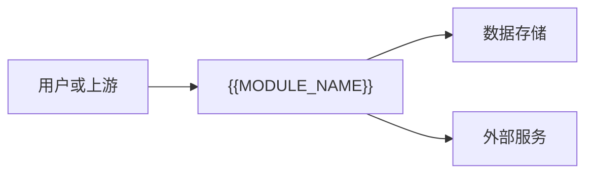
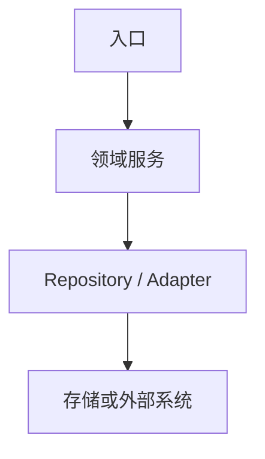
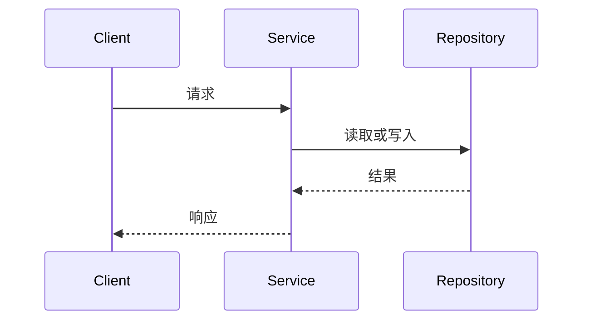

# {{MODULE_NAME}} 架构说明

> 模块 ID：`{{MODULE_ID}}`
> 状态：Draft / Accepted / Superseded
> 负责人：{{OWNER}}
> 最后更新：{{DATE}}
> 对应 PRD：{{PRD_LINKS}}

仅保留会约束实现或验收的决策。通用工程约定引用 `docs/CONVENTIONS.md`，不要复制。

## 1. 摘要

### 目标

- {{ARCH_GOAL_1}}
- {{ARCH_GOAL_2}}

### 非目标

- {{NON_GOAL_1}}

### 关键决策

| ID | 决策 | 原因 | 状态 |
| --- | --- | --- | --- |
| ADR-{{N}} | {{DECISION}} | {{RATIONALE}} | Accepted |

## 2. 上下文与边界

### 系统上下文

```mermaid
flowchart LR
  U["用户或上游"] --> M["{{MODULE_NAME}}"]
  M --> D["数据存储"]
  M --> X["外部服务"]
```

### 职责

- {{RESPONSIBILITY_1}}
- {{RESPONSIBILITY_2}}

### 不负责

- {{OUT_OF_SCOPE_1}}

### 依赖

| 依赖 | 类型 | 合约/版本 | 失败影响 | 降级 |
| --- | --- | --- | --- | --- |
| {{DEPENDENCY}} | internal/external | {{CONTRACT}} | {{IMPACT}} | {{FALLBACK}} |

## 3. 组件设计

| 组件 | 职责 | 输入 | 输出 | 所有者 |
| --- | --- | --- | --- | --- |
| {{COMPONENT}} | {{PURPOSE}} | {{INPUT}} | {{OUTPUT}} | {{OWNER}} |

```mermaid
flowchart TD
  A["入口"] --> B["领域服务"]
  B --> C["Repository / Adapter"]
  C --> D["存储或外部系统"]
```

### 关键调用链

1. {{STEP_1}}
2. {{STEP_2}}
3. {{STEP_3}}

## 4. 接口与合约

### API / 事件 / 命令

| 名称 | 方向 | 请求/事件 | 响应 | 幂等键 | 错误 |
| --- | --- | --- | --- | --- | --- |
| {{INTERFACE}} | in/out | {{REQUEST}} | {{RESPONSE}} | {{IDEMPOTENCY}} | {{ERRORS}} |

### 兼容策略

- 版本策略：{{VERSIONING}}
- 向后兼容窗口：{{COMPATIBILITY_WINDOW}}
- 废弃流程：{{DEPRECATION}}

## 5. 数据设计

### 实体

| 实体 | 主键 | 关键字段 | 约束 | 保留策略 |
| --- | --- | --- | --- | --- |
| {{ENTITY}} | {{KEY}} | {{FIELDS}} | {{CONSTRAINTS}} | {{RETENTION}} |

### 数据流

```mermaid
sequenceDiagram
  participant C as Client
  participant S as Service
  participant R as Repository
  C->>S: 请求
  S->>R: 读取或写入
  R-->>S: 结果
  S-->>C: 响应
```

### 一致性与迁移

- 事务边界：{{TRANSACTION_BOUNDARY}}
- 并发策略：{{CONCURRENCY}}
- 幂等策略：{{IDEMPOTENCY_STRATEGY}}
- 迁移/回滚：{{MIGRATION_ROLLBACK}}

## 6. 质量属性

| 属性 | 可测目标 | 设计措施 | 验证方式 |
| --- | --- | --- | --- |
| 性能 | {{PERF_TARGET}} | {{PERF_DESIGN}} | {{PERF_TEST}} |
| 可用性 | {{AVAILABILITY_TARGET}} | {{RESILIENCE}} | {{FAILURE_TEST}} |
| 安全 | {{SECURITY_TARGET}} | {{SECURITY_CONTROL}} | {{SECURITY_TEST}} |
| 可观测性 | {{OBS_TARGET}} | {{OBS_DESIGN}} | {{OBS_VERIFY}} |

### 失败与恢复

| 失败场景 | 检测 | 行为 | 恢复 | 告警 |
| --- | --- | --- | --- | --- |
| {{FAILURE}} | {{DETECTION}} | {{BEHAVIOR}} | {{RECOVERY}} | {{ALERT}} |

## 7. 安全与隐私

- 身份与权限边界：{{AUTHZ}}
- 输入验证：{{VALIDATION}}
- 敏感数据分类：{{DATA_CLASSIFICATION}}
- 加密与密钥：{{ENCRYPTION}}
- 审计与删除：{{AUDIT_DELETION}}
- 威胁与缓解：{{THREATS}}

## 8. 部署与运行

- 部署单元：{{DEPLOYMENT_UNIT}}
- 配置/secret：{{CONFIG_SECRETS}}
- 健康检查：{{HEALTH_CHECK}}
- 扩缩容：{{SCALING}}
- 发布/回滚：{{RELEASE_ROLLBACK}}

## 9. 可测试性

| 层级 | 合约或场景 | 测试类型 | 证据 |
| --- | --- | --- | --- |
| 单元 | {{UNIT_SCOPE}} | unit | {{UNIT_EVIDENCE}} |
| 集成 | {{INTEGRATION_SCOPE}} | integration/contract | {{INTEGRATION_EVIDENCE}} |
| 系统 | {{SYSTEM_SCOPE}} | e2e/perf/security | {{SYSTEM_EVIDENCE}} |

## 10. 风险与待决项

| ID | 风险/问题 | 影响 | 缓解/负责人 | 截止 |
| --- | --- | --- | --- | --- |
| R-{{N}} | {{RISK}} | {{IMPACT}} | {{MITIGATION_OWNER}} | {{DUE}} |

## 11. 实现约束

- 必须：{{MUST}}
- 禁止：{{MUST_NOT}}
- 可选：{{OPTIONAL}}
- TASK 拆分提示：{{TASK_HINTS}}

## 12. 完成检查

- [ ] PRD 需求与验收标准均有架构落点。
- [ ] 边界、合约、数据和失败路径明确。
- [ ] 安全、性能、可用性和可观测性可测试。
- [ ] 迁移、兼容和回滚策略明确。
- [ ] 决策、风险和待决项有负责人。
- [ ] 已更新模块清单和追踪矩阵。
