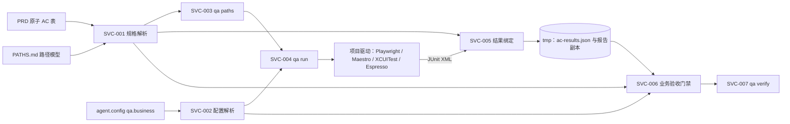

# 业务测试自动化架构说明

> 模块 ID：`BIZTEST`  
> 状态：Accepted  
> 负责人：@template-maintainers  
> 最后更新：2026-10-06  
> 对应 PRD：[业务测试自动化 PRD](../../prd-modules/business-testing/PRD.md)  
> 决策记录：[ADR-038](../../adr/038-arch-business-test-automation.md)

## 1. 摘要

### 目标

- 大模型在创作期把 PRD 原子 AC 推导为“界面—状态—转移—路径”模型与数据驱动用例；校验、运行、结果绑定与判定由脚本确定性完成。
- 驱动无关：Web 页面与 mac、win、ios、android 客户端共用同一份报告约定。
- 默认关闭；既有 `qa verify` 的输出、退出码与回执保持不变。

### 非目标

- 脚本不调用任何模型 API，不联网，不引入随机。
- 不内置 Playwright、Maestro、XCUITest、Espresso 等驱动或脚手架（后续由 architecture 包提供）。
- 不做 flaky 重试、突变抽样、断言质量 lint、性能与安全专项、manual AC 的验收记录门禁。
- 不跨电脑共享结果；换电脑须在该电脑重新 `qa run`。

### 关键决策

| ID | 决策 | 原因 | 状态 |
| --- | --- | --- | --- |
| ADR-038 | 创作期由模型推导并落成可评审文件，脚本期确定性解析、运行、绑定与判定 | 结果可复现、零模型成本、判定不受被测内容注入影响 | Accepted |
| BIZTEST-D1 | PRD 原子 AC 表是规格唯一事实源，路径模型与测试名只引用其 ID | 追溯按标识精确匹配，不依赖模糊对应 | Accepted |
| BIZTEST-D2 | 驱动契约只有 JUnit XML、用例名含 AC/TC 标识、套件 `platform` 标签 | 适用于任何驱动与端，不绑定技术栈 | Accepted |
| BIZTEST-D3 | 结果存容器 `tmp`，绑定 HEAD、配置摘要与报告 SHA256，门禁用报告副本重算并与记录比对 | 陈旧与改动可被发现，回执结构不变 | Accepted |
| BIZTEST-D4 | 套件非零退出本身不阻断，由 AC 绑定判定；无法启动、超时、报告缺失或不可解析为硬失败 | 驱动在任一用例失败时整体非零，低于必需优先级的失败才能只披露 | Accepted |
| BIZTEST-D5 | 以覆盖准则选路径，取值变体只生成数据行 | 用例数随路径与取值组合爆炸，需要可验证的收敛方式 | Accepted |

## 2. 上下文与边界



### 职责

- 解析并校验 PRD 原子 AC 表与 `PATHS.md`，输出覆盖矩阵（`qa paths`）。
- 按配置运行套件，收集 JUnit XML，按 AC/TC 标识绑定结果并写出带证据的 `ac-results.json`（`qa run`）。
- 在 `qa verify` 中判定必需优先级的自动化 AC 是否被通过用例证明（门禁）。
- 提供模板、指引与角色文件，约束模型创作期的产出形态。

### 不负责

- 不选择、安装或配置驱动；不生成被测应用的页面或测试脚本代码。
- 不证明被测系统本身正确，只证明“规格中的验收被带标识的通过用例覆盖”；用例与路径的质量由评审与指引保证。
- 不处理 manual AC 的验收记录，只披露风险。

### 依赖

| 依赖 | 类型 | 合约 | 失败影响 | 降级 |
| --- | --- | --- | --- | --- |
| `governance-ids.js` | internal | AC/TC/Story ID 模式与整词匹配 | 无法解析标识 | 启动失败 |
| 配置加载 | internal | 合并后的 `qa.business` | 配置缺失或非法 | 默认关闭；开启时 BLOCKED |
| Git | internal | `rev-parse HEAD`、`status --porcelain --untracked-files=normal`、`ls-files` | 无法确认版本、洁净状态或报告路径是否受版本控制 | 无提交或无法确认报告路径时 `BLOCKED`；`status` 失败按“不洁净”记录，不推断 |
| 容器目录 | internal | `ensureContainerDirectories` 声明 `tmp` | 结果无法落盘 | `FAILED`（`WRITE_FAILED`），不写出残缺结果 |
| 项目测试驱动 | external | 退出码与 JUnit XML | 无报告即无证据 | 硬失败，不降级 |

## 3. 组件设计

### 组件/服务清单

| 组件 ID | 组件 | 职责 | 输入 | 输出 | 所有者 |
| --- | --- | --- | --- | --- | --- |
| BIZTEST-SVC-001 | 规格解析器（`business-spec.js`） | 解析原子 AC 表与 `PATHS.md`，输出结构化模型与逐项违规 | 模块 PRD、`PATHS.md` | AC、界面、状态、转移、路径与违规列表 | template |
| BIZTEST-SVC-002 | 配置解析器（`business-config.js`） | 校验并规范化 `qa.business`，计算配置摘要 | 合并后配置 | 规范化配置、摘要或违规 | template |
| BIZTEST-SVC-003 | 路径校验器（`qa-paths.js`） | 校验引用、衔接与覆盖，输出覆盖矩阵（`qa paths`） | SVC-001 模型 | `STATUS`、计数、矩阵、违规 | template |
| BIZTEST-SVC-004 | 套件运行器（`qa-run.js`） | 按配置逐套运行命令、收集报告、写结果（`qa run`） | SVC-002 配置、SVC-001 模型 | `ac-results.json`、报告副本 | template |
| BIZTEST-SVC-005 | 结果绑定器（`business-results.js`） | 安全解析 JUnit、提取标识、绑定并聚合状态、读写结果文件 | 报告副本、规格模型 | 用例/TC/AC/路径状态与汇总 | template |
| BIZTEST-SVC-006 | 业务验收门禁（`qa-business-gate.js`） | 校验新鲜度与完整性，重算并按规则判定 | 结果文件、规格、配置、HEAD | 阻断项与风险披露 | template |
| BIZTEST-SVC-007 | 命令与门禁接入（`agent-cli.js`、`qa-verify.js`） | 路由 `qa paths`、`qa run`，把门禁接入 `qa verify` | CLI 参数 | 命令输出与退出码 | template |
| BIZTEST-SVC-008 | 指引与模板资产 | PRD/QA 模板与示例、`PATHS-TEMPLATE.md`、QA playbook、四个角色文件、CONVENTIONS、manifest 登记 | — | 约束创作期产出的文档 | template |
| BIZTEST-API-001 | 驱动无关报告与结果契约 | 约定 JUnit 命名、`platform` 标签与结果文件 | 项目驱动输出 | 可绑定的报告与可复验的结果 | template |

### 关键调用链

`qa paths`（只读，不创建目录）：

1. 读取 `docs/prd-modules/<domain>/` 下直接子级 Markdown，按表头识别原子 AC 表。
2. 读取 `docs/qa-modules/<domain>/PATHS.md`（存在时），解析四张表与覆盖准则。
3. 校验标识、引用、路径衔接、覆盖准则与 P0 自动化 AC 关联。
4. 输出 `STATUS`、`SUMMARY`、`NEXT_ACTION`、计数、覆盖矩阵与逐项违规；存在违规则 `STATUS=BLOCKED` 并以非零退出。

`qa run`：

1. 解析 `qa.business`；非法 → `BLOCKED`（`CONFIG_INVALID`），未配置任何套件 → `BLOCKED`（`NO_SUITES`），均不启动套件。
2. 执行与 `qa paths` 相同的静态校验；存在违规 → `BLOCKED`（`SPEC_INVALID`），不启动套件。
3. 读取 HEAD SHA；仓库尚无提交 → `BLOCKED`（`NO_HEAD`）。
4. 只读校验全部套件的 `report` 路径：自仓库根起逐段 `lstat`，拒绝符号链接、非目录的中间段与非普通文件的终段（路径尚不存在视为通过），并拒绝已被 Git 跟踪或无法确认是否被跟踪的路径；任一套件不合格 → `BLOCKED`（`REPORT_PATH_INVALID`），此前不产生任何副作用。
5. 此后才开始写入：通过共享初始化器声明 `tmp`；删除全部套件的旧报告；记录运行前 `git status --porcelain --untracked-files=normal` 是否洁净（含未跟踪文件；命令失败按“不洁净”）；删除旧的 `ac-results.json`。任一步失败 → `FAILED`（`WRITE_FAILED`）。
6. 按配置顺序逐套执行：删除该套件的旧报告 → 经 shell 在仓库根的独立进程组内带超时运行命令（套件的标准输出与标准错误转到 stderr，stdout 只留给本命令的输出）→ 记录退出码 → 重新校验路径并以 `O_NOFOLLOW` 读取（至多读取上限加 1 字节）→ 计算 SHA256 → 安全解析；启动失败或超时的套件不读取报告。超时先发 `SIGTERM`，宽限期后发 `SIGKILL` 并确认进程组已清空（Windows 以 `taskkill /T /F` 终止进程树）。`SIGINT`、`SIGTERM`、`SIGHUP` 会转发给进程组（重复信号直接 `SIGKILL`），已收集的观察被丢弃、不写出结果，`FAILED`（`INTERRUPTED`）。
7. 聚合绑定后，先写报告副本，最后原子写入 `ac-results.json`；写入失败 → `FAILED`（`WRITE_FAILED`）。
8. 输出每套件状态与汇总：全部套件 `ok` 且无 `failed`/`error` 用例为 `STATUS=OK`，否则 `STATUS=FAILED`（`SUITE_FAILED`），结果仍然写出；失败均以非零退出。`AC_OPEN` 行与门禁共用同一判定函数，只作提示，不改变 `STATUS`。

`qa verify`（`qa.business.enabled=true` 且非模板源）：启动时先删除旧回执；既有校验通过并捕获回执身份（HEAD）后，先执行既有“测试范围证据校验”，再以该 HEAD 执行门禁，最后才写回执。有阻断项则打印 `BUSINESS_*` 行与“业务验收未通过，回执未签发。”、以非零退出、不写回执；通过则打印风险披露后继续写回执。`enabled` 缺省或为 `false` 时不读取规格与结果，也不产生任何输出。模板源仓库同时跳过测试范围证据校验与门禁。

### 状态语义

| 对象 | 取值 | 判定 |
| --- | --- | --- |
| 用例 | `error`、`failed`、`skipped`、`passed` | 按子元素优先级 `error` > `failure` > `skipped`，都没有则 `passed` |
| TC 与 AC（总体或某一端） | `failed`、`passed`、`skipped`、`missing` | 任一绑定用例 `failed`/`error` 为 `failed`；否则至少一条 `passed` 为 `passed`；绑定用例全部 `skipped` 为 `skipped`；无绑定用例为 `missing` |
| 路径 | `passed`、`failed`、`missing` | 关联 TC 任一 `failed` 为 `failed`；关联 TC 非空且全部 `passed` 为 `passed`；其余（无关联 TC，或存在 `missing`/`skipped` 的 TC）为 `missing` |
| 套件 | `ok`、`exit_nonzero`、`spawn_error`、`timeout`、`report_missing`、`report_invalid` | 退出码 0 且报告有效为 `ok`；退出码非零但报告有效为 `exit_nonzero`；其余为硬失败 |

- 套件的 `platform` 把其用例计入对应端与总体；未声明 `platform` 的套件（视为 `-`）只计入总体。
- 同一标识可对应多条用例（数据行、多端、重复）：任一失败即失败，至少一条通过且无失败才通过。
- 报告不含任何 `testcase` 视为 `report_invalid`，避免“零用例也算通过”。

### 门禁判定顺序

1. **配置**：非法 → `CONFIG_INVALID`；已开启却未配置任何套件 → `CONFIG_INVALID`（对象为 `qa.business.suites`）。
2. **规格**：未发现任何原子 AC 表 → `NO_ATOMIC_AC`；规格或路径违规（同 `qa paths` 的阻断项）→ `SPEC_INVALID`（说明为 `<违规代码>: <原因>`）；两者的对象均为违规位置 `文件:行号`。
3. **结果存在**：缺失 → `RESULTS_MISSING`；JSON 或 schema 非法、版本未知 → `RESULTS_INVALID`。
4. **新鲜度**：`head_sha` 不等于 `qa verify` 已捕获的 HEAD → `RESULTS_STALE_HEAD`；`worktree_clean` 不为 `true` → `RESULTS_DIRTY_WORKTREE`；`config_digest` 与当前配置重算值不同 → `RESULTS_CONFIG_DRIFT`；三项同时列出。
5. **套件**：任一套件为硬失败状态 → `SUITE_HARD_FAILURE`。
6. **完整性**：先查报告副本——某套件的记录缺失、副本缺失、不是普通文件、超过大小上限，或 SHA256、字节数与记录不符 → `REPORT_TAMPERED`，逐套件全部列出，出现即不再比对；否则用副本与当前规格重算：已配置与已记录的 `名称:platform` 集合不一致、副本无法重新解析，或各套件的用例数与无标识数、`tcs`、`acs`、`paths`、`unknown_ids`、`summary` 与记录不一致 → `RESULTS_MISMATCH`（至多列出 10 处差异，其余汇总为“另有 N 项差异未列出”）。
7. **验收**：必需优先级（默认 `P0`）且验证方式为 `auto` 的 AC，逐条判定，不满足 → `AC_NOT_PROVEN`（对象为 AC 标识，说明为 `<优先级> <状态>: <原因>`，原因含 `failed`/`missing`/`skipped` 与端）。
8. **路径覆盖**：声明的覆盖准则须由 `passed` 路径满足，否则 → `PATH_COVERAGE_GAP`。
9. **披露**（不阻断）：见下表。

第 1–6 步按顺序执行，任一步出现阻断项即停止后续步骤（结果不可信时，后面的清单只会误导），同一步内的违规全部列出；第 7、8 步相互独立，同时失败都列出，且阻断时仍附第 9 步的风险披露；第 9 步仅在第 1–6 步全部通过时给出。门禁不运行 Git：工作区是否干净取自结果记录的 `worktree_clean`，与 HEAD 的绑定由 `head_sha` 保证；门禁自身的内部异常折叠为 `GATE_ERROR` 阻断，不向调用方抛出，也不视为通过。

AC 的验收判定：

- 任一套件或端上状态为 `failed`（含不在声明端内的套件）→ 阻断。
- 声明端为 `-`：总体状态须为 `passed`。
- 声明了端：每个声明的端须各有 `passed` 且无 `failed`；无套件提供该端标签则该端为 `missing`。

风险披露（不阻断）：

| 代码 | 条件 |
| --- | --- |
| `RISK_MANUAL_AC` | 必需优先级内验证方式为 `manual` 的 AC，列出清单 |
| `RISK_LOWER_PRIORITY` | 低于必需优先级的自动化 AC 未通过 |
| `RISK_UNLABELLED_CASES` | 存在不含任何 AC/TC 标识的用例，给出数量 |
| `RISK_UNKNOWN_IDS` | 用例名引用了规格中不存在的 AC/TC 标识 |
| `RISK_SUITE_EXIT_NONZERO` | 套件退出码非零但报告有效 |
| `RISK_MODULE_WITHOUT_TABLE` | 部分模块没有原子 AC 表，其验收不受门禁约束 |

## 4. 接口与合约

### 提供的接口

| 名称 | 方向 | 请求 | 响应 | 幂等键 | 错误 |
| --- | --- | --- | --- | --- | --- |
| `qa paths` | CLI | `pnpm agent -- qa paths`（无参数） | `STATUS`、`SUMMARY`、`NEXT_ACTION`、计数、覆盖矩阵、`VIOLATION` 行 | 规格文档内容 | 存在违规 → `BLOCKED`；读取或解析异常 → `FAILED`；均非零退出 |
| `qa run` | CLI | `pnpm agent -- qa run`（无参数） | 每套件状态、`RESULTS_FILE`、AC/用例/路径汇总与 `AC_OPEN` 提示 | HEAD、配置摘要、报告 SHA256 | 前置失败 `BLOCKED`（`CONFIG_INVALID`、`NO_SUITES`、`SPEC_INVALID`、`NO_HEAD`、`REPORT_PATH_INVALID`）；运行或写入失败 `FAILED`（`WRITE_FAILED`、`INTERRUPTED`、`SUITE_FAILED`）；均非零退出 |
| `qa verify` 增量 | CLI | 既有参数，无新增 | 开启时追加业务测试段（`BUSINESS_*` 行）；关闭时与既有逐字节一致 | 回执键 | 阻断沿用既有语义：不写回执、非零退出 |
| `qa.business` | 配置 | 见下文“配置” | 规范化配置与摘要 | 配置摘要 | 非法值逐项报告 |
| 报告约定 | 文件 | JUnit XML、用例名标识、`platform` 标签 | — | 报告 SHA256 | 缺失或不可解析为硬失败 |
| `ac-results.json` | 文件 | 见 §5 | — | HEAD 与配置摘要 | 缺失、陈旧或被改动均阻断 |

`qa paths` 输出契约（逐行，按标识排序以保证确定性）：

```text
STATUS=OK|BLOCKED|FAILED
SUMMARY=<一行概述>
NEXT_ACTION=<下一动作>
MODULES=<含原子 AC 表的模块数>
AC_TOTAL=<n>  AC_AUTO=<n>  AC_MANUAL=<n>
TRANSITION_TOTAL=<n>  PATH_TOTAL=<n>  TC_TOTAL=<n>
MATRIX_AC=<AC ID>|<优先级>|<验证>|<端>|<关联转移>|<关联路径>|<TC>
MATRIX_PATH=<路径 ID>|<转移序列>|<TC>
VIOLATION=<代码>|<文件>:<行号>|<说明>
```

矩阵中无关联项的字段输出 `-`；违规没有行号时位置只含文件；读取或解析异常时只输出 `STATUS=FAILED`、`SUMMARY`、`NEXT_ACTION` 并以非零退出。

`qa run` 输出契约（stdout 只含 `KEY=value` 行，套件自身的输出转到 stderr；各行是否出现取决于运行到哪一阶段）：

```text
STATUS=OK|BLOCKED|FAILED
SUMMARY=<一行概述>
NEXT_ACTION=<下一动作>
REASON=<原因代码>
HEAD_SHA=<提交 SHA>
WORKTREE_CLEAN=true|false
CONFIG_DIGEST=sha256:<摘要>
CONFIG_ERROR=<字段>|<说明>
VIOLATION=<代码>|<文件>:<行号>|<说明>
REPORT_PATH=<套件名>|<report 路径>|<说明>
SUITE=<名称>|<platform>|<状态>|exit=<退出码或 ->|<耗时>ms|<用例数> cases|sha256=<报告摘要或 ->|<说明或 ->
RESULTS_FILE=<绝对路径>
AC_TOTAL=<n>
AC_PASSED=<n>
AC_FAILED=<n>
AC_SKIPPED=<n>
AC_MISSING=<n>
AC_MANUAL=<n>
CASES_TOTAL=<n>
CASES_PASSED=<n>
CASES_FAILED=<n>
CASES_ERROR=<n>
CASES_SKIPPED=<n>
PATH_TOTAL=<n>
PATH_PASSED=<n>
UNKNOWN_IDS=<标识,标识,…>
AC_OPEN=<AC ID>|<优先级>|<状态>|<原因>
WARNING=<说明>
```

- `REASON` 仅在非 `OK` 时给出，取值见上表与“失败与恢复”；`CONFIG_ERROR`、`VIOLATION`、`REPORT_PATH` 仅在对应阻断时逐项输出，`VIOLATION` 与 `qa paths` 同格式。
- `SUITE` 至 `PATH_PASSED` 仅在结果已写出时输出，套件失败（`SUITE_FAILED`）时同样输出；`UNKNOWN_IDS` 仅在存在规格外标识时输出。
- `AC_OPEN` 列出必需优先级内尚未被证明的自动化 AC，与门禁共用判定函数，只作提示，不改变 `STATUS`；`WARNING` 例如运行前工作区不洁净（门禁会以 `RESULTS_DIRTY_WORKTREE` 阻断）。

`qa verify` 开启业务验收后追加的输出契约：

```text
BUSINESS_GATE=PASS|BLOCKED
BUSINESS_SUMMARY=<一行概述>
BUSINESS_BLOCK=<代码>|<对象>|<说明>
BUSINESS_RISK=<代码>|<说明>
BUSINESS_NEXT_ACTION=<下一动作>
```

- `BUSINESS_BLOCK` 与 `BUSINESS_RISK` 逐项输出；`BUSINESS_NEXT_ACTION` 仅阻断时输出，由各阻断代码对应的提示去重后以“；”连接。
- 输出经过净化：空白与控制字符折叠为单个空格并去除首尾空白，超过 400 个码点的内容截断并以 `…` 结尾，`代码`、`对象` 字段中的 `|` 替换为 `/`；因此 PRD、`PATHS.md` 或报告中的文本无法伪造 `BUSINESS_*` 行。

### 依赖的接口

| 依赖 | 合约 | 失败行为 |
| --- | --- | --- |
| `governance-ids.js` | `AC_ID_SOURCE`、`TEST_CASE_ID_SOURCE`、`STORY_ID_SOURCE`、`searchPattern`、`exactPattern` | 内部模块缺失即启动失败 |
| 配置加载器 | `qa.business` 来自 CLI、环境、`agent.config.json`、`config.example.json` 的合并结果 | 非法值 → `CONFIG_INVALID` |
| `qa-verify.js` 主流程 | 已捕获的 HEAD、`templateSource` 判定、阻断即不写回执 | 门禁异常按阻断处理，不吞掉 |
| 回执键 | `worktreeReceiptKey` 的同源派生（P1 导出该函数） | 无法派生 → `BLOCKED` |
| 容器目录 | `ensureContainerDirectories(config, mainRoot, ['tmp'])`，仅 `qa run` 调用 | 失败即 `FAILED`（`WRITE_FAILED`） |
| Git | `rev-parse HEAD`、`status --porcelain --untracked-files=normal`、`--literal-pathspecs ls-files -z --`；仅 `qa run` 调用，门禁不运行 Git | `HEAD` 或 `ls-files` 失败即 `BLOCKED`；`status` 失败按“不洁净”记录 |

兼容策略：`schema_version` 当前为 `1`，未知版本视为 `RESULTS_INVALID` 并提示重新 `qa run`；PRD 未采用新表格的既有项目不受门禁约束，仅以 `RISK_MODULE_WITHOUT_TABLE` 披露。

### 原子 AC 表语法

识别规则：读取 `docs/prd-modules/<domain>/` 下全部直接子级 Markdown（含 `PRD.md` 与拆分规格），表头逐列须为：

```text
AC ID | Story | 优先级 | 验证 | 端 | Given | When | Then | TC
```

`docs/prd-modules/` 根目录下的模板与示例文件不扫描。单元格内的竖线写作 `\|`，解析器按未转义竖线切分并还原。

| 违规代码 | 条件 |
| --- | --- |
| `AC_ID_INVALID`、`AC_ID_DUPLICATE` | AC ID 不符合 `AC-{M}-NNN-NN`，或在全部模块内重复 |
| `STORY_INVALID`、`STORY_MISMATCH` | Story 不符合 `US-{M}-NNN`，或与 AC ID 的模块与编号不一致 |
| `PRIORITY_INVALID` | 优先级不在 `P0`、`P1`、`P2`、`P3` |
| `VERIFICATION_INVALID` | 验证不在 `auto`、`manual` |
| `PLATFORM_INVALID` | 端既不是 `-`，也不是逗号分隔的 `[a-z][a-z0-9-]*` 标签（推荐 `web`、`mac`、`win`、`ios`、`android`） |
| `FIELD_EMPTY` | Given、When、Then 任一为空 |
| `TC_INVALID` | TC 列既不是 `-`，也不是 `TC-{M}-NNN` 列表（逗号、顿号或空格分隔） |
| `ROW_COLUMNS` | 行的列数与表头不符 |

端的取值只约束语法，不设固定词表：声明了但没有任何套件提供的端会在门禁中表现为 `missing` 而被阻断，由此发现拼写错误。

### 路径模型语法与校验

`docs/qa-modules/<domain>/PATHS.md` 与同名域的 PRD 配对。文件含一行覆盖准则声明与四张表，表头逐列须一致：

```text
覆盖准则：all-transitions
界面：ID | 名称 | 端 | 说明
状态：ID | 界面 | 名称 | 说明
转移：ID | 起始状态 | 操作 | 守卫 | 目标状态 | 关联 AC
路径：ID | 转移序列 | 关联 TC | 说明
```

- 标识：`SCR-{M}-NNN`、`STA-{M}-NNN`、`TRN-{M}-NNN`、`PTH-{M}-NNN`；`{M}` 采用与 `governance-ids.js` 相同的模块标识语法。
- 覆盖准则取值 `all-transitions`、`all-states`、`none`，可逗号分隔组合（`none` 不与其他并存）；缺省视为 `none`。
- 转移序列以 `→`、`->` 或逗号分隔；关联 AC、关联 TC 以逗号、顿号或空格分隔，`-` 表示无。
- 路径覆盖的转移为全部路径所含转移的并集，覆盖的状态为这些转移起止状态的并集；门禁用 `passed` 路径按同一规则重算。

| 违规代码 | 条件 |
| --- | --- |
| `PATHS_TABLE_MISSING` | 缺少界面、状态、转移、路径四表之一 |
| `ID_INVALID`、`ID_DUPLICATE` | 标识格式非法，或在同一文件内重复 |
| `REF_UNKNOWN` | 引用的界面、状态、转移或 AC 不存在（AC 在全部模块的原子 AC 表内查找） |
| `PATH_EMPTY`、`PATH_DISCONNECTED` | 路径不含转移；相邻转移的目标状态与下一转移的起始状态不同 |
| `CRITERION_INVALID` | 覆盖准则取值非法，或 `none` 与其他取值并存 |
| `COVERAGE_GAP` | 声明 `all-transitions` 或 `all-states` 时存在未被任何路径覆盖的转移或状态 |
| `AC_UNLINKED` | 声明了覆盖准则，而本域 P0 自动化 AC 未被任何转移关联 |
| `TC_INVALID` | 路径的关联 TC 不符合 `TC-{M}-NNN` |

### 报告约定与绑定语义

- 驱动契约共三项：产出 JUnit XML；`testcase` 的 `name` 或 `classname` 含 AC 或 TC 标识（大写整词，沿用 `searchPattern`）；套件在配置中声明 `platform`。
- 绑定：用例直接绑定其中出现的 AC ID，并经 PRD 原子表的 TC 列，把其中出现的 TC ID 绑定到列出该 TC 的全部 AC；不含任何标识的用例单独计数，不参与绑定；引用规格中不存在的标识记入 `unknown_ids`。
- 数据驱动：一行数据对应一条 `testcase`，名称都含同一 TC 标识；聚合按“任一失败即失败”。
- 解析器只接受 UTF-8 XML；出现 `<!DOCTYPE` 或实体声明即视为 `report_invalid`；仅还原五个预定义实体与数字字符引用；单个报告上限 64 MiB。

### 配置 `qa.business`

```json
{
  "qa": {
    "business": {
      "enabled": false,
      "requiredPriorities": ["P0"],
      "suites": [
        {
          "name": "web-e2e",
          "platform": "web",
          "command": "pnpm exec playwright test",
          "report": "test-results/junit.xml",
          "timeoutSeconds": 900
        }
      ]
    }
  }
}
```

| 键 | 默认 | 约束 |
| --- | --- | --- |
| `enabled` | `false` | 仅布尔，非布尔值按开启处理并报 `CONFIG_INVALID`；只控制 `qa verify` 门禁，`qa run` 不受其影响 |
| `requiredPriorities` | `["P0"]` | `P0`–`P3` 的非空子集，去重并排序 |
| `suites[].name` | 必填 | `[a-z][a-z0-9-]*`，套件间唯一 |
| `suites[].platform` | `-` | `-` 或单个端标签 |
| `suites[].command` | 必填 | 非空字符串，经 shell 在仓库根运行；只来自合并后的受信配置 |
| `suites[].report` | 必填 | 相对仓库根的文件路径：非空、不含控制字符、不是绝对路径（含盘符与 UNC）；反斜杠按 `/` 处理并规范化；不能指向目录或以斜杠结尾；不得越出仓库根或位于 `.git` 内。`qa run` 运行前逐段 `lstat` 拒绝符号链接与非普通文件，并拒绝已被 Git 跟踪的路径 |
| `suites[].timeoutSeconds` | `900` | 1–7200 的整数 |

配置摘要为 `sha256:` 加 `requiredPriorities` 与 `suites`（含全部字段，键序规范化）的 JSON 摘要，不含 `enabled`。命令中不应写入密钥；跨平台输出路径建议配置在驱动自己的配置文件里，而不是在命令里内联环境变量赋值。

套件含未知键、套件名重复均报 `CONFIG_INVALID`；`report` 路径不要求互不相同，因为每个套件运行后立即读取其报告。

## 5. 数据设计

### 数据资产表

| 表名 | 类型 | 关键字段 | 保留策略 |
| --- | --- | --- | --- |
| 原子 AC 表 | 受跟踪的 Markdown 表 | AC ID、Story、优先级、验证、端、Given/When/Then、TC | 目标项目 PRD 长期维护（project-owned） |
| `PATHS.md` | 受跟踪的 Markdown 文档 | 覆盖准则、界面、状态、转移、路径 | 目标项目 QA 文档维护（project-owned） |
| `ac-results.json` | 容器 `tmp` 的 JSON | HEAD、配置摘要、套件、TC/AC/路径状态、汇总 | 随 worktree 键隔离，每次 `qa run` 覆盖；不跨电脑 |
| 报告副本 | 容器 `tmp` 的 XML | SHA256、字节数 | 与结果文件同生命周期 |

目录：`<container>/tmp/qa-business-results/<worktree-key>/`，其下 `ac-results.json` 与 `reports/<套件名>.xml`；`<worktree-key>` 与 QA 回执键同源（worktree 真实路径摘要）。

`ac-results.json`（`schema_version` 为 1）：

| 字段 | 说明 |
| --- | --- |
| `schema_version`、`generated_at` | 版本与生成时间（UTC，不参与比对） |
| `head_sha` | 运行时 HEAD（40 位十六进制） |
| `worktree_clean` | 运行前 `git status --porcelain --untracked-files=normal` 为空（含未跟踪文件）；命令失败记为 `false` |
| `config_digest` | 见“配置”一节 |
| `suites[]` | 按配置顺序：`name`、`platform`、`command`、`exit_code`（启动失败或被信号终止时为 `null`）、`status`、`detail`（硬失败等的原因，否则 `null`）、`duration_ms`、`cases`（用例数）、`unlabelled`、`report{path,copy,sha256,bytes}`（硬失败状态为 `null`；`copy` 固定为 `reports/<套件名>.xml`） |
| `tcs{}` | TC ID → `{status,cases:{total,passed,failed,error,skipped}}`；列出规格中已知的全部 TC，没有任何用例的为 `missing` 且各计数为 0 |
| `acs{}` | AC ID → `{priority,verification,platforms,status,by_platform,tcs}`；`platforms` 为声明的端（去掉 `-` 后排序），`by_platform` 覆盖声明端与有用例的端 |
| `paths{}` | 路径 ID → `{status,tcs}` |
| `unknown_ids[]` | 用例名引用但规格中不存在的标识 |
| `summary` | `{suites,cases:{total,passed,failed,error,skipped},unlabelled,acs:{total,passed,failed,skipped,missing,auto,manual},paths:{total,passed}}` |

- 绑定规则：AC 与 TC 的绑定只来自 PRD 原子 AC 表的 TC 列，同一用例对同一 AC 只计一次；仅出现在 `PATHS.md` 路径中的 TC 参与路径状态，但不绑定任何 AC。
- 键序：`suites` 按配置顺序，其余各段按标识排序，以保证逐字节确定。
- 读取与清理：结果文件是目录或符号链接、超过 64 MiB、JSON 非法或结构不符，一律 `RESULTS_INVALID`；写入时若目标位置被目录占据，先清理再原子写入；成功写入后尽力清除 `reports/` 下不再被引用的旧副本。
- 事务边界：报告副本先落盘，`ac-results.json` 最后以“同目录临时文件加 rename”原子写入；读取方忽略残留临时文件。
- 并发策略：同一 worktree 不并行执行 `qa run`；若发生交错，副本哈希与重算比对会使门禁 `BLOCKED`，重新 `qa run` 即可恢复（fail closed）。
- 幂等策略：同一 HEAD、配置与报告产生相同的 `tcs`、`acs`、`paths`、`summary`（`generated_at` 与 `duration_ms` 除外）。
- 迁移/回滚：新增能力均可加性回滚——关闭 `qa.business.enabled` 或还原提交即可；结果目录位于容器 `tmp`，可由普通清理回收。

## 6. 质量属性

| 属性 | 可测目标 | 设计措施 | 验证方式 |
| --- | --- | --- | --- |
| 确定性 | 同一仓库状态与同一报告，校验、绑定与判定输出逐字节一致（时间字段除外） | 纯函数解析与聚合，全部输出按标识排序（套件按配置顺序），无随机、无网络、无模型调用 | 重复运行比对 |
| 兼容性 | 默认配置下 `qa verify` 输出与退出码与既有一致 | `enabled` 缺省即不读取规格与结果、无输出；回执结构不变 | 既有 `qa-verify` 测试回归 |
| 性能 | 500 条 AC、2000 条用例，校验、绑定与判定合计不超过 5 秒 | 单遍扫描与哈希映射，无外部进程；不含套件运行时间 | 合成夹具计时 |
| 安全 | 套件命令只来自受信配置；报告与文档内容不被执行；不展开外部实体；不输出环境变量值 | 见 §7 | 负向夹具 |
| 可审计 | 结果绑定 HEAD 与报告 SHA256；陈旧或被改动即阻断 | 门禁重算并比对 | 夹具反例 |
| 可追溯 | P0 自动化 AC 至少一条绑定通过用例，否则阻断 | AC/TC 标识绑定与逐条判定 | 夹具反例 |
| 可观测性 | 违规与阻断带稳定代码、文件与行号 | 结构化输出行 | stdout 断言 |

### 失败与恢复

| 失败场景 | 检测 | 行为 | 恢复 | 告警 |
| --- | --- | --- | --- | --- |
| 配置非法或无套件 | 配置解析 | `qa run` 为 `BLOCKED`；开启门禁时 `CONFIG_INVALID` | 修正 `agent.config.json` | STATUS=BLOCKED |
| 规格或路径违规 | 规格解析与路径校验 | 不启动套件；门禁 `SPEC_INVALID` | 按 `VIOLATION` 逐项修正 PRD 与 `PATHS.md` | STATUS=BLOCKED |
| 套件无法启动、超时 | spawn 错误、超时终止 | 记录硬失败状态并继续后续套件，结果仍写出 | 修复命令或超时后重跑 | STATUS=FAILED |
| 报告缺失、不可解析或零用例 | 读取与解析 | `report_missing`/`report_invalid`，门禁 `SUITE_HARD_FAILURE` | 修复驱动报告输出后重跑 | STATUS=FAILED |
| 结果缺失、陈旧或配置漂移 | 门禁新鲜度检查 | `BLOCKED`，提示重新 `qa run` | 在当前 HEAD 之后重跑 `qa run` | 门禁输出 |
| 结果或报告副本被改动 | SHA256 与重算比对 | `REPORT_TAMPERED`/`RESULTS_MISMATCH` | 重新 `qa run` 生成真实结果 | 门禁输出 |
| 运行时工作区不洁净 | 运行前 `git status --porcelain --untracked-files=normal` | 结果记录 `worktree_clean=false`，门禁 `RESULTS_DIRTY_WORKTREE` | 提交或忽略生成物后重跑 | `WARNING` 与门禁输出 |
| 仓库尚无提交 | `rev-parse HEAD` | `qa run` 为 `BLOCKED`（`NO_HEAD`），不启动套件 | 提交后重跑 | STATUS=BLOCKED |
| 报告路径不安全（符号链接、已被 Git 跟踪、指向目录，或无法确认是否被跟踪） | 运行前对全部套件只读校验 | `qa run` 为 `BLOCKED`（`REPORT_PATH_INVALID`），不删除任何文件、不启动套件 | 调整 `report`；已跟踪的文件先 `git rm --cached` 并加入忽略规则 | `REPORT_PATH=` 行 |
| 运行环境或结果无法写入 | 容器目录声明、旧产物清理、结果与副本写入 | `FAILED`（`WRITE_FAILED`），不写出残缺结果 | 修复目录权限或占位后重跑 | STATUS=FAILED |
| 运行被信号中断 | `SIGINT`、`SIGTERM`、`SIGHUP` | 终止套件进程组，丢弃已收集的观察，`FAILED`（`INTERRUPTED`），不写出结果 | 重新 `qa run` | STATUS=FAILED |
| 门禁自身异常 | 门禁内部异常 | 折叠为 `GATE_ERROR` 阻断，永不视为通过 | 按说明排查后重新 `qa verify` | 门禁输出 |

## 7. 安全与隐私

- 套件命令只来自合并后的受信配置；PRD、`PATHS.md`、报告内容永远不作为命令或路径执行。
- 解析 XML 时拒绝 `DOCTYPE` 与实体声明，不解析外部资源；报告大小设上限。
- 路径包含性：`report` 须是规范化的仓库相对文件路径（绝对路径、越出仓库根的 `..` 与位于 `.git` 内的路径一律拒绝）；运行前与读取前自仓库根起逐段 `lstat`，任一段为符号链接即拒绝，报告以 `O_NOFOLLOW` 打开并再次确认是普通文件；结果只写入容器 `tmp` 下按 worktree 键隔离的目录，读取结果与副本时同样拒绝目录与符号链接（分别为 `RESULTS_INVALID`、`REPORT_TAMPERED`）；规格只从 `docs/prd-modules/` 与 `docs/qa-modules/` 读取。
- 旧报告仅在“仓库内、普通文件、未被 Git 跟踪”时删除；已跟踪或无法确认是否被跟踪的报告路径视为不合格，且全部套件的路径校验先于任何删除完成。
- 日志与结果文件不输出环境变量值；命令字符串原样记录，项目不得在命令中写入密钥。
- 信任边界与既有本地门禁一致：结果文件“被改动可被发现”，但不防同时伪造报告副本与记录，不宣称服务端零信任。

## 8. 部署与运行

无独立部署单元。脚本位于已整体登记所有权的 `infra/scripts/qa-tools/`，随模板更新传播；`qa.business` 默认值写入 `infra/templates/agent/config.example.json`；新增的 `docs/data/templates/qa/PATHS-TEMPLATE.md` 须在模板 manifest 单独登记 `overwrite`；`docs/prd-modules/**`、`docs/qa-modules/**`、追溯矩阵与项目的 `agent.config.json` 保持 project-owned，不被模板更新覆盖。模板源不执行业务门禁。

项目使用顺序：写原子 AC 与 `PATHS.md` → `qa paths` → 生成并评审用例 → 提交 → `qa run` → `qa verify`。`qa run` 须在最终提交之后执行，提交后 HEAD 变化会使结果过期。

## 9. 可测试性

| 层级 | 合约或场景 | 测试类型 | 证据 |
| --- | --- | --- | --- |
| 单元 | 原子 AC 表合法与各违规代码 | node:test | TC-BIZTEST-001 |
| 内容 | 模板与示例统一 `TC-` 标识、原子 AC 写法 | 内容扫描 | TC-BIZTEST-002 |
| 单元 | `PATHS.md` 解析、引用、衔接、覆盖准则与矩阵 | node:test | TC-BIZTEST-003、TC-BIZTEST-004、TC-BIZTEST-005、TC-BIZTEST-006 |
| 集成 | `qa run` 运行夹具套件、超时、启动失败、报告缺失 | integration | TC-BIZTEST-007 |
| 单元 | JUnit 解析、标识绑定、按端聚合、无标识计数、实体与 `DOCTYPE` 拒绝 | node:test | TC-BIZTEST-008、TC-BIZTEST-010 |
| 单元 | 结果文件字段、原子写入与容器目录位置 | node:test | TC-BIZTEST-009 |
| 集成 | 门禁：未通过、缺失、陈旧、哈希不符、关闭、风险披露、端、路径覆盖 | integration | TC-BIZTEST-011、TC-BIZTEST-012、TC-BIZTEST-013、TC-BIZTEST-014、TC-BIZTEST-015、TC-BIZTEST-016 |
| 内容 | QA 指引、刷新策略与角色文件同步 | 内容扫描 | TC-BIZTEST-017、TC-BIZTEST-018、TC-BIZTEST-019、TC-BIZTEST-020 |
| 系统 | 闭环夹具：故意令用例失败、跳过、缺失、过期、被改动，门禁逐一变红，恢复后变绿 | contract | TC-BIZTEST-021 |
| 系统 | manifest 所有权登记与模板收敛 dry-run | contract | TC-BIZTEST-022 |

## 10. 风险与验证表

| ID | 风险类型 | 影响 | 缓解/负责人 | 截止 |
| --- | --- | --- | --- | --- |
| R-BIZ-001 | 预言机污染：模型把被测代码当前输出当作期望值 | 测试形成循环验证，门禁形同虚设 | 指引与角色文件限定预言机来源，P0 用例与路径人工评审，夹具反例证明门禁可证伪 / @qa-owner | TDD 与 QA 前 |
| R-BIZ-002 | 路径模型臆造或过度细化 | 覆盖虚高或用例膨胀 | `qa paths` 校验引用、衔接与覆盖，P0 路径评审 / @qa-owner | 评审时 |
| R-BIZ-003 | 结果陈旧、被手写或被改动 | 门禁误放行 | HEAD、配置摘要、报告 SHA256 绑定与重算比对；信任边界与既有本地门禁一致，已接受 / @template-maintainers | TDD |
| R-BIZ-004 | 项目忽略用例命名约定 | P0 AC 无绑定用例 | 无绑定即阻断；无标识用例计数并披露 / @project | 采用时 |
| R-BIZ-005 | 不稳定用例造成误报 | 门禁间歇性变红 | P1 失败即失败、不自动重试；flaky 策略列入后续阶段 / @template-maintainers | P4 |
| R-BIZ-006 | 既有项目未采用原子 AC 表 | 门禁覆盖面不足 | 开启时全无原子表即阻断，部分模块缺表则披露 `RISK_MODULE_WITHOUT_TABLE` / @project | 开启门禁前 |
| R-BIZ-007 | 结果只存本机 | 换电脑无法复用 | 与 QA 回执一致，换电脑重新 `qa run` / @project | 已接受约束 |
| R-BIZ-008 | 运行产物使工作区不洁净 | 结果被标记为不可绑定 HEAD | 指引要求把驱动产物加入忽略规则；门禁给出明确原因 / @project | 采用时 |
| R-BIZ-009 | 命令内联环境变量不可跨平台 | Windows 套件无法运行 | 指引建议把输出路径写在驱动配置文件中 / @project | 采用时 |

## 11. 实现约束

- 必须：解析、绑定与判定为可注入 HEAD、工作区状态与结果目录的纯函数；结果原子写入；门禁关闭时不读取规格与结果、不输出；所有违规带稳定代码、文件与行号；输出按标识排序；`qa paths` 与门禁只读且不创建目录。
- 禁止：调用模型或网络；执行文档或报告中的内容；展开 XML 实体；在日志与结果中输出环境变量值；把结果写入受跟踪目录或任务状态；因套件退出码非零一律阻断；自动重试用例；修改回执结构。
- 可选：无。
- TASK 拆分提示：先测规格解析与路径校验，再实现 JUnit 解析与绑定及 `qa run`，随后接入门禁与 `qa verify`，最后落实模板、指引、角色文件与所有权传播。

## 12. Story/Component 追溯表

| Story | Component |
| --- | --- |
| US-BIZTEST-001 | BIZTEST-SVC-001、BIZTEST-SVC-008 |
| US-BIZTEST-002 | BIZTEST-SVC-001、BIZTEST-SVC-003 |
| US-BIZTEST-003 | BIZTEST-SVC-002、BIZTEST-SVC-004、BIZTEST-SVC-005、BIZTEST-API-001 |
| US-BIZTEST-004 | BIZTEST-SVC-002、BIZTEST-SVC-005、BIZTEST-SVC-006、BIZTEST-SVC-007 |
| US-BIZTEST-005 | BIZTEST-SVC-008 |
| US-BIZTEST-006 | BIZTEST-SVC-003、BIZTEST-SVC-004、BIZTEST-SVC-005、BIZTEST-SVC-006、BIZTEST-SVC-008 |

## 13. 完成检查

- [x] PRD Story/AC 均有架构落点。
- [x] 边界、合约、失败路径明确。
- [x] 安全、幂等与可观测性可测试。
- [x] 回滚策略明确。
- [x] 无待决阻塞项。
- [x] 已更新模块清单。
