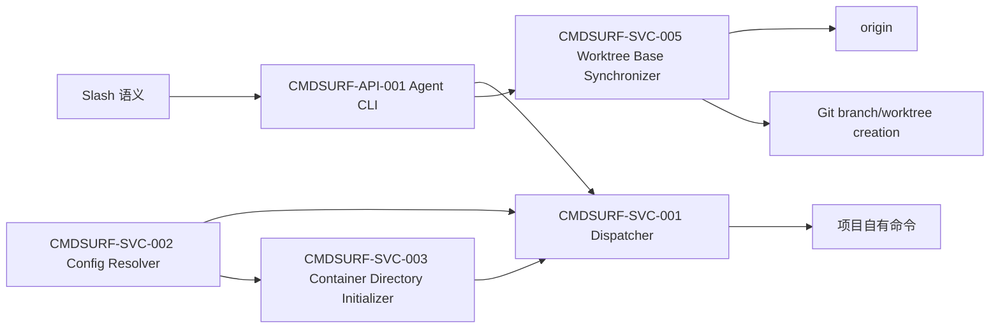

# 模板命令面架构说明

> 模块 ID：`CMDSURF`  
> 状态：Accepted  
> 负责人：@template-maintainers  
> 最后更新：2026-09-01
> 对应 PRD：[`US-CMDSURF-001~007`](../../prd-modules/template-command-surface/PRD.md)

## 1. 摘要

目标是以单一模板执行面覆盖本地服务、客户端开发、客户端构建和环境部署。模板配置登记稳定的规范 alias，项目实现或覆盖 alias；产品参数继续外置。非目标是规定具体客户端框架或真实部署实现。

| ID | 决策 | 原因 | 状态 |
| --- | --- | --- | --- |
| ADR-001 | 扩展现有 Agent CLI 和 DevOps dispatcher | 保持单一执行面与证据模型 | Accepted |
| ADR-003 | 在共享配置层提供显式、按需的容器目录初始化器 | 统一路径校验与失败语义，同时避免配置读取产生副作用 | Accepted |
| ADR-004 | 任务输入语义集中在 `AGENTS.md`，`createTask()` 只强制 mutation 显式验收 | 以最小模板改动同时获得上下文补齐和可执行门禁，并保持只读任务兼容 | Accepted |
| ADR-005 | 全新 worktree 默认 required fetch 并从固定远端 base SHA 创建；现有 `--skip-fetch` 是唯一离线逃生口 | 防止陈旧 remote-tracking ref 或任意 HEAD 被误报为最新基线，同时保持显式离线能力 | Accepted |

## 2. 上下文与边界

职责：解析稳定动作、校验平台/profile/环境、精确选择配置、执行并输出证据。不负责定义端口、服务名、框架、数据库或签名策略。

## 3. 组件设计

### 组件/服务清单

| 组件 ID | 组件 | 职责 | 输入 | 输出 | 所有者 |
| --- | --- | --- | --- | --- | --- |
| CMDSURF-API-001 | Agent CLI Router | 将 `app dev/build` 等路由为执行器动作 | CLI argv | action argv | 模板 |
| CMDSURF-SVC-001 | Command Dispatcher | 维度校验、执行、结构化结果 | action/platform/target/env | STATUS 与运行证据 | 模板 |
| CMDSURF-SVC-002 | Config Resolver | 从合并配置精确选择命令 | `app.commands`、`devServer.commands`、`devops.commands` | command 或空 | 模板 |
| CMDSURF-SVC-003 | Container Directory Initializer | 对声明的容器目录执行解析、拓扑校验、递归创建与真实目录复核 | config、main root、目录 key 集合 | 已校验绝对路径或明确错误 | 模板 |
| CMDSURF-SVC-004 | Task State Manager | 校验 mutation 显式验收并持久化任务目标、步骤与验收 | task type、goal、acceptance | task state 或明确错误 | 模板 |
| CMDSURF-SVC-005 | Worktree Base Synchronizer | 在创建副作用前刷新并解析远端 base，或在显式 skip 时解析缓存 remote/local base；输出固定 commit SHA 与新鲜度 | main root、base branch、skip flag | base ref、base commit、fetch status、freshness 或明确错误 | 模板 |

关键调用链：CLI 标准化参数 → Dispatcher 校验必需维度 → Config Resolver 精确查找 → 按动作声明并初始化所需容器目录 → 项目命令执行 → 记录结果。

初始化策略：

- `resolveContainerPath()` 保持纯解析、无文件系统副作用。
- 新增显式初始化接口，只接受白名单 key：`worktrees`、`tmp`、`cache`、`artifacts`；内部先复用拓扑校验与绝对路径解析，再以 recursive 方式创建，并用 `lstat` 拒绝文件或符号链接冒充目录。
- 状态/worktree/template 命令只声明自身写入的目录；构建、CI、发布等项目命令在启动前声明 `tmp`、`cache`、`artifacts`，并通过环境变量获得同一批已初始化绝对路径。
- 只读列表、状态审计或单纯配置加载不调用初始化接口。

任务输入策略：`AGENTS.md` 是短提示词补齐、最小提问与修改前验收门禁的唯一语义入口；`docs/CONVENTIONS.md` 只保留命令示例和入口引用。`createTask()` 在任何状态写入前拒绝缺少显式验收的 mutation；`diagnose`、`research`、`operation` 沿用目标回退，不新增状态 schema 或 CLI 参数。

Worktree 基线策略：请求与恢复态预检先于网络和文件系统副作用；全新创建的默认路径必须成功执行 `git fetch --prune origin`，随后严格解析 `refs/remotes/origin/<base>^{commit}`。创建命令使用解析出的 commit SHA，不再使用可能被并发 fetch 改写的符号 ref。`--skip-fetch` 只允许缓存 remote base 或本地 base，输出 `BASE_FRESHNESS=UNVERIFIED`；两者都不存在时阻断，禁止回退任意 `HEAD`。dry-run 与已有 worktree resume 不 fetch、不改变已有分支。

## 4. 接口视图

### 提供的接口

| 名称 | 请求 | 响应 | 错误 |
| --- | --- | --- | --- |
| `app dev` | `--platform=<platform> [--target=<profile>]` | 结构化执行结果 | missing platform/config |
| `app build` | `--platform=<platform> [--target=<profile>]` | 结构化执行结果 | missing platform/config |
| `dev restart` | 可选内部 `--target=<profile>` | 结构化执行结果 | missing profile config |
| `task start` | `--type=<type> --desc=<goal> [--acceptance=<criterion>]` | task state | mutation 缺少显式 acceptance 时拒绝创建 |
| `worktree new` | identity/phase 与可选 `--skip-fetch` | `FETCH_STATUS`、`BASE_REF`、`BASE_COMMIT`、`BASE_FRESHNESS`、worktree 路径 | 默认 fetch/base 失败或 skip 无可用 configured base 时拒绝创建 |

用户快捷语法将 `/private restart` 翻译为内部 `dev restart --target=private`；模板文档不把后者呈现为用户快捷命令。

### 依赖的接口

| 依赖 | 合约 | 失败行为 |
| --- | --- | --- |
| `loadConfig()` | CLI > env > project > template defaults | 配置无效时阻断 |
| 项目命令 | shell command string | 非零退出转 `STATUS=BLOCKED` |
| 容器路径解析 | `resolveContainerPath()` | 越界路径阻断 |
| 容器目录初始化 | 显式目录 key 集合；返回绝对路径映射 | 非白名单 key、非法拓扑、非目录目标或创建失败时阻断 |
| Git `origin` 与 configured base | 默认在线刷新并解析 `refs/remotes/origin/<base>^{commit}` | fetch、鉴权、remote 或 base ref 失败时在创建副作用前阻断 |

兼容策略：`config.example.json` 提供完整默认矩阵，项目稀疏 `agent.config.json` 通过深合并继承并可在任意叶级覆盖；已有 package aliases 不删除。项目显式选择未知 profile、平台或环境时不跨维度回退。

## 5. 数据视图

### 数据资产表

| 表名 | 类型 | 关键字段 | 保留策略 |
| --- | --- | --- | --- |
| `app.commands` | JSON 配置，不是数据库表 | action → platform → profile → command | 模板登记规范 alias 默认值；项目稀疏覆盖 |
| `devops-runs/result.json` | 临时运行证据 | action/platform/target/command/cwd/status | 容器 tmp 策略 |
| Worktree base result | 进程内证据，不新增持久 schema | fetchStatus/baseRef/baseCommit/freshness | CLI 返回后不单独保留；branch HEAD 提供确定性 Git 证据 |

无 schema 迁移、事务、并发写入或业务数据保留变化。

## 6. 质量属性

| 属性 | 可测目标 | 设计措施 | 验证方式 |
| --- | --- | --- | --- |
| 可靠性 | 不发生跨 profile 回退 | 精确嵌套选择 | 负向单元测试 |
| 可移植性 | 0 个产品硬编码参数且完整矩阵可继承 | 规范 alias 默认值 + 项目叶级覆盖 | 内容扫描与枚举契约测试 |
| 可观测性 | 每次执行有结构化字段 | 复用 run directory | 集成测试 |
| 兼容性 | 既有 dev/ship 测试全部通过 | 增量 action 分支 | 回归测试 |
| 可恢复性 | 缺目录首次写入成功，重复调用不改已有内容 | 共享显式初始化器 + recursive mkdir + lstat | 缺失/已存在/文件占位/只读场景测试 |
| 输入完整性 | mutation 状态均含显式可观察验收 | 文档语义门禁 + 创建时 fail closed | 单元测试与模板内容扫描 |
| 基线一致性 | 默认新 worktree HEAD 100% 等于本次 fetch 后解析的远端 base commit | required fetch + `rev-parse --verify <ref>^{commit}` + SHA 创建 | bare remote 集成测试与 HEAD 比对 |

## 7. 安全与隐私

不新增身份或权限。远端操作继续复用 `buildGitHubGitEnv()`，不得把 token、HTTP header 或完整敏感 stderr 写入结构化输出。命令字符串只来自受版本控制的配置或既有环境覆盖；显式 profile 不得回退 default。

## 8. 部署与运行

无新部署单元、daemon 或端口。模板更新通过 manifest 传播；真实客户端和服务端命令由目标项目执行并负责其健康/产物验收。

## 9. 可测试性

| 层级 | 合约或场景 | 测试类型 | 证据 |
| --- | --- | --- | --- |
| 单元 | CLI 路由、配置选择、缺失维度 | Node unit | `agent-cli`、`devops-run` tests |
| 集成 | dry-run 结构化输出 | process integration | dispatcher test |
| 系统 | 模板 apply 所有权与收敛 | template integration | update-template test + 目标 dry-run |
| 单元/集成 | 四类容器目录缺失、重复初始化和非法目标 | Node unit/process integration | shared config、worktree、task、devops tests |
| 集成 | 远端 base 前进、默认 fetch、固定 SHA 创建 | local bare Git remote | worktree-core tests |
| 负向集成 | fetch 失败、远端 base 缺失、skip 无缓存/local base | local invalid/bare Git remote | 无 branch/worktree/session 副作用断言 |
| 兼容 | dry-run、已有 worktree resume、显式 skip | Node process integration | 不 fetch、不改变已有 HEAD |

## 10. 风险与验证表

| ID | 风险类型 | 影响 | 缓解/负责人 | 截止 |
| --- | --- | --- | --- | --- |
| R-001 | profile fallback | 操作错误目标 | 精确查找 + @template-maintainers | TDD Gate |
| R-002 | alias 实现缺失 | 配置可解析但项目脚本执行失败 | 模板只登记规范名称；目标项目负责实现或覆盖，传播验收检查目标 alias | ARCH/QA Gate |
| R-003 | project-owned overwrite | 目标行为损坏 | manifest 收敛测试 + @qa | QA Gate |
| R-004 | 配置读取隐式创建目录 | 只读命令污染文件系统 | 解析与初始化 API 分离，只在写入边界显式调用 | TDD Gate |
| R-005 | 文件或链接冒充容器目录 | 写入越界或状态损坏 | `lstat` 复核真实目录，异常 fail closed | TDD Gate |
| R-006 | 把用户原始目标机械复制为验收 | 任务看似完整但不可验证 | mutation 禁止目标回退；文档要求可观察验收 | TDD Gate |
| R-007 | fetch 失败仍使用陈旧缓存 | 新任务起点不可证明 | 默认 fetch 失败即阻断；缓存只由显式 skip 使用 | TDD Gate |
| R-008 | base ref 在解析与创建之间变化 | 记录 SHA 与实际 HEAD 不一致 | 创建命令使用已解析的 commit SHA，并在测试中比对 HEAD | TDD Gate |

## 11. 实现约束

- 必须：模板配置登记 mac、win、ios、android 的 dev/build 默认与 private 变体、本地服务五项生命周期默认与 private 变体、dev/staging/prod 服务端 build 默认与 private 变体。
- 必须：`ship` 只保留配置槽且无可执行默认值；显式清空或未知维度时 `STATUS=BLOCKED`。
- 禁止：在模板中写入 XiaoLan 名称、端口、URL、脚本或签名参数。
- 可选：项目通过同名 package aliases 实现规范名称，或在 `agent.config.json` 覆盖为项目命令。
- TASK 拆分提示：先负向测试，再路由和选择器实现，最后传播验收。
- 必须：容器目录初始化集中于共享 helper；调用方声明目录需求，禁止复制散落的 `mkdir` 与 `../tmp` 路径猜测。
- 必须：项目命令启动前提供已创建的 `AGENT_TMP_DIR`、`AGENT_CACHE_DIR`、`AGENT_ARTIFACTS_DIR`；只读命令不触发全量目录创建。
- 必须：mutation 任务只有显式 `--acceptance` 才可创建；`diagnose`、`research`、`operation` 保持目标回退。
- 禁止：为短提示词补齐新增 schema、CLI 参数或重复的专家规则。
- 必须：全新 worktree 默认 fetch `origin` 成功且远端 base commit 可解析后才能创建 branch/worktree/session。
- 必须：新分支以解析出的 commit SHA 创建，并输出 `FETCH_STATUS=OK`、`BASE_REF`、`BASE_COMMIT`、`BASE_FRESHNESS=VERIFIED`。
- 必须：`--skip-fetch` 继续作为兼容入口，只允许缓存 remote base 或本地 base，输出 `BASE_FRESHNESS=UNVERIFIED`。
- 禁止：默认 fetch 失败后继续、回退任意 `HEAD`、在 resume 中 fetch/rebase，或新增 remote/policy/retry 配置面。

## 12. Story/Component 追溯表

| Story | Component |
| --- | --- |
| US-CMDSURF-001 | CMDSURF-API-001、CMDSURF-SVC-001 |
| US-CMDSURF-002 | CMDSURF-API-001、CMDSURF-SVC-002 |
| US-CMDSURF-003 | CMDSURF-SVC-001、CMDSURF-SVC-002 |
| US-CMDSURF-004 | CMDSURF-SVC-002、模板 manifest |
| US-CMDSURF-005 | CMDSURF-SVC-003、CMDSURF-SVC-001 |
| US-CMDSURF-006 | CMDSURF-SVC-004、AGENTS 任务输入规则、Codex 配置模板 |
| US-CMDSURF-007 | CMDSURF-API-001、CMDSURF-SVC-005、Git origin/base 与 worktree lifecycle |

## 13. 完成检查

- [x] PRD Story/AC 均有架构落点。
- [x] 边界、合约、数据和失败路径明确。
- [x] 安全、兼容和可观测性可测试。
- [x] 无迁移或新部署单元。
- [x] 风险有验证 Gate。
