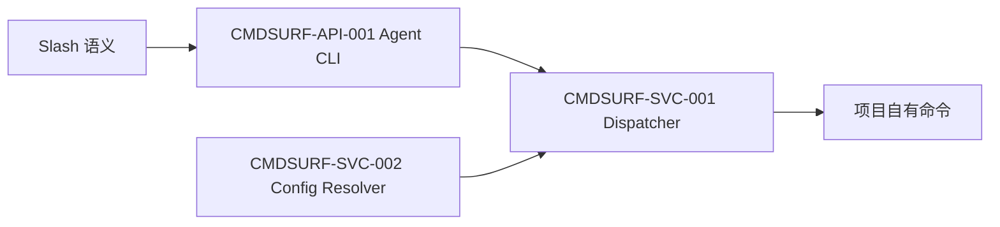

# 模板命令面架构说明

> 模块 ID：`CMDSURF`  
> 状态：Accepted  
> 负责人：@template-maintainers  
> 最后更新：2026-08-23  
> 对应 PRD：[`US-CMDSURF-001~004`](../../prd-modules/template-command-surface/PRD.md)

## 1. 摘要

目标是以单一模板执行面覆盖本地服务、客户端开发、客户端构建和环境部署，同时保持项目命令与产品参数外置。非目标是创造新的 shell alias 体系或规定具体客户端框架。

| ID | 决策 | 原因 | 状态 |
| --- | --- | --- | --- |
| ADR-001 | 扩展现有 Agent CLI 和 DevOps dispatcher | 保持单一执行面与证据模型 | Accepted |

## 2. 上下文与边界

职责：解析稳定动作、校验平台/profile/环境、精确选择配置、执行并输出证据。不负责定义端口、服务名、框架、数据库或签名策略。

## 3. 组件设计

### 组件/服务清单

| 组件 ID | 组件 | 职责 | 输入 | 输出 | 所有者 |
| --- | --- | --- | --- | --- | --- |
| CMDSURF-API-001 | Agent CLI Router | 将 `app dev/build` 等路由为执行器动作 | CLI argv | action argv | 模板 |
| CMDSURF-SVC-001 | Command Dispatcher | 维度校验、执行、结构化结果 | action/platform/target/env | STATUS 与运行证据 | 模板 |
| CMDSURF-SVC-002 | Config Resolver | 从合并配置精确选择命令 | `app.commands`、`devServer.commands`、`devops.commands` | command 或空 | 模板 |

关键调用链：CLI 标准化参数 → Dispatcher 校验必需维度 → Config Resolver 精确查找 → 项目命令执行 → 记录结果。

## 4. 接口视图

### 提供的接口

| 名称 | 请求 | 响应 | 错误 |
| --- | --- | --- | --- |
| `app dev` | `--platform=<platform> [--target=<profile>]` | 结构化执行结果 | missing platform/config |
| `app build` | `--platform=<platform> [--target=<profile>]` | 结构化执行结果 | missing platform/config |
| `dev restart` | 可选内部 `--target=<profile>` | 结构化执行结果 | missing profile config |

用户快捷语法将 `/private restart` 翻译为内部 `dev restart --target=private`；模板文档不把后者呈现为用户快捷命令。

### 依赖的接口

| 依赖 | 合约 | 失败行为 |
| --- | --- | --- |
| `loadConfig()` | CLI > env > project > template defaults | 配置无效时阻断 |
| 项目命令 | shell command string | 非零退出转 `STATUS=BLOCKED` |
| 容器路径解析 | `resolveContainerPath()` | 越界路径阻断 |

兼容策略：既有 `devServer` 和 `devops` 配置不变；新增 `app.commands` 为可选扩展。已有 package aliases 不删除。

## 5. 数据视图

### 数据资产表

| 表名 | 类型 | 关键字段 | 保留策略 |
| --- | --- | --- | --- |
| `app.commands` | JSON 配置，不是数据库表 | action → platform → profile → command | 项目版本控制；模板仅提供空默认值 |
| `devops-runs/result.json` | 临时运行证据 | action/platform/target/command/cwd/status | 容器 tmp 策略 |

无 schema 迁移、事务、并发写入或业务数据保留变化。

## 6. 质量属性

| 属性 | 可测目标 | 设计措施 | 验证方式 |
| --- | --- | --- | --- |
| 可靠性 | 不发生跨 profile 回退 | 精确嵌套选择 | 负向单元测试 |
| 可移植性 | 0 个产品硬编码参数 | 空模板默认值 + 项目配置 | 内容扫描 |
| 可观测性 | 每次执行有结构化字段 | 复用 run directory | 集成测试 |
| 兼容性 | 既有 dev/ship 测试全部通过 | 增量 action 分支 | 回归测试 |

## 7. 安全与隐私

不新增身份、权限或外部接口。命令字符串只来自受版本控制的配置或既有环境覆盖；输出不得展开凭据。显式 profile 不得回退 default。

## 8. 部署与运行

无新部署单元、daemon 或端口。模板更新通过 manifest 传播；真实客户端和服务端命令由目标项目执行并负责其健康/产物验收。

## 9. 可测试性

| 层级 | 合约或场景 | 测试类型 | 证据 |
| --- | --- | --- | --- |
| 单元 | CLI 路由、配置选择、缺失维度 | Node unit | `agent-cli`、`devops-run` tests |
| 集成 | dry-run 结构化输出 | process integration | dispatcher test |
| 系统 | 模板 apply 所有权与收敛 | template integration | update-template test + 目标 dry-run |

## 10. 风险与验证表

| ID | 风险类型 | 影响 | 缓解/负责人 | 截止 |
| --- | --- | --- | --- | --- |
| R-001 | profile fallback | 操作错误目标 | 精确查找 + @template-maintainers | TDD Gate |
| R-002 | alias proliferation | 命令事实源漂移 | 不扩张 package scripts + @template-maintainers | ARCH Gate |
| R-003 | project-owned overwrite | 目标行为损坏 | manifest 收敛测试 + @qa | QA Gate |

## 11. 实现约束

- 必须：新增配置结构保持空默认值；缺失命令 `STATUS=BLOCKED`。
- 禁止：在模板中写入 XiaoLan 名称、端口、URL、脚本或签名参数。
- 可选：项目继续保留 `/private ...` package aliases。
- TASK 拆分提示：先负向测试，再路由和选择器实现，最后传播验收。

## 12. Story/Component 追溯表

| Story | Component |
| --- | --- |
| US-CMDSURF-001 | CMDSURF-API-001、CMDSURF-SVC-001 |
| US-CMDSURF-002 | CMDSURF-API-001、CMDSURF-SVC-002 |
| US-CMDSURF-003 | CMDSURF-SVC-001、CMDSURF-SVC-002 |
| US-CMDSURF-004 | CMDSURF-SVC-002、模板 manifest |

## 13. 完成检查

- [x] PRD Story/AC 均有架构落点。
- [x] 边界、合约、数据和失败路径明确。
- [x] 安全、兼容和可观测性可测试。
- [x] 无迁移或新部署单元。
- [x] 风险有验证 Gate。
