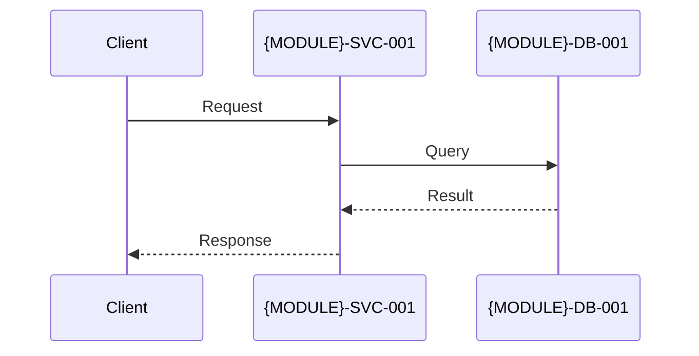
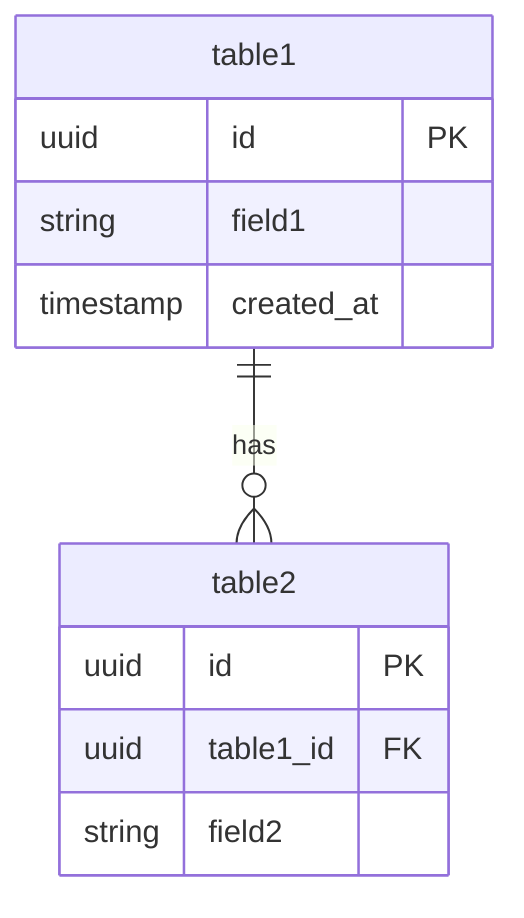

# {模块名称} - 架构模块

> 所属主架构：[ARCHITECTURE.md](../ARCHITECTURE.md)

**日期**：YYYY-MM-DD
**版本**：v0
**状态**：📝 草稿

---

## 1. 模块概述

**功能范围**：
- （列出本模块负责的业务能力）
- （引用核心用户故事，如 `US-{MODULE}-001`）

**负责团队**：
- @team-name
- 联系人：@tech-lead

**依赖的模块**：
| 被依赖模块 | 依赖类型 | 用途 | 降级策略 |
|-----------|---------|------|---------|
| （示例）通知服务 | 异步消息 | 邮件通知 | 失败时异步重试 3 次 |

---

## 2. C4 架构视图

### 2.1 Container 视图

```mermaid
graph TB
    MODULE_SVC[{MODULE}-SVC-001<br/>服务名称<br/>技术栈]
    MODULE_DB[({MODULE}-DB-001<br/>数据库<br/>PostgreSQL)]
    MODULE_CACHE[{MODULE}-CACHE-001<br/>缓存<br/>Redis]
    
    MODULE_SVC --> MODULE_DB
    MODULE_SVC --> MODULE_CACHE
```

**容器清单**：
| 容器 ID | 容器名称 | 技术栈 | 运行环境 | 说明 |
|---------|---------|--------|---------|------|
| {MODULE}-SVC-001 | 服务名称 | Node.js 18 + Express | ECS Fargate | REST API 服务 |
| {MODULE}-DB-001 | 数据库 | PostgreSQL 15 | RDS | 数据存储 |

### 2.2 Component 视图（可选）

```mermaid
graph TB
    subgraph MODULE_SVC["{MODULE}-SVC-001 服务"]
        Controller[Controller]
        Service[Service]
        Repository[Repository]
        
        Controller --> Service
        Service --> Repository
    end
    
    Repository --> MODULE_DB[({MODULE}-DB-001)]
```

---

## 3. 运行时视图

### 3.1 关键流程时序图



**流程说明**：
1. （步骤 1 说明）
2. （步骤 2 说明）

**异常处理**：
- （异常场景 1）
- （异常场景 2）

---

## 4. 数据视图

### 4.1 模块内实体关系



### 4.2 核心数据表

| 表名 | 用途 | 主键 | 重要字段 | 索引策略 |
|------|------|------|---------|---------|
| table1 | 数据表 1 | id (UUID) | field1, created_at | idx_field1 |

### 4.3 索引策略

**查询热点**：
- field1：（查询场景说明）

**复合索引**：
- (field1, field2)：（查询场景说明）

### 4.4 事务边界

**强一致性**：
- （场景 1）

**最终一致性**：
- （场景 2）

### 4.5 容量与保留

**预估数据量**：
- table1：10,000（第一年）

**增长率**：20% MoM

**数据保留**：
- table1：永久保留

### 4.6 备份与恢复

**备份频率**：每日全量备份
**RTO/RPO**：< 4h / < 1h

---

## 5. 接口视图

### 5.1 提供的接口（Exports）

**POST /api/v1/endpoint**

**Request**：
```json
{
  "field1": "value1"
}
```

**Response（Success）**：
```json
{
  "code": 0,
  "message": "成功",
  "data": {}
}
```

**Error Codes**：
| 错误码 | HTTP 状态 | 含义 | 处理建议 |
|--------|----------|------|---------|
| 1001 | 400 | 参数错误 | 检查请求参数 |

**幂等性**：是/否
**限流**：10 req/min/IP
**SLA**：P95 < 500ms，可用性 99.5%

### 5.2 依赖的接口（Imports）

| 接口名称 | 提供方 | 接口路径 | 用途 | 降级策略 |
|---------|--------|---------|------|---------|
| （示例）发送通知 | 通知模块 | POST /api/notifications | 发送通知 | 异步重试 3 次 |

### 5.3 事件订阅/发布（可选）

**发布的事件**：EventName

```typescript
interface EventNameEvent {
  eventId: string;
  eventName: "EventName";
  timestamp: string;
  version: "1.0";
  data: {};
}
```

---

## 6. 运维视图

### 6.1 部署拓扑

```mermaid
graph TB
    ALB[Load Balancer]
    ALB --> SVC_1[{MODULE}-SVC-001 实例 1]
    ALB --> SVC_2[{MODULE}-SVC-001 实例 2]
    SVC_1 --> DB[({MODULE}-DB-001)]
    SVC_2 --> DB
```

### 6.2 弹性策略

**水平扩展**：
- 最小实例数：2
- 最大实例数：10
- 触发条件：CPU > 70%（持续 5 分钟）

**降级策略**：
- （降级场景 1）

### 6.3 监控指标

**系统指标**：
- CPU 使用率：< 70%
- 内存使用率：< 80%

**业务指标**：
- 成功率：> 95%
- 响应时间：P95 < 500ms

### 6.4 SLO（服务等级目标）

| 指标 | 目标 | 测量方式 |
|------|------|---------|
| 可用性 | 99.5%（月度） | Uptime Robot + 自定义健康检查 |
| 响应时间 | P95 < 500ms | APM 工具统计 |

### 6.5 告警规则

| 告警名称 | 触发条件 | 严重级别 | 通知渠道 |
|---------|---------|---------|---------|
| CPU 使用率过高 | CPU > 85%（持续 10 分钟） | P2（高） | Slack |

---

## 7. 安全与合规

### 7.1 身份与权限

**认证**：
- JWT Token（有效期 7 天）

**授权**：
- RBAC（角色：Admin、User、Guest）

### 7.2 审计

**操作日志**：
- 记录所有写操作
- 保留期：90 天

### 7.3 数据安全

**传输加密**：HTTPS (TLS 1.2+)
**存储加密**：敏感字段使用 AES-256

### 7.4 合规要求

- GDPR：支持数据导出与删除
- PIPL：符合数据最小化原则

---

## 8. 技术选型与 ADR

### 8.1 模块技术栈

| 层次 | 技术选择 | 理由 | ADR 链接 |
|------|---------|------|---------|
| 语言/框架 | Node.js 18 + Express | 团队熟悉、高性能 | [ADR-001-{module}-framework](../adr/001-{module}-framework.md) |
| 数据库 | PostgreSQL 15 | ACID、全文检索 | [ADR-002-{module}-database](../adr/002-{module}-database.md) |

### 8.2 关键技术决策

详见 `/docs/adr/` 目录下的模块级 ADR 文档（格式：`NNN-{module}-*.md`）。

---

## 9. 外部依赖

### 9.1 依赖的模块

| 模块名称 | 依赖类型 | 接口/事件 | 说明 | 降级策略 |
|---------|---------|----------|------|---------|
| （示例）通知服务 | 异步消息 | POST /api/notifications | 发送通知 | 异步重试 3 次 |

### 9.2 依赖的外部服务

| 服务名称 | 用途 | 文档链接 | 降级策略 |
|---------|------|---------|---------|
| AWS Secrets Manager | 密钥管理 | [AWS Docs](https://aws.amazon.com/secrets-manager/) | 本地缓存 24 小时 |

---

## 10. 变更记录

| 版本 | 日期 | 变更类型 | 变更描述 | 负责人 |
|------|------|---------|---------|--------|
| v0 | YYYY-MM-DD | 新增 | 初始版本 | @architect |

---

## 11. 相关文档

- [主架构文档](../ARCHITECTURE.md)
- [模块索引](README.md)
- [全局数据目录](../data/README.md)
- [ADR 目录](../adr/)

---

> 本模块架构文档由 ARCHITECTURE 专家编写和维护。
