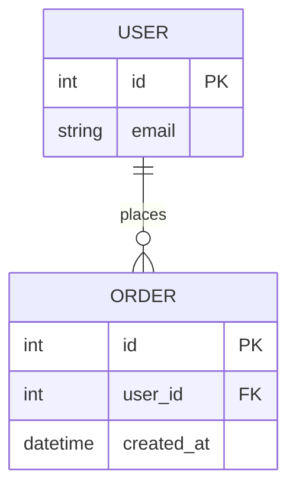

# 实体关系图（ERD）

> **用途**：全局数据模型可视化，展示核心实体及其关系
> **维护者**：ARCHITECTURE 专家
> **最后更新**：2025-11-08
> **适用阶段**：ARCHITECTURE_DEFINED 后

---

## 数据模型

---

## 实体说明

### USER（用户表）
- **主键**：`id`（int）
- **字段**：
  - `email`（string）— 用户邮箱，唯一索引

### ORDER（订单表）
- **主键**：`id`（int）
- **外键**：`user_id` → `USER.id`
- **字段**：
  - `created_at`（datetime）— 订单创建时间

---

## 关系说明

| 关系 | 类型 | 描述 |
|------|------|------|
| USER → ORDER | 一对多（1:N） | 一个用户可以下多个订单 |

---

## 维护指南

- **更新时机**：数据库表结构变更时（增删表、修改字段、调整关系）
- **更新流程**：
  1. 在 mermaid 代码块中更新实体定义
  2. 同步更新"实体说明"和"关系说明"表格
  3. 更新"最后更新"时间戳
- **验证**：确认在 VSCode/GitHub 中预览正常

---

## 参考

- [Mermaid ERD 语法文档](https://mermaid.js.org/syntax/entityRelationshipDiagram.html)
- 关联文档：[/docs/ARCHITECTURE.md](../ARCHITECTURE.md) § 数据视图
