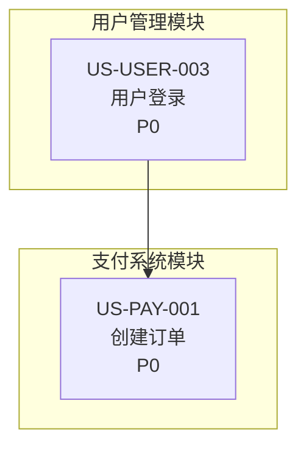

# 全局数据目录说明（/docs/data/）

> **用途**：存放跨模块、全局级别的需求管理数据与追溯文档
> **更新日期**：2025-11-05
> **版本**：v1.8+

---

## 📂 目录结构

```
/docs/data/
  README.md                          # 本文件：目录说明

  # 全局追溯与管理
  traceability-matrix.md             # 全局追溯矩阵（Story → AC → Test ID）
  goal-story-mapping.md              # 全局业务目标映射（Story → OKR）
  persona-story-matrix.md            # 全局角色覆盖矩阵（用户角色 × Story）

  # 全局依赖与架构
  global-dependency-graph.mmd        # 跨模块依赖关系图（Mermaid 格式）
  dependency-graph-README.md         # 依赖图使用说明
  component-dependency-graph.mmd     # 跨模块组件依赖图（架构层级，Component ID 追溯）
  ERD.mmd                            # 全局 ER 图（实体关系图）
  dictionary.md                      # 数据字典（全局实体与字段定义）

  # 变更管理
  change-requests/                   # 变更请求流程
    README.md                        # CR 流程说明
    CR-TEMPLATE.md                   # CR 模板
    CR-YYYYMMDD-NNN.md               # 具体 CR 记录

  # 其他
  scrs/                              # 软件变更请求（SCR）
```

---

## 🔍 全局数据 vs 模块数据

### 本目录（data/）仅存放全局/跨模块数据：

| 文件 | 范围 | 说明 |
|------|------|------|
| `traceability-matrix.md` | **全局** | 所有模块的 Story → AC → Test Case ID 映射，QA 专家集中维护 |
| `global-dependency-graph.mmd` | **跨模块** | 跨模块依赖关系（如 US-USER-003 → US-PAY-001），PRD 专家维护 |
| `component-dependency-graph.mmd` | **跨模块** | 跨模块组件依赖关系（如 PAY-SVC-001 → USER-SVC-001），ARCH 专家维护 |
| `goal-story-mapping.md` | **全局** | 所有模块 Story 与业务目标（OKR）的映射关系 |
| `persona-story-matrix.md` | **全局** | 所有用户角色 × 所有 Story 的覆盖矩阵 |
| `change-requests/` | **全局** | 影响多个模块的变更请求流程 |
| `ERD.mmd` | **全局** | 跨模块的实体关系图（数据库设计） |
| `dictionary.md` | **全局** | 共享数据实体与字段定义 |

### 模块内部数据存放在 prd-modules/{domain}/：

| 文件 | 范围 | 说明 |
|------|------|------|
| `dependency-graph.mmd` | **模块内** | 模块内 Story 的依赖关系（如 US-USER-001 → US-USER-003） |
| `nfr-tracking.md` | **模块级** | 模块的 NFR 追踪表（性能、安全、可用性等指标） |
| `priority-matrix.md` | **模块级** | 模块内 Story 的优先级评分矩阵 |

**❌ 不应在此目录存放的内容**：
- 模块内部的依赖图 → 放入 `prd-modules/{domain}/dependency-graph.mmd`
- 模块级的 NFR 追踪 → 放入 `prd-modules/{domain}/nfr-tracking.md`
- 模块级的优先级矩阵 → 放入 `prd-modules/{domain}/priority-matrix.md`

---

## 📋 文件详细说明

### 1. traceability-matrix.md — 全局追溯矩阵

**作用**：集中维护所有模块的 Story → AC → Test Case ID 映射，便于 QA 专家验证覆盖率

**格式**：
```markdown
| Story ID | Story Title | AC ID | Test Case ID | 状态 | 负责人 | 备注 |
|----------|-------------|-------|--------------|------|--------|------|
| US-USER-001 | 用户注册 | AC-USER-001-01 | TC-REG-001 | ✅ Pass | @tester-a | - |
| US-PAY-005 | 支付确认 | AC-PAY-005-01 | TC-PAY-012 | ❌ Fail | @tester-b | [BUG-123](#) |
```

**维护者**：QA 专家（测试执行过程中更新状态）

---

### 2. global-dependency-graph.mmd — 跨模块 Story 依赖图

**作用**：可视化跨模块的 Story 依赖关系，识别关键路径与团队协作点

**格式**：Mermaid 图表

**示例**：


**维护者**：PRD 专家（需求澄清阶段）

**与模块依赖图的区别**：
- 本文件：只包含**跨模块**依赖（如 US-USER-003 → US-PAY-001）
- 模块依赖图：只包含**模块内**依赖（如 US-USER-001 → US-USER-003）

---

### 2.1 component-dependency-graph.mmd — 跨模块组件依赖图

**作用**：可视化跨模块的组件/服务依赖关系，用于架构层级的依赖追溯与影响分析

**格式**：Mermaid 图表（使用 Component ID 命名）

**示例**：
```mermaid
graph TB
    subgraph USER["用户管理模块"]
        USER_SVC_001["USER-SVC-001<br/>用户认证服务<br/>Node.js + Express"]
        USER_DB_001["USER-DB-001<br/>用户数据库<br/>PostgreSQL"]
    end

    subgraph PAY["支付系统模块"]
        PAY_SVC_001["PAY-SVC-001<br/>订单服务<br/>Node.js + Express"]
        PAY_DB_001["PAY-DB-001<br/>订单数据库<br/>PostgreSQL"]
    end

    PAY_SVC_001 -->|同步调用<br/>GET /api/users/{id}| USER_SVC_001
    USER_SVC_001 --> USER_DB_001
    PAY_SVC_001 --> PAY_DB_001
```

**维护者**：ARCH 专家（架构设计阶段）

**与 Story 依赖图的区别**：
- **global-dependency-graph.mmd**（PRD 层级）：业务功能依赖（如 US-USER-003 → US-PAY-001）
- **component-dependency-graph.mmd**（ARCH 层级）：组件/服务依赖（如 PAY-SVC-001 → USER-SVC-001）

**Component ID 命名规范**：
- 格式：`{MODULE}-{TYPE}-{序号}`
- TYPE 类型：`SVC`（服务）、`DB`（数据库）、`CACHE`（缓存）、`MQ`（消息队列）、`API`（API 端点）、`JOB`（定时任务）
- 示例：`USER-SVC-001`（用户管理服务）、`PAY-DB-001`（订单数据库）

详见 [architecture-modules/README.md](../architecture-modules/README.md)

---

### 3. goal-story-mapping.md — 全局业务目标映射

**作用**：确保所有 Story 都关联业务目标（OKR），避免"孤儿 Story"

**格式**：
```markdown
| Objective | Key Result | Story ID | 预期贡献 | 状态 |
|-----------|-----------|----------|---------|------|
| 提升新用户留存率 | 7天留存率 > 60% | US-USER-001 | +5% | 已实现 |
| 提升新用户留存率 | 7天留存率 > 60% | US-NOTIF-001 | +3% | 开发中 |
```

**维护者**：PRD 专家（需求澄清阶段）

---

### 4. persona-story-matrix.md — 全局角色覆盖矩阵

**作用**：验证每个用户角色的功能覆盖完整性，避免"孤儿角色"

**格式**：
```markdown
| Story | Admin | User | Guest | Auditor |
|-------|:-----:|:----:|:-----:|:-------:|
| US-USER-001: 注册 | - | ✅ | ✅ | - |
| US-USER-003: 登录 | ✅ | ✅ | - | ✅ |
| US-PAY-001: 创建订单 | ⚙️ | ✅ | - | 🔍 |
```

**图例**：
- ✅ 主要使用者
- 🔍 查看权限
- ⚙️ 配置权限
- - 不涉及

**维护者**：PRD 专家（需求澄清阶段）

---

### 5. change-requests/ — 变更请求流程

**作用**：结构化管理需求变更，追踪影响范围与多专家审批

**内容**：
- `README.md` — CR 流程说明（Draft → Under Review → Approved → Implemented → Closed）
- `CR-TEMPLATE.md` — CR 模板（包含变更原因、影响分析、审批记录）
- `CR-YYYYMMDD-NNN.md` — 具体 CR 记录

**维护者**：PRD 专家（需求变更发生时）

---

### 6. ERD.mmd — 全局 ER 图

**作用**：定义跨模块的实体关系模型（数据库设计）

**格式**：Mermaid ER 图

**维护者**：ARCHITECTURE 专家

---

### 7. dictionary.md — 数据字典

**作用**：定义跨模块共享的数据实体与字段

**格式**：
```markdown
## User（用户）
| 字段 | 类型 | 必填 | 说明 |
|------|------|------|------|
| user_id | UUID | 是 | 用户唯一标识 |
| email | String | 是 | 用户邮箱 |
```

**维护者**：ARCHITECTURE 专家

---

## 🔗 与模块数据的协作关系

### 工作流示例：新增一个 Story

1. **PRD 专家**在模块 PRD（`prd-modules/{domain}/PRD.md`）中定义 Story 和 AC
2. **PRD 专家**在模块依赖图（`prd-modules/{domain}/dependency-graph.mmd`）中添加模块内依赖
3. **PRD 专家**在 `data/global-dependency-graph.mmd` 中添加跨模块依赖（如有）
4. **PRD 专家**在 `data/goal-story-mapping.md` 中关联业务目标
5. **PRD 专家**在 `data/persona-story-matrix.md` 中标记角色权限
6. **TDD 专家**实现 Story 后，在 `data/traceability-matrix.md` 中添加 Test Case ID
7. **QA 专家**执行测试后，更新 `data/traceability-matrix.md` 的状态（✅ Pass / ❌ Fail）

---

## 🛠️ 自动化脚本

项目已提供以下脚本扫描全局数据：

### 1. PRD 完整性检查
```bash
npm run prd:lint
```
**检查**：追溯矩阵、全局依赖图是否存在

### 2. 依赖循环检查
```bash
npm run prd:check-dependency-cycles
```
**检查**：全局依赖图中的循环依赖

### 3. NFR 达标检查
```bash
npm run nfr:check-compliance
```
**检查**：所有模块的 NFR 追踪表达标率

---

## 📚 相关资源

- [STRUCTURE-GUIDE.md](../prd-modules/STRUCTURE-GUIDE.md) — 模块内部结构指南
- [CONVENTIONS.md](../CONVENTIONS.md) — 项目目录规范
- [PRD-ENHANCEMENT-ROADMAP.md](../PRD-ENHANCEMENT-ROADMAP.md) — 增强功能实施路线图

---

> 本目录遵循"高内聚、低耦合"原则，仅存放真正全局的数据。模块内部数据请放入对应的 `prd-modules/{domain}/` 目录。
