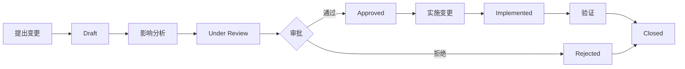

# 需求变更请求（Change Request）管理

> **目的**：结构化管理 PRD 变更，追踪影响范围，确保变更可追溯、可审批、可验证。

---

## 变更请求流程



---

## 变更状态定义

| 状态 | 说明 | 负责人 |
|------|------|--------|
| 📝 **Draft** | 草稿，初步描述变更需求 | 提出人 |
| 🔍 **Under Review** | 审查中，已完成影响分析 | PRD 专家 + 相关专家 |
| ✅ **Approved** | 已批准，准备实施 | 审批组 |
| ❌ **Rejected** | 已拒绝，记录原因 | 审批组 |
| 🔄 **Implemented** | 已实施，等待验证 | TDD 专家 |
| 🎯 **Closed** | 已关闭（完成或取消） | QA 专家 |

---

## 变更优先级

| 优先级 | 说明 | 响应时间 |
|--------|------|---------|
| **Critical** | 阻塞性缺陷/严重安全漏洞 | 24 小时内响应 |
| **High** | 影响核心功能/多模块依赖 | 3 个工作日内响应 |
| **Medium** | 功能增强/局部优化 | 1 周内响应 |
| **Low** | 文案调整/非关键优化 | 按计划排期 |

---

## 变更分类

- **需求新增**：增加全新的用户故事或功能模块
- **需求修改**：修改现有 Story 的 AC 或范围
- **需求删除**：废弃不再需要的功能
- **技术调整**：因技术方案变化引起的需求调整
- **合规驱动**：因法律法规变化引起的需求变更

---

## 变更请求模板

每个变更请求使用独立文件：`CR-{YYMMDD}-{序号}.md`

示例：
- `CR-20251105-001.md` — 2025年11月5日第1个变更请求
- `CR-20251108-002.md` — 2025年11月8日第2个变更请求

详见：[CR-TEMPLATE.md](CR-TEMPLATE.md)

---

## 当前变更请求列表

| CR ID | 提出日期 | 变更类型 | 优先级 | 状态 | 负责人 |
|-------|---------|---------|--------|------|--------|
| （示例）CR-20251105-001 | 2025-11-05 | 需求修改 | High | ✅ Approved | @pm |
| （待填充） | - | - | - | - | - |

---

## 使用指南

### 1. 提出变更请求
任何人（PM、开发、QA、业务方）发现需求需要变更时：
1. 在本目录创建新文件：`CR-{YYMMDD}-{序号}.md`
2. 使用模板填写变更描述、原因、影响范围
3. 更新本 README 的变更列表，状态标记为 `📝 Draft`

### 2. PRD 专家进行影响分析
- 识别受影响的 Story、AC、模块 PRD
- 评估跨模块依赖影响
- 列出需要重新测试的测试用例
- 状态更新为 `🔍 Under Review`

### 3. 多专家协同审批
- **PRD 专家**：评估业务合理性、需求完整性
- **ARCH 专家**：评估技术可行性、架构影响
- **TASK 专家**：评估工作量、里程碑影响
- **QA 专家**：评估测试范围、回归风险

所有专家在 CR 文档的"审批记录"章节签字。

### 4. 实施变更
审批通过后：
1. TDD 专家按照 CR 实施代码变更
2. 同步更新：PRD、ARCHITECTURE、TASK、追溯矩阵
3. 状态更新为 `🔄 Implemented`

### 5. QA 验证与关闭
- QA 专家验证变更符合 CR 描述
- 执行回归测试
- 确认无遗漏后，状态更新为 `🎯 Closed`

---

## 变更指标统计（可选）

| 指标 | 数值 | 目标 |
|------|------|------|
| 当前开放 CR 数 | 0 | < 5 |
| 平均审批周期（High 优先级） | - | < 3 天 |
| 变更通过率 | - | > 80% |
| 变更导致的缺陷率 | - | < 5% |

---

## 与其他文档的关系

```
变更请求（CR）
  ├─ 触发 → PRD 更新（/docs/PRD.md 或 prd-modules/*.md）
  ├─ 触发 → 追溯矩阵更新（/docs/data/traceability-matrix.md）
  ├─ 可能触发 → 架构调整（/docs/ARCHITECTURE.md + ADR）
  ├─ 可能触发 → 任务调整（/docs/TASK.md）
  └─ 关联 → 测试用例更新（tests/**/*.test.ts）
```

---

## 自动化建议（可选）

### 脚本工具
```bash
# 创建新变更请求
npm run cr:new -- --type="需求修改" --priority="High"

# 检查待审批 CR
npm run cr:pending

# 生成变更影响报告
npm run cr:impact -- --id=CR-20251105-001
```

### GitHub/GitLab 集成
- 使用 Issue 模板管理 CR
- 在 PR 描述中关联 CR ID
- CI 检查：PR 必须关联有效的已批准 CR

---

> 本目录由 PRD 专家维护，所有专家协同审批。变更请求是保障大型项目需求可控变化的关键机制。
