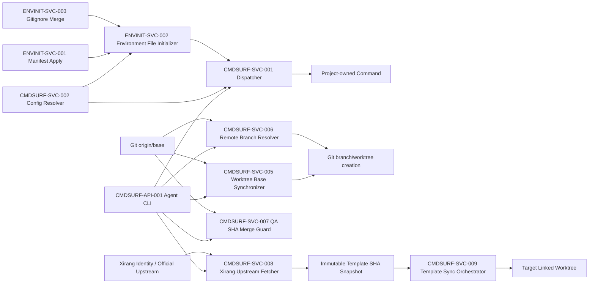

# 组件依赖图

| 组件 ID | 上游 | 下游 | 约束 |
| --- | --- | --- | --- |
| CMDSURF-API-001 | 用户/Agent | CMDSURF-SVC-001 | 只路由稳定 action |
| CMDSURF-SVC-001 | CMDSURF-API-001 | 项目命令 | 缺失配置阻断 |
| CMDSURF-SVC-002 | 合并配置 | CMDSURF-SVC-001 | 显式 profile 不回退 |
| CMDSURF-SVC-003 | CMDSURF-SVC-002、main repo root | CMDSURF-SVC-001、状态/worktree 写入器 | 显式按需创建，拒绝非目录与符号链接目标 |
| CMDSURF-SVC-005 | CMDSURF-API-001、Git origin/base、configured base branch | Git branch/worktree creation | 默认在线基线必须验证并固定为 commit SHA；显式 skip 才可使用未验证缓存 |
| CMDSURF-SVC-006 | CMDSURF-API-001、Git origin/feature | Git branch/worktree creation、本机 session | new 阻断远端同名误建；resume 从远端固定 SHA 恢复 |
| CMDSURF-SVC-007 | CMDSURF-API-001、Git origin/base/feature、GitHub PR、本地 QA 回执 | 配置主干、PR 与 worktree cleanup | base/head SHA 必须匹配；只允许 expected-head merge 或普通非快进 push |
| CMDSURF-SVC-008 | CMDSURF-API-001、息壤 identity、官方 GitHub URL/branch、GitHub auth | 不可变模板 SHA 快照 | required fetch；失败不得写目标 tracked 文件或使用旧缓存 |
| CMDSURF-SVC-009 | 不可变模板 SHA 快照、最新 updater/manifest、目标 linked worktree | 模板更新与结构化报告 | dry-run → apply → convergence；project-owned 文件保持不变 |
| ENVINIT-SVC-001 | 模板源 | ENVINIT-SVC-002 | example 必须先完成 init-if-missing |
| ENVINIT-SVC-002 | ENVINIT-SVC-001、目标 example | 目标实际文件 | exclusive create，已有文件不修改 |
| ENVINIT-SVC-003 | `.gitignore` 模板块 | 目标实际文件 | 三个实际文件精确忽略 |
