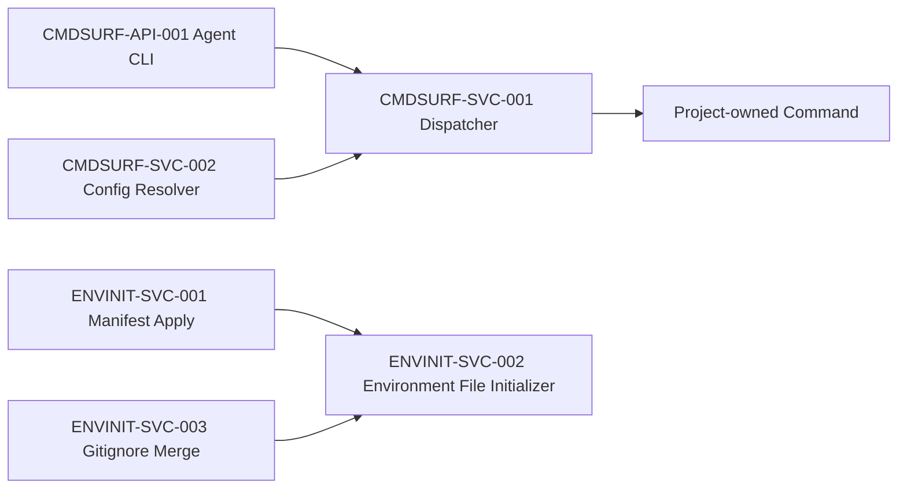

# 组件依赖图

| 组件 ID | 上游 | 下游 | 约束 |
| --- | --- | --- | --- |
| CMDSURF-API-001 | 用户/Agent | CMDSURF-SVC-001 | 只路由稳定 action |
| CMDSURF-SVC-001 | CMDSURF-API-001 | 项目命令 | 缺失配置阻断 |
| CMDSURF-SVC-002 | 合并配置 | CMDSURF-SVC-001 | 显式 profile 不回退 |
| ENVINIT-SVC-001 | 模板源 | ENVINIT-SVC-002 | example 必须先完成 init-if-missing |
| ENVINIT-SVC-002 | ENVINIT-SVC-001、目标 example | 目标实际文件 | exclusive create，已有文件不修改 |
| ENVINIT-SVC-003 | `.gitignore` 模板块 | 目标实际文件 | 三个实际文件精确忽略 |
