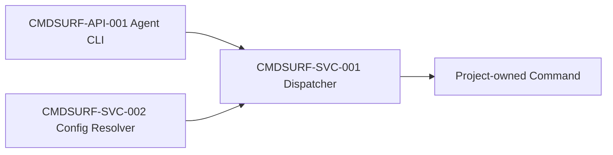

# 组件依赖图

| 组件 ID | 上游 | 下游 | 约束 |
| --- | --- | --- | --- |
| CMDSURF-API-001 | 用户/Agent | CMDSURF-SVC-001 | 只路由稳定 action |
| CMDSURF-SVC-001 | CMDSURF-API-001 | 项目命令 | 缺失配置阻断 |
| CMDSURF-SVC-002 | 合并配置 | CMDSURF-SVC-001 | 显式 profile 不回退 |
