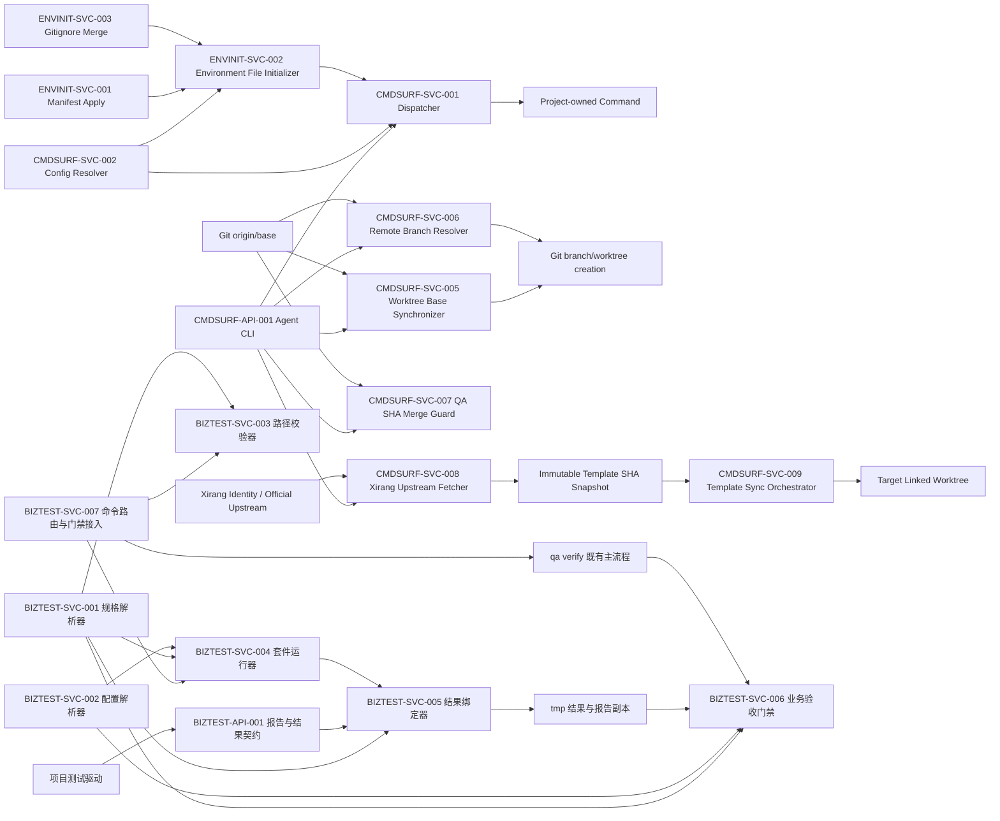

# 组件依赖图

```mermaid
flowchart LR
  API[CMDSURF-API-001 Agent CLI] --> D[CMDSURF-SVC-001 Dispatcher]
  C[CMDSURF-SVC-002 Config Resolver] --> D
  C --> I[CMDSURF-SVC-003 Container Directory Initializer]
  I --> D
  D --> P[Project-owned Command]
  API --> B[CMDSURF-SVC-005 Worktree Base Synchronizer]
  O[Git origin/base] --> B
  B --> W[Git branch/worktree creation]
  API --> R[CMDSURF-SVC-006 Remote Branch Resolver]
  O --> R
  R --> W
  API --> Q[CMDSURF-SVC-007 QA SHA Merge Guard]
  O --> Q
  API --> X[CMDSURF-SVC-008 Xirang Upstream Fetcher]
  XI[Xirang Identity / Official Upstream] --> X
  X --> S[Immutable Template SHA Snapshot]
  S --> A[CMDSURF-SVC-009 Template Sync Orchestrator]
  A --> T[Target Linked Worktree]
  M[ENVINIT-SVC-001 Manifest Apply] --> I[ENVINIT-SVC-002 Environment File Initializer]
  G[ENVINIT-SVC-003 Gitignore Merge] --> I
  BTCLI[BIZTEST-SVC-007 命令路由与门禁接入] --> BTPATHS[BIZTEST-SVC-003 路径校验器]
  BTCLI --> BTRUN[BIZTEST-SVC-004 套件运行器]
  BTCLI --> BTVERIFY[qa verify 既有主流程]
  BTSPEC[BIZTEST-SVC-001 规格解析器] --> BTPATHS
  BTSPEC --> BTRUN
  BTSPEC --> BTBIND[BIZTEST-SVC-005 结果绑定器]
  BTSPEC --> BTGATE[BIZTEST-SVC-006 业务验收门禁]
  BTCONF[BIZTEST-SVC-002 配置解析器] --> BTRUN
  BTCONF --> BTGATE
  BTDRV[项目测试驱动] --> BTAPI[BIZTEST-API-001 报告与结果契约]
  BTAPI --> BTBIND
  BTRUN --> BTBIND
  BTBIND --> BTRES[tmp 结果与报告副本]
  BTRES --> BTGATE
  BTVERIFY --> BTGATE
```

| 组件 ID | 上游 | 下游 | 约束 |
| --- | --- | --- | --- |
| CMDSURF-API-001 | 用户/Agent | CMDSURF-SVC-001 | 只路由稳定 action |
| CMDSURF-SVC-001 | CMDSURF-API-001 | 项目命令 | 缺失配置阻断 |
| CMDSURF-SVC-002 | 合并配置 | CMDSURF-SVC-001 | 显式 profile 不回退 |
| CMDSURF-SVC-003 | CMDSURF-SVC-002、main repo root | CMDSURF-SVC-001、状态/worktree 写入器 | 显式按需创建，拒绝非目录与符号链接目标 |
| CMDSURF-SVC-005 | CMDSURF-API-001、Git origin/base、configured base branch | Git branch/worktree creation | 默认在线基线必须验证并固定为 commit SHA；显式 skip 才可使用未验证缓存 |
| CMDSURF-SVC-006 | CMDSURF-API-001、Git origin/feature | Git branch/worktree creation、本机 session | new 阻断远端同名误建；resume 从远端固定 SHA 恢复 |
| CMDSURF-SVC-007 | CMDSURF-API-001、Git origin/base/feature、GitHub PR、本地 QA 回执 | 配置主干、PR 与 worktree cleanup | base/head SHA 必须匹配；只允许 expected-head merge 或普通非快进 push |
| CMDSURF-SVC-008 | CMDSURF-API-001、息壤 identity、官方 GitHub URL/branch、匿名 HTTPS 环境 | 不可变模板 SHA 快照 | required fetch；失败不得写目标 tracked 文件或使用旧缓存 |
| CMDSURF-SVC-009 | 不可变模板 SHA 快照、最新 updater/manifest、目标 linked worktree | 模板更新与结构化报告 | dry-run → apply → convergence；project-owned 文件保持不变 |
| ENVINIT-SVC-001 | 模板源 | ENVINIT-SVC-002 | example 必须先完成 init-if-missing |
| ENVINIT-SVC-002 | ENVINIT-SVC-001、目标 example | 目标实际文件 | exclusive create，已有文件不修改 |
| ENVINIT-SVC-003 | `.gitignore` 模板块 | 目标实际文件 | 三个实际文件精确忽略 |
| BIZTEST-API-001 | 项目测试驱动（JUnit XML、`platform` 标签） | BIZTEST-SVC-005 | 用例名携带 AC/TC 标识；报告缺失或不可解析为硬失败 |
| BIZTEST-SVC-001 | 模块 PRD 原子 AC 表、`PATHS.md` | BIZTEST-SVC-003、BIZTEST-SVC-004、BIZTEST-SVC-005、BIZTEST-SVC-006 | 纯解析；违规带稳定代码、文件与行号 |
| BIZTEST-SVC-002 | 合并后的 `qa.business` 配置 | BIZTEST-SVC-004、BIZTEST-SVC-006 | 非法值逐项报告；配置摘要不含 `enabled` |
| BIZTEST-SVC-003 | BIZTEST-SVC-001、BIZTEST-SVC-007 | 覆盖矩阵与违规输出 | 只读，不创建目录 |
| BIZTEST-SVC-004 | BIZTEST-SVC-001、BIZTEST-SVC-002、BIZTEST-SVC-007、项目测试驱动 | BIZTEST-SVC-005 | 先静态校验；套件失败与缺报告不被掩盖 |
| BIZTEST-SVC-005 | BIZTEST-SVC-001、BIZTEST-SVC-004、BIZTEST-API-001 | 容器 `tmp` 的 `ac-results.json` 与报告副本 | 拒绝 `DOCTYPE` 与实体；报告副本先落盘，结果文件原子写入 |
| BIZTEST-SVC-006 | BIZTEST-SVC-001、BIZTEST-SVC-002、结果文件、`qa verify` 已捕获的 HEAD | `qa verify` 阻断或风险披露 | 重算并与记录比对，陈旧或被改动即阻断；默认关闭时不读取规格与结果 |
| BIZTEST-SVC-007 | 用户/Agent、`qa verify` 既有主流程 | BIZTEST-SVC-003、BIZTEST-SVC-004、BIZTEST-SVC-006 | 默认关闭时输出与退出码和既有一致；回执结构不变 |
| BIZTEST-SVC-008 | 模板源 | 目标项目的 PRD/QA 模板、指引与角色约束 | project-owned 文档不被模板更新覆盖 |
