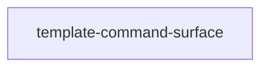

# 全局依赖关系图

## 模块关系

当前仅有 `template-command-surface` 一个治理模块，无跨模块依赖或循环依赖。

## 外部与基础设施依赖

| 依赖 | 类型 | 约束 | 状态 |
| --- | --- | --- | --- |
| `agent.config.json` 配置加载器 | 模板内部 | 继续使用深合并和稀疏项目覆盖 | 已存在 |
| `agent-cli.js` 与执行器 | 模板内部 | 命令缺失时 fail closed | 已存在 |
| 目标项目命令 | 项目所有 | 模板不得提供业务回退 | 配置时可用 |
| Git `origin` 与 configured base branch | 外部远端/模板内部约定 | 全新 worktree 默认必须成功刷新并解析 commit；显式 skip 才可离线 | 已存在 |
| Git `origin` feature refs 与 GitHub PR | 外部远端 | 远端同名分支由 resume 显式接管；QA/merge 绑定 base/head SHA | 已存在 |
| GitHub CI / merge queue | 外部能力 | 本功能明确不依赖、不创建、不触发 | 禁用 |

范围变化或新增模块时必须更新本图并执行依赖环检查。
