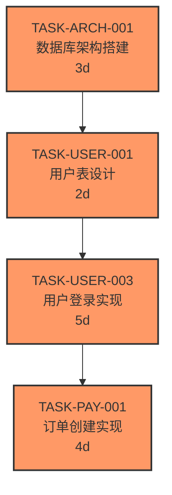

# 任务依赖矩阵（跨模块）

> 维护者：TASK 专家
> 最后更新：YYYY-MM-DD

---

## 依赖关系图

---

## 依赖清单

| 前置任务 | 后置任务 | 依赖类型 | 提前量（天） | 备注 |
|---------|---------|---------|------------|------|
| TASK-ARCH-001 | TASK-USER-001 | FS | 0 | 数据库就绪后开始 |
| TASK-USER-003 | TASK-PAY-001 | FS | 0 | 登录功能是订单前置条件 |
| TASK-USER-002 | TASK-NOTIF-001 | SS | 2 | 可提前 2 天并行开始 |

**依赖类型说明**：
- **FS (Finish-to-Start)**: A 完成后 B 才能开始
- **SS (Start-to-Start)**: A 开始后 B 才能开始（可并行）
- **FF (Finish-to-Finish)**: A 完成时 B 也要完成

---

## 使用说明

1. **添加依赖**：在表格中添加新行，更新 Mermaid 图
2. **工具验证**：运行 `npm run task:check-cycles` 检查循环依赖
3. **同步更新**：修改依赖时同时更新关键路径分析

---

> 此文件维护所有跨模块依赖关系。模块内依赖见各模块的 `dependency-graph.mmd`。
