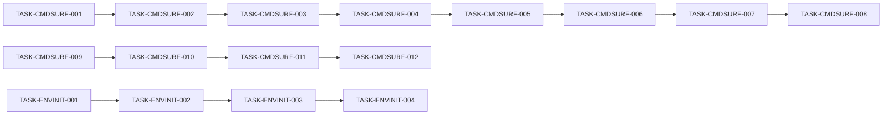

# 任务依赖矩阵

| 前置 Task | 后置 Task | 类型 | 提前量 | 关键路径 | 说明 |
| --- | --- | --- | --- | --- | --- |
| TASK-CMDSURF-001 | TASK-CMDSURF-002 | Finish-to-start | 0 | 是 | RED 后进入配置与路由实现 |
| TASK-CMDSURF-002 | TASK-CMDSURF-003 | Finish-to-start | 0 | 是 | 配置路由后进入 Dispatcher 与文档 |
| TASK-CMDSURF-003 | TASK-CMDSURF-004 | Finish-to-start | 0 | 是 | 实现后进入模板 QA/合并 |
| TASK-CMDSURF-004 | TASK-CMDSURF-005 | Finish-to-start | 0 | 是 | 模板合并后进入目标项目传播 |
| TASK-CMDSURF-006 | TASK-CMDSURF-007 | Finish-to-start | 0 | 是 | 默认矩阵 RED 后进入中央模板登记 |
| TASK-CMDSURF-007 | TASK-CMDSURF-008 | Finish-to-start | 0 | 是 | 中央模板登记后进入实际项目传播 |
| TASK-CMDSURF-009 | TASK-CMDSURF-010 | Finish-to-start | 0 | 是 | 容器目录 RED 后实现共享初始化器 |
| TASK-CMDSURF-010 | TASK-CMDSURF-011 | Finish-to-start | 0 | 是 | 共享合约冻结后接入写入命令 |
| TASK-CMDSURF-011 | TASK-CMDSURF-012 | Finish-to-start | 0 | 是 | 集成完成后执行回归与合并门禁 |
| TASK-ENVINIT-001 | TASK-ENVINIT-002 | Finish-to-start | 0 | 是 | RED 后登记 example 与 manifest |
| TASK-ENVINIT-002 | TASK-ENVINIT-003 | Finish-to-start | 0 | 是 | example 就绪后实现实际文件初始化 |
| TASK-ENVINIT-003 | TASK-ENVINIT-004 | Finish-to-start | 0 | 是 | 实现后进入传播与 Git QA |

```mermaid
flowchart LR
  T1[TASK-CMDSURF-001] --> T2[TASK-CMDSURF-002]
  T2 --> T3[TASK-CMDSURF-003]
  T3 --> T4[TASK-CMDSURF-004]
  T4 --> T5[TASK-CMDSURF-005]
  T5 --> T6[TASK-CMDSURF-006]
  T6 --> T7[TASK-CMDSURF-007]
  T7 --> T8[TASK-CMDSURF-008]
  C9[TASK-CMDSURF-009] --> C10[TASK-CMDSURF-010]
  C10 --> C11[TASK-CMDSURF-011]
  C11 --> C12[TASK-CMDSURF-012]
  E1[TASK-ENVINIT-001] --> E2[TASK-ENVINIT-002]
  E2 --> E3[TASK-ENVINIT-003]
  E3 --> E4[TASK-ENVINIT-004]
```
