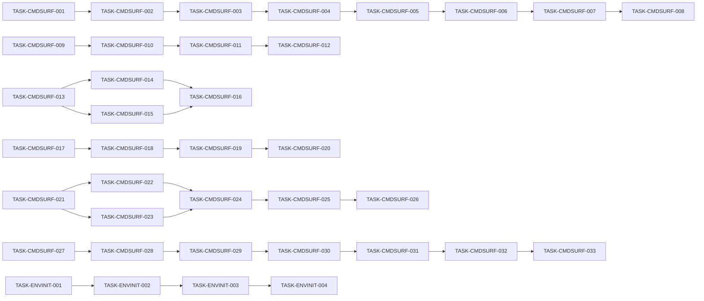

# 任务依赖矩阵

多端平台关键路径：TASK-MONOPLAT-001 → 002 → 003 → 004 → 005 → 006。001 依赖既有架构平台，005 为真实消费者验收，006 为本地 QA 合并；各步骤间 Finish-to-start，提前量 0。详见 [模块 WBS](../task-modules/monorepo-platform/TASK.md)。

| 前置 Task | 后置 Task | 类型 | 提前量 | 关键路径 | 说明 |
| --- | --- | --- | --- | --- | --- |
| TASK-CMDSURF-001 | TASK-CMDSURF-002 | Finish-to-start | 0 | 是 | RED 后进入配置与路由实现 |
| TASK-CMDSURF-002 | TASK-CMDSURF-003 | Finish-to-start | 0 | 是 | 配置路由后进入 Dispatcher 与文档 |
| TASK-CMDSURF-003 | TASK-CMDSURF-004 | Finish-to-start | 0 | 是 | 实现后进入模板 QA/合并 |
| TASK-CMDSURF-004 | TASK-CMDSURF-005 | Finish-to-start | 0 | 是 | 模板合并后进入目标项目传播 |
| TASK-CMDSURF-006 | TASK-CMDSURF-007 | Finish-to-start | 0 | 是 | 默认矩阵 RED 后进入中央模板登记 |
| TASK-CMDSURF-007 | TASK-CMDSURF-008 | Finish-to-start | 0 | 是 | 中央模板登记后进入实际项目传播 |
| TASK-CMDSURF-009 | TASK-CMDSURF-010 | Finish-to-start | 0 | 是 | 容器目录 RED 后实现共享初始化器 |
| TASK-CMDSURF-010 | TASK-CMDSURF-011 | Finish-to-start | 0 | 是 | 共享合约冻结后接入写入命令 |
| TASK-CMDSURF-011 | TASK-CMDSURF-012 | Finish-to-start | 0 | 是 | 集成完成后执行回归与合并门禁 |
| TASK-CMDSURF-013 | TASK-CMDSURF-014 | Finish-to-start | 0 | 是 | RED 后实现任务输入与创建门禁 |
| TASK-CMDSURF-013 | TASK-CMDSURF-015 | Finish-to-start | 0 | 是 | 内容扫描 RED 后收敛 Codex 配置示例 |
| TASK-CMDSURF-014 | TASK-CMDSURF-016 | Finish-to-start | 0 | 是 | 任务门禁实现完成后进入统一回归 |
| TASK-CMDSURF-015 | TASK-CMDSURF-016 | Finish-to-start | 0 | 是 | 配置示例收敛后进入统一回归 |
| TASK-CMDSURF-017 | TASK-CMDSURF-018 | Finish-to-start | 0 | 是 | Worktree 基线 RED 后实现严格 fetch 与固定 SHA |
| TASK-CMDSURF-018 | TASK-CMDSURF-019 | Finish-to-start | 0 | 是 | 实现冻结后同步通用约定与模板版本 |
| TASK-CMDSURF-019 | TASK-CMDSURF-020 | Finish-to-start | 0 | 是 | 代码、测试与协议齐备后进入回归与 QA 合并 |
| TASK-CMDSURF-021 | TASK-CMDSURF-022 | Finish-to-start | 0 | 是 | 多电脑 RED 后实现远端分支阻断与恢复 |
| TASK-CMDSURF-021 | TASK-CMDSURF-023 | Finish-to-start | 0 | 是 | 多电脑 RED 后实现 PR base 与 QA 回执 |
| TASK-CMDSURF-022 | TASK-CMDSURF-024 | Finish-to-start | 0 | 是 | 远端分支状态稳定后实现精确合并 |
| TASK-CMDSURF-023 | TASK-CMDSURF-024 | Finish-to-start | 0 | 是 | QA 身份证据稳定后实现精确合并 |
| TASK-CMDSURF-024 | TASK-CMDSURF-025 | Finish-to-start | 0 | 是 | 合并语义冻结后同步同权与无 CI 协议 |
| TASK-CMDSURF-025 | TASK-CMDSURF-026 | Finish-to-start | 0 | 是 | 代码和协议齐备后执行三 clone 与最终 QA |
| TASK-CMDSURF-027 | TASK-CMDSURF-028 | Finish-to-start | 0 | 是 | 身份与自然语言契约 RED 后实现传播协议 |
| TASK-CMDSURF-028 | TASK-CMDSURF-029 | Finish-to-start | 0 | 是 | 固定身份和 CLI 入口后实现官方源 fetch |
| TASK-CMDSURF-029 | TASK-CMDSURF-030 | Finish-to-start | 0 | 是 | 不可变 SHA 快照就绪后实现最新 updater 自举 |
| TASK-CMDSURF-030 | TASK-CMDSURF-031 | Finish-to-start | 0 | 是 | 编排稳定后补齐 apply convergence 门禁 |
| TASK-CMDSURF-031 | TASK-CMDSURF-032 | Finish-to-start | 0 | 是 | 行为冻结后同步名称、配置和模板版本 |
| TASK-CMDSURF-032 | TASK-CMDSURF-033 | Finish-to-start | 0 | 是 | 代码与传播协议齐备后执行回归和 QA |
| TASK-CMDSURF-034 | TASK-CMDSURF-035 | Finish-to-start | 0 | 是 | 匿名凭据隔离 RED 后实现传输环境 |
| TASK-CMDSURF-035 | TASK-CMDSURF-036 | Finish-to-start | 0 | 是 | 实现及协议完成后回归与 QA |
| TASK-ENVINIT-001 | TASK-ENVINIT-002 | Finish-to-start | 0 | 是 | RED 后登记 example 与 manifest |
| TASK-ENVINIT-002 | TASK-ENVINIT-003 | Finish-to-start | 0 | 是 | example 就绪后实现实际文件初始化 |
| TASK-ENVINIT-003 | TASK-ENVINIT-004 | Finish-to-start | 0 | 是 | 实现后进入传播与 Git QA |

```mermaid
flowchart LR
  T1[TASK-CMDSURF-001] --> T2[TASK-CMDSURF-002]
  T2 --> T3[TASK-CMDSURF-003]
  T3 --> T4[TASK-CMDSURF-004]
  T4 --> T5[TASK-CMDSURF-005]
  T5 --> T6[TASK-CMDSURF-006]
  T6 --> T7[TASK-CMDSURF-007]
  T7 --> T8[TASK-CMDSURF-008]
  C9[TASK-CMDSURF-009] --> C10[TASK-CMDSURF-010]
  C10 --> C11[TASK-CMDSURF-011]
  C11 --> C12[TASK-CMDSURF-012]
  C13[TASK-CMDSURF-013] --> C14[TASK-CMDSURF-014]
  C13 --> C15[TASK-CMDSURF-015]
  C14 --> C16[TASK-CMDSURF-016]
  C15 --> C16
  W17[TASK-CMDSURF-017] --> W18[TASK-CMDSURF-018]
  W18 --> W19[TASK-CMDSURF-019]
  W19 --> W20[TASK-CMDSURF-020]
  H21[TASK-CMDSURF-021] --> H22[TASK-CMDSURF-022]
  H21 --> H23[TASK-CMDSURF-023]
  H22 --> H24[TASK-CMDSURF-024]
  H23 --> H24
  H24 --> H25[TASK-CMDSURF-025]
  H25 --> H26[TASK-CMDSURF-026]
  X27[TASK-CMDSURF-027] --> X28[TASK-CMDSURF-028]
  X28 --> X29[TASK-CMDSURF-029]
  X29 --> X30[TASK-CMDSURF-030]
  X30 --> X31[TASK-CMDSURF-031]
  X31 --> X32[TASK-CMDSURF-032]
  X32 --> X33[TASK-CMDSURF-033]
  E1[TASK-ENVINIT-001] --> E2[TASK-ENVINIT-002]
  E2 --> E3[TASK-ENVINIT-003]
  E3 --> E4[TASK-ENVINIT-004]
```
