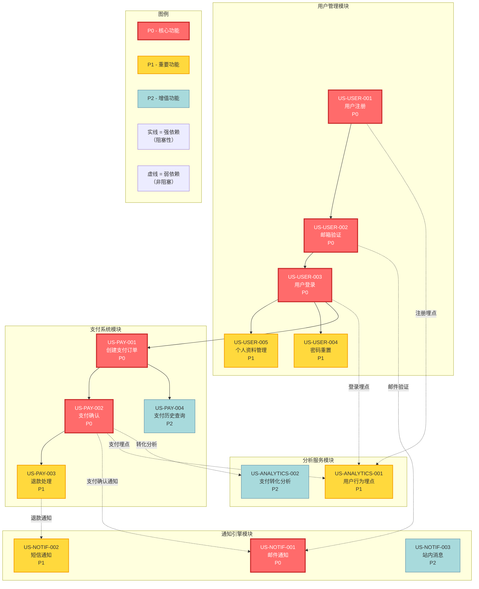

# 全局需求依赖关系图

> **用途**：可视化用户故事之间的依赖关系（跨模块视图）
> **维护者**：PRD 专家
> **最后更新**：2025-11-08
> **适用阶段**：PRD_CONFIRMED 后，TASK_PLANNED 前
> **在线编辑器**：https://mermaid.live/

---

## 依赖关系可视化



---

## 模块与需求概览

### 用户管理模块（USER）
| Story ID | 标题 | 优先级 | 前置依赖 |
|----------|------|--------|----------|
| US-USER-001 | 用户注册 | P0 | 无 |
| US-USER-002 | 邮箱验证 | P0 | US-USER-001 |
| US-USER-003 | 用户登录 | P0 | US-USER-002 |
| US-USER-004 | 密码重置 | P1 | US-USER-003 |
| US-USER-005 | 个人资料管理 | P1 | US-USER-003 |

### 支付系统模块（PAY）
| Story ID | 标题 | 优先级 | 前置依赖 |
|----------|------|--------|----------|
| US-PAY-001 | 创建支付订单 | P0 | US-USER-003 |
| US-PAY-002 | 支付确认 | P0 | US-PAY-001 |
| US-PAY-003 | 退款处理 | P1 | US-PAY-002 |
| US-PAY-004 | 支付历史查询 | P2 | US-PAY-001 |

### 通知引擎模块（NOTIF）
| Story ID | 标题 | 优先级 | 依赖来源 |
|----------|------|--------|----------|
| US-NOTIF-001 | 邮件通知 | P0 | US-USER-002（弱）、US-PAY-002（弱） |
| US-NOTIF-002 | 短信通知 | P1 | US-PAY-003（弱） |
| US-NOTIF-003 | 站内消息 | P2 | 无 |

### 分析服务模块（ANALYTICS）
| Story ID | 标题 | 优先级 | 依赖来源 |
|----------|------|--------|----------|
| US-ANALYTICS-001 | 用户行为埋点 | P1 | US-USER-001/003（弱）、US-PAY-002（弱） |
| US-ANALYTICS-002 | 支付转化分析 | P2 | US-PAY-002（弱） |

---

## 关键路径分析

### 最长依赖链（Critical Path）
```
US-USER-001 → US-USER-002 → US-USER-003 → US-PAY-001 → US-PAY-002
```

- **路径长度**：5 个 Story
- **预估工期**：10 天（假设每个 Story 2 天）
- **风险点**：任何一个环节的延误都会影响整体交付

### 并行开发机会
- **弱依赖模块**（NOTIF、ANALYTICS）可与核心流程并行开发
- **P2 优先级需求**（US-PAY-004、US-NOTIF-003、US-ANALYTICS-002）可延后至 MVP 后

---

## 依赖关系说明

### 依赖类型定义

| 依赖类型 | 图形表示 | 含义 | 阻塞性 |
|---------|---------|------|--------|
| **强依赖** | `A --> B` 实线 | B 必须等待 A 完成后才能开始 | ✅ 阻塞 |
| **弱依赖** | `A -.-> B` 虚线 | B 可以独立开发，A 提供数据/事件 | ❌ 非阻塞 |

### 跨模块依赖梳理

| 依赖方 | 被依赖方 | 类型 | 理由 |
|--------|---------|------|------|
| PAY-001 | USER-003 | 强依赖 | 创建支付订单需要用户登录态 |
| NOTIF-001 | USER-002 | 弱依赖 | 邮箱验证需触发邮件通知（失败不影响验证流程） |
| NOTIF-001 | PAY-002 | 弱依赖 | 支付确认需触发邮件通知（失败不影响支付） |
| ANALYTICS-001 | USER-001/003 | 弱依赖 | 用户行为埋点（后台异步，失败不影响业务） |

---

## 维护指南

### 更新时机
1. **新增 Story**：在对应模块添加节点
2. **Story 完成**：取消注释 `completed` 样式行，添加对应 Story ID
3. **Story 阻塞**：取消注释 `blocked` 样式行，添加对应 Story ID
4. **依赖变更**：调整箭头关系（强依赖用 `-->`，弱依赖用 `-.->` ）

### 更新示例

**场景：US-USER-001 已完成**
```mermaid
%% 在样式应用区域添加：
class US_USER_001 completed
```

**场景：US-PAY-003 被阻塞**
```mermaid
%% 在样式应用区域添加：
class US_PAY_003 blocked
```

### 验证清单
- [ ] 所有 Story ID 与 `/docs/PRD.md` 或 `/docs/prd-modules/*.md` 一致
- [ ] 优先级标注（P0/P1/P2）准确
- [ ] 依赖关系类型（强/弱）符合业务逻辑
- [ ] 图形在 VSCode/GitHub 预览正常

---

## 参考

- [Mermaid Graph 语法文档](https://mermaid.js.org/syntax/flowchart.html)
- 关联文档：
  - [/docs/PRD.md](../PRD.md) — 需求详情
  - [/docs/TASK.md](../TASK.md) — 任务分解（基于此图生成）
  - [/docs/data/dependency-graph-README.md](./dependency-graph-README.md) — 依赖图使用指南
