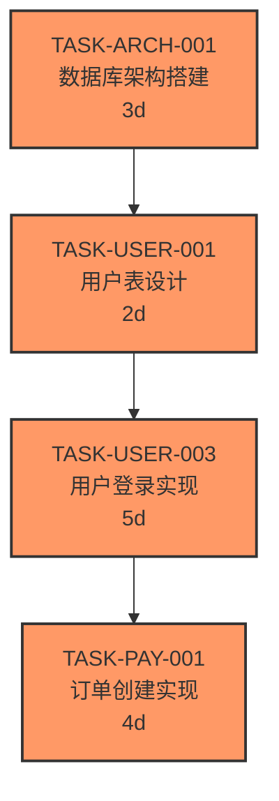

# 任务依赖矩阵（跨模块）模板

> 维护者：TASK 专家  
> 模板版本：v1.0  
> 最后更新：`YYYY-MM-DD`

---

## 模板目的
该模板用于生成 `/docs/data/task-dependency-matrix.md`，提供跨模块任务间的依赖视图（Mermaid图 + 表格 + 风险/缓解说明），便于 Task/QA/TDD 对齐里程碑与关键路径。

## 依赖关系图

- 每个节点格式：`TASK-ID 任务名称 周期/估算`；若任务为关键路径、阻塞或有外部依赖，可加 `class critical`/`class blocked fill:#f33` 统一高亮。  
- 箭头方向应与下表一致；若某依赖仅为“并行触发”，可用双向箭头或补充备注。  
- 图中节点数量与任务表保持一致，避免漏项。

## 依赖清单字段

| 前置任务 | 后置任务 | 依赖类型 | 提前量（天） | 触发条件 | 备注 |
|---------|---------|---------|------------|--------------|------|
| TASK-ARCH-001 | TASK-USER-001 | FS | 0 | 架构文档签发 | 数据库就绪后开始 |
| TASK-USER-003 | TASK-PAY-001 | FS | 0 | 登录验收通过 | 登录功能是订单前置条件 |
| TASK-USER-002 | TASK-NOTIF-001 | SS | 2 | 通知模块配置完成 | 可提前 2 天并行开始 |

- `前置/后置任务`：使用 `TASK-{DOMAIN}-{NNN}` 规范，后接简短标题，便于 traceability（可链接到 `/docs/TASK.md`、模块 TASK）。  
- `依赖类型`：支持 FS/SS/FF/Other；如为“外部审批”可写 `Other` 并在备注中说明。  
- `提前量`：明确后置任务需在前置任务完成前多少天准备（如环境、审批、数据），帮助排调整体排期。  
- `触发条件`：说明依赖成立的精确条件（如“接口契约签署”、“监控验证完成”），便于大模型生成紧密门槛信息。  
- `备注`：活用字段链接外部任务、记录风险（例：“sre 资源不足”）、或写出与 QA/TDD 协作的关键点。

## 风险与缓解（可选）

- 列出可能因依赖变更导致的阻塞/延期，例如“支付模块依赖第三方接口；若接口延迟，后置订单模块需延迟 3 天”，并提供缓解方案（备用任务、临时 mock）。  
- 可添加 `责任人`/`状态`字段，让 Task 专家、QA 与 ARCH 协调每条风险。  
- 记录风险变化后要更新 `docs/task-dependency-matrix.md` 的“使用说明”段，提醒团队复审。

## 生成指南（大模型友好）

1. 给模型提供最新的模块/任务列表（含 Task ID、Story、Owner、里程碑）与当前状态，指示模型输出 Mermaid 图 + 完整表格 + 风险段落。  
2. 要求模型用 `class critical` 标记关键路径节点，用 `class blocked` 标识当前阻塞任务，并在表格备注说明阻塞原因。  
3. 生成后 QA/Task 专家需再跑 `npm run task:check-cycles`（如有），验证无循环依赖并同步 `module-list.md` 的依赖状态。
4. 完成后将模板头部 `最后更新` 替换为实际日期，并把生成结果推送至 `/docs/TASK.md` 的依赖矩阵段及 `/docs/AGENT_STATE.md`（如触发 `TASK_PLANNED`）。

## 同步与维护

1. 每次 Task 依赖变更（新增依赖、提前量调整、依赖状态变更）都要在此模板中更新 Mermaid 图、表格与风险段。  
2. 与 QA/ARCH 共享此文件，确保他们可以根据依赖及时调整测试/架构时间。  
3. 若模块任务被回收或拆分，记得在 `module-list.md` 中同步更新“依赖”/“状态”列，并在本文件下方写入“变更记录”段。

---
> 本模板生成的 `task-dependency-matrix.md` 覆盖跨模块依赖；模块内部依赖仍由各模块的 `dependency-graph.md`（或 `task-modules/{domain}/dependency-matrix.md`）维护。
