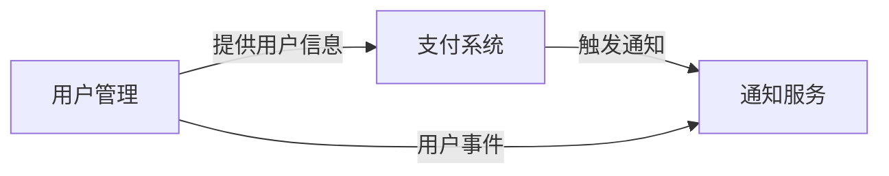

# 系统架构文档（总纲）

> **说明**：本模板供大型项目使用，复制到 `/docs/ARCH.md` 作为总纲与索引（< 1000 行）。详细架构设计见各功能域模块文档。
> 小型项目请使用 `ARCH-TEMPLATE-SMALL.md`。

**日期**：YYYY-MM-DD
**版本**：v1.0
**状态**：✅ 已确认

## 1. 系统概述
- **系统边界**：（系统范围与对外接口）
- **核心目标**：（系统要解决的核心问题）
- **质量属性优先级**：性能 > 可靠性 > 成本 > 可演进性 > 安全性

## 2. 功能域架构索引

| 功能域 | 负责团队 | 文档链接 | 状态 | 依赖/Gate | Traceability ID | 阻塞/待办 | 最后更新 |
|--------|---------|---------|------|----------|-------------|------------|---------|
| 用户管理 | @team-backend | [ARCH.md](arch-modules/user-management/ARCH.md) | ✅ 已确认 | Traceability、接口同步；进入 `ARCHITECTURE_DEFINED` | AC-101、COMP-01 | 无 | YYYY-MM-DD |
| 支付系统 | @team-payment | [ARCH.md](arch-modules/payment-system/ARCH.md) | 🔄 进行中 | 依赖结算系统、需完成 Contract Gate | AC-205、API-77 | 外部接口 | YYYY-MM-DD |
| 通知服务 | @team-notification | [ARCH.md](arch-modules/notification-service/ARCH.md) | 📝 待启动 | 数据平台、合规审计待对齐 | AC-303 | 合规审批中 | - |
| （补充其他模块）| - | - | - | - | - | - | - |

> 建议在此表中用熔断器颜色/图标标记"关键依赖/阻塞"，并在"依赖/Gate"与"Traceability ID"列备注需要同步的 Traceability Matrix 或接口表，方便 ARCH/TASK/TDD 交互。

## 3. 全局视图（跨模块）

### 3.1 系统全景（C4 Context）
（Mermaid 图：展示所有功能域与外部系统的交互）
- 说明要点：记录所有对外依赖的 Gate 状态并在 Gate 前同步 `/docs/data/arch-prd-traceability.md`，并附上验证负责人。

### 3.2 全局数据流与集成点
- **数据流**：用户管理 → 支付系统 → 通知服务
- **集成点**：API Gateway、消息队列、共享数据库
- 说明要点：注明哪些数据流涉及合规/隐私限制、容量/备份要求，并列出相关 Traceability 条目与确认人（QA/Traceability）。

### 3.3 横切关注点
- **日志**：ELK Stack（集中式日志）
- **监控**：Prometheus + Grafana（系统指标）
- **安全**：JWT 认证 + RBAC 授权
- **合规**：GDPR + PIPL
- 说明要点：列出横切功能需要的监控/演练/审计/合规节点、责任团队以及与 SRE/QA/Legal 的同步状态，避免上线前遗漏验证。

## 4. 全局技术选型与 ADR

| 技术栈 | 选择 | ADR 链接 |
|--------|------|---------|
| 前端框架 | React 18 | [ADR-001](adr/001-frontend-framework.md) |
| 后端框架 | Node.js + Express | [ADR-002](adr/002-backend-framework.md) |
| 数据库 | PostgreSQL 15 | [ADR-003](adr/003-database-selection.md) |
| 缓存 | Redis 7 | [ADR-004](adr/004-cache-strategy.md) |
| 部署平台 | AWS ECS + Fargate | [ADR-005](adr/005-deployment-platform.md) |
| 消息队列 | RabbitMQ | [ADR-006](adr/006-message-queue-selection.md) |

## 5. 跨模块依赖关系

- **依赖说明**：
- **用户管理 → 支付系统**：支付功能依赖用户身份验证（JWT Token）
- **支付系统 → 通知服务**：支付完成后通过消息队列异步发送通知
- **用户管理 → 通知服务**：用户注册/登录时发送欢迎邮件
- **当前阻塞/待定**：消息队列升级→支付系统（需确认兼容性）、通知服务监控覆盖仍在构建

## 6. 全局风险与缓解

| 风险/问题 | 类型 | 影响范围 | Gate 条件 | 缓解计划 | 责任人 | 当前状态 |
| ---------- | ---- | -------- | ---------- | -------- | ------ | -------- |
| 数据库单点故障 | 技术 | 全系统 | `ARCHITECTURE_DEFINED` 前完成主从复制验证与故障转移测试 | 主从复制 + 自动故障检测 | @dba | 验证中 |
| API Gateway 容量 | 稳定性 | 全系统 | Traceability + QA 需覆盖限流/降级流程 | 水平扩展 + 限流 + 提前压测 | @devops | 压测中 |
| 跨模块一致性 | 可靠性 | 支付+通知 | Traceability Gate 需展示 Saga 流程与 compensating action | 使用 Saga 与事件追踪 | @architect | 设计中 |
| 合规审计记录 | 合规 | 通知服务 | Legal 审批并记录审计日志 | 补齐审计 + 合规演练 | @security | 审批中 |

> 各项风险/ADR 变更同步到 `AGENT_STATE` / release checklist，并在完成后确认 `ARCHITECTURE_DEFINED` 状态，必要时退回 `PRD_CONFIRMED` 或延迟 Gate。

## 7. 文档审查与更新节奏

- 每次主架构更新需记录版本、触发原因、影响范围、审查负责人和 Traceability/QA 同步状态，确保 QA/TDD/Traceability 可回溯决策与验证工件；建议此表定期用于 Doc Sync Gate 备注。
- Doc Sync Gate 除了主 PRD 的变更摘要，也需列出每个模块 PRD 的当前状态/版本与是否已同频更新，避免某个模块因旧 PRD 而在架构中被错标为完成。
  | 版本 | 日期 | 触发类型 | 影响功能域 | 审查人 | Traceability/QA 状态 | 说明 |
  | ---- | ---- | -------- | -------- | ------ | ------------------- | ---- |
  | v1.0 | YYYY-MM-DD | 模块重构 | 支付 + 通知 | @architect | Traceability ×，QA Review ✔ | 从单一文件迁移到模块化架构 |
  | v1.1 | YYYY-MM-DD | 合规更新 | 通知服务审计 | @security | Traceability ✔，QA Pending | 补齐审计日志 + DR 计划 |
- 更新记录应同时更新 `/docs/data/doc-snapshots.md` 或 `AGENT_STATE` Note，包含审核人签字、Doc Sync Gate 结果（如是否已触发 `ARCHITECTURE_DEFINED`）、以及所有相关 traceability/QA 任务的完成状态，便于后续阶段查证。

## 8. 相关文档

- **PRD 文档**：[PRD.md](PRD.md)
- **任务计划**：[TASK.md](TASK.md)
- **测试计划**：[QA.md](QA.md)
- **架构模块索引**：[module-list.md](arch-modules/module-list.md)
- **ADR 目录**：[adr/](adr/)
- **目录规范**：[CONVENTIONS.md](CONVENTIONS.md)

> ✅ 发布/DEL Gate：确认 Traceability Matrix、Component Graph、Monitoring Coverage、QA 验证报告等文档已更新，同步提示至 TDD/QA 专家，确保后续阶段无漏检。
