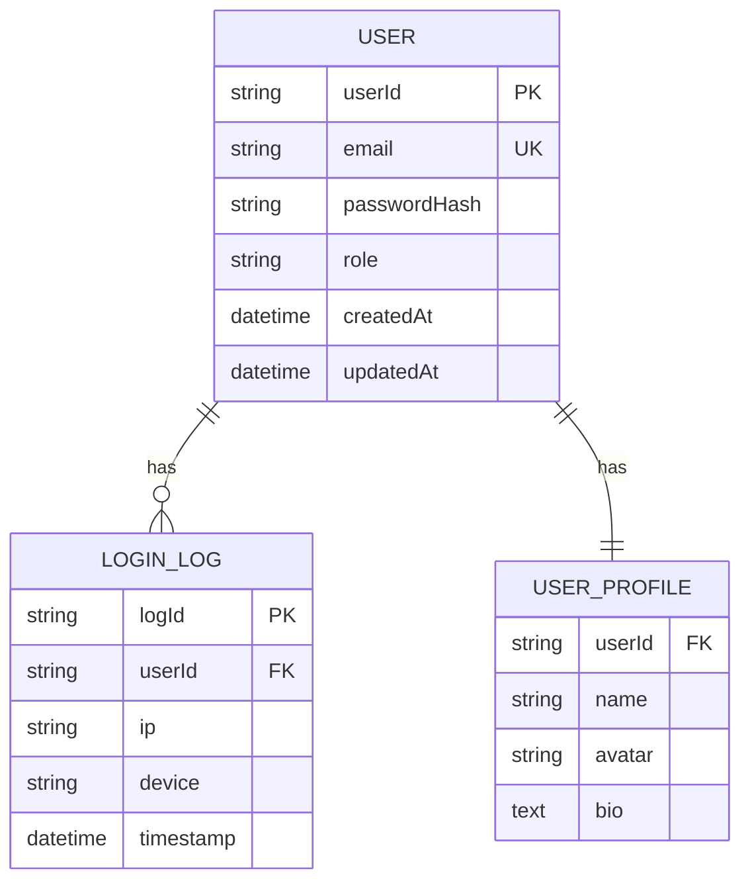

# 模块 PRD 填充示例（用户管理域）

> 本文为 `/docs/prd-modules/MODULE-TEMPLATE.md` Appendix A 的填充示例，以"用户管理"模块为例，展示各章节的实际内容；本示例章节编号为示例自身顺序，原子 AC 清单对应模板的 §3.2。仅供参考，实际项目请按 MODULE-TEMPLATE.md 中的模板骨架创建。

---

## 1. 模块概述

### 1.1 功能域定义
本模块负责用户身份管理，包括注册、登录、权限验证、个人资料管理等核心功能。

### 1.2 业务目标
- **目标 1**：提供安全可靠的用户认证机制
- **目标 2**：支持多种登录方式（邮箱、手机、第三方）
- **目标 3**：用户数据符合 GDPR/PIPL 合规要求

### 1.3 成功指标
| 指标 | 目标值 | 测量方式 |
|------|--------|---------|
| 注册转化率 | > 35% | Google Analytics 漏斗分析 |
| 登录成功率 | > 98% | 后端日志统计 |
| 密码重置响应时间 | < 5min | 邮件发送监控 |

---

## 2. 用户故事与验收标准

### 2.1 用户故事

| Story ID | 用户故事 | 优先级 | 依赖 | 预估工时 |
|----------|----------|--------|------|----------|
| US-USER-001 | 作为访客，我希望用邮箱注册账号，以便使用平台服务 | P0 | - | 5 人天 |
| US-USER-002 | 作为已注册用户，我希望登录账号，以便访问个人数据；连续输错密码时账号要被保护 | P0 | US-USER-001 | 4 人天 |
| US-USER-003 | 作为已登录用户，我希望查看并更新个人资料，以便保持信息准确 | P1 | US-USER-002 | 3 人天 |
| US-USER-004 | 作为忘记密码的用户，我希望通过邮件重置密码，以便找回账号 | P0 | US-USER-001 | 3 人天 |

优先级的综合得分与取舍详见 [priority-matrix.md](../data/priority-matrix.md)；跨模块依赖引用对方的 Story ID。

### 2.2 原子 AC 清单

验收标准的唯一规格来源：每条 AC 占一行，Given/When/Then 各占一列，不拆成三个 AC。优先级取 `P0`–`P3`；验证方式取 `auto`（自动化）或 `manual`（人工）；端是适用的客户端标签，不适用写 `-`；`TC` 是承载该 AC 的测试用例，暂无写 `-`。预期结果只来自本 PRD、数据字典、UX 规范与 §4 的接口契约。

| AC ID | Story | 优先级 | 验证 | 端 | Given | When | Then | TC |
|-------|-------|--------|------|----|-------|------|------|----|
| AC-USER-001-01 | US-USER-001 | P0 | auto | web,ios | 访客在注册页，邮箱未被注册 | 提交合法邮箱、合规密码与正确验证码 | 返回 201 且 `needEmailVerify` 为 true，系统发送验证邮件 | TC-USER-001 |
| AC-USER-001-02 | US-USER-001 | P1 | auto | web | 邮箱已被注册 | 使用同一邮箱再次提交注册 | 返回错误码 1001，不新建账号 | TC-USER-002 |
| AC-USER-001-03 | US-USER-001 | P1 | auto | web | 访客在注册页 | 提交少于 8 位或不满足复杂度的密码 | 返回错误码 1002，停留在注册表单并提示密码规则 | TC-USER-003 |
| AC-USER-001-04 | US-USER-001 | P1 | auto | web | 访客在注册页 | 提交错误或已过期的验证码 | 返回错误码 1003，刷新图形验证码 | TC-USER-004 |
| AC-USER-002-01 | US-USER-002 | P0 | auto | web,ios | 账号已激活，密码正确 | 提交邮箱和密码登录 | 返回 200，含有效期 2 小时的 `token` 与 7 天的 `refreshToken`，进入首页 | TC-USER-005 |
| AC-USER-002-02 | US-USER-002 | P0 | auto | web | 账号已激活，此前连续失败少于 4 次 | 提交错误密码 | 返回错误码 2001 与 `remainingAttempts`（5 减去含本次在内的累计失败次数），停留在登录页 | TC-USER-006 |
| AC-USER-002-03 | US-USER-002 | P0 | auto | web | 账号已激活，此前已连续失败 4 次 | 第 5 次提交错误密码 | 账号锁定 15 分钟并返回错误码 2002；锁定期内即使密码正确也被拒绝 | TC-USER-007 |
| AC-USER-002-04 | US-USER-002 | P1 | auto | web | 账号尚未完成邮箱验证 | 提交正确的邮箱和密码 | 返回错误码 2003，不签发 Token | TC-USER-008 |
| AC-USER-003-01 | US-USER-003 | P1 | auto | web,ios | 用户已登录 | 打开个人资料页 | 显示姓名、头像和邮箱（数据来自 `GET /api/user/{userId}`） | TC-USER-009 |
| AC-USER-003-02 | US-USER-003 | P1 | auto | web | 用户已登录并处于资料编辑态 | 修改姓名并保存 | 返回更新后的 `User` 对象，页面显示新姓名 | TC-USER-010 |
| AC-USER-004-01 | US-USER-004 | P0 | auto | web | 邮箱已注册 | 在重置页提交该邮箱 | 提示「重置邮件已发送」，邮件队列新增一条含重置链接的任务 | TC-USER-011 |
| AC-USER-004-02 | US-USER-004 | P1 | auto | web | 重置链接签发已超过 30 分钟 | 打开该重置链接 | 提示「链接已失效」并可重新申请 | TC-USER-012 |
| AC-USER-004-03 | US-USER-004 | P2 | manual | - | 邮件服务正常 | 提交重置申请 | 5 分钟内在收件箱收到重置邮件（对应成功指标「密码重置响应时间 < 5min」） | - |

每个 Story 至少包含一条可量化的 AC，覆盖正常流与异常流；追溯矩阵 `traceability-matrix.md` 按 Story/AC/Test Case ID 映射。页面状态与操作路径、覆盖准则见 QA 的 `docs/qa-modules/user-management/PATHS.md`（模板 `docs/data/templates/qa/PATHS-TEMPLATE.md`），路径只引用上表的 AC 与 TC，不复制规格。

---

## 3. 模块级非功能需求

### 3.1 性能要求（模块特定）
| 接口 | 响应时间（P95） | 并发量（QPS） | 备注 |
|------|----------------|--------------|------|
| POST /api/auth/register | < 500ms | 100 | 含验证码校验 |
| POST /api/auth/login | < 200ms | 500 | 高频接口 |
| GET /api/user/profile | < 100ms | 1000 | 缓存优化 |

### 3.2 数据保留策略
- **用户账号**：永久保留（除非用户主动注销）
- **登录日志**：保留 90 天（安全审计要求）
- **验证码记录**：保留 24 小时（用于风控分析）

### 3.3 安全要求（模块特定）
- **密码存储**：Bcrypt 加密，成本因子 12
- **Token 机制**：JWT，有效期 2 小时，刷新 Token 7 天
- **防暴力破解**：5 次失败登录后锁定账号 15 分钟
- **敏感操作**：密码修改、邮箱变更需验证原密码或短信验证码

---

## 4. 接口与依赖

### 4.1 提供的接口（Exports）

本模块对外提供以下接口，供其他模块调用：

| 接口名称 | 接口路径 | 方法 | 输入参数 | 输出格式 | 调用方 | SLA | 幂等性 |
|---------|---------|------|---------|---------|--------|-----|--------|
| 用户注册 | `/api/auth/register` | POST | `{email, password, captcha}` | `{userId, token}` | 前端、营销系统 | < 500ms | 是（邮箱去重） |
| 用户登录 | `/api/auth/login` | POST | `{email, password}` | `{userId, token, refreshToken}` | 前端、移动端 | < 200ms | 是 |
| Token 验证 | `/api/auth/validate` | POST | `{token}` | `{valid: boolean, userId}` | 所有模块 | < 50ms | 是 |
| 获取用户信息 | `/api/user/{userId}` | GET | `userId` | `User` 对象 | 支付、分析、通知模块 | < 100ms | 是 |
| 更新用户资料 | `/api/user/{userId}` | PUT | `{name, avatar, ...}` | `User` 对象 | 前端 | < 300ms | 否 |

#### 接口契约详细定义

##### 接口 1: 用户注册
```typescript
// Request
POST /api/auth/register
Content-Type: application/json

{
  "email": "user@example.com",    // 必填，邮箱格式
  "password": "Pass123!",          // 必填，8-20 位，含大小写+数字+特殊字符
  "captcha": "ABC123",             // 必填，图形验证码
  "referralCode"?: "REF001"        // 可选，邀请码
}

// Response (Success)
HTTP 201 Created
{
  "code": 0,
  "message": "注册成功",
  "data": {
    "userId": "usr_1234567890",
    "email": "user@example.com",
    "token": "eyJhbGc...",           // JWT Token（2 小时有效）
    "refreshToken": "eyJhbGc...",   // Refresh Token（7 天有效）
    "needEmailVerify": true         // 是否需要邮箱验证
  }
}

// Response (Error)
HTTP 400 Bad Request
{
  "code": 1001,
  "message": "邮箱已被注册",
  "data": null
}

// Error Codes
- 1001: 邮箱已被注册
- 1002: 密码格式不符合要求
- 1003: 验证码错误或已过期
- 1004: 邀请码无效
```

##### 接口 2: 用户登录
```typescript
// Request
POST /api/auth/login
Content-Type: application/json

{
  "email": "user@example.com",
  "password": "Pass123!",
  "rememberMe"?: boolean           // 可选，是否记住登录（延长 Token 有效期）
}

// Response (Success)
HTTP 200 OK
{
  "code": 0,
  "message": "登录成功",
  "data": {
    "userId": "usr_1234567890",
    "token": "eyJhbGc...",
    "refreshToken": "eyJhbGc...",
    "user": {                       // 用户基本信息
      "id": "usr_1234567890",
      "email": "user@example.com",
      "name": "张三",
      "avatar": "https://cdn.example.com/avatar.jpg",
      "role": "user"                // user / admin / guest
    }
  }
}

// Response (Error)
HTTP 401 Unauthorized
{
  "code": 2001,
  "message": "邮箱或密码错误",
  "data": {
    "remainingAttempts": 3         // 剩余尝试次数
  }
}

// Error Codes
- 2001: 邮箱或密码错误
- 2002: 账号已被锁定（暴力破解保护）
- 2003: 账号未激活（需邮箱验证）
```

##### 接口 3: Token 验证（内部接口）
```typescript
// Request
POST /api/auth/validate
Content-Type: application/json
Authorization: Bearer {token}

{
  "token": "eyJhbGc..."
}

// Response (Success)
HTTP 200 OK
{
  "code": 0,
  "message": "Token 有效",
  "data": {
    "valid": true,
    "userId": "usr_1234567890",
    "expiresAt": "2025-11-05T12:00:00Z",
    "permissions": ["read:user", "write:profile"]  // RBAC 权限列表
  }
}

// Response (Invalid Token)
HTTP 200 OK
{
  "code": 0,
  "message": "Token 无效",
  "data": {
    "valid": false,
    "reason": "expired"             // expired / invalid / revoked
  }
}
```

### 4.2 依赖的接口（Imports）

本模块依赖以下外部服务或其他模块：

| 接口名称 | 提供方 | 接口路径/方法 | 输入 | 输出 | 用途 | 降级策略 |
|---------|--------|--------------|------|------|------|---------|
| 发送邮件 | 通知模块 | `sendEmail(to, template, data)` | 邮箱、模板ID、变量 | `Promise<void>` | 注册验证、密码重置 | 失败时记录日志，异步重试 3 次 |
| 发送短信 | 通知模块 | `sendSMS(phone, code)` | 手机号、验证码 | `Promise<void>` | 手机验证 | 失败时降级为邮件验证 |
| 埋点上报 | 分析模块 | `trackEvent(event, properties)` | 事件名、属性 | `void` | 用户行为分析 | 失败不阻塞主流程 |
| 风控检查 | 风控服务 | `POST /risk/check` | 用户ID、IP、设备指纹 | `{risk: low/medium/high}` | 异常登录检测 | 超时 500ms 则跳过，默认为 low |

#### 依赖接口契约详细定义

##### 依赖 1: 发送邮件（通知模块）
```typescript
// 接口定义（TypeScript）
interface EmailService {
  sendEmail(params: {
    to: string;                    // 收件人邮箱
    template: string;              // 模板 ID（如 "user-registration"）
    data: Record<string, any>;     // 模板变量（如 {userName, verifyLink}）
    priority?: 'high' | 'normal';  // 优先级（默认 normal）
  }): Promise<void>;
}

// 调用示例
await emailService.sendEmail({
  to: "user@example.com",
  template: "user-registration",
  data: {
    userName: "张三",
    verifyLink: "https://example.com/verify?token=xxx"
  },
  priority: "high"
});

// 降级策略
try {
  await emailService.sendEmail(...);
} catch (error) {
  logger.error('邮件发送失败', error);
  // 异步重试队列（3 次，间隔 5/10/30 分钟）
  await retryQueue.add({ type: 'email', ...params });
}
```

##### 依赖 2: 风控检查（第三方服务）
```typescript
// Request
POST https://risk-api.example.com/v1/check
Content-Type: application/json
Authorization: Bearer {API_KEY}

{
  "userId": "usr_1234567890",
  "action": "login",               // login / register / password-reset
  "context": {
    "ip": "192.168.1.1",
    "deviceId": "dev_xxx",
    "userAgent": "Mozilla/5.0..."
  }
}

// Response
HTTP 200 OK
{
  "risk": "low",                   // low / medium / high
  "reason": "",                    // 风险原因（如 "异地登录"）
  "actions": ["allow"]             // allow / challenge / block
}

// 降级策略
const riskResult = await fetch('/risk/check', {
  timeout: 500                     // 500ms 超时
}).catch(() => ({
  risk: 'low',                     // 默认低风险
  reason: 'service unavailable'
}));
```

### 4.3 事件订阅/发布（Event-Driven）

本模块发布以下事件，供其他模块订阅：

| 事件名称 | 发布时机 | Payload Schema | 订阅方 | 幂等性要求 | 重试策略 |
|---------|---------|---------------|--------|-----------|---------|
| `UserRegistered` | 用户注册成功 | `{userId, email, timestamp}` | 分析模块、营销模块 | 是（userId 去重） | 失败重试 3 次 |
| `UserLoggedIn` | 用户登录成功 | `{userId, ip, device, timestamp}` | 分析模块、风控模块 | 是 | 失败重试 3 次 |
| `PasswordResetRequested` | 用户请求重置密码 | `{userId, email, token, expireAt}` | 通知模块 | 是 | 失败重试 5 次 |
| `UserProfileUpdated` | 用户资料修改 | `{userId, changes: {field: {old, new}}}` | 分析模块 | 否 | 失败重试 3 次 |

#### 事件契约详细定义

##### 事件 1: UserRegistered
```typescript
// Event Schema
interface UserRegisteredEvent {
  eventId: string;                 // 事件唯一 ID（UUID）
  eventName: "UserRegistered";
  timestamp: string;               // ISO 8601 格式
  version: "1.0";                  // 事件版本（支持向后兼容）
  data: {
    userId: string;
    email: string;
    referralCode?: string;         // 邀请码（如有）
    source: "web" | "mobile" | "api";
  };
}

// 发布方式（使用消息队列）
await eventBus.publish('UserRegistered', {
  eventId: generateUUID(),
  eventName: 'UserRegistered',
  timestamp: new Date().toISOString(),
  version: '1.0',
  data: {
    userId: newUser.id,
    email: newUser.email,
    source: 'web'
  }
});

// 订阅方处理（分析模块）
eventBus.subscribe('UserRegistered', async (event: UserRegisteredEvent) => {
  // 幂等性保障：检查 eventId 是否已处理
  if (await redis.exists(`event:processed:${event.eventId}`)) {
    return; // 已处理，跳过
  }

  // 业务逻辑
  await analytics.trackUserRegistration(event.data);

  // 标记已处理
  await redis.set(`event:processed:${event.eventId}`, '1', 'EX', 86400);
});
```

---

## 5. 数据模型（概要）

### 5.1 核心实体

| 实体名称 | 描述 | 关键字段 | 关联实体 |
|---------|------|---------|---------|
| User | 用户账号 | userId, email, passwordHash, role | UserProfile |
| UserProfile | 用户资料 | userId, name, avatar, bio | User |
| LoginLog | 登录日志 | logId, userId, ip, device, timestamp | User |

### 5.2 数据字典引用
详细字段定义见 [data/dictionary.md](../data/dictionary.md)

### 5.3 数据关系图


---

## 6. 风险与约束

### 6.1 模块特定风险

| 风险 | 等级 | 影响 | 缓解措施 | 负责人 |
|------|------|------|---------|--------|
| 第三方邮件服务不稳定 | High | 注册验证邮件延迟或失败 | 增加重试机制，准备备用邮件服务商 | @infra |
| 暴力破解攻击 | High | 账号安全风险 | 实施账号锁定策略，集成验证码 | @security |
| Token 泄露风险 | Medium | 未授权访问 | Token 短有效期 + Refresh Token 机制 | @security |

### 6.2 技术债务或已知限制
- 当前不支持第三方登录（OAuth），计划在 v2.0 实现
- 密码强度策略硬编码，未来考虑可配置化
- 登录日志存储在关系数据库，数据量增长后需迁移到时序数据库

---

## 7. 模块版本与变更记录

| 版本 | 日期 | 变更类型 | 变更描述 | 变更人 | 关联 CR |
|------|------|---------|---------|--------|---------|
| v1.0 | 2025-10-01 | 新增 | 初始版本创建 | @pm | - |
| v1.1 | 2025-10-15 | 修改 | 新增 US-USER-004（密码重置） | @pm | CR-20251015-001 |
| v1.2 | 2025-11-05 | 修改 | 增强接口契约定义（本次更新） | @pm | - |

---

## 8. 相关文档

- **主 PRD**：[PRD.md](../PRD.md)
- **追溯矩阵**：[traceability-matrix.md](../data/traceability-matrix.md)
- **依赖关系图**：[dependency-graph.md](../data/dependency-graph.md)
- **优先级矩阵**：[priority-matrix.md](../data/priority-matrix.md)
- **架构文档**：[ARCH.md](../ARCH.md)
- **API 规范**：[api/user-management-api.yaml](../../api/user-management-api.yaml)（OpenAPI 3.0 格式）

---

> **维护说明**：
> - 本文档由 PRD 专家在模块 PRD 编写时创建
> - 接口契约定义应与 ARCH 专家协同确认，避免实现偏差
> - 事件 Schema 应保持向后兼容，版本升级时遵循 Semantic Versioning
> - 依赖接口变更时，及时更新本文档并通知相关团队
