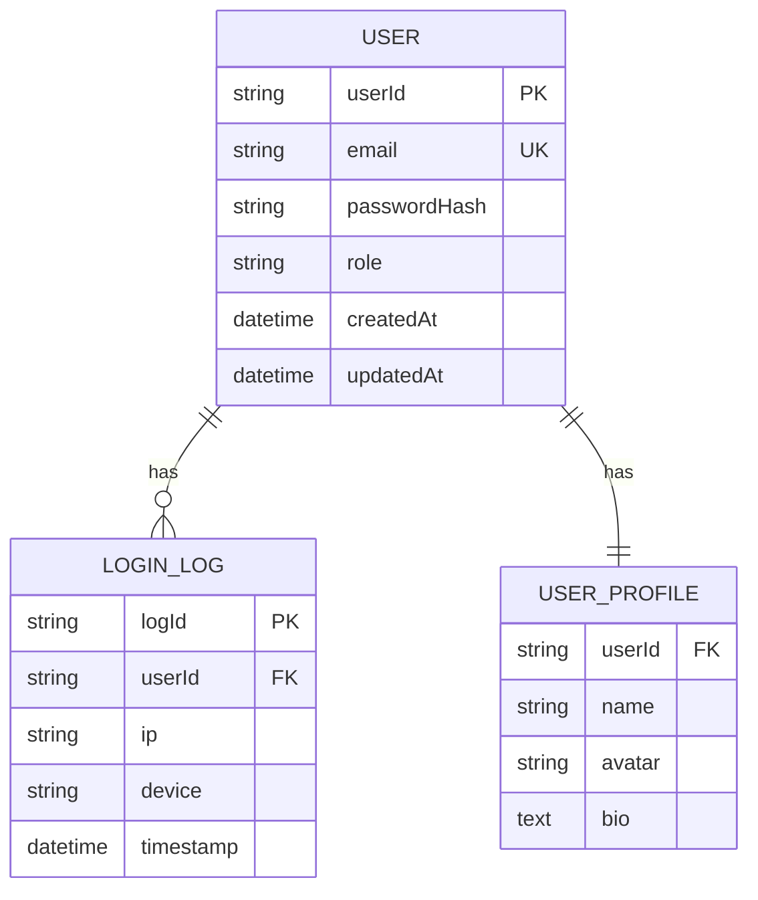

# 子模块 PRD 模板

> 本文档整合了模块目录约定、模板结构、协作规范与自动化脚本等要素，是模块化需求治理的唯一权威参考。
>
> **提醒**：PRD 专家在评估拆分前，请先梳理本文件的目录与模板规范后再展开模块产出，生成的模块 PRD 仍以 `{domain}/PRD.md` 为主体，从本模板获取章节/支撑产物的定义。

## 1. 目录与命名规范

### 1.1 模块目录结构

```
/docs/
└── prd-modules/
    ├── MODULE-TEMPLATE.md # 本模板（权威）
    ├── module-list.md # 模板清单（由 PRD 专家根据本文件 §3 模块清单模板 生成）
    └── {domain}/
        ├── PRD.md
        ├── dependency-graph.md
        ├── nfr-tracking.md
        └── priority-matrix.md
```

### 1.2 命名与 ID

- **模块目录**：`{domain}` 使用 kebab-case 域名（如 `user-management`、`payment-system`），保持与主 PRD 功能域索引中的 ID 一致，便于追溯与自动化脚本查找。
- **模块文件**：`{domain}/PRD.md`（目录固定，文件名统一为 `PRD.md`），与主 PRD 的结构保持同步，方便引用与导航。
- **Story ID**：`US-{MODULE}-{序号}`（例如 `US-USER-001`、`US-PAY-005`）
- **验收标准 ID**：`AC-{MODULE}-{Story序号}-{AC序号}`（例如 `AC-USER-001-01`）
- **测试用例 ID**：`TC-{MODULE}-{序号}`（例如 `TC-REG-001`）

#### 状态与优先级
- 状态
  - 📝 待启动（计划中）
  - 🔄 进行中（编写/修订中）
  - ✅ 已确认（PRD 完成）
  - ❌ 已废弃（不再计划）
   
- 优先级：P0（阻塞发布）→ P1（重要）→ P2（增值）→ P3（可延后）。

## 2. 模块清单模板

| 模块名称 | 优先级 | 负责团队 | 文件链接 | 状态 |
|---------|--------|---------|----------|------|
| （待添加） | - | - | - | - |

该表格仅作为模板，实际模块清单信息由 PRD 专家根据以上表格生成到`module-list.md`，每次PRD 模块变化都更新`module-list.md`。

## 3. 标准模块 PRD 结构

`{domain}/PRD.md` 根据模板创建，模板见本文件 § Appendix A: PRD 模块模板。
- 每次更新需记录 `最后更新` 时间戳
- 重大变更需在主 PRD 的“变更记录”章节同步，并补齐必要 ADR

## 4. 支撑产物说明

### dependency-graph.md
- 模块依赖图，可视化模块内 Story 依赖（Mermaid 图），支持模块内关键路径识别。
- 适用于 Story > 10 或依赖复杂的模块
- 初始版本应根据 `/docs/prd-modules/DEPENDENCY-GRAPH-TEMPLATE.md` 生成（可手动复制或运行示例脚本），确保包含目的、节点/线型说明与 Mermaid 表达。
- 与 `/docs/data/global-dependency-graph.md` 区分：前者模块内、后者跨模块
>- 维护模式：PRD 专家在 Story/依赖确定后更新图节点，TASK 专家则补充任务依赖、关键路径与冲突备注，二者协同保持图的可执行性。

### nfr-tracking.md
- 模块 NFR 追踪表，量化模块的非功能需求（性能、安全、可扩展性等）。
- 记录 NFR ID、关联 Story、目标/当前值、验证方式、状态、负责人
- 状态示例：✅ 达标、❌ 未达标、🔄 优化中、⚠️ 接近阈值、📝 待验证
- QA 专家在执行测试后更新该文件
- 初始版本参考 `/docs/prd-modules/NFR-TRACKING-TEMPLATE.md` 生成，PRD 专家补充需求描述与目标值、TASK/TDD 评估实现影响，QA 维护状态并记录验证结果，形成“需求→验证”闭环。

### priority-matrix.md（可选）
- 模块优先级矩阵，使用量化评分模型动态调整模块内需求优先级（业务价值、用户影响面、技术风险、依赖权重）。
- 评分公式：业务价值 × 2 + 用户影响面 × 1.5 + (6 - 技术风险) + 依赖权重 × 0.5
- 输出综合得分与建议优先级（P0/P1/P2）
- 适用于优先级冲突或资源紧张的模块
- 可参照 `/docs/prd-modules/PRIORITY-MATRIX-TEMPLATE.md` 的示例模板生成初始表格，PRD+TASK 共同评估指标值，QA/ARCH 提供依赖与风险输入，定期刷新优先级排序并同步到 `TASK.md`。

## 5. 模块协作规范

- **依赖管理**：主 PRD 的“里程碑与依赖”章节维护跨模块全局视图，各模块在“接口与依赖”章节细化
- **数据共享**：共享实体在 `/docs/data/dictionary.md` 定义，模块直接引用，避免重复建模
- **追溯矩阵**：`/docs/data/traceability-matrix.md` 记录 Story → AC → Test Case ID，便于 QA 全局验证
- **跨团队对齐**：PRD 专家在模块规划完成后，通知 ARCH/TASK/QA 依次消费主/模块文档并更新 `AGENT_STATE`

## 6. 维护与文件时机

### 6.1 PRD 专家职责
1. 拆分决策：评估是否需要模块化，将风险/理由记录在主 PRD
2. 模块规划：定义功能域、更新模块索引表
3. 内容编写：按本模板创建/更新模块 PRD
4. 一致性检查：核对主 PRD、模块 PRD 与追溯矩阵，必要时补 ADR

### 6.2 与其他专家协作
- ARCH：基于主/模块 PRD 产出架构视图，保持 Story 与组件的追溯
- TASK：依据模块 PRD 拆解 WBS，并同步关键依赖和里程碑
- QA：覆盖追溯矩阵中的 Story/AC/Test Case，及时更新机密与阻塞状态

### 6.3 版本管理
- 模块文档每次更新需记录“最后更新”并标注负责人
- 重大变动涉架构取舍需推送 `docs/adr/NNN-prd-{module}-{decision}.md`

### 6.4 文件创建时机
- PRD 拆分初期：必建 `{domain}/PRD.md` 与 `prd-modules/` 的索引条目
- 需求澄清阶段：Story > 10 时建 `dependency-graph.md`；关键 NFR 时建 `nfr-tracking.md`，优先级复杂时加 `priority-matrix.md`
- 持续维护：模块 PRD 实时更新、依赖图/优先级/追溯按 Sprint 维度更新

## 7. 自动化脚本

| 命令 | 功能 |
|------|------|
| `npm run prd:lint` | 校验模块 PRD 结构、Story/AC（GWT）与 NFR/依赖/风险字段 |
| `npm run prd:check-dependency-cycles` | 检查模块 Story 依赖/PRD 文档之间是否存在循环或缺失引用 |
| `npm run prd:generate-dependency-graph` |（若配置）自动抽取 Story/Task 依赖生成 summary 图 |
| `npm run nfr:check-compliance` | 校验模块级 NFR 追踪表并输出发布 Gate 状态（阻塞/警告/待验证） |
| `npm run prd:sync-matrix` | 把 Story→AC 映射同步到 `/docs/data/traceability-matrix.md` 并保持 AC 状态更新 |

## 8. 相关资源

- `/docs/PRD.md` — 主 PRD 总纲与章节模板
- `/docs/prd-modules/README.md` — PRD 模块化指南与流程说明
- `/AgentRoles/PRD-WRITER-EXPERT.md` 与 `Handbook` — 角色职责、DoD、验证与 Gate 清单
- `/docs/data/traceability-matrix.md` — Story → AC → Test Case 追溯与模板
- `/docs/data/global-dependency-graph.md` — 依赖追溯与模块层级视图
- `/docs/data/templates/TRACEABILITY-MATRIX-TMPLATE.md` — Traceability 初始化模板
- `/docs/CONVENTIONS.md` — PRD/模块命名、拆分与产物规范
- 脚本：`scripts/prd-tools/*.js` 以及 `package.json` 中的 `prd:*` 命令（`prd:lint`、`prd:check-dependency-cycles`、`prd:sync-matrix` 等）
- `/docs/AGENT_STATE.md` 与 `/AGENTS.md` — 状态机与 Agent 流程（触发 `PRD_CONFIRMED` / `ARCHITECTURE_DEFINED`）

---

## Appendix A: PRD 模块模板
> 以下内容不允许自动工具修改，仅由 PRD 专家编辑。

# {功能域名称} - PRD 模块

> **所属主 PRD**: [PRD.md](../PRD.md)
> **负责团队**: @team-name
> **最后更新**: YYYY-MM-DD
> **状态**: 📝 待启动 / 🔄 进行中 / ✅ 已确认 / ⚠️ 需更新
> **追溯说明**: 列出 Story/AC/Task/QA 链接并同步 `docs/data/traceability-matrix.md`

---

### 1. 模块概述（业务目标与交付）
- 简述模块业务能力、核心价值与作用场景
- 关联 Story（`US-...`）、PRD/Task/ARCH 链接
- 交付产物列表（功能/文档/接口）

### 2. 范围与约束
- In-Scope 与 Out-of-Scope
- 关键约束（资源、合规、时间）
- 前置依赖模块与接口（指向 PRD/ARCH/Task）

### 3. 用户故事与验收
- Story ID 与描述

```markdown
| Story ID | 验收标准（Given-When-Then） | Task ID | Test Case ID | QA 负责人 |
|----------|---------------------------|---------|--------------|-----------|
| US-XXX-001 | Given..., When..., Then... | TASK-XXX-001 | TC-XXX-001 | @qa-lead |
```

- 在每条故事后注明是否已写入 `traceability-matrix`、是否需要 ARCH/QA 复核

### 4. 非功能需求（NFR）
- 列出性能/安全/可用/可维护等指标
- 表示需要的监控/验证（如 SLO、性能测试脚本）
- 标注相关 QA 负责人与验证状态

### 5. 依赖与风险
- 依赖表格：模块/外部系统/数据服务
- 风险表格：风险、影响、缓解、责任人、状态
- 提到与 ARCH/Task 的追溯（说明 arch-prd-traceability、task dependency 表）

### 6. 里程碑与 Gate
- Milestone ID、名称、日期、目标、验收标准
- Gate（`PRD_CONFIRMED`→`ARCHITECTURE_DEFINED`）要求的补充资料

### 7. 追溯矩阵与验证
- Story → AC → Test Case → Task 追踪表（可复制 Table）
- 描述 Traceability 与 QA 校验状态
- 提示如何更新 `/docs/data/traceability-matrix.md` 并生成 release gate 报告

### 8. 开放问题
- 问题描述、影响、负责人、计划解决时间
- 每条问题附上相关 Task/Story ID

### 9. 变更记录
- 版本、日期、描述、责任人

### 10. 自检清单
- [ ] 是否运行 `npm run prd:lint`、`prd:check-dependency-cycles`、`prd:sync-matrix`？
- [ ] 是否同步 traceability matrix 与 QA 状态？
- [ ] 是否通知 ARCH/TASK/TDD/QA（接口验证/风险/依赖）？
- [ ] 是否在 `/docs/AGENT_STATE.md` 标注 `PRD_CONFIRMED`、`ARCHITECTURE_DEFINED` 等阶段？

## 1. 模块概述

### 1.1 功能域定义
（简要描述本模块的业务范围和核心职责）

**示例**：
本模块负责用户身份管理，包括注册、登录、权限验证、个人资料管理等核心功能。

### 1.2 业务目标
- **目标 1**：提供安全可靠的用户认证机制
- **目标 2**：支持多种登录方式（邮箱、手机、第三方）
- **目标 3**：用户数据符合 GDPR/PIPL 合规要求

### 1.3 成功指标
| 指标 | 目标值 | 测量方式 |
|------|--------|---------|
| 注册转化率 | > 35% | Google Analytics 漏斗分析 |
| 登录成功率 | > 98% | 后端日志统计 |
| 密码重置响应时间 | < 5min | 邮件发送监控 |

---

## 2. 用户故事与验收标准
```markdown
### US-{MODULE}-001: {故事标题}
**作为** [用户角色]
**我希望** [功能描述]
**以便** [业务价值]

**验收标准（Given-When-Then）：**
- **AC-{MODULE}-001-01 (Given)** 前置条件
- **AC-{MODULE}-001-02 (When)** 触发动作
- **AC-{MODULE}-001-03 (Then)** 预期结果

**优先级**：P0 / P1 / P2（综合得分：X.X，详见 [priority-matrix.md](../data/priority-matrix.md)）
**依赖**：US-{OTHER}-XXX（如有跨模块依赖，引用 Story ID）
**预估工时**：X 人天
```
每个 Story 至少包含一个量化的 AC，覆盖正常与异常流，同时在 `traceability-matrix.md` 中映射 Story/AC/Test Case ID。

---

## 3. 模块级非功能需求

### 3.1 性能要求（模块特定）
| 接口 | 响应时间（P95） | 并发量（QPS） | 备注 |
|------|----------------|--------------|------|
| POST /api/auth/register | < 500ms | 100 | 含验证码校验 |
| POST /api/auth/login | < 200ms | 500 | 高频接口 |
| GET /api/user/profile | < 100ms | 1000 | 缓存优化 |

### 3.2 数据保留策略
- **用户账号**：永久保留（除非用户主动注销）
- **登录日志**：保留 90 天（安全审计要求）
- **验证码记录**：保留 24 小时（用于风控分析）

### 3.3 安全要求（模块特定）
- **密码存储**：Bcrypt 加密，成本因子 12
- **Token 机制**：JWT，有效期 2 小时，刷新 Token 7 天
- **防暴力破解**：5 次失败登录后锁定账号 15 分钟
- **敏感操作**：密码修改、邮箱变更需验证原密码或短信验证码

---

## 4. 接口与依赖

### 4.1 提供的接口（Exports）

本模块对外提供以下接口，供其他模块调用：

| 接口名称 | 接口路径 | 方法 | 输入参数 | 输出格式 | 调用方 | SLA | 幂等性 |
|---------|---------|------|---------|---------|--------|-----|--------|
| 用户注册 | `/api/auth/register` | POST | `{email, password, captcha}` | `{userId, token}` | 前端、营销系统 | < 500ms | 是（邮箱去重） |
| 用户登录 | `/api/auth/login` | POST | `{email, password}` | `{userId, token, refreshToken}` | 前端、移动端 | < 200ms | 是 |
| Token 验证 | `/api/auth/validate` | POST | `{token}` | `{valid: boolean, userId}` | 所有模块 | < 50ms | 是 |
| 获取用户信息 | `/api/user/{userId}` | GET | `userId` | `User` 对象 | 支付、分析、通知模块 | < 100ms | 是 |
| 更新用户资料 | `/api/user/{userId}` | PUT | `{name, avatar, ...}` | `User` 对象 | 前端 | < 300ms | 否 |

#### 接口契约详细定义

##### 接口 1: 用户注册
```typescript
// Request
POST /api/auth/register
Content-Type: application/json

{
  "email": "user@example.com",    // 必填，邮箱格式
  "password": "Pass123!",          // 必填，8-20 位，含大小写+数字+特殊字符
  "captcha": "ABC123",             // 必填，图形验证码
  "referralCode"?: "REF001"        // 可选，邀请码
}

// Response (Success)
HTTP 201 Created
{
  "code": 0,
  "message": "注册成功",
  "data": {
    "userId": "usr_1234567890",
    "email": "user@example.com",
    "token": "eyJhbGc...",           // JWT Token（2 小时有效）
    "refreshToken": "eyJhbGc...",   // Refresh Token（7 天有效）
    "needEmailVerify": true         // 是否需要邮箱验证
  }
}

// Response (Error)
HTTP 400 Bad Request
{
  "code": 1001,
  "message": "邮箱已被注册",
  "data": null
}

// Error Codes
- 1001: 邮箱已被注册
- 1002: 密码格式不符合要求
- 1003: 验证码错误或已过期
- 1004: 邀请码无效
```

##### 接口 2: 用户登录
```typescript
// Request
POST /api/auth/login
Content-Type: application/json

{
  "email": "user@example.com",
  "password": "Pass123!",
  "rememberMe"?: boolean           // 可选，是否记住登录（延长 Token 有效期）
}

// Response (Success)
HTTP 200 OK
{
  "code": 0,
  "message": "登录成功",
  "data": {
    "userId": "usr_1234567890",
    "token": "eyJhbGc...",
    "refreshToken": "eyJhbGc...",
    "user": {                       // 用户基本信息
      "id": "usr_1234567890",
      "email": "user@example.com",
      "name": "张三",
      "avatar": "https://cdn.example.com/avatar.jpg",
      "role": "user"                // user / admin / guest
    }
  }
}

// Response (Error)
HTTP 401 Unauthorized
{
  "code": 2001,
  "message": "邮箱或密码错误",
  "data": {
    "remainingAttempts": 3         // 剩余尝试次数
  }
}

// Error Codes
- 2001: 邮箱或密码错误
- 2002: 账号已被锁定（暴力破解保护）
- 2003: 账号未激活（需邮箱验证）
```

##### 接口 3: Token 验证（内部接口）
```typescript
// Request
POST /api/auth/validate
Content-Type: application/json
Authorization: Bearer {token}

{
  "token": "eyJhbGc..."
}

// Response (Success)
HTTP 200 OK
{
  "code": 0,
  "message": "Token 有效",
  "data": {
    "valid": true,
    "userId": "usr_1234567890",
    "expiresAt": "2025-11-05T12:00:00Z",
    "permissions": ["read:user", "write:profile"]  // RBAC 权限列表
  }
}

// Response (Invalid Token)
HTTP 200 OK
{
  "code": 0,
  "message": "Token 无效",
  "data": {
    "valid": false,
    "reason": "expired"             // expired / invalid / revoked
  }
}
```

### 4.2 依赖的接口（Imports）

本模块依赖以下外部服务或其他模块：

| 接口名称 | 提供方 | 接口路径/方法 | 输入 | 输出 | 用途 | 降级策略 |
|---------|--------|--------------|------|------|------|---------|
| 发送邮件 | 通知模块 | `sendEmail(to, template, data)` | 邮箱、模板ID、变量 | `Promise<void>` | 注册验证、密码重置 | 失败时记录日志，异步重试 3 次 |
| 发送短信 | 通知模块 | `sendSMS(phone, code)` | 手机号、验证码 | `Promise<void>` | 手机验证 | 失败时降级为邮件验证 |
| 埋点上报 | 分析模块 | `trackEvent(event, properties)` | 事件名、属性 | `void` | 用户行为分析 | 失败不阻塞主流程 |
| 风控检查 | 风控服务 | `POST /risk/check` | 用户ID、IP、设备指纹 | `{risk: low/medium/high}` | 异常登录检测 | 超时 500ms 则跳过，默认为 low |

#### 依赖接口契约详细定义

##### 依赖 1: 发送邮件（通知模块）
```typescript
// 接口定义（TypeScript）
interface EmailService {
  sendEmail(params: {
    to: string;                    // 收件人邮箱
    template: string;              // 模板 ID（如 "user-registration"）
    data: Record<string, any>;     // 模板变量（如 {userName, verifyLink}）
    priority?: 'high' | 'normal';  // 优先级（默认 normal）
  }): Promise<void>;
}

// 调用示例
await emailService.sendEmail({
  to: "user@example.com",
  template: "user-registration",
  data: {
    userName: "张三",
    verifyLink: "https://example.com/verify?token=xxx"
  },
  priority: "high"
});

// 降级策略
try {
  await emailService.sendEmail(...);
} catch (error) {
  logger.error('邮件发送失败', error);
  // 异步重试队列（3 次，间隔 5/10/30 分钟）
  await retryQueue.add({ type: 'email', ...params });
}
```

##### 依赖 2: 风控检查（第三方服务）
```typescript
// Request
POST https://risk-api.example.com/v1/check
Content-Type: application/json
Authorization: Bearer {API_KEY}

{
  "userId": "usr_1234567890",
  "action": "login",               // login / register / password-reset
  "context": {
    "ip": "192.168.1.1",
    "deviceId": "dev_xxx",
    "userAgent": "Mozilla/5.0..."
  }
}

// Response
HTTP 200 OK
{
  "risk": "low",                   // low / medium / high
  "reason": "",                    // 风险原因（如 "异地登录"）
  "actions": ["allow"]             // allow / challenge / block
}

// 降级策略
const riskResult = await fetch('/risk/check', {
  timeout: 500                     // 500ms 超时
}).catch(() => ({
  risk: 'low',                     // 默认低风险
  reason: 'service unavailable'
}));
```

### 4.3 事件订阅/发布（Event-Driven）

本模块发布以下事件，供其他模块订阅：

| 事件名称 | 发布时机 | Payload Schema | 订阅方 | 幂等性要求 | 重试策略 |
|---------|---------|---------------|--------|-----------|---------|
| `UserRegistered` | 用户注册成功 | `{userId, email, timestamp}` | 分析模块、营销模块 | 是（userId 去重） | 失败重试 3 次 |
| `UserLoggedIn` | 用户登录成功 | `{userId, ip, device, timestamp}` | 分析模块、风控模块 | 是 | 失败重试 3 次 |
| `PasswordResetRequested` | 用户请求重置密码 | `{userId, email, token, expireAt}` | 通知模块 | 是 | 失败重试 5 次 |
| `UserProfileUpdated` | 用户资料修改 | `{userId, changes: {field: {old, new}}}` | 分析模块 | 否 | 失败重试 3 次 |

#### 事件契约详细定义

##### 事件 1: UserRegistered
```typescript
// Event Schema
interface UserRegisteredEvent {
  eventId: string;                 // 事件唯一 ID（UUID）
  eventName: "UserRegistered";
  timestamp: string;               // ISO 8601 格式
  version: "1.0";                  // 事件版本（支持向后兼容）
  data: {
    userId: string;
    email: string;
    referralCode?: string;         // 邀请码（如有）
    source: "web" | "mobile" | "api";
  };
}

// 发布方式（使用消息队列）
await eventBus.publish('UserRegistered', {
  eventId: generateUUID(),
  eventName: 'UserRegistered',
  timestamp: new Date().toISOString(),
  version: '1.0',
  data: {
    userId: newUser.id,
    email: newUser.email,
    source: 'web'
  }
});

// 订阅方处理（分析模块）
eventBus.subscribe('UserRegistered', async (event: UserRegisteredEvent) => {
  // 幂等性保障：检查 eventId 是否已处理
  if (await redis.exists(`event:processed:${event.eventId}`)) {
    return; // 已处理，跳过
  }

  // 业务逻辑
  await analytics.trackUserRegistration(event.data);

  // 标记已处理
  await redis.set(`event:processed:${event.eventId}`, '1', 'EX', 86400);
});
```

---

## 5. 数据模型（概要）

### 5.1 核心实体

| 实体名称 | 描述 | 关键字段 | 关联实体 |
|---------|------|---------|---------|
| User | 用户账号 | userId, email, passwordHash, role | UserProfile |
| UserProfile | 用户资料 | userId, name, avatar, bio | User |
| LoginLog | 登录日志 | logId, userId, ip, device, timestamp | User |

### 5.2 数据字典引用
详细字段定义见 [data/dictionary.md](../data/dictionary.md)

### 5.3 数据关系图


---

## 6. 风险与约束

### 6.1 模块特定风险

| 风险 | 等级 | 影响 | 缓解措施 | 负责人 |
|------|------|------|---------|--------|
| 第三方邮件服务不稳定 | High | 注册验证邮件延迟或失败 | 增加重试机制，准备备用邮件服务商 | @infra |
| 暴力破解攻击 | High | 账号安全风险 | 实施账号锁定策略，集成验证码 | @security |
| Token 泄露风险 | Medium | 未授权访问 | Token 短有效期 + Refresh Token 机制 | @security |

### 6.2 技术债务或已知限制
- 当前不支持第三方登录（OAuth），计划在 v2.0 实现
- 密码强度策略硬编码，未来考虑可配置化
- 登录日志存储在关系数据库，数据量增长后需迁移到时序数据库

---

## 7. 模块版本与变更记录

| 版本 | 日期 | 变更类型 | 变更描述 | 变更人 | 关联 CR |
|------|------|---------|---------|--------|---------|
| v1.0 | 2025-10-01 | 新增 | 初始版本创建 | @pm | - |
| v1.1 | 2025-10-15 | 修改 | 新增 US-USER-004（密码重置） | @pm | CR-20251015-001 |
| v1.2 | 2025-11-05 | 修改 | 增强接口契约定义（本次更新） | @pm | - |

---

## 8. 相关文档

- **主 PRD**：[PRD.md](../PRD.md)
- **追溯矩阵**：[traceability-matrix.md](../data/traceability-matrix.md)
- **依赖关系图**：[dependency-graph.md](../data/dependency-graph.md)
- **优先级矩阵**：[priority-matrix.md](../data/priority-matrix.md)
- **架构文档**：[ARCH.md](../ARCH.md)
- **API 规范**：[api/user-management-api.yaml](../../api/user-management-api.yaml)（OpenAPI 3.0 格式）

---

> **维护说明**：
> - 本文档由 PRD 专家在模块 PRD 编写时创建
> - 接口契约定义应与 ARCH 专家协同确认，避免实现偏差
> - 事件 Schema 应保持向后兼容，版本升级时遵循 Semantic Versioning
> - 依赖接口变更时，及时更新本文档并通知相关团队
