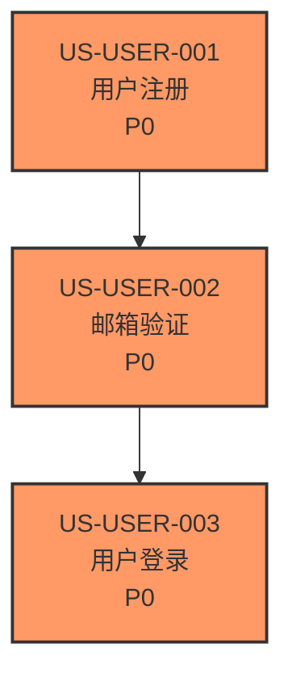

# PRD 模块内部结构指南（v1.8+）

> **适用范围**：大型项目（满足拆分条件：单文件 > 1000 行 或 50+ 用户故事 或 3+ 业务域）
> **更新日期**：2025-11-05

---

## 📁 模块目录结构

每个功能域模块在 `/docs/prd-modules/{domain}/` 目录下维护以下文件：

```
prd-modules/
  {domain}/                      # 功能域目录（如 user-management, payment-system）
    PRD.md                       # 模块 PRD（必需）
    dependency-graph.md         # 模块依赖图（推荐）
    nfr-tracking.md              # 模块 NFR 追踪表（推荐）
    priority-matrix.md           # 模块优先级矩阵（可选）
```

---

## 📄 文件用途说明

### 1. PRD.md — 模块 PRD（必需）

**用途**：定义该功能域的详细需求

**标准结构**：
```markdown
# {功能域名称} - PRD 模块

> 所属主 PRD: [PRD.md](../PRD.md)
> 负责团队: @team-name
> 最后更新: YYYY-MM-DD

## 1. 模块概述
- 功能域定义
- 业务目标
- 成功指标

## 2. 用户故事与验收标准
### US-{MODULE}-001: {故事标题}
**作为** [用户角色]
**我希望** [功能描述]
**以便** [业务价值]

**验收标准（Given-When-Then）：**
- **Given** 前置条件
- **When** 触发动作
- **Then** 预期结果

**优先级：** P0/P1/P2
**依赖：** [关联其他 Story ID]

## 3. 模块级非功能需求
- 性能要求（模块特定）
- 数据保留策略
- 安全要求（模块特定）

## 4. 接口与依赖
- 上游依赖（其他模块）
- 下游消费方
- 外部 API 依赖

## 5. 数据模型（概要）
- 核心实体
- 关键字段（详见 data/dictionary.md）

## 6. 风险与约束
- 模块特定风险
- 技术债务或已知限制
```

**创建时机**：PRD 专家评估需要拆分时，按功能域创建

---

### 2. dependency-graph.md — 模块依赖图（推荐）

**用途**：可视化该模块内的 Story 依赖关系

**格式**：Mermaid 图表

**示例**：


**创建时机**：
- 模块内 Story > 10 个时
- Story 间存在复杂依赖关系时

**与全局依赖图的关系**：
- 本文件：只包含**模块内** Story 的依赖（如 US-USER-001 → US-USER-003）
- `/docs/data/global-dependency-graph.md`：包含**跨模块**依赖（如 US-USER-003 → US-PAY-001）

---

### 3. nfr-tracking.md — 模块 NFR 追踪表（推荐）

**用途**：量化追踪该模块的非功能需求（性能、安全、可用性等）

**格式**：Markdown 表格

**示例**：
```markdown
# {模块名称} - NFR 追踪表

| NFR ID | 类型 | 需求描述 | 关联 Story | 基准值 | 目标值 | 当前值 | 验证方式 | 状态 | 负责人 |
|--------|------|---------|-----------|--------|--------|--------|---------|------|--------|
| NFR-USER-PERF-001 | 性能 | 登录响应时间 | US-USER-003 | 2.5s | < 1s | 0.8s | Lighthouse CI | ✅ 达标 | @dev-a |
| NFR-USER-SEC-001 | 安全 | 密码强度 | US-USER-001 | 无限制 | 8位+复杂度 | 已实现 | 单元测试 | ✅ 达标 | @dev-b |
| NFR-USER-SEC-002 | 安全 | 防暴力破解 | US-USER-003 | 无 | 5次锁定10分钟 | 未实现 | 集成测试 | ❌ 未达标 | @dev-b |

## 状态说明
- ✅ 达标：当前值满足目标值
- ❌ 未达标：当前值不满足目标值，阻塞发布
- 🔄 优化中：正在实施优化方案
- ⚠️ 接近阈值：当前值在目标值 80%-100% 之间，需关注
- 📝 待验证：尚未执行验证
```

**创建时机**：
- 模块有性能、安全、可用性等关键 NFR 时
- QA 专家制定测试计划时

**与全局追溯的关系**：
- 本文件：模块级 NFR 详细追踪（便于模块团队管理）
- `/docs/data/traceability-matrix.md`：全局追溯矩阵（Story → AC → Test ID），不包含 NFR 详情

---

### 4. priority-matrix.md — 模块优先级矩阵（可选）

**用途**：量化该模块内 Story 的优先级评分，辅助 Sprint 规划

**格式**：Markdown 表格

**示例**：
```markdown
# {模块名称} - 优先级矩阵

## 评分公式
综合得分 = 业务价值 × 2 + 用户影响面 × 1.5 + (6-技术风险) + 依赖权重 × 0.5

| Story ID | 业务价值<br/>(1-5) | 用户影响面<br/>(1-5) | 技术风险<br/>(1-5) | 依赖权重 | 综合得分 | 建议优先级 | 当前优先级 |
|----------|---------|-----------|---------|---------|---------|-----------|-----------|
| US-USER-001 | 5 | 5 | 2 | 8 | 25.5 | P0 | P0 |
| US-USER-002 | 4 | 4 | 2 | 4 | 18.0 | P1 | P0 |
| US-USER-003 | 5 | 5 | 3 | 2 | 21.5 | P0 | P0 |

## 评分规则
- **业务价值**（1-5）：对 KPI 贡献（1=低，5=高）
- **用户影响面**（1-5）：受益用户比例（1=小众，5=全员）
- **技术风险**（1-5）：实现复杂度（1=简单，5=高风险）
- **依赖权重**：被依赖次数 × 2 + 依赖层级

## 优先级映射
- ≥ 20 分 → P0（必须实现）
- 15-19 分 → P1（重要）
- 10-14 分 → P2（增值）
- < 10 分 → P3（可延后）
```

**创建时机**：
- 模块内 Story > 20 个时
- 优先级决策存在争议时

---

## 🔗 与全局数据的协作关系

### 全局数据目录（`/docs/data/`）

| 文件 | 范围 | 包含内容 |
|------|------|---------|
| `traceability-matrix.md` | 全局 | 所有模块的 Story → AC → Test ID 映射 |
| `global-dependency-graph.md` | 跨模块 | 跨模块的依赖关系（如 US-USER-003 → US-PAY-001） |
| `goal-story-mapping.md` | 全局 | Story 与 OKR 的映射（所有模块） |
| `persona-story-matrix.md` | 全局 | 用户角色覆盖矩阵（所有模块） |
| `change-requests/` | 全局 | 变更请求流程（影响所有模块） |

### 协作规则

1. **追溯矩阵**：
   - 模块 PRD 定义 Story 和 AC
   - `/docs/data/traceability-matrix.md` 集中维护 Story → AC → Test ID 映射
   - QA 专家更新测试状态时，直接修改全局追溯矩阵

2. **依赖关系**：
   - 模块内依赖：在模块的 `dependency-graph.md` 维护
   - 跨模块依赖：在 `/docs/data/global-dependency-graph.md` 维护
   - PRD 专家在主 PRD 的"里程碑与依赖"章节说明全局依赖视图

3. **NFR 追踪**：
   - 模块级 NFR：在模块的 `nfr-tracking.md` 详细追踪
   - 全局级 NFR：在主 PRD 第 5 章定义（如"整体系统可用性 99.9%"）

---

## 📝 文件创建时机

### 初始阶段（PRD 拆分时）
- ✅ **必创建**：`{domain}/PRD.md`
- ✅ **必创建**：在 `prd-modules/README.md` 添加模块索引条目

### 需求澄清阶段
- ⚠️ **推荐创建**：`{domain}/dependency-graph.md`（如 Story > 10 个）
- ⚠️ **推荐创建**：`{domain}/nfr-tracking.md`（如有关键 NFR）
- 📝 **可选创建**：`{domain}/priority-matrix.md`（如优先级决策复杂）

### 持续维护
- 🔄 **实时更新**：模块 PRD（新增/修改 Story 时）
- 🔄 **定期更新**：依赖图（每周 Sprint 规划前）
- 🔄 **动态更新**：NFR 追踪表（测试完成后更新状态）
- 🔄 **按需更新**：优先级矩阵（业务目标变化时重新评分）

---

## 🛠️ 自动化脚本支持

项目已提供以下脚本扫描模块目录：

### 1. PRD 完整性检查
```bash
npm run prd:lint
```
**检查内容**：
- 主 PRD 必需章节
- 模块 PRD 结构规范
- Story ID 格式（US-MODULE-NNN）
- AC 使用 Given-When-Then 格式

### 2. 依赖循环检查
```bash
npm run prd:check-dependency-cycles
```
**检查内容**：
- 解析所有模块 PRD 的依赖关系
- 检测循环依赖（A → B → C → A）
- 检测无效依赖（依赖的 Story 不存在）

### 3. NFR 达标检查
```bash
npm run nfr:check-compliance
```
**检查内容**：
- 扫描所有模块的 `nfr-tracking.md`
- 统计达标率（✅ 达标 / ❌ 未达标）
- 生成发布 Gate 报告（阻塞性问题/警告项/待验证项）

---

## ❓ 常见问题

### Q1: 小型模块（< 10 Story）需要创建所有文件吗？
**A**: 不需要。仅创建 `PRD.md`，其他文件按需创建：
- 依赖关系简单 → 不创建 `dependency-graph.md`
- 无关键 NFR → 不创建 `nfr-tracking.md`
- 优先级明确 → 不创建 `priority-matrix.md`

### Q2: 模块间有共享逻辑怎么办？
**A**: 在主 PRD 的"全局范围"章节定义共享能力（如统一认证、日志系统），各模块 PRD 引用即可。共享能力不单独作为模块。

### Q3: 如何避免模块 PRD 与主 PRD 不一致？
**A**:
1. 主 PRD 只维护索引和全局信息，不重复模块细节
2. 使用 Story ID 作为唯一标识，跨文档引用
3. 每次更新模块 PRD 后，检查主 PRD 的功能域索引是否需要同步

### Q4: 全局依赖图和模块依赖图有什么区别？
**A**:
- **模块依赖图**（`{domain}/dependency-graph.md`）：只显示模块内 Story 的依赖，如 US-USER-001 → US-USER-003
- **全局依赖图**（`/docs/data/global-dependency-graph.md`）：显示跨模块依赖，如 US-USER-003 → US-PAY-001（用户登录 → 创建订单）
- **作用**：模块图用于团队内部任务规划，全局图用于跨团队协调

---

## 📚 相关资源

- [PRD-WRITER-EXPERT.playbook.md](../../AgentRoles/Handbooks/PRD-WRITER-EXPERT.playbook.md) — 详细操作手册
- [CONVENTIONS.md](../CONVENTIONS.md) — 项目目录规范
- [MODULE-TEMPLATE-ENHANCED.md](MODULE-TEMPLATE-ENHANCED.md) — 模块 PRD 模板（含接口契约）
- [PRD-ENHANCEMENT-ROADMAP.md](../PRD-ENHANCEMENT-ROADMAP.md) — 增强功能实施路线图

---

> 本指南随项目实践持续更新。如有疑问，请在团队会议中提出或联系 PRD 专家。
